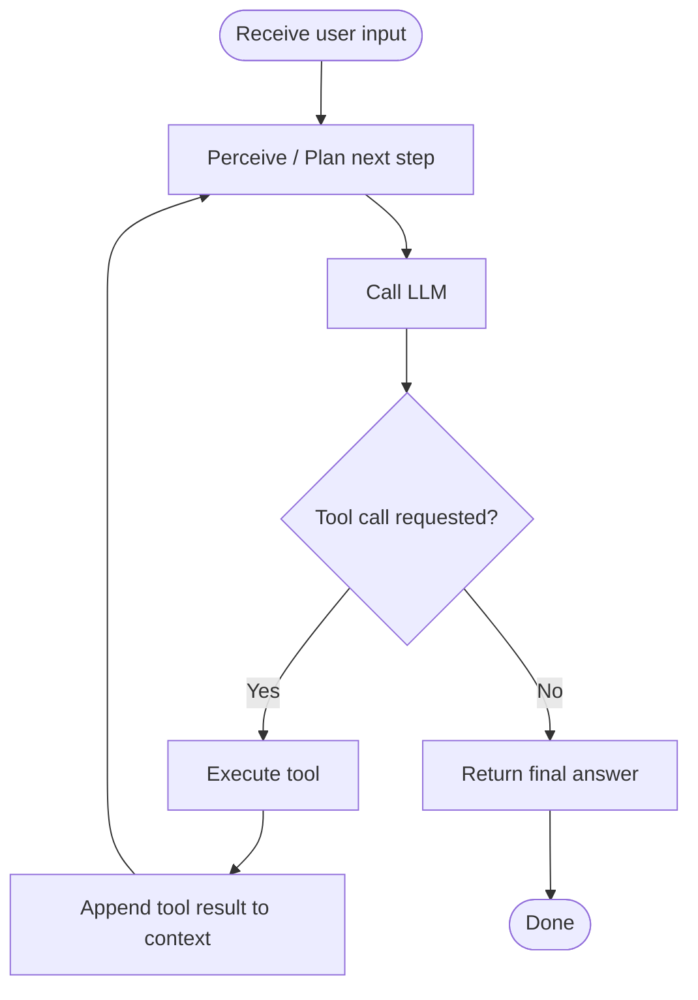
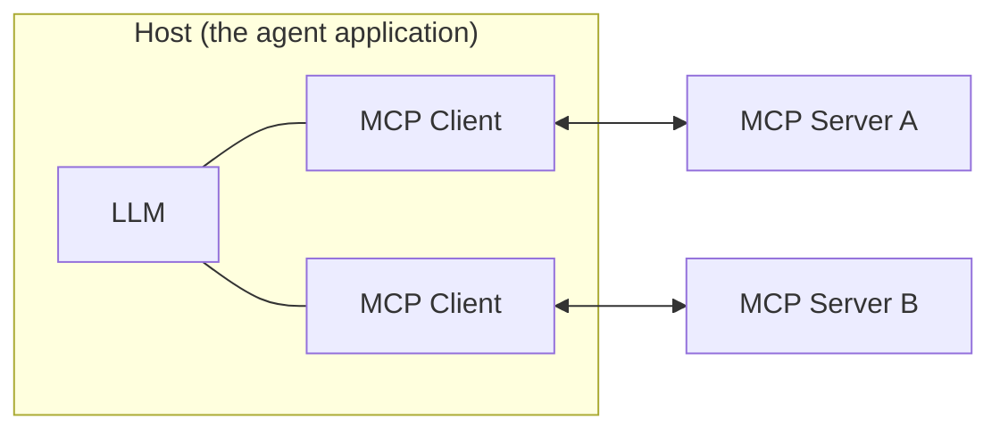

# Agent Architecture

An AI agent is fundamentally a loop: call the model, check whether it wants to use a tool, execute the tool if so, and feed the result back in — repeating until the model produces a final answer.

Each pass through the loop is a single LLM call. The model sees the conversation so far, including any prior tool results, and decides either to call a tool or to respond directly. If it calls a tool, the agent's runtime executes that tool (a function call, an API request, a database query), appends the result back into the context as if it were part of the conversation, and loops back to call the LLM again — now with more information than it had before. This continues until the model decides it has enough to answer, at which point the loop exits and the final answer is returned to the user. See [Agent Architecture](../docs/17-ai-agents-and-mcp/agent-architecture.md) for the full breakdown, including how memory and error handling fit into each step.

## MCP's Client-Host-Server Model

Agents commonly get their tools from MCP servers rather than hand-written integrations. MCP defines three roles for how that connection is structured:

The **host** is the agent application itself — it embeds the LLM and decides which servers to connect to. Each **client** lives inside the host and maintains a dedicated 1:1 connection to one **server**, which is an independent process exposing tools, resources, and prompts over the MCP protocol. This separation is what lets a single tool integration (say, a Postgres server) be built once and reused by any MCP-compatible agent, instead of every agent reimplementing the same integration.

## See Also

- [Agent Architecture](../docs/17-ai-agents-and-mcp/agent-architecture.md)
- [MCP Architecture](../docs/17-ai-agents-and-mcp/mcp-architecture.md)
