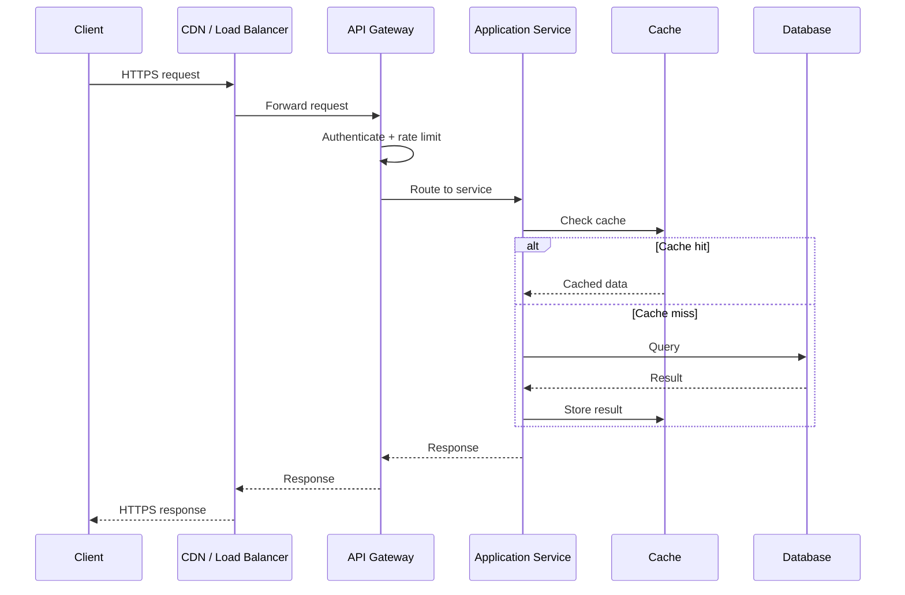

# API Request Flow

A generic, technology-agnostic view of what happens between a client sending a request and receiving a response, for any typical production API.

Every request starts at the edge, not at your application. The CDN or load balancer terminates TLS, absorbs traffic spikes, and picks a healthy upstream instance before the request ever reaches your code. The API gateway sits just behind that edge and does the cross-cutting work — authentication, rate limiting, request routing — so that individual application services don't have to reimplement it.

Once a request reaches an application service, the cache is the first stop, not the database. A cache hit skips the database entirely and returns in single-digit milliseconds; a cache miss falls through to the database, and the result is written back to the cache so the next request for the same data is fast. This cache-aside pattern is why well-cached APIs can serve most traffic without touching the database at all.

The response then retraces the same path in reverse: application service to gateway to CDN to client. Every hop in this chain is a place where things can go wrong — timeouts, retries, and circuit breakers (Part 6) all exist to handle failures at one of these hops without taking down the whole system.

## See Also

- [API Architecture](../docs/00-introduction/api-architecture.md)
- [Complete Architecture Walkthrough](../docs/18-production-architecture/complete-architecture-walkthrough.md)
