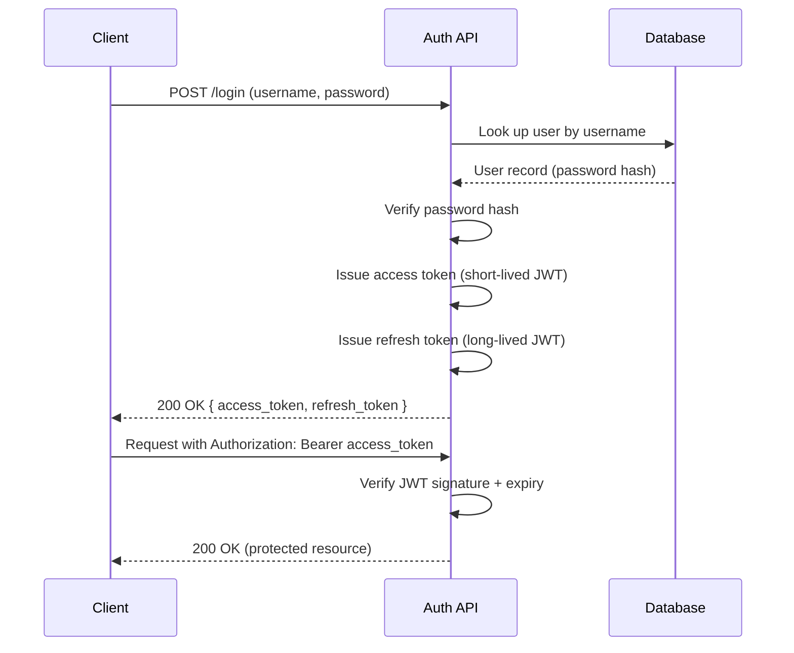
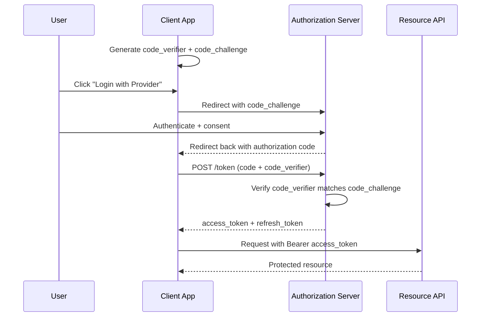

# Authentication Flow

Two of the most common authentication flows in production APIs: a first-party username/password login that issues JWTs, and a third-party OAuth 2.0 login with PKCE.

## Username/Password Login (Access + Refresh Tokens)

The server never stores the plaintext password — it stores a salted hash and re-hashes the submitted password to compare. On success, it issues two tokens instead of one: a short-lived **access token** (minutes) used on every request, and a long-lived **refresh token** (days/weeks) used only to obtain a new access token once the old one expires. This split limits the damage of a leaked access token while avoiding forcing the user to re-enter their password constantly. See [Access vs Refresh Tokens](../docs/05-authentication-authorization/access-vs-refresh-tokens.md) for the full rationale.

## OAuth 2.0 Authorization Code Flow with PKCE

PKCE (Proof Key for Code Exchange) closes a gap in the plain authorization code flow: a client generates a random `code_verifier`, derives a `code_challenge` from it, and sends only the challenge in the initial redirect. When it later exchanges the authorization code for tokens, it must present the original verifier — so even if the authorization code is intercepted in transit, an attacker without the verifier cannot redeem it. This makes PKCE mandatory for public clients (mobile apps, SPAs) that can't safely hold a client secret. See [OAuth 2.0](../docs/05-authentication-authorization/oauth2.md) for the full protocol walkthrough.

## See Also

- [JWT Deeply Explained](../docs/05-authentication-authorization/jwt-deeply-explained.md)
- [OAuth 2.0](../docs/05-authentication-authorization/oauth2.md)
- [Access vs Refresh Tokens](../docs/05-authentication-authorization/access-vs-refresh-tokens.md)
