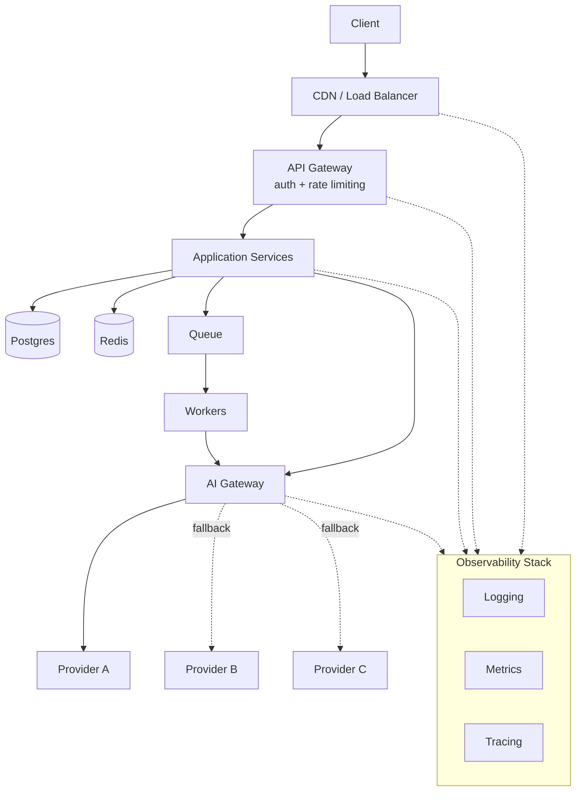

# Production AI Architecture

The composite system that Part 18 walks through end to end: everything from Parts 1–17 assembled into one production-grade AI API, wrapped in observability.

This is the same request path from [API Request Flow](api-request-flow.md), extended with the two layers that make it AI-specific: a queue/worker pair for anything too slow to run inline (document processing, batch jobs), and an AI gateway sitting between application services and the actual model providers.

The AI gateway exists for the same reason the API gateway does — it centralizes cross-cutting concerns, but for LLM calls specifically: provider routing, token-based rate limiting, cost tracking, and prompt/semantic caching. Its most important job in this diagram is the fallback arrow: if the primary provider (A) is down, slow, or rate-limiting you, the gateway can transparently retry the request against provider B or C without the application service ever knowing a fallback happened.

Observability wraps the entire diagram rather than sitting at one point in it, because a single AI request can touch six or seven services, and understanding why it was slow or wrong requires logs, metrics, and traces correlated across all of them — not just at the edge or just at the AI gateway.

## See Also

- [Part 18 — Production Architecture](../docs/18-production-architecture/README.md)
