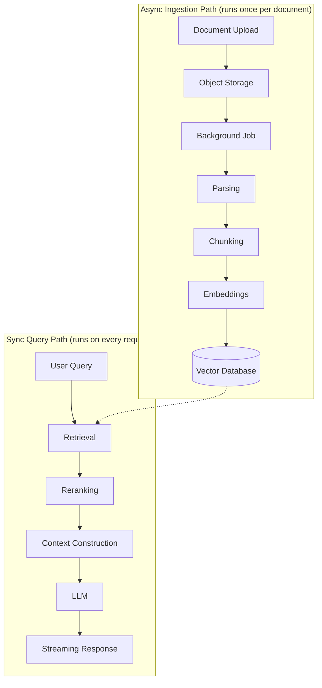

# RAG Architecture

Retrieval-Augmented Generation splits cleanly into two paths that run on different schedules: an **async ingestion path** that prepares documents ahead of time, and a **sync query path** that runs on every user request.

The ingestion path is intentionally asynchronous: parsing a PDF, splitting it into chunks, and generating embeddings for each chunk is too slow to run inside an HTTP request, so upload just writes the raw file to object storage and hands off to a background job (see [Async Document Processing](../docs/16-rag-apis/async-document-processing.md)). That job parses the document, chunks it into retrieval-sized pieces, embeds each chunk, and writes the vectors into a vector database — all off the request/response cycle.

The query path is what actually runs when a user asks a question, and it depends entirely on the vector database being already populated by ingestion. Retrieval pulls the most similar chunks by vector similarity, reranking reorders them for relevance using a more precise (and more expensive) model, and context construction assembles the final prompt sent to the LLM. The response is typically streamed back token by token rather than returned all at once, so the user sees output immediately instead of waiting for full generation.

Keeping these two paths separate is the key architectural decision in RAG systems: ingestion optimizes for throughput and can tolerate latency, while the query path optimizes for latency and must stay fast under load.

## See Also

- [Part 16 — RAG APIs](../docs/16-rag-apis/README.md)
- [Document Ingestion APIs](../docs/16-rag-apis/document-ingestion-apis.md)
- [Chunking Pipelines](../docs/16-rag-apis/chunking-pipelines.md)
- [Retrieval](../docs/16-rag-apis/retrieval.md)
- [Streaming RAG](../docs/16-rag-apis/streaming-rag.md)
