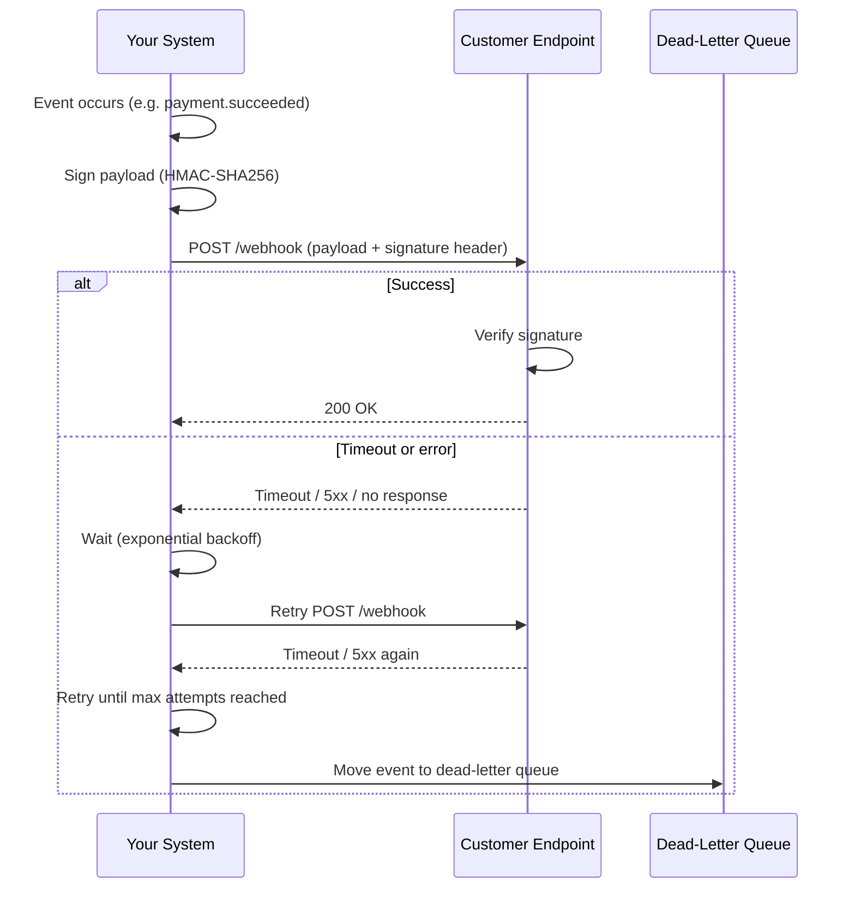

# Webhook Flow

How an outbound webhook gets delivered — and what happens when the customer's endpoint doesn't cooperate.

Every outbound webhook is signed before it's sent, not just sent as plain JSON. Your system computes an HMAC over the payload using a secret shared with the customer at registration time and attaches it as a header (e.g. `X-Signature`). The customer recomputes that HMAC on their side and compares it to the header value — this is what proves the request actually came from you and wasn't forged or tampered with in transit.

Delivery is not assumed to succeed on the first try. A customer's endpoint can be down, slow, or briefly returning errors, so a well-behaved webhook sender treats delivery failure as the normal case, not the exception. On timeout or a non-2xx response, the system retries with **exponential backoff** — waiting progressively longer between attempts — so a struggling endpoint isn't hammered with immediate retries.

If delivery keeps failing after the maximum number of retries, the event is moved to a dead-letter queue rather than retried forever. This preserves the event for manual inspection or replay without letting one broken customer endpoint consume unbounded retry capacity.

## See Also

- [Webhooks](../docs/09-realtime-and-webhooks/webhooks.md)
- [Webhook Signature Verification](../docs/09-realtime-and-webhooks/webhook-signature-verification.md)
