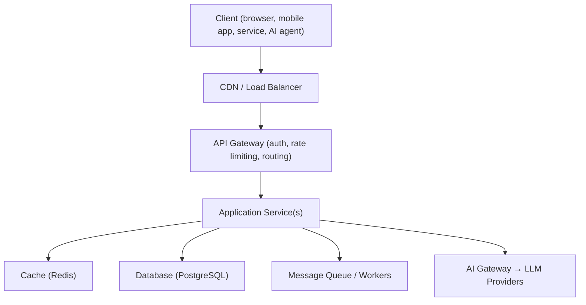
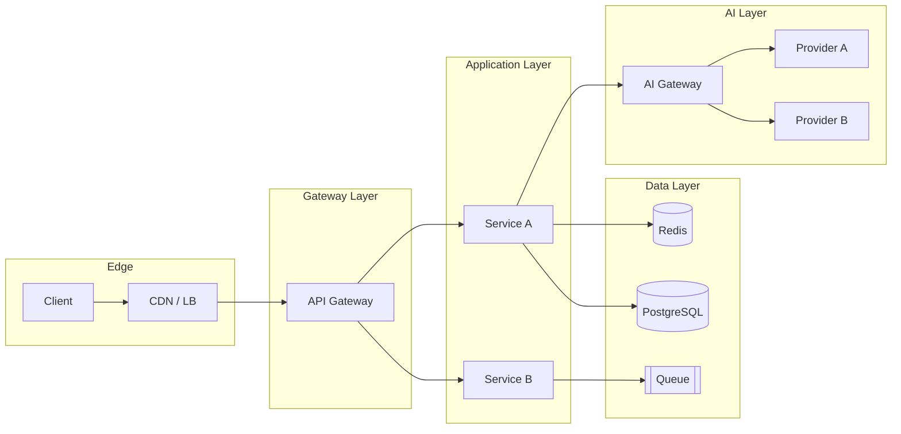

# API Architecture at a Glance

## Why This Matters

Before diving chapter-by-chapter into HTTP methods and status codes, it helps to see the whole map once. Production APIs are never just "a server that answers requests" — they sit inside a layered system of gateways, caches, databases, queues, and (increasingly) AI services. Seeing the full picture now means every later chapter has a place to slot into.

## Core Concept

A production API is a **layered system**. Each layer has a narrow job, and a request typically passes through several of them before a response comes back:



This is the same diagram you'll see again, in more depth, in [Part 18 — Production Architecture](../18-production-architecture/README.md). For now, just recognize the shape: **client → edge → gateway → application → data/AI layers**.

## Mental Model

Think of a company's org chart instead of a single person doing everything. A CDN is the receptionist who hands you a form if they already have your answer cached. A gateway is security and routing — checking your badge (auth) and directing you to the right department. The application service is the actual department doing the work. The database is the filing cabinet. A queue is the "we'll get back to you" ticket system for anything that takes too long to do while you wait. An AI gateway is a specialized department that knows how to talk to multiple outside AI vendors and picks the right one for the job.

## How It Works

A request for something simple (`GET /products/9`) might only touch the CDN cache and return immediately. A request that mutates data (`POST /orders`) will typically go: gateway → application → database, and might also enqueue a background job (send a confirmation email) without making the client wait for it. A request that needs an AI-generated answer (`POST /chat`) goes: gateway → application → AI gateway → one of several LLM providers, possibly streaming the response back token by token.

Not every API needs every layer. A small internal tool might just be a client talking directly to a single application service with a database behind it — and that's the right architecture for that scale. Complexity should be added when the problem demands it (traffic, reliability requirements, team size), not by default. This tension — simplicity vs. scalability — comes up constantly and is addressed head-on in [Part 11 — Microservices & Distributed Systems](../11-microservices-distributed-systems/README.md).

## Architecture



## Request / Response Example

A single logical "send a chat message" request can fan out across several of these layers:

```text
1. Client → POST /chat  {"message": "Summarize this doc"}
2. Gateway validates JWT, checks rate limit
3. App service loads conversation from Postgres, checks Redis cache for recent context
4. App service calls AI Gateway
5. AI Gateway routes to an available LLM provider (with a fallback if the primary is down)
6. Response streams back through App service → Gateway → Client
7. App service asynchronously logs the interaction and updates usage/cost tracking via a queue
```

## Code Example

You don't need code to internalize this chapter — it's map-reading, not implementation. Every layer in the diagrams above gets real, runnable code in later parts: FastAPI application services in Part 3, Redis caching in Part 7, queues and workers in Part 8, and the AI gateway pattern in Part 15.

## Production Considerations

Each additional layer buys you something (caching buys latency, a gateway buys centralized auth/rate-limiting, a queue buys resilience to slow downstream work) but costs you something too: more moving parts, more failure modes, more operational overhead. Part 18 walks through exactly this trade-off for a complete production system.

## Common Mistakes

- Assuming every API needs a gateway, a queue, and a cache from day one. Most don't, at first.
- Treating "microservices" as inherently more "production-grade" than a well-built monolith. It depends entirely on the problem (see Part 11).
- Designing the AI layer as an afterthought bolted onto an existing API, instead of treating it as its own layer with its own reliability concerns (timeouts, provider outages, cost) — covered in Part 15.

## Best Practices

- Start simple; add layers when a specific, real problem (not a hypothetical one) demands them.
- Keep each layer's responsibility narrow — a gateway that also contains business logic stops being a gateway.
- Treat the AI layer with the same production rigor as the database layer: it can be slow, it can fail, and it costs money per call.

## AI Engineering Perspective

The biggest architectural shift AI systems introduce is that a "backend call" can now be **slow, non-deterministic, and metered by usage cost** in a way a database query usually isn't. That's why Parts 14–17 introduce dedicated concepts — LLM gateways, token rate limits, prompt caching, semantic caching — that don't have a direct analog in a typical CRUD API. The architecture pattern doesn't change (it's still client → gateway → application → downstream service), but the downstream service (an LLM provider) has very different failure and cost characteristics than PostgreSQL, and the architecture has to account for that.

## Exercises

**Beginner**
1. In your own words, what's the difference between the API Gateway layer and the Application Service layer?

**Intermediate**
2. Draw (on paper or in Mermaid) the layers a `GET /orders/{id}` request for a food-delivery app would likely pass through.

**Advanced**
3. Sketch an architecture for a system where a single client request needs to call two different application services and combine their results before responding. Where would you put that combination logic — the gateway, a new "aggregation" service, or the client itself? Justify your choice.

## Key Takeaways

- Production APIs are layered systems: edge → gateway → application → data/AI.
- Not every API needs every layer — add complexity when the problem demands it.
- AI systems introduce a new layer (the AI gateway) with different failure and cost characteristics than a typical database call.
- This map will be referenced constantly — bookmark [Part 18](../18-production-architecture/README.md) for the full version.
