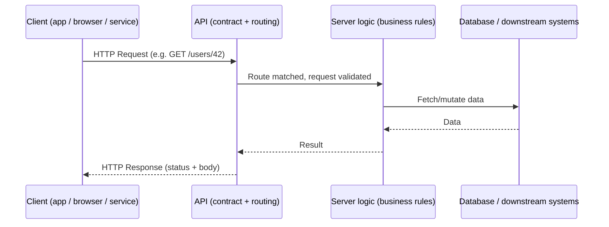

# What Is an API?

## Why This Matters

Every piece of modern software you use — the weather app on your phone, the "Sign in with Google" button, the chatbot answering your support question — is talking to something else over an API. If you're going to build backend systems, AI applications, or anything that isn't a completely standalone script, you need a precise mental model of what an API is and isn't. "API" is one of the most-used and least-precisely-understood terms in software.

## Core Concept

**API** stands for **Application Programming Interface**. Strip away the acronym and it's simpler than it sounds: an API is a defined way for one piece of software to ask another piece of software to do something, without needing to know how that something is actually implemented.

That's the whole idea. Three parts matter:

- **A defined way** — a contract. Specific inputs produce specific, predictable outputs.
- **One piece of software asking another** — a *caller* and a *provider*. They can be two functions in the same codebase, two services on the same machine, or two computers on opposite sides of the planet.
- **Without needing to know how** — the caller doesn't need to understand the provider's internals, database schema, or programming language. It just needs to know the contract.

This handbook focuses specifically on **web APIs**: APIs exposed over a network (usually the internet) using HTTP, where a **client** sends a **request** and a **server** sends back a **response**. That's a narrower, more specific thing than "API" in general — a function signature is technically an API too — but it's the kind you'll build and consume as a backend or AI engineer, so it's what "API" means for the rest of this handbook unless stated otherwise.

## Mental Model

Think of a restaurant. You (the client) don't walk into the kitchen and cook your own food — you don't know the recipes, don't have access to the ingredients, and honestly shouldn't be back there. Instead:

1. You look at a **menu** (the API's documentation / contract) that tells you exactly what you can order and what you'll get back.
2. You give your order to a **waiter** (the API layer) using the menu's format — you don't shout into the kitchen in your own words.
3. The **kitchen** (the server/backend) prepares the food however it wants — swap chefs, change the stove, rewrite the recipe — as long as the dish that comes out still matches what the menu promised.
4. The waiter brings back your **food** (the response).

You never needed to know how the kitchen works. That's the entire value of an API: it lets two systems change independently as long as the contract between them stays stable.

## How It Works

A typical web API interaction follows this flow:

```text
Client                          Server
  │                                │
  │──── HTTP Request ────────────▶│
  │     (method, URL, headers,    │
  │      body)                    │
  │                                │  server processes the
  │                                │  request: validates input,
  │                                │  runs business logic,
  │                                │  talks to a database, etc.
  │                                │
  │◀──── HTTP Response ────────────│
  │     (status code, headers,    │
  │      body)                    │
```

The client is anything that initiates the request: a mobile app, a web browser, another backend service, a script, or an AI agent calling a tool. The server is anything that listens for requests and returns responses: a REST API, a GraphQL API, or — as you'll see in Part 14 — an LLM API.

## Architecture



The API is the boundary in this diagram — it's the only part the client is allowed to depend on. Everything to the right of it (business logic, database schema, internal services) is free to change without breaking the client, as long as the boundary's contract is honored.

## Request / Response Example

A concrete HTTP example — a client asking an API for a user's profile:

**Request**

```http
GET /users/42 HTTP/1.1
Host: api.example.com
Accept: application/json
Authorization: Bearer eyJhbGciOi...
```

**Response**

```http
HTTP/1.1 200 OK
Content-Type: application/json

{
  "id": 42,
  "name": "Priya Sharma",
  "email": "priya@example.com",
  "created_at": "2025-03-14T10:22:00Z"
}
```

Nothing here reveals whether `42` came from PostgreSQL, MongoDB, or an in-memory dictionary. That's the point.

## Code Example

Here's the same idea from the provider side — a minimal API endpoint using FastAPI (the framework used throughout this handbook, introduced properly in Part 3):

```python
# main.py
from fastapi import FastAPI, HTTPException

app = FastAPI()

# In real systems this would be a database call — see Part 4.
FAKE_USERS_DB = {
    42: {"id": 42, "name": "Priya Sharma", "email": "priya@example.com"}
}


@app.get("/users/{user_id}")
def get_user(user_id: int):
    """The API contract: given a user_id, return that user's public profile."""
    user = FAKE_USERS_DB.get(user_id)
    if user is None:
        raise HTTPException(status_code=404, detail="User not found")
    return user
```

Run it with `uvicorn main:app --reload` and `GET http://localhost:8000/users/42` returns the JSON above. Whether `FAKE_USERS_DB` becomes PostgreSQL next week doesn't change a single line the client depends on.

## Production Considerations

In production, "an API" is rarely just one function like the example above. It typically involves: input validation, authentication/authorization, rate limiting, structured error responses, logging and tracing, a database or cache behind it, and monitoring to know when it breaks. Every one of those concerns gets its own part later in this handbook — this chapter is deliberately about the *idea* of an API, not yet its production shape.

## Common Mistakes

- **Confusing "API" with "REST API" or "web API."** APIs existed before HTTP — library function signatures, operating system calls, and IPC mechanisms are all APIs. This handbook narrows scope to web APIs on purpose, but don't assume the word always means that.
- **Treating the API as the whole system.** The API is the *contract*, not the implementation. Confusing the two leads to unnecessary coupling — e.g., leaking database column names directly into API response fields.
- **Assuming API and UI are the same thing.** A UI consumes an API; it isn't one. Many systems have several UIs (web, mobile) consuming the same API.

## Best Practices

- Design the contract (the API) before writing the implementation — it forces you to think about the caller's needs first.
- Keep the contract stable even when the implementation changes underneath it; this is the entire reason APIs exist.
- Document the contract explicitly (Part 3 covers OpenAPI) rather than letting callers reverse-engineer it from behavior.

## AI Engineering Perspective

Every interaction you have with an LLM through code — Anthropic's Messages API, OpenAI's Chat Completions API, or any other provider — is a web API, following exactly the client/server/request/response model in this chapter. The "menu" is the provider's API reference; the "kitchen" is a large, opaque model you'll never see the internals of. Part 14 builds directly on this chapter: a chat completion request is a `POST` request with a JSON body, and the response is JSON (or a stream of JSON) — the same request/response shape as the user-profile example above, just with a much more interesting "kitchen" behind it.

Tool calling and MCP (Part 17) extend this idea one layer further: instead of a human client calling an API, you'll have an *LLM* deciding when to call an API on your behalf — but it's still the same contract-based request/response model underneath.

## Exercises

**Beginner**
1. Name three APIs you (or your phone) used today without realizing it.
2. In the restaurant analogy, what breaks if the waiter starts improvising instead of using the menu?

**Intermediate**
3. Extend the `get_user` example with a second endpoint, `GET /users`, that returns all users. What should happen if the database is empty — an error, or an empty list? Justify your answer.

**Advanced**
4. Sketch (in words or a diagram) two different possible internal implementations of `FAKE_USERS_DB` — one backed by a SQL database, one backed by a call to another internal microservice — that both satisfy the exact same `get_user` contract shown above.

## Key Takeaways

- An API is a defined contract that lets one system ask another to do something without knowing its internals.
- This handbook focuses on **web APIs**: HTTP-based client/server request/response systems.
- The value of an API is decoupling — the caller and the provider can change independently as long as the contract holds.
- LLM APIs, RAG APIs, and agent/MCP systems are still APIs in exactly this sense — they just happen to have a language model as the "kitchen."
