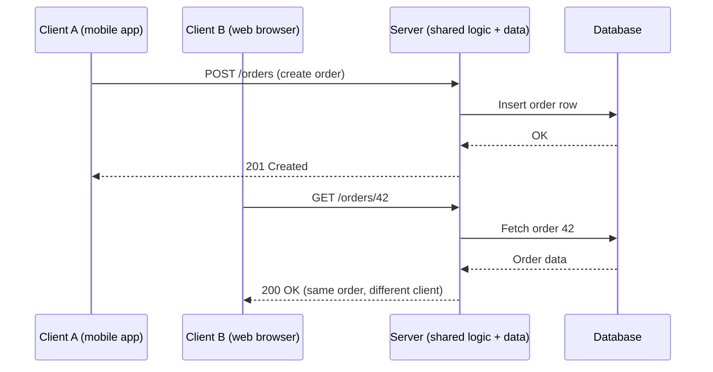

# Client-Server Architecture

## Why This Matters

Almost everything you'll build in this handbook — a REST API, an authentication service, an LLM gateway — is an instance of one architectural pattern: **client-server**. It's such a foundational assumption that it's easy to stop noticing it's a *choice*, with specific trade-offs versus alternatives (peer-to-peer, monoliths with embedded UIs, etc.). Understanding what the client-server split actually buys you — and what it costs — shapes almost every later design decision in this handbook, from statelessness to scaling to authentication.

## Core Concept

**Client-server architecture** splits a system into two roles:

- The **client** *initiates* communication. It requests something and consumes the result. Clients are typically what a user directly interacts with: a mobile app, a browser, a CLI tool — or another backend service, or an AI agent.
- The **server** *listens* for requests, does the actual work (business logic, data access, computation), and sends back a result. Servers are typically shared, always-on, and centrally maintained.

The key property is **asymmetry of responsibility**: the client doesn't need to know how the server does its job, and the server doesn't need to know anything about the client beyond how to interpret its requests and where to send a response. This is a specific case of the general API contract idea covered in [Part 0's "What Is an API?"](../00-introduction/what-is-an-api.md) — client-server is the *deployment shape* that most web APIs live inside.

## Mental Model

Think of a bank. The **server** is the bank itself: vaults, ledgers, staff, security systems — heavy, centralized infrastructure that many customers share. The **client** is you, walking up to a teller window. You don't get to see the vault or touch the ledgers. You make a request ("I'd like to withdraw $200"), the bank does whatever internal work is needed (updates its ledger, checks your balance, dispenses cash), and hands you a result.

Crucially: thousands of customers can interact with the same bank simultaneously, each unaware of the others, each getting correct and independent results — because the bank (server) manages shared state centrally rather than each customer keeping their own copy of the ledger.

## How It Works

A client-server system generally has these properties:

- **Many clients, few servers.** One server (or server cluster) typically serves many clients concurrently — this ratio is why servers need to be optimized for concurrency and clients don't.
- **Server holds the source of truth.** Persistent, shared data (a database, business state) lives on the server side, not scattered across clients, which keeps that data consistent for everyone.
- **Clients initiate; servers react.** In the base model, a server never randomly contacts a client — it only responds to requests. (Patterns like WebSockets and Server-Sent Events, covered in [Part 9 — Real-Time APIs](../09-realtime-and-webhooks/README.md), extend this so servers can push data too, but a connection is still client-initiated.)
- **Statelessness (usually).** Well-designed HTTP servers treat each request independently rather than remembering "where you left off" in server memory — any needed state travels with the request (e.g., an auth token) or lives in a shared store like a database, not in the process handling one specific client. This is what lets you run multiple identical server instances behind a load balancer.

The client-server model isn't the only way to build distributed systems — **peer-to-peer** architectures (like BitTorrent) let every node act as both client and server with no central authority — but almost all APIs you'll build professionally are client-server, because centralizing data and logic makes consistency, security, and updates dramatically simpler to manage.

## Architecture



Both clients are unaware of each other, yet they see a consistent view of the same underlying data — because the server, not either client, owns that data.

## Request / Response Example

Two different clients hitting the same server endpoint, each getting an independent, correctly-scoped response:

**Client A's request**

```http
GET /orders/42 HTTP/1.1
Host: api.example.com
Authorization: Bearer <client-a-token>
```

**Server's response to Client A**

```http
HTTP/1.1 200 OK
Content-Type: application/json

{ "id": 42, "status": "shipped", "owner_id": 101 }
```

**Client B's request for a different resource, same server, same connection model**

```http
GET /orders/99 HTTP/1.1
Host: api.example.com
Authorization: Bearer <client-b-token>
```

Same server code path handles both — the server doesn't maintain any special memory of "client A" between requests; each request carries everything the server needs (here, the auth token) to process it independently.

## Code Example

A minimal FastAPI server illustrating the core client-server property: the server holds shared state (`ORDERS`), and any number of clients can query it independently without knowing anything about each other or how the data is stored.

```python
from fastapi import FastAPI, HTTPException

app = FastAPI()

# Shared server-side state — the "source of truth" every client reads from.
# In production this would be a database (Part 4), not an in-memory dict.
ORDERS = {
    42: {"id": 42, "status": "shipped", "owner_id": 101},
    99: {"id": 99, "status": "pending", "owner_id": 202},
}


@app.get("/orders/{order_id}")
def get_order(order_id: int):
    """Any client can call this. The server doesn't remember who called last."""
    order = ORDERS.get(order_id)
    if order is None:
        raise HTTPException(status_code=404, detail="Order not found")
    return order
```

Run this with `uvicorn main:app --reload` and open two different terminals with `curl http://localhost:8000/orders/42` and `curl http://localhost:8000/orders/99` — both work independently, concurrently, against the same running server process.

## Production Considerations

- **Scaling the server, not the client.** Because servers handle many clients, they're the bottleneck under load — this is why horizontal scaling (running multiple server instances behind a load balancer), connection pooling, and caching (Part 7) exist. Clients typically don't need this kind of scaling work.
- **Statelessness enables horizontal scaling.** If a server keeps per-client state in local memory (e.g., "remember this user is mid-checkout"), you can't freely add or remove server instances without breaking active clients. Stateless servers with state in a shared database or cache (Redis, Part 7) can scale elastically.
- **Trust boundary.** The client is untrusted by default — it runs on infrastructure you don't control (a user's phone, browser) and can be tampered with. The server must independently validate and authorize every request rather than trusting anything the client claims (Part 5, Part 10).
- **Thin vs. thick clients.** How much logic lives in the client versus the server is a real design decision. Moving business logic into the client (e.g., a mobile app computing prices locally) creates duplication and security risk if that logic can be bypassed; keeping it server-side keeps a single source of truth but adds network round-trips.

## Common Mistakes

- **Putting business logic or secrets in the client.** Anything shipped to a client (mobile app, browser JavaScript) can be inspected or modified by whoever runs it — API keys, pricing logic, or authorization decisions must live server-side.
- **Storing per-user state in server process memory.** This silently breaks the moment you run more than one server instance, since a later request might hit a different instance that has no memory of the earlier one.
- **Trusting client-supplied data without validation.** Because the server has no control over what a client sends, every request needs to be validated and authorized server-side, even if the official client app would "never send that."

## Best Practices

- Keep servers stateless where possible; push shared state into a database or cache that any server instance can reach.
- Treat every incoming request as if it came from an untrusted, possibly malicious client — validate and authorize on the server, always.
- Design the client-server contract (the API) to be the *only* thing either side depends on, so client and server implementations can evolve independently, as covered in [Part 2 — REST API Design](../02-rest-api-design/README.md).

## AI Engineering Perspective

LLM providers are servers in exactly this sense: your application (the client) sends a request with a prompt, and Anthropic's or OpenAI's infrastructure (the server) does the actual model inference — you never see the weights, the GPUs, or the internal serving stack, only the API contract. This is also why an "AI agent" that calls tools is still client-server underneath: the agent is a client to the LLM API *and* a client to whatever tools/APIs it calls, while your backend acts as a server to whichever frontend or agent depends on it. [Part 17 — AI Agents & MCP](../17-ai-agents-and-mcp/README.md) explores this layered client-server structure directly.

## Exercises

**Beginner**
1. Identify the client and the server the next time you use an app (e.g., a weather app). What request do you think the client sends, and what does the server likely respond with?
2. Why can't a mobile app safely store the master database password and query the database directly, skipping the server?

**Intermediate**
3. Extend the FastAPI example with a `POST /orders` endpoint that adds a new order to `ORDERS`. Have two separate `curl` calls (simulating two clients) create orders and confirm both are visible via `GET /orders/{id}` afterward.

**Advanced**
4. The FastAPI example stores `ORDERS` in a Python dict in process memory. Explain concretely what breaks if you run this app with `uvicorn main:app --workers 4` (four separate processes) and one client creates an order while another client — hitting a different worker — tries to read it.

## Key Takeaways

- Client-server architecture splits systems into request-initiators (clients) and request-handlers with shared state (servers).
- Servers own the shared source of truth; clients are untrusted, independent, and shouldn't hold business logic or secrets.
- Statelessness on the server side is what enables horizontal scaling — a core theme that resurfaces throughout Parts 4, 6, and 11.
- LLM providers, tool APIs, and AI agents all fit the same client-server model, just with more layers stacked together.
