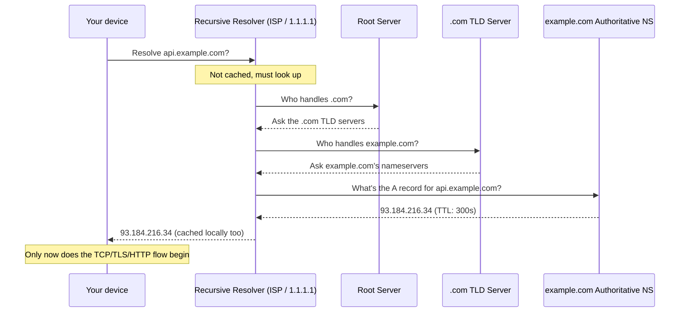

# DNS

## Why This Matters

You never type an IP address into your API client — you type `api.stripe.com` or `api.anthropic.com`. Somewhere between typing that hostname and your request actually leaving your machine, something has to translate a human-readable name into the numeric IP address that routing (from [How the Internet Works](how-the-internet-works.md)) actually understands. That translation is **DNS**, and it's a surprisingly common source of production incidents: "the API is down" is very often "DNS didn't resolve" or "DNS is returning a stale IP," not an application bug at all. As an API developer, you'll configure DNS records for your own services and need to reason about DNS-related failures in systems you consume.

## Core Concept

**DNS (Domain Name System)** is the internet's distributed, hierarchical naming system. It maps human-friendly **domain names** (`api.example.com`) to machine-usable **IP addresses** (`93.184.216.34`), roughly the way a phone's contacts app maps a person's name to their phone number.

DNS is:

- **Distributed** — no single server holds every mapping in the world; the responsibility is split across a hierarchy of servers.
- **Hierarchical** — domain names read right to left in authority: the root, then the **TLD (top-level domain)** like `.com`, then the specific domain (`example.com`), then subdomains (`api.example.com`).
- **Cached at every level** — because looking up the same name repeatedly would be wasteful, DNS answers are cached (with an expiry, the **TTL**) by resolvers, operating systems, and even browsers.

## Mental Model

Think of DNS like a global, tiered directory-assistance system for phone numbers, rather than one giant phone book. If you ask your local operator (your ISP's resolver) for "Example Company's API number," and they don't have it memorized, they don't have to know the number directly — they know *which regional office* to call to find out (the `.com` registry), and that regional office knows exactly which local office (`example.com`'s own nameservers) to route your question to. Once your local operator gets the answer, they jot it down on a sticky note with an expiry date (**TTL**, time-to-live) so the next few callers asking the same question get an instant answer without redoing the whole chain — until the sticky note expires and they ask again to make sure the number hasn't changed.

## How It Works

A DNS lookup for `api.example.com` typically follows this chain (grossly simplified, since most of it is cached in practice):

1. Your device checks its **local cache** (OS-level, sometimes browser-level) — if it already knows the answer and the TTL hasn't expired, it's done immediately.
2. If not cached, it asks a **recursive resolver** (usually run by your ISP or a public service like `8.8.8.8` or `1.1.1.1`) to figure it out on your behalf.
3. The resolver asks a **root server**: "who handles `.com`?"
4. The root server points it to the **TLD server** for `.com`.
5. The TLD server points it to `example.com`'s **authoritative nameserver** — the server that actually holds the real records for that domain.
6. The authoritative nameserver returns the actual **A record** (or **AAAA** for IPv6) — the IP address for `api.example.com`.
7. The resolver caches this answer for the record's TTL and returns it to your device, which also caches it.

Common DNS **record types** you'll configure as an API developer:

- **A** — maps a hostname to an IPv4 address.
- **AAAA** — maps a hostname to an IPv6 address.
- **CNAME** — an alias: maps a hostname to *another hostname* rather than an IP directly (e.g., pointing `api.example.com` to a cloud provider's load balancer hostname).
- **MX** — where to deliver email for the domain (not directly relevant to APIs, but commonly seen alongside).
- **TXT** — arbitrary text, commonly used for domain ownership verification and email security policies (SPF/DKIM).
- **NS** — declares which nameservers are authoritative for a domain.

## Architecture



## Request / Response Example

DNS itself is a request/response protocol (traditionally over UDP for speed, falling back to TCP for larger responses), though you'll rarely interact with it directly — you'll use tools like `dig` or `nslookup`. A `dig` query and simplified response looks like:

**Query**

```text
dig api.example.com A
```

**Response (simplified)**

```text
;; ANSWER SECTION:
api.example.com.    300    IN    A    93.184.216.34

;; Query time: 24 msec
;; SERVER: 1.1.1.1#53
```

The `300` is the TTL in seconds — how long resolvers should cache this answer before asking again. This single lookup happens before a single byte of your actual HTTP request (from the [HTTP chapter](http.md)) is sent.

## Code Example

Python's `socket` module exposes DNS resolution directly, which is useful for understanding exactly what happens before an HTTP client even opens a connection:

```python
import socket

hostname = "example.com"

# This performs a DNS lookup and returns the resolved IPv4 address.
# Every `requests.get("https://example.com")` call does this internally
# before opening a TCP connection.
ip_address = socket.gethostbyname(hostname)
print(f"{hostname} resolves to {ip_address}")

# getaddrinfo gives the fuller picture: multiple addresses (A and AAAA),
# since a domain can resolve to more than one IP for redundancy/load balancing.
results = socket.getaddrinfo(hostname, 443, proto=socket.IPPROTO_TCP)
for family, _, _, _, sockaddr in results:
    kind = "IPv4" if family == socket.AF_INET else "IPv6"
    print(kind, sockaddr[0])
```

If `socket.gethostbyname` raises `socket.gaierror`, that's DNS resolution failing — a distinct failure mode from a TCP connection timeout or an HTTP error, and one worth recognizing separately when debugging.

## Production Considerations

- **TTL is a trade-off, not just a technical detail.** A low TTL (e.g., 60 seconds) lets you change infrastructure (like failing over to a backup server) quickly, because caches expire fast — but it means more frequent DNS lookups and slightly higher latency/load on your nameservers. A high TTL reduces lookup overhead but means changes propagate slowly and a bad record can stay cached (and broken) for a long time.
- **DNS propagation delay.** When you change a DNS record, it doesn't update everywhere instantly — resolvers around the world are holding cached answers until their TTL expires. Plan infrastructure migrations around this, often by lowering the TTL in advance of a planned change.
- **DNS as a single point of failure.** If your authoritative nameservers are down, your API is unreachable even if your actual servers are perfectly healthy — many production setups use multiple redundant nameservers and/or managed DNS providers with high availability guarantees.
- **DNS-based load balancing and failover.** Returning multiple A records, or using health-check-aware DNS services, is a real (if coarse-grained) load balancing and failover mechanism, distinct from the load balancer covered in [Part 11 — Microservices & Distributed Systems](../11-microservices-distributed-systems/README.md).

## Common Mistakes

- **Confusing a DNS failure with an application failure.** "Connection refused" or "could not resolve host" errors mean DNS or TCP-level problems, not a bug in your API's business logic — check `dig`/`nslookup` before digging into application logs.
- **Setting TTLs too high before a planned migration.** If you're about to change which server a domain points to, forgetting to lower the TTL in advance means some clients keep hitting the old server for hours or days after the change.
- **Hardcoding IP addresses instead of using hostnames.** This bypasses DNS entirely and breaks the moment the underlying server's IP changes — always connect via hostname unless you have a very specific reason not to.

## Best Practices

- Use a reputable, redundant DNS provider for production domains rather than a single point of failure.
- Lower TTLs before planned infrastructure changes; raise them again afterward once you're confident in the new setup.
- When debugging "can't reach the API" issues, check DNS resolution first (`dig`, `nslookup`) — it's a fast way to rule out an entire class of problems before looking at application code.

## AI Engineering Perspective

Every call to an LLM provider's API starts with resolving a hostname like `api.anthropic.com` or `api.openai.com` to an IP address — if you're building a **multi-provider LLM gateway** (a real pattern covered in [Part 15 — Production AI Systems](../15-production-ai-systems/README.md)), you're implicitly relying on each provider's DNS infrastructure being reliable and fast, since a slow or failed DNS lookup adds latency or an outright failure before your request even reaches the model. Self-hosting your own model-serving infrastructure means you're now the one responsible for configuring correct, redundant DNS for your inference endpoints — a production concern many AI teams don't think about until their "AI service" goes down because of a DNS misconfiguration, not a model problem.

## Exercises

**Beginner**
1. Run `dig example.com` (or `nslookup example.com`) and identify the IP address returned and the TTL.
2. Explain in your own words why DNS caching exists and what problem it solves.

**Intermediate**
3. Use the `socket.getaddrinfo` code example against a domain you know has multiple servers (e.g., a large public API) and check whether it returns more than one IP address.

**Advanced**
4. You're about to migrate `api.yourcompany.com` from an old server to a new one. The current DNS record has a TTL of 24 hours. Describe, step by step, the safest sequence of changes to make the migration close to zero-downtime.

## Key Takeaways

- DNS translates human-readable domain names into IP addresses through a hierarchical, cached lookup chain (root → TLD → authoritative nameserver).
- Common record types (A, AAAA, CNAME, TXT, NS) each serve a distinct purpose you'll configure as an API owner.
- TTL controls the caching/freshness trade-off — low TTLs mean faster propagation of changes but more frequent lookups.
- DNS failures are a distinct, common class of production incident, separate from TCP or application-level failures, and worth ruling out first when debugging connectivity.
