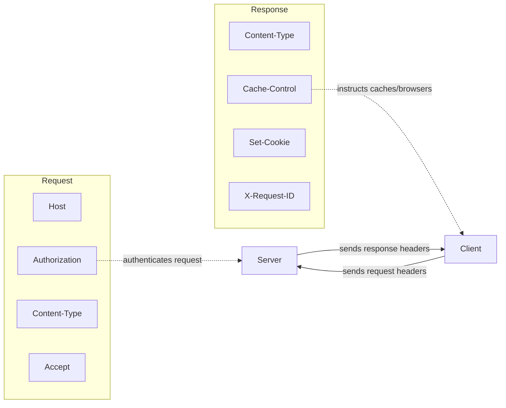

# Headers

## Why This Matters

Headers are how HTTP carries *metadata about a request or response* separately from the actual payload — what format the body is in, who's making the request, how the response should be cached, what the client is willing to accept. Nearly every cross-cutting concern in API engineering (authentication, caching, content negotiation, tracing, rate limiting) is implemented through headers, not through the body or URL. If you don't know your way around headers, you'll end up reinventing things (like passing auth tokens as query parameters) that HTTP already has a correct, standard mechanism for.

## Core Concept

A **header** is a `Name: value` pair sent as part of an HTTP message, one per line, between the start line and the body (recall the structure from the [HTTP chapter](http.md)). Headers exist on **both** requests and responses — a request header describes the request or the client (e.g., "what formats can I accept?"); a response header describes the response or the server (e.g., "here's the format of what I'm sending back").

Headers are case-insensitive by name (`Content-Type` and `content-type` are the same header) and there can be multiple headers with the same name in one message where that's meaningful (e.g., multiple `Set-Cookie` headers). Unlike the body, headers are meant to be small, structured metadata — not the primary payload.

## Mental Model

Think of headers like the information written on the *outside* of a package, as opposed to what's inside it. The shipping label doesn't contain the actual product — it says who it's from, what's inside (roughly), how it should be handled ("fragile," "refrigerate"), and tracking information. A warehouse worker can make routing and handling decisions just by reading the label, without ever opening the box. That's exactly the role headers play for HTTP infrastructure — proxies, load balancers, and caches make real decisions based on headers alone, without ever parsing the request/response body.

## How It Works

**Common request headers:**

- **`Host`** — which domain this request is for (required in HTTP/1.1); lets one server/IP host many domains.
- **`Content-Type`** — the media type (MIME type) of the request body, e.g., `application/json`, `multipart/form-data`. Tells the server how to parse the body.
- **`Authorization`** — carries credentials, most commonly `Bearer <token>` for token-based auth (Part 5).
- **`Accept`** — tells the server what response formats the client can handle, e.g., `application/json`. Servers can use this for **content negotiation**.
- **`User-Agent`** — identifies the client software making the request.
- **`Accept-Encoding`** — what compression formats the client supports (e.g., `gzip`), so the server can compress the response body to save bandwidth.

**Common response headers:**

- **`Content-Type`** — same idea, but for the response body's format.
- **`Content-Length`** — the size of the body in bytes, so the client knows when it's fully received the message.
- **`Cache-Control`** — instructions for how (and whether) this response can be cached (`no-store`, `max-age=3600`, etc.) — the backbone of HTTP caching, covered in [Part 7](../07-caching-performance/README.md).
- **`Set-Cookie`** — asks the client to store a cookie, used for session-based state (Part 5).
- **`Location`** — used with `201 Created` or `3xx` redirects to point to a resource's URL.
- **`Retry-After`** — tells the client how long to wait before retrying, paired with `429` or `503` (Part 6).

**Custom headers** — APIs frequently define their own headers for API-specific metadata not covered by standard ones, conventionally (though not required anymore) prefixed with `X-`, e.g., `X-Request-ID` for tracing (Part 12), or provider-specific auth headers like `x-api-key`. There's no strict rule enforcing this prefix today, but it remains a common, useful convention for signaling "this is not a standard HTTP header."

## Architecture



## Request / Response Example

A request and response showing several headers doing distinct jobs simultaneously:

**Request**

```http
POST /api/v1/comments HTTP/1.1
Host: api.example.com
Authorization: Bearer eyJhbGciOi...
Content-Type: application/json
Accept: application/json
User-Agent: MyApp/2.1.0
X-Request-ID: 8f14e45f-ceea-4a3a-9e91-1c6b3d2f10ab

{"post_id": 12, "text": "Nice post!"}
```

**Response**

```http
HTTP/1.1 201 Created
Content-Type: application/json
Content-Length: 78
Location: /api/v1/comments/501
Cache-Control: no-store
X-Request-ID: 8f14e45f-ceea-4a3a-9e91-1c6b3d2f10ab

{"id": 501, "post_id": 12, "text": "Nice post!", "created_at": "2026-08-18T09:00:00Z"}
```

Note the server echoes back the same `X-Request-ID` — a common pattern (Part 12) that lets you trace a single logical request across logs from multiple services, even though it's just a header the client happened to invent and send.

## Code Example

Reading and setting headers in FastAPI, both incoming and outgoing:

```python
from fastapi import FastAPI, Header, HTTPException, Response
from typing import Annotated

app = FastAPI()


@app.get("/orders/{order_id}")
def get_order(
    order_id: int,
    response: Response,
    authorization: Annotated[str | None, Header()] = None,
    accept: Annotated[str | None, Header()] = None,
):
    # FastAPI's `Header()` reads a specific incoming header by name.
    if authorization is None or not authorization.startswith("Bearer "):
        raise HTTPException(401, "Missing or malformed Authorization header")

    token = authorization.removeprefix("Bearer ")
    # ... validate token here (Part 5) ...

    # Setting outgoing response headers explicitly.
    response.headers["Cache-Control"] = "private, max-age=60"
    response.headers["X-Request-ID"] = "8f14e45f-ceea-4a3a-9e91-1c6b3d2f10ab"

    return {"id": order_id, "status": "shipped"}
```

And on the client side, setting request headers with `httpx`:

```python
import httpx

response = httpx.get(
    "https://api.example.com/orders/501",
    headers={
        "Authorization": "Bearer eyJhbGciOi...",
        "Accept": "application/json",
        "X-Request-ID": "8f14e45f-ceea-4a3a-9e91-1c6b3d2f10ab",
    },
    timeout=5,
)
print(response.headers["Content-Type"])
print(response.json())
```

## Production Considerations

- **Headers are logged more often than bodies.** Many logging/observability setups log request headers (or a subset) by default but not full bodies — this is another reason secrets belong in specific, well-understood headers (like `Authorization`) rather than invented ad hoc, so your logging pipeline can be configured to redact them deliberately.
- **Header size limits exist.** Servers and proxies cap total header size (commonly 8KB or so) — don't stuff large data (like an entire JSON payload) into a custom header; use the body.
- **Case-insensitivity can bite you in code.** If you're manually comparing header names as strings, remember `Content-Type` and `content-type` must be treated as equal — most HTTP libraries handle this for you, but raw/manual parsing won't.
- **CORS is enforced through headers.** Cross-origin requests (browser JavaScript calling a different domain's API) rely entirely on headers like `Access-Control-Allow-Origin` — covered in [Part 10 — API Security](../10-api-security/README.md).

## Common Mistakes

- **Putting authentication tokens in the URL instead of the `Authorization` header.** URLs get logged far more pervasively than headers (see [URLs](urls.md)) — this is a recurring, avoidable security mistake.
- **Forgetting `Content-Type` on requests with a body.** Without it, a server may fail to parse the body correctly or guess incorrectly — always set it explicitly when sending a body.
- **Inventing a new header for something HTTP already standardizes.** E.g., building a custom `X-Auth-Token` header when `Authorization: Bearer <token>` already exists and is understood by generic tooling (proxies, API gateways, client libraries).

## Best Practices

- Use standard headers whenever one already exists for your purpose (`Authorization`, `Content-Type`, `Cache-Control`) instead of inventing your own.
- Prefix genuinely custom, API-specific headers clearly (e.g., `X-Request-ID`) so it's obvious they're not part of the HTTP standard.
- Always set `Content-Type` explicitly on requests and responses with a body.
- Propagate a request ID header end-to-end through every service a request touches — it's one of the highest-value, lowest-cost things you can do for debuggability (Part 12).

## AI Engineering Perspective

LLM provider APIs authenticate almost exclusively through headers — Anthropic's API uses an `x-api-key` header (plus an `anthropic-version` header to pin the API version you're coding against), while other providers commonly use `Authorization: Bearer <key>`. Headers are also where you'll find crucial operational information in LLM API responses: rate-limit state is frequently exposed via headers like `x-ratelimit-remaining-requests` or `x-ratelimit-remaining-tokens`, letting a well-built client back off *before* hitting a hard `429` rather than reactively. If you build a multi-provider LLM gateway (Part 15), a huge part of that work is normalizing these differently-named, provider-specific headers into one consistent internal shape your application code can rely on.

## Exercises

**Beginner**
1. Use `curl -v` against any public API and list every request and response header you see, noting what each one is likely for.
2. Explain why `Authorization` is preferred over putting a token in the URL, referencing at least one concrete leak vector.

**Intermediate**
3. Extend the FastAPI example to also read and validate an `Accept` header, returning `406 Not Acceptable` if the client requests a format (e.g., `application/xml`) your API doesn't support.

**Advanced**
4. Design a header-based request-tracing scheme for a system made of three chained services (A calls B calls C). What header(s) would you propagate, what would each service do with them, and how would this help you debug a slow request spanning all three?

## Key Takeaways

- Headers carry metadata about a request or response — separate from the actual payload — and both requests and responses have their own sets.
- Standard headers (`Authorization`, `Content-Type`, `Cache-Control`, `Accept`) already solve most common needs; reach for custom headers only when nothing standard fits.
- Headers drive real infrastructure behavior: caching, content negotiation, authentication, and rate limiting all work through headers, not the body.
- LLM provider APIs rely on headers for both authentication and rate-limit signaling — patterns you'll normalize yourself when building multi-provider AI systems.
