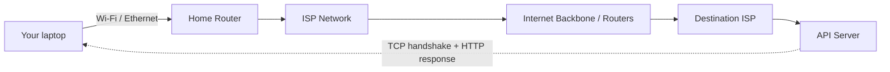

# How the Internet Works

## Why This Matters

Every API call you make or build travels across a physical and logical stack of infrastructure you didn't write and mostly don't control: cables, routers, ISPs, and protocols developed decades before "REST API" was a phrase. When a request from your FastAPI client times out, hangs, or gets a mysterious connection error, understanding *what's actually happening between "send" and "receive"* is the difference between guessing and diagnosing. You don't need to be a network engineer to build APIs — but you do need a working model of packets, addresses, and routing, because every HTTP request you'll ever send rides on top of them.

## Core Concept

The internet is not one thing — it's a **network of networks**, all agreeing to speak the same set of low-level protocols so that any device can, in principle, talk to any other device. Three ideas make this possible:

- **Packet switching** — data isn't sent as one continuous stream; it's chopped into small chunks called **packets**, each labeled with where it's going. Packets from the same request can take different physical routes and get reassembled at the destination.
- **Addressing** — every device on the internet needs a unique address to be reachable, called an **IP address** (e.g., `142.250.premise.174`, `2607:f8b0::1`). Without an address, there's nowhere to route a packet.
- **Layered protocols** — instead of one giant protocol that does everything, the internet is built from stacked layers, each solving one problem (physical transmission, addressing, reliable delivery, application meaning) and handing off to the next.

As an API developer, you mostly live at the top of this stack (HTTP), but every layer below it shapes your API's behavior: latency, connection failures, retries, and timeouts all trace back to what's happening at these lower layers.

## Mental Model

Think of mailing a large book to a friend, but the postal service only accepts postcards. You'd tear the book into individual pages (**packets**), write your friend's address and a page number on each one (**addressing + sequencing**), and drop them in different mailboxes around the city. Each postcard might travel a different route through different sorting facilities (**routers**), depending on traffic. Your friend's mailbox collects all the postcards, and your friend reassembles the book in page order — noticing if a page is missing and asking you to resend just that one (this reassembly-and-recovery job is what the **TCP** layer does).

You never had to know which sorting facility handled page 42. You just needed a correct address and a numbering scheme. That's exactly the deal packet-switched networking makes with you.

## How It Works

The internet's plumbing is usually described as a stack of layers, most commonly summarized (a simplified version of the OSI/TCP-IP models) as:

1. **Physical/Link layer** — the actual medium: fiber optic cables, Wi-Fi radio, Ethernet. Moves raw bits between directly connected devices.
2. **Internet layer (IP)** — the **Internet Protocol** gives every device an address and defines how packets are routed from source to destination across multiple networks, hop by hop, without any single router knowing the full path.
3. **Transport layer (TCP/UDP)** — sits on top of IP and adds delivery guarantees. **TCP (Transmission Control Protocol)** establishes a connection, guarantees packets arrive in order, retransmits lost packets, and controls sending rate. **UDP (User Datagram Protocol)** skips all that overhead — it just fires packets and doesn't guarantee delivery or order, which is why it's used for things like video calls and DNS where speed matters more than perfection. HTTP runs over TCP (HTTP/3 is a notable exception — more in the [HTTP chapter](http.md)).
4. **Application layer (HTTP, DNS, SMTP, ...)** — the protocols that give the raw bytes *meaning*. HTTP is an application-layer protocol: it defines what a "request" and "response" look like, but relies entirely on TCP underneath to actually get those bytes from client to server reliably.

Getting a packet from your laptop to a server in another country involves dozens of intermediate hops — your home router, your **ISP (Internet Service Provider)**, regional and international backbone providers, and finally the destination's network — each one a router that looks at the destination IP address and forwards the packet one step closer, without knowing the entire route in advance. This is why `traceroute` to the same server can show a different path on different days: routing is dynamic and adapts to congestion and failures.

## Architecture



Each arrow above is a hop where a router inspects the destination IP address of a packet and forwards it toward the next network. Your HTTP request doesn't travel as one unit down this whole path — it's split into packets at your machine, reassembled in order at the server thanks to TCP, and the response makes the same kind of trip back.

## Request / Response Example

At the application layer, what you write looks like this — but it's worth remembering everything below the first line is packets, routing, and a TCP handshake you don't see:

```http
GET /api/v1/status HTTP/1.1
Host: api.example.com
User-Agent: curl/8.4.0
Accept: */*
```

Before this single HTTP request even leaves your machine, TCP has already: resolved a route to the server's IP, performed a three-way handshake (`SYN` → `SYN-ACK` → `ACK`) to open a connection, and only then does the HTTP text above get sent as the payload of one or more packets.

## Code Example

You rarely touch packets or IP directly in application code, but Python's standard library lets you see the layer just below HTTP — a raw TCP socket — to make the abstraction concrete:

```python
import socket

# Resolve api.example.com to an IP address, then open a raw TCP connection.
# This is exactly what `requests` / `httpx` do internally before sending HTTP text.
host = "example.com"
port = 80

with socket.create_connection((host, port), timeout=5) as sock:
    # At this point, a full TCP three-way handshake has already happened.
    # We're now writing raw bytes onto an established, reliable, ordered stream.
    request = (
        f"GET / HTTP/1.1\r\n"
        f"Host: {host}\r\n"
        f"Connection: close\r\n"
        f"\r\n"
    )
    sock.sendall(request.encode("utf-8"))

    response = b""
    while chunk := sock.recv(4096):
        response += chunk

    print(response.decode("utf-8", errors="replace")[:300])
```

Notice `socket.create_connection` is doing IP resolution and the TCP handshake before a single byte of HTTP is sent. Every `requests.get(...)` call you'll ever write does this same work, just hidden behind a friendlier API.

## Production Considerations

- **Latency is physical, not just logical.** A server in another continent has an unavoidable round-trip time from the speed of light in fiber, regardless of how fast your code runs. This is why CDNs and regional deployments exist (see [Part 7 — Caching & Performance](../07-caching-performance/README.md)).
- **Connection failures happen below your code.** A "connection refused," "connection reset," or "timeout" error in your HTTP client often reflects something failing at the TCP or routing layer, not a bug in your application logic.
- **NAT and firewalls affect reachability.** Most devices don't have a public IP address directly; they sit behind Network Address Translation (NAT) and firewalls, which is why services you deploy need to be explicitly exposed (e.g., via a load balancer or reverse proxy) to be reachable from the internet.
- **DNS is a separate step** in this whole chain, covered in depth in [DNS](dns.md) — before any of the above happens, your client has to translate `api.example.com` into an IP address.

## Common Mistakes

- **Assuming "the internet" and "HTTP" are the same thing.** HTTP is one application built on top of the internet's lower layers; understanding this separation helps you know which layer a given failure belongs to.
- **Ignoring latency as a design factor.** New API developers often assume network calls are "instant" the way local function calls are, then get surprised by real-world latency in production.
- **Confusing "no response" with "server is down."** A timeout could mean the server crashed, but it could equally mean a router along the path dropped packets, a firewall silently blocked the connection, or DNS resolution failed — these have very different fixes.

## Best Practices

- Always set explicit timeouts on outbound HTTP calls (see the socket example's `timeout=5`) — without one, a network-layer stall can hang your application indefinitely.
- When debugging connectivity issues, work down the stack: confirm DNS resolves, confirm TCP connects (e.g., `telnet host port` or `nc -zv host port`), then check HTTP-level behavior.
- Design APIs assuming the network between client and server is unreliable — packets get lost, connections get reset, latency spikes happen. This assumption underlies retries and idempotency, covered in [Part 6 — Production Reliability](../06-production-reliability/README.md).

## AI Engineering Perspective

Every call to an LLM provider — Anthropic's API, OpenAI's API, or a self-hosted model — is, at the bottom of the stack, exactly this: packets routed over IP, reassembled reliably by TCP, carrying an HTTP request. When you build an AI system that streams tokens back over a long-lived connection (covered in [Part 14 — AI API Engineering](../14-ai-api-engineering/README.md) and [Part 9 — Real-Time APIs](../09-realtime-and-webhooks/README.md)), you are relying on that same TCP connection staying open and ordered for potentially tens of seconds — which is why network-layer instability (a flaky Wi-Fi connection, an ISP hiccup) shows up as a broken or truncated LLM stream, not an "AI problem."

## Exercises

**Beginner**
1. Run `traceroute example.com` (or `tracert` on Windows) and count how many hops your request takes before reaching the destination. What does each hop represent?
2. In your own words, explain why data is split into packets instead of sent as one continuous stream.

**Intermediate**
3. Run the raw socket example against a real HTTP server. Modify it to print only the response status line and headers, not the body.

**Advanced**
4. Explain why UDP (no delivery guarantees) is a reasonable choice for DNS lookups and video calls, but a poor choice for a JSON API response. What would break if HTTP ran over raw UDP with no equivalent of TCP's guarantees?

## Key Takeaways

- The internet is a network of networks connected by routers that forward IP packets hop by hop toward a destination address.
- TCP sits below HTTP and provides reliable, ordered delivery over an inherently unreliable packet-switched network; UDP skips those guarantees for speed.
- Every API call you make inherits the latency, failure modes, and reliability characteristics of this underlying stack — timeouts and retries exist because of it.
- You don't need to manage packets or routing directly, but recognizing which layer a failure belongs to (DNS, TCP, or HTTP) makes debugging dramatically faster.
