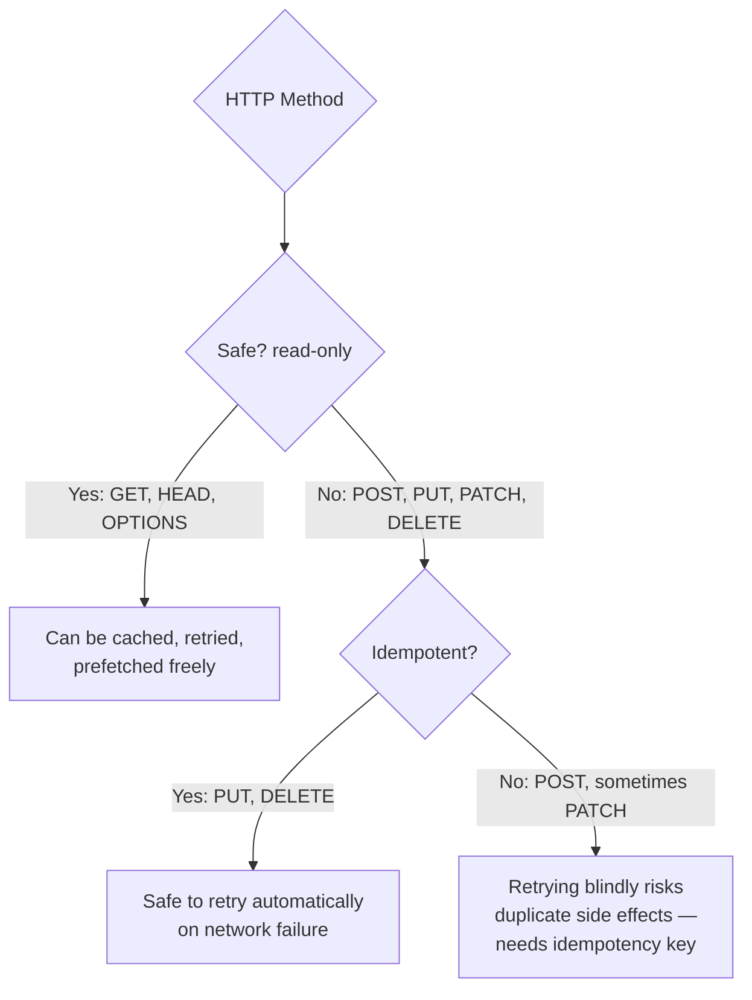

# HTTP Methods

## Why This Matters

The HTTP method is the very first thing on the request line — it's the verb that tells the server what kind of operation you intend, before it even looks at the path or body. Choosing the right method isn't a stylistic preference: it determines whether intermediaries (caches, proxies, browsers) treat your request as safe to retry, safe to cache, or safe to repeat automatically. Get this wrong — like using `GET` to delete something — and you can accidentally let a search engine crawler or browser prefetcher destroy data. Every REST API design decision in Part 2 builds on getting these semantics right.

## Core Concept

An HTTP **method** (sometimes called a "verb") declares the intended action of a request. HTTP defines a fixed, small set of standard methods rather than letting every API invent its own verbs — this is what lets generic infrastructure (browsers, caches, proxies, CDNs) apply consistent, safe behavior to *any* HTTP API without knowing anything about what that API actually does.

The methods you'll use as an API developer, and what each is *supposed* to mean:

| Method | Purpose | Has a body? |
|---|---|---|
| `GET` | Retrieve a resource | No (by convention) |
| `POST` | Create a resource / trigger an action | Yes |
| `PUT` | Replace a resource entirely | Yes |
| `PATCH` | Partially update a resource | Yes |
| `DELETE` | Remove a resource | Usually no |
| `HEAD` | Like `GET`, but headers only, no body | No |
| `OPTIONS` | Ask what methods/behavior are supported | No |

Two properties define how each method is expected to behave, and both matter enormously for correctness and performance in real systems:

- **Safety** — a method is **safe** if it doesn't change server state; it's read-only. `GET`, `HEAD`, and `OPTIONS` are safe. This is why it's reasonable for a browser to prefetch a `GET` link speculatively, or for a search engine crawler to hit every `GET` URL it finds — none of that should ever *do* anything.
- **Idempotency** — a method is **idempotent** if making the same request multiple times has the same effect as making it once. `GET`, `PUT`, `DELETE`, `HEAD`, and `OPTIONS` are idempotent. `POST` is **not** idempotent by default — submitting the same "create order" `POST` twice typically creates two orders. `PATCH` is *not guaranteed* idempotent (depends on what the patch actually does — "set status to shipped" is idempotent; "increment quantity by 1" is not).

## Mental Model

Think of HTTP methods like standardized labels on a set of physical request forms at a government office: a "Copy of Record" form (`GET`) that never changes anything no matter how many times you submit it, a "New Application" form (`POST`) where submitting it twice genuinely creates two separate applications, a "Full Replacement" form (`PUT`) where re-submitting the exact same completed form just re-confirms the same end state, and a "Amend Section" form (`PATCH`) for changing part of an existing record. The clerk (server) doesn't need to read your handwriting to know broadly what you intend — the form type alone tells them.

## How It Works

**GET** — the workhorse of retrieval. `GET /users/42` fetches user 42. Because it's safe and idempotent, `GET` responses are the primary thing HTTP caching (browsers, CDNs, `Cache-Control` headers) is built around — see [Part 7 — Caching & Performance](../07-caching-performance/README.md).

**POST** — used both for creating new resources (`POST /orders` → creates a new order, returns its ID) and for triggering actions that don't map cleanly to a resource (`POST /orders/42/cancel`). Because it's not idempotent, retrying a failed `POST` automatically (e.g., after a network timeout) risks double-processing — this is exactly why **idempotency keys** exist (a client-generated unique ID sent with the request so the server can detect and ignore a duplicate retry), covered in depth in [Part 6 — Production Reliability](../06-production-reliability/README.md).

**PUT** — replaces a resource wholesale. `PUT /users/42` with a full user object means "this is now the complete, entire state of user 42" — any field you omit is expected to be cleared or reset, not left untouched. This is what makes `PUT` idempotent: sending the exact same full replacement twice leaves the resource in the same final state both times.

**PATCH** — updates part of a resource. `PATCH /users/42` with `{"email": "new@example.com"}` changes just that field, leaving everything else alone. `PATCH`'s idempotency depends entirely on the semantics of the patch itself.

**DELETE** — removes a resource. `DELETE /users/42` is idempotent in the sense that deleting an already-deleted resource should still end in the same state (the resource doesn't exist) — even though a well-behaved API might return a `404` the second time rather than a `200`/`204`, the *server state* after either call is identical.

**HEAD** — identical to `GET` but the server omits the body, returning only headers/status. Useful for checking whether a resource exists, or its size/last-modified time, without transferring the full payload.

**OPTIONS** — asks a server what methods/headers are permitted for a given resource, without performing any action. Browsers use this automatically as a "preflight" check for cross-origin requests (CORS, covered in [Part 10 — API Security](../10-api-security/README.md)).

## Architecture



## Request / Response Example

Contrasting `POST` (create, not idempotent) and `PUT` (replace, idempotent) on the same resource:

**Creating a new order — POST**

```http
POST /orders HTTP/1.1
Host: api.example.com
Content-Type: application/json

{"item": "Widget", "quantity": 2}
```

```http
HTTP/1.1 201 Created
Location: /orders/501
Content-Type: application/json

{"id": 501, "item": "Widget", "quantity": 2}
```

Sending this exact request twice creates order 502, then 503 — two separate resources.

**Replacing an existing order — PUT**

```http
PUT /orders/501 HTTP/1.1
Host: api.example.com
Content-Type: application/json

{"item": "Widget", "quantity": 5}
```

```http
HTTP/1.1 200 OK
Content-Type: application/json

{"id": 501, "item": "Widget", "quantity": 5}
```

Sending this exact request twice leaves order 501 in the exact same final state both times — that's idempotency in action.

## Code Example

FastAPI maps HTTP methods directly to Python decorators, and the framework itself encodes some of this semantics (e.g., it won't parse a body for `GET` by default):

```python
from fastapi import FastAPI, HTTPException
from pydantic import BaseModel

app = FastAPI()
ORDERS: dict[int, dict] = {}
NEXT_ID = 1


class OrderIn(BaseModel):
    item: str
    quantity: int


@app.get("/orders/{order_id}")
def get_order(order_id: int):
    """Safe + idempotent: never changes state, safe to retry/cache."""
    if order_id not in ORDERS:
        raise HTTPException(404, "Order not found")
    return ORDERS[order_id]


@app.post("/orders", status_code=201)
def create_order(order: OrderIn):
    """NOT idempotent: calling this twice creates two separate orders."""
    global NEXT_ID
    order_id = NEXT_ID
    NEXT_ID += 1
    ORDERS[order_id] = {"id": order_id, **order.model_dump()}
    return ORDERS[order_id]


@app.put("/orders/{order_id}")
def replace_order(order_id: int, order: OrderIn):
    """Idempotent: replaces the whole resource. Same call twice = same end state."""
    if order_id not in ORDERS:
        raise HTTPException(404, "Order not found")
    ORDERS[order_id] = {"id": order_id, **order.model_dump()}
    return ORDERS[order_id]


@app.delete("/orders/{order_id}", status_code=204)
def delete_order(order_id: int):
    """Idempotent in effect: end state (resource gone) is the same either way."""
    ORDERS.pop(order_id, None)  # no error even if already deleted
```

## Production Considerations

- **Retries depend entirely on method semantics.** HTTP clients, load balancers, and API gateways commonly auto-retry `GET`/`PUT`/`DELETE` on network failure because they're idempotent — but must never auto-retry a plain `POST` without an idempotency key, or you risk duplicate orders, duplicate charges, duplicate emails.
- **Caching relies on safety.** Only safe methods (`GET`, `HEAD`) are cached by HTTP infrastructure by default — this is a core mechanism explored in [Part 7](../07-caching-performance/README.md).
- **`PUT` vs `PATCH` is a real API design decision**, not interchangeable naming — `PUT` requires clients to send the full resource state; `PATCH` allows partial updates but requires you to define (and document) exactly how partial updates behave, especially for nested or list fields.
- **Method mismatches break infrastructure assumptions.** Using `GET` to trigger a side effect (e.g., `GET /users/42/delete`) is a classic and dangerous anti-pattern, because anything that treats `GET` as safe — browser prefetching, crawlers, CDNs — will trigger that side effect unintentionally.

## Common Mistakes

- **Using `GET` for anything that mutates state.** This breaks every safety assumption built into web infrastructure and can lead to accidental data loss from crawlers or prefetchers.
- **Assuming `POST` is idempotent.** It isn't by default — network retries, double-clicks, or client bugs can cause duplicate `POST` requests; production systems need explicit idempotency keys to guard against this (Part 6).
- **Using `PUT` for partial updates.** A `PUT` that only sends changed fields, expecting untouched fields to remain as-is, violates `PUT`'s "full replacement" contract and will silently clear fields the client didn't intend to touch, depending on server implementation.

## Best Practices

- Use `GET` exclusively for safe, read-only operations — never attach side effects to it.
- Use `POST` for creation and non-idempotent actions; add idempotency keys for anything where a duplicate would cause real harm (payments, order creation).
- Use `PUT` when clients will always send the complete resource state; use `PATCH` when partial updates are the norm, and document your patch semantics precisely (e.g., JSON Merge Patch conventions).
- Prefer `DELETE` with no meaningful response body over inventing a `POST /resource/delete` endpoint — it's more consistent with HTTP semantics and infrastructure expectations.

## AI Engineering Perspective

Nearly every LLM API call — chat completions, embeddings, image generation — is a `POST` request, even though semantically it can feel like "just asking a question" (which might intuitively feel `GET`-like). This is correct: LLM calls are **not idempotent** in the strict sense (a `temperature > 0` request can return a different completion each time even with identical input) and typically carry a nontrivial request body (the prompt/messages) that doesn't belong in a URL — both strong signals for `POST`, as discussed in [URLs](urls.md). This has a real production consequence: you cannot safely auto-retry a failed LLM `POST` request without risk of double-billing or duplicate side effects (e.g., an agent that both sends an email *and* times out, triggering a naive retry) — which is exactly why idempotency keys and careful retry logic (Part 6, Part 17) matter even more in AI systems than in typical CRUD APIs.

## Exercises

**Beginner**
1. For each of `GET`, `POST`, `PUT`, `PATCH`, `DELETE`, state whether it is safe, and whether it is idempotent.
2. Explain, using the mental model of "form types," why a browser might prefetch a `GET` link but would never prefetch a `POST` form submission.

**Intermediate**
3. Add a `PATCH /orders/{order_id}` endpoint to the FastAPI example above that updates only the fields provided in the request body, leaving others unchanged. What Pydantic model shape do you need to distinguish "field not provided" from "field explicitly set to null"?

**Advanced**
4. A payments API endpoint is `POST /payments`. Design (in words, or as a short code sketch) how you'd make retrying this request safe using a client-generated idempotency key, including what the server needs to store and check.

## Key Takeaways

- HTTP methods declare intent (`GET` = read, `POST` = create/act, `PUT` = replace, `PATCH` = partial update, `DELETE` = remove) and let generic infrastructure behave safely without understanding your API.
- Safety (no side effects) and idempotency (repeatable with the same end result) are the two properties that determine what's safe to cache, retry, or prefetch automatically.
- `POST` is the only common method that is neither safe nor idempotent by default — this is exactly why idempotency keys exist for production reliability.
- LLM chat and generation endpoints are `POST` for the same fundamental reasons any non-idempotent, body-carrying action is — not an arbitrary API design choice.
