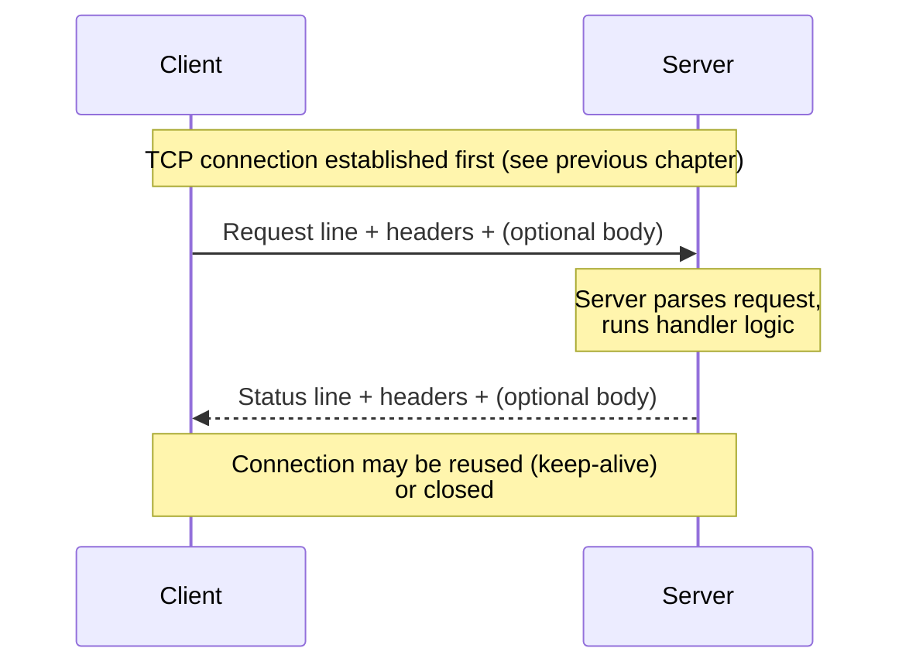

# HTTP

## Why This Matters

HTTP (**HyperText Transfer Protocol**) is the language almost every API in this handbook speaks. Whether you're calling a REST API, sending a webhook, or streaming tokens from an LLM, you're formatting your intent as an HTTP request and parsing an HTTP response. Frameworks like FastAPI hide most of the raw text from you, but when something goes wrong — a malformed request, an unexpected status code, a client that can't parse your response — you're debugging at the HTTP level whether you like it or not. Knowing what's actually on the wire turns "the API is broken" into "the server sent a 400 because the JSON body was empty."

## Core Concept

HTTP is a **text-based, request-response, application-layer protocol**. Breaking that down:

- **Text-based** — HTTP/1.1 messages are (mostly) human-readable ASCII text, not binary. You can literally type an HTTP request by hand into a raw TCP connection and get a real response back (we did this in the [previous chapter](how-the-internet-works.md)'s code example).
- **Request-response** — every HTTP interaction is a client sending exactly one request and the server sending exactly one response back. There's no built-in concept of the server initiating contact on its own.
- **Application-layer** — HTTP doesn't handle packet routing or delivery guarantees itself; it relies entirely on TCP (or, in HTTP/3, QUIC over UDP) underneath to actually deliver the bytes.
- **Stateless** — by design, HTTP has no built-in memory of past requests. Each request must contain everything the server needs to understand it (this is why cookies, tokens, and sessions exist — they're mechanisms *built on top of* HTTP to simulate state).

An HTTP message — request or response — has three parts: a **start line**, a set of **headers**, and an optional **body**.

## Mental Model

Think of HTTP as filling out a standardized form to make a request at a government office, rather than having a free-form conversation. The form has required fields in a fixed order: what you want to do and where (the start line), a list of labeled details about your request (headers — your ID number, the department, the language you want a reply in), and, if needed, an attachment with the actual content of your request (the body). The clerk (server) reads the form, does the work, and mails back a response using the exact same structure: a result code, a set of labeled details, and, if there's data to return, an attachment.

Because both sides agree on this exact structure in advance, neither has to guess how to parse the other's message — that's the entire value of a protocol.

## How It Works

**A request** consists of:

```text
<METHOD> <PATH> HTTP/<VERSION>      ← request line
<Header-Name>: <value>              ← headers (zero or more)
<Header-Name>: <value>
                                     ← blank line separates headers from body
<optional body>
```

**A response** consists of:

```text
HTTP/<VERSION> <STATUS-CODE> <REASON PHRASE>   ← status line
<Header-Name>: <value>                          ← headers
<Header-Name>: <value>
                                                 ← blank line
<optional body>
```

Methods ([HTTP Methods](http-methods.md)) tell the server what kind of operation to perform. Status codes ([HTTP Status Codes](status-codes.md)) tell the client what happened. Headers ([Headers](headers.md)) carry metadata about the request/response itself (content type, authentication, caching rules). The body ([Request & Response Bodies](request-response.md)) carries the actual payload — often JSON in modern APIs ([JSON and Serialization](json-and-serialization.md)).

**HTTP versions**, briefly:

- **HTTP/1.1** (1997, still extremely common) — one request per TCP connection at a time by default, though "keep-alive" lets a connection be reused sequentially. Text-based framing as shown above.
- **HTTP/2** (2015) — same semantics (same methods, headers, status codes) but a binary framing layer underneath, allowing **multiplexing**: multiple requests/responses interleaved over a single TCP connection simultaneously, fixing HTTP/1.1's "head-of-line blocking" at the connection level.
- **HTTP/3** (2022) — replaces TCP with **QUIC**, a transport protocol built on UDP, to eliminate a subtler head-of-line blocking problem where one lost packet stalls every stream sharing a TCP connection. Semantically, it's still "the same HTTP" from an application developer's point of view — same methods, headers, and status codes.

As an API developer using a framework, you rarely choose the HTTP version explicitly — it's typically negotiated automatically between client and server (e.g., by your reverse proxy or CDN) — but knowing HTTP/2 and HTTP/3 exist explains why your API can be fast even when a client makes many concurrent requests to the same host.

## Architecture



## Request / Response Example

A realistic request creating a resource, and the response it produces:

**Request**

```http
POST /api/v1/comments HTTP/1.1
Host: api.example.com
Content-Type: application/json
Content-Length: 47
Authorization: Bearer eyJhbGciOi...

{"post_id": 12, "text": "Great write-up!"}
```

**Response**

```http
HTTP/1.1 201 Created
Content-Type: application/json
Location: /api/v1/comments/501

{"id": 501, "post_id": 12, "text": "Great write-up!", "created_at": "2026-08-18T09:12:00Z"}
```

Notice the exact structural symmetry: start line, headers, blank line, body — on both sides.

## Code Example

Using Python's low-level `http.client` module makes the request/response structure explicit, without a friendly wrapper library hiding it:

```python
import http.client
import json

# http.client speaks raw HTTP/1.1 — a good way to see exactly what
# higher-level libraries like `requests` or `httpx` do for you.
conn = http.client.HTTPSConnection("httpbin.org", timeout=5)

body = json.dumps({"post_id": 12, "text": "Great write-up!"})
headers = {
    "Content-Type": "application/json",
    "Content-Length": str(len(body)),
}

conn.request("POST", "/post", body=body, headers=headers)

response = conn.getresponse()
print(response.status, response.reason)      # e.g. 200 OK
print(response.getheader("Content-Type"))    # e.g. application/json
data = response.read()
print(json.loads(data)["json"])              # httpbin echoes back what we sent

conn.close()
```

In everyday application code you'd use `httpx` or `requests` instead — but they're building exactly this request line / headers / body structure underneath.

## Production Considerations

- **Connection reuse matters for performance.** HTTP/1.1's keep-alive and HTTP/2's multiplexing avoid the cost of a new TCP (and TLS) handshake per request. HTTP client libraries in production should use connection pooling (e.g., a shared `httpx.Client()` instance) rather than opening a new connection per call.
- **HTTP is stateless, so state must be explicit.** Because the protocol has no memory, production APIs pass authentication on every request (tokens/headers, Part 5) rather than relying on the server "remembering" a client.
- **Version negotiation is usually automatic** but can matter for streaming-heavy AI workloads — HTTP/2's multiplexing is one reason a single connection can efficiently handle many concurrent streamed LLM responses to different users.
- **Message size limits are real.** Servers and proxies enforce maximum header sizes and body sizes; large uploads or huge JSON payloads may need chunked transfer or dedicated upload flows (see [Request & Response Bodies](request-response.md)).

## Common Mistakes

- **Assuming HTTP guarantees delivery or state on its own.** HTTP relies on TCP for reliable delivery and has zero built-in memory between requests — both must be handled explicitly at higher layers.
- **Forgetting the blank line matters.** In raw HTTP, the blank line separating headers from the body is not optional whitespace — it's how a parser knows headers ended and the body began. Hand-rolled HTTP (rare, but happens in low-level tooling) is a common source of this bug.
- **Conflating HTTP version with HTTP semantics.** HTTP/2 and HTTP/3 don't add new methods or status codes — they change *how* the same request/response messages are transported, not *what* they mean.

## Best Practices

- Let your framework (FastAPI) and HTTP client library (httpx) handle version negotiation, connection pooling, and message framing — write raw sockets only for learning or genuinely low-level tooling.
- Reuse HTTP client connections/sessions in production code rather than creating a new connection per request.
- When debugging, capture and read the raw request/response (`curl -v`, browser dev tools' Network tab) rather than guessing from application-level logs alone.

## AI Engineering Perspective

LLM chat APIs are ordinary HTTP under the hood: a `POST` request with a JSON body containing your messages, and a response that's either a single JSON blob or, for streaming ([Part 9](../09-realtime-and-webhooks/README.md), [Part 14](../14-ai-api-engineering/README.md)), a sequence of chunks sent over one long-lived HTTP response using Server-Sent Events framing. The "long-lived connection carrying many small chunks" pattern used for token streaming is a direct, practical application of the request/response and connection-reuse concepts in this chapter — a streaming LLM response is still fundamentally one HTTP response, just written to the client incrementally instead of all at once.

## Exercises

**Beginner**
1. Use `curl -v https://example.com` and identify the request line, at least three headers, and the status line in the output.
2. Explain in your own words why HTTP is described as "stateless," and name one mechanism used to work around that limitation.

**Intermediate**
3. Modify the `http.client` code example to send a `GET` request instead of `POST`, and print all response headers, not just `Content-Type`.

**Advanced**
4. Research and explain, in 3-4 sentences, what "head-of-line blocking" means at the TCP level, and why HTTP/2's multiplexing over a single TCP connection can still suffer from it in a way HTTP/3 (over QUIC) avoids.

## Key Takeaways

- HTTP messages have a strict structure: a start line, headers, a blank line, and an optional body — true for both requests and responses.
- HTTP is stateless by design; anything resembling "memory" between requests (sessions, tokens) is built on top of it, not part of the protocol itself.
- HTTP/1.1, HTTP/2, and HTTP/3 share the same request/response semantics but differ in transport-level efficiency (multiplexing, underlying transport protocol).
- Streaming LLM responses are ordinary HTTP responses delivered incrementally — the same protocol you already know, applied to a longer-lived exchange.
