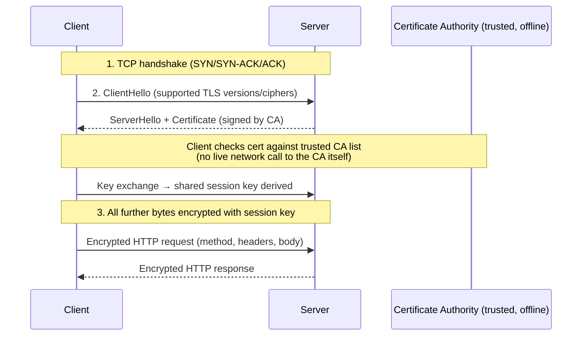

# HTTPS

## Why This Matters

Plain HTTP sends everything — including passwords, API keys, and session tokens — as readable text over the network. Anyone positioned between the client and server (a coffee-shop Wi-Fi operator, a compromised router, an ISP) can read or even modify that traffic in transit. HTTPS is what makes it safe to send an `Authorization: Bearer <token>` header or a credit card number over the internet at all. Every production API you build or consume — REST, webhook, or LLM — runs over HTTPS, and understanding what it actually protects (and doesn't) is essential before you touch authentication in Part 5.

## Core Concept

**HTTPS (HTTP Secure)** is not a separate protocol from HTTP — it's HTTP layered on top of **TLS (Transport Layer Security)**, an encryption protocol that sits between HTTP and TCP. HTTP itself doesn't change at all: the same request lines, headers, methods, and status codes from the [HTTP chapter](http.md) apply. What TLS adds is:

- **Encryption** — the actual bytes sent over the network are scrambled such that only the client and server (who hold the right keys) can read them. An eavesdropper sees ciphertext, not your JSON body or your bearer token.
- **Integrity** — TLS detects if data was tampered with in transit; a modified packet fails a cryptographic check rather than silently reaching the application layer altered.
- **Authentication** — TLS proves the server is who it claims to be, using **certificates** issued by a trusted **Certificate Authority (CA)**. This is what stops someone from impersonating `api.yourbank.com`.

You'll often see "SSL" used interchangeably with "TLS" — SSL was the original protocol name; it's been fully superseded by TLS (SSL is deprecated and insecure), but the term "SSL certificate" stuck around colloquially even though what's actually issued and used today is a TLS certificate.

## Mental Model

Imagine mailing a letter (HTTP) versus mailing the same letter inside a tamper-evident, locked security envelope (HTTPS) that only the intended recipient has the key to open. Anyone who intercepts the envelope in the mail system can see who it's addressed to and roughly how big it is, but can't read the contents or alter them without the recipient noticing the seal is broken. Before you even seal the envelope, you also check the recipient's ID against a trusted registry (the certificate authority) to make sure you're mailing it to the real bank, not an impostor who set up a fake mailbox with the same-looking address.

## How It Works

Establishing an HTTPS connection happens in two stages, both before your first byte of actual HTTP request data is sent:

1. **TCP handshake** — the same three-way handshake from [How the Internet Works](how-the-internet-works.md), establishing a raw, ordered byte stream.
2. **TLS handshake** — layered on top of that TCP connection:
   - The client says hello and lists which TLS versions/ciphers it supports.
   - The server responds with its **certificate**, which contains its public key and is cryptographically signed by a Certificate Authority the client trusts (browsers and operating systems ship with a built-in list of trusted CAs).
   - The client verifies the certificate's signature and that the domain name matches, confirming it's really talking to the claimed server (not an impostor).
   - Client and server use asymmetric cryptography briefly to agree on a shared **symmetric session key**, which is much faster to use for the actual data encryption that follows.
   - From this point on, every byte of the HTTP request and response — start line, headers, and body — is encrypted using that session key.

Modern TLS (1.3) reduces this to effectively one round trip before encrypted application data can flow, whereas older TLS 1.2 needed two. Either way, this handshake happens once per connection and is then reused for subsequent requests on that connection (thanks to keep-alive/multiplexing from the [HTTP chapter](http.md)), which is why the first request to a new host is slightly slower than subsequent ones.

## Architecture



## Request / Response Example

At the application layer, the HTTP itself looks identical to plain HTTP — the difference is invisible at this level because it's happening one layer down:

**Request (as your code sees it — TLS has already been stripped away by the library)**

```http
GET /api/v1/account HTTP/1.1
Host: api.example.com
Authorization: Bearer eyJhbGciOi...
```

**What actually goes over the wire** is ciphertext — an eavesdropper capturing packets on this connection sees encrypted bytes, not this readable text. Only the fact that a connection was opened to `api.example.com` on port 443 (and, depending on TLS version/configuration, the hostname during the handshake) is visible to an observer; the path, headers, and body are not.

## Code Example

Python's `ssl` module shows the TLS layer explicitly, wrapping a raw socket the same way `https://` URLs do implicitly in higher-level libraries:

```python
import socket
import ssl

host = "example.com"
port = 443  # HTTPS's default port, vs. 80 for plain HTTP

context = ssl.create_default_context()  # loads trusted CA certificates

with socket.create_connection((host, port), timeout=5) as sock:
    # wrap_socket performs the TLS handshake shown in the diagram above.
    # server_hostname is required so the client can verify the certificate
    # actually matches the host it's connecting to.
    with context.wrap_socket(sock, server_hostname=host) as tls_sock:
        cert = tls_sock.getpeercert()
        print("Connected securely to:", cert["subject"])

        request = f"GET / HTTP/1.1\r\nHost: {host}\r\nConnection: close\r\n\r\n"
        tls_sock.sendall(request.encode())

        response = b""
        while chunk := tls_sock.recv(4096):
            response += chunk
        print(response.decode(errors="replace")[:200])
```

`ssl.create_default_context()` is doing the "check against trusted CAs" step from the diagram — never disable certificate verification (e.g., `ssl._create_unverified_context()`) in production code; doing so defeats the entire authentication guarantee HTTPS provides.

## Production Considerations

- **Certificates expire and must be renewed.** An expired certificate causes every client to refuse the connection (correctly) — automate renewal (e.g., via Let's Encrypt and tools like `certbot`, or a managed platform) rather than tracking expiry manually.
- **TLS termination architecture.** In production, TLS is often "terminated" (decrypted) at a load balancer or reverse proxy, with traffic flowing unencrypted (but on a private, trusted network) to backend services — understand where in your infrastructure encryption starts and stops.
- **HSTS (`Strict-Transport-Security` header)** tells browsers to never even attempt a plain-HTTP connection to your domain again, closing a window where an attacker could intercept an initial unencrypted request before a redirect to HTTPS happens.
- **Certificate pinning** (mostly in mobile apps) hardcodes which certificate/CA is expected, protecting against a compromised or coerced CA — a stronger but more operationally rigid guarantee than default trust-store verification.
- **TLS is not the same as authentication of the client.** HTTPS proves the *server's* identity to the client (and encrypts the channel) — it says nothing about who the client is. That's the job of Part 5 (Authentication & Authorization).

## Common Mistakes

- **Disabling certificate verification "to make it work" in development and forgetting to fix it before production.** This silently removes HTTPS's core guarantee and makes the connection vulnerable to interception.
- **Assuming HTTPS hides everything.** The destination IP/host is typically still visible to network observers (and, without newer extensions like Encrypted Client Hello, so is the hostname during the handshake) — HTTPS protects the content of the exchange, not the fact that it happened.
- **Confusing "has a padlock icon" with "is trustworthy."** HTTPS confirms you're talking to the domain you think you are, encrypted — it says nothing about whether that domain itself is legitimate or malicious.

## Best Practices

- Enforce HTTPS everywhere in production; redirect plain HTTP requests and use HSTS.
- Never disable or bypass certificate verification in any environment your code might accidentally ship with.
- Automate certificate renewal and monitor certificate expiry as part of your production readiness checks (Part 6).
- Keep secrets (API keys, tokens) out of URLs even over HTTPS — URLs often get logged by proxies, browsers, and servers, and query strings are more likely to leak into logs than headers or bodies (see [Headers](headers.md) and [Part 10 — API Security](../10-api-security/README.md)).

## AI Engineering Perspective

Every request you send to an LLM provider carries your API key in a header (`Authorization` or a provider-specific header) — HTTPS is the only reason that key isn't visible to anyone watching network traffic between you and the provider. This is non-negotiable for AI systems specifically because API keys for LLM providers are usually billed per token and can rack up significant unauthorized cost if intercepted. Streaming LLM responses (Part 14) also flow over the same encrypted TLS connection as a regular request — encryption doesn't need to be re-negotiated per chunk, since it applies to the whole underlying connection.

## Exercises

**Beginner**
1. Visit any HTTPS website and inspect its certificate in your browser (click the padlock icon). Identify the issuing Certificate Authority and the expiry date.
2. Explain, in your own words, the difference between what HTTPS protects and what it does not protect.

**Intermediate**
3. Run the `ssl` code example against a real HTTPS host and print the certificate's expiry date (`cert["notAfter"]`) in addition to the subject.

**Advanced**
4. Explain why terminating TLS at a load balancer and running plain HTTP between the load balancer and backend services is a common production pattern, and what assumption about the internal network makes it acceptable.

## Key Takeaways

- HTTPS is HTTP running over TLS — the HTTP semantics (methods, headers, status codes) are unchanged; TLS adds encryption, integrity, and server authentication.
- The TLS handshake happens once per connection, verifies the server's certificate against a trusted CA, and derives a session key used to encrypt all subsequent HTTP traffic.
- HTTPS authenticates the server to the client, not the other way around — client authentication is a separate concern (Part 5).
- Never disable certificate verification in code that could reach production; it silently defeats the protocol's core guarantee.
