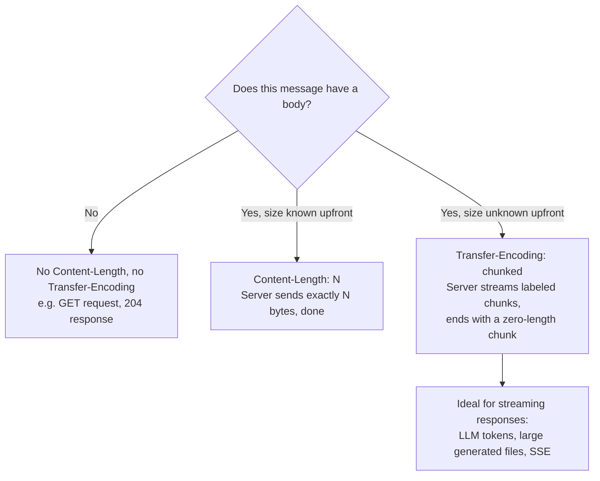

# Request & Response Bodies

## Why This Matters

Headers and the start line tell you *what kind* of message you have; the **body** is where the actual payload lives — the JSON object you're sending to create a resource, the file you're uploading, the data the server sends back. Understanding how HTTP knows where a body starts, how big it is, and when bodies are and aren't allowed at all is what lets you debug problems like "the server says my request is empty" or "the client can't tell when my streamed response is finished."

## Core Concept

The **body** is the optional payload of an HTTP message, sent after the headers and a blank line (recall the structure from the [HTTP chapter](http.md)). Not every request or response has one — whether a body is present, and how large it is, has to be communicated explicitly, because HTTP doesn't have a fixed message size; the receiving side needs a way to know exactly where the body ends.

Two headers solve that problem, in two different ways:

- **`Content-Length: <n>`** — declares the exact size of the body in bytes up front. The receiver reads exactly `n` bytes after the headers and knows it's done. This requires the sender to know the full size *before* sending anything.
- **`Transfer-Encoding: chunked`** — instead of declaring a total size up front, the body is sent as a series of labeled chunks, each prefixed with its own size, ending with a zero-length chunk that marks the end. This lets a server start sending a response before it knows the total size — essential for streaming (e.g., streaming LLM tokens, Part 14) or generating large responses on the fly.

A message can't sensibly use both at once — the receiver needs one unambiguous way to know where the body ends.

## Mental Model

Think of `Content-Length` like mailing a box with the exact weight and dimensions printed on the label before you seal it — you had to know the full contents in advance to write that label. Chunked transfer is more like handing someone a series of smaller, individually labeled envelopes one at a time as you produce them, with a final "that's everything" envelope at the end — you never had to know the total in advance, and the recipient can start opening earlier envelopes while you're still producing later ones. That second pattern is exactly why it's the right tool for a server that's generating a response incrementally, like an LLM streaming tokens as they're generated rather than waiting for the entire response to be ready.

## How It Works

**Which methods carry bodies?** By convention (not a strict protocol rule): `POST`, `PUT`, and `PATCH` typically have request bodies (they're sending data to the server); `GET`, `HEAD`, and `DELETE` typically don't (see [HTTP Methods](http-methods.md)). Responses can have a body for almost any status code except a few that explicitly forbid one, most notably `204 No Content` (by definition, no body) and responses to `HEAD` requests (headers only, always).

**Body formats** are declared by the `Content-Type` header (see [Headers](headers.md)):

- `application/json` — by far the most common in modern APIs; structured, human-readable, directly maps to most programming languages' native data structures (see [JSON and Serialization](json-and-serialization.md)).
- `application/x-www-form-urlencoded` — key-value pairs encoded like a URL query string (`key1=value1&key2=value2`), historically from HTML forms.
- `multipart/form-data` — used for file uploads, allows mixing binary file data with regular fields in one request, each part separated by a boundary marker.
- `text/plain`, `application/xml`, and others — less common in JSON-first APIs but still seen, especially in legacy or non-web-native systems.

**Chunked transfer in practice** — a chunked body looks like this on the wire (simplified):

```text
7\r\n
Mozilla\r\n
9\r\n
Developer\r\n
0\r\n
\r\n
```

Each chunk starts with its size in hexadecimal, followed by the chunk's actual bytes, repeated until a zero-size chunk signals the end. This is exactly the underlying mechanism that makes streaming HTTP responses (like Server-Sent Events, Part 9) possible — the server writes chunks as data becomes available, and the connection isn't closed or artificially delayed waiting for a known total length.

## Architecture



## Request / Response Example

A `Content-Length`-based JSON request/response, and a chunked streaming response for comparison:

**Fixed-length request/response**

```http
POST /orders HTTP/1.1
Host: api.example.com
Content-Type: application/json
Content-Length: 35

{"item": "Widget", "quantity": 2}
```

```http
HTTP/1.1 201 Created
Content-Type: application/json
Content-Length: 58

{"id": 501, "item": "Widget", "quantity": 2}
```

**Chunked streaming response** (e.g., an LLM generating tokens progressively)

```http
HTTP/1.1 200 OK
Content-Type: text/event-stream
Transfer-Encoding: chunked

5
data:

7
{"tok":

...additional chunks as tokens are generated...

0

```

No `Content-Length` header is present at all — it couldn't be, since the server doesn't know the total response size until generation finishes.

## Code Example

Sending a JSON body and, separately, consuming a chunked/streamed response — both common patterns you'll use constantly:

```python
import httpx

# --- Fixed-size JSON request/response (Content-Length handled automatically) ---
response = httpx.post(
    "https://api.example.com/orders",
    json={"item": "Widget", "quantity": 2},  # httpx serializes + sets Content-Type/Content-Length
    timeout=5,
)
print(response.status_code, response.json())

# --- Consuming a streamed (chunked) response incrementally ---
with httpx.stream("GET", "https://api.example.com/events", timeout=None) as stream_response:
    for chunk in stream_response.iter_bytes():
        # Each chunk arrives as soon as the server produces it — we never
        # waited for a Content-Length because there wasn't one to wait for.
        print("received chunk:", chunk[:50])
```

And on the server side, a FastAPI endpoint that streams a response using chunked transfer under the hood:

```python
from fastapi import FastAPI
from fastapi.responses import StreamingResponse
import time

app = FastAPI()


def generate_tokens():
    """A generator standing in for an LLM producing output incrementally."""
    for word in ["The", "quick", "brown", "fox"]:
        yield f"{word} "
        time.sleep(0.2)  # simulate generation latency


@app.get("/stream")
def stream_response():
    # FastAPI/Starlette automatically uses chunked transfer encoding here,
    # since the total response size isn't known in advance.
    return StreamingResponse(generate_tokens(), media_type="text/plain")
```

## Production Considerations

- **Streaming trades memory for latency.** Chunked responses let clients start processing data before the full response is ready — critical for LLM UX (showing tokens as they're generated) — but requires both client and server code to handle partial data correctly instead of assuming the whole body arrives at once.
- **Body size limits protect your server.** Accepting an unbounded request body (e.g., a huge file upload with no limit) can exhaust memory or disk — production APIs enforce explicit maximum body sizes, often at a reverse proxy/gateway layer before the request even reaches application code.
- **Large uploads need `multipart/form-data` or dedicated upload flows**, not a giant JSON body — binary data doesn't serialize efficiently into JSON (see the [JSON chapter](json-and-serialization.md)'s note on binary data), and streaming an upload avoids holding the whole file in memory at once.
- **Not all infrastructure supports chunked transfer well.** Some older proxies or strict client libraries have limited or buggy support for chunked responses — worth verifying if you're introducing streaming behind infrastructure you don't fully control.

## Common Mistakes

- **Manually setting `Content-Length` incorrectly.** Miscounting bytes (especially with multi-byte UTF-8 characters) produces a body the receiver either truncates or hangs waiting to complete — let your HTTP library calculate this for you rather than hardcoding it.
- **Sending a body with `GET`.** While not strictly forbidden by the HTTP spec, it's unconventional, poorly supported by some servers/proxies, and violates the expectation that `GET` requests don't need a body — use query parameters or switch to `POST` if you have significant data to send.
- **Trying to read `response.json()` on a response with no body** (e.g., a `204 No Content`) — this raises a parsing error; always check the status code or `Content-Length` before assuming a body exists.

## Best Practices

- Let your HTTP client/framework manage `Content-Length` and chunking automatically — write the data, not the low-level framing.
- Use `application/json` as your default body format for structured API data; reserve `multipart/form-data` specifically for file uploads.
- Use streaming responses (chunked transfer) intentionally, when the server genuinely can't know the total size upfront or when incremental delivery meaningfully improves the client experience — not as a default for every endpoint.
- Enforce request body size limits at the edge of your system (reverse proxy, API gateway, or framework-level middleware).

## AI Engineering Perspective

The body is where the real content of an AI API call lives: your prompt/messages as a JSON request body, and — this is the important part — the model's response is very often sent back as a **chunked, streamed body**, not a single fixed-length JSON blob. Every "typing" effect you see in an LLM-powered chat UI is a direct product of `Transfer-Encoding: chunked` (or the closely related Server-Sent Events framing, Part 9) letting the server emit each generated token as its own chunk the instant it's ready, rather than buffering the entire response until generation completes. Understanding this is what lets you correctly implement or debug a streaming client: you must process the response incrementally as chunks arrive, not call something like `response.json()` that expects one complete body up front.

## Exercises

**Beginner**
1. Explain, in your own words, why a message can't use both `Content-Length` and `Transfer-Encoding: chunked` at the same time.
2. Name two HTTP methods that conventionally don't have a request body, and explain why.

**Intermediate**
3. Run the `httpx.stream` code example against a real streaming endpoint (or the FastAPI `/stream` example above) and print how many separate chunks arrive versus one single read.

**Advanced**
4. You're designing an endpoint that accepts a user-uploaded video file up to 2GB. Explain why a plain JSON body (with the video base64-encoded inside it) is a poor design choice here, and describe a better approach.

## Key Takeaways

- A body's boundary is communicated either via `Content-Length` (known size upfront) or `Transfer-Encoding: chunked` (streamed, unknown size upfront) — never both.
- Bodies are conventional on `POST`/`PUT`/`PATCH` requests and most success responses, but explicitly absent on `204 No Content` and `HEAD` responses.
- Chunked transfer is the underlying mechanism that makes streaming responses — including streamed LLM output — possible.
- Always enforce body size limits in production, and let your HTTP library manage the low-level framing rather than hand-rolling it.
