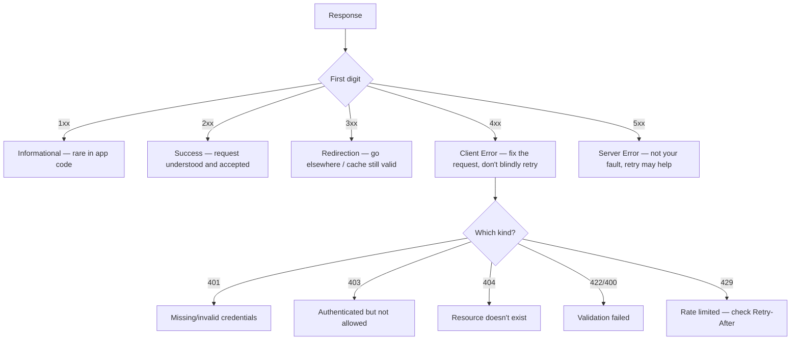

# HTTP Status Codes

## Why This Matters

A status code is the first thing a client checks in an HTTP response, before it even looks at the body — it's a compact, standardized signal of what happened. Get status codes right and clients (including your own frontend, other services, and monitoring tools) can react correctly without parsing error messages. Get them wrong — returning `200 OK` on a validation failure, or `500` for something that's actually the caller's fault — and you break retry logic, alerting, and the basic trust a client places in your API. Status codes are also one of the fastest things to check when something breaks in production, which is exactly why understanding them precisely matters.

## Core Concept

Every HTTP response starts with a **three-digit status code** plus a short human-readable **reason phrase** (e.g., `404 Not Found`). The first digit defines the **class** of response, and that class alone tells a client, in general terms, how to react — even without understanding the specific API:

- **1xx — Informational.** The request was received, processing continues. Rare to see directly in application code.
- **2xx — Success.** The request was received, understood, and accepted.
- **3xx — Redirection.** Further action is needed to complete the request, usually "go here instead."
- **4xx — Client Error.** The request itself was wrong in some way — bad syntax, missing auth, a resource that doesn't exist. Retrying the *same* request unchanged won't help.
- **5xx — Server Error.** The server failed to fulfill an apparently valid request. The problem is on the server's side; retrying *might* help (especially after a delay).

That 4xx-vs-5xx distinction is the single most important thing to internalize: it tells you (and any automated system) **whose fault it was and whether retrying makes sense**.

## Mental Model

Think of status codes like the standardized responses a customer service line uses, categorized by who needs to act next. "Sure, done" (2xx) — the request succeeded, nothing more needed. "You'll need to call this other number instead" (3xx) — the right resource is elsewhere. "That request doesn't make sense as submitted — check what you sent" (4xx) — the caller needs to fix something before trying again. "We're having an internal problem, try again later" (5xx) — it's not the caller's fault, and retrying later might just work.

## How It Works

The codes you'll use constantly as an API developer:

**2xx — Success**
- **200 OK** — generic success, typically with a response body (e.g., `GET`, successful `PATCH`/`PUT`).
- **201 Created** — a new resource was created (typically after `POST`); conventionally includes a `Location` header pointing to the new resource.
- **204 No Content** — success, but there's nothing to return in the body (common for `DELETE`).

**3xx — Redirection**
- **301 Moved Permanently** — the resource now lives at a different URL permanently; clients should update their records/bookmarks.
- **304 Not Modified** — used with caching (Part 7): tells the client its cached copy is still valid, no body is sent.

**4xx — Client Error**
- **400 Bad Request** — the request is malformed in a generic way (invalid JSON, missing required fields).
- **401 Unauthorized** — the request lacks valid authentication credentials (despite the name, this is about *authentication*, not authorization — Part 5 covers the distinction precisely).
- **403 Forbidden** — the client is authenticated, but not allowed to perform this action on this resource.
- **404 Not Found** — no resource exists at this URL.
- **405 Method Not Allowed** — the resource exists, but doesn't support the HTTP method used (e.g., `DELETE` on a read-only endpoint).
- **409 Conflict** — the request conflicts with the current state of the resource (e.g., a duplicate unique field, a version mismatch).
- **422 Unprocessable Entity** — the request is syntactically valid but semantically invalid (e.g., valid JSON, but a field fails validation rules). FastAPI returns this automatically for Pydantic validation failures.
- **429 Too Many Requests** — the client has hit a rate limit (Part 6); often paired with a `Retry-After` header telling the client when to try again.

**5xx — Server Error**
- **500 Internal Server Error** — a generic, unhandled failure on the server side; the catch-all for "something broke and we didn't return a more specific error."
- **502 Bad Gateway** — a server acting as a proxy/gateway got an invalid response from an upstream server.
- **503 Service Unavailable** — the server is temporarily unable to handle the request (overloaded, in maintenance, or a dependency is down); often paired with `Retry-After`.
- **504 Gateway Timeout** — a proxy/gateway timed out waiting for an upstream server to respond.

## Architecture



## Request / Response Example

Three requests to the same endpoint producing three different, meaningfully distinct status codes:

**Missing authentication**

```http
GET /orders/501 HTTP/1.1
Host: api.example.com
```

```http
HTTP/1.1 401 Unauthorized
WWW-Authenticate: Bearer
Content-Type: application/json

{"error": "authentication_required", "message": "Missing bearer token"}
```

**Authenticated, but the order doesn't belong to this user**

```http
GET /orders/501 HTTP/1.1
Host: api.example.com
Authorization: Bearer eyJhbGciOi...
```

```http
HTTP/1.1 403 Forbidden
Content-Type: application/json

{"error": "forbidden", "message": "You do not have access to this order"}
```

**Order doesn't exist at all**

```http
GET /orders/99999 HTTP/1.1
Host: api.example.com
Authorization: Bearer eyJhbGciOi...
```

```http
HTTP/1.1 404 Not Found
Content-Type: application/json

{"error": "not_found", "message": "Order 99999 does not exist"}
```

Notice each of these is a distinct, actionable signal — a client (or a human debugging) should react completely differently to `401` versus `403` versus `404`, even though all three represent "you can't have this order."

## Code Example

FastAPI makes returning correct status codes explicit and type-checked via `HTTPException` and route decorators:

```python
from fastapi import FastAPI, HTTPException, status
from pydantic import BaseModel

app = FastAPI()
ORDERS = {501: {"id": 501, "owner_id": 7, "item": "Widget"}}
CURRENT_USER_ID = 7  # normally derived from auth (Part 5)


class OrderIn(BaseModel):
    item: str


@app.get("/orders/{order_id}")
def get_order(order_id: int):
    order = ORDERS.get(order_id)
    if order is None:
        # 404: the resource doesn't exist at all
        raise HTTPException(status.HTTP_404_NOT_FOUND, "Order not found")
    if order["owner_id"] != CURRENT_USER_ID:
        # 403: it exists, but this caller isn't allowed to see it
        raise HTTPException(status.HTTP_403_FORBIDDEN, "Not your order")
    return order


@app.post("/orders", status_code=status.HTTP_201_CREATED)
def create_order(order: OrderIn):
    # FastAPI automatically returns 422 if `order` fails Pydantic validation,
    # before this function body even runs.
    new_id = max(ORDERS) + 1
    ORDERS[new_id] = {"id": new_id, "owner_id": CURRENT_USER_ID, **order.model_dump()}
    return ORDERS[new_id]


@app.delete("/orders/{order_id}", status_code=status.HTTP_204_NO_CONTENT)
def delete_order(order_id: int):
    ORDERS.pop(order_id, None)
    # 204 means "success, no body" — FastAPI won't try to serialize a return
    # value here; returning nothing is correct for this status code.
```

## Production Considerations

- **4xx vs 5xx drives automated behavior.** Load balancers, retry logic, and alerting systems commonly treat 5xx as "the server is unhealthy, maybe retry / alert on-call" and 4xx as "the client made a mistake, don't retry blindly, don't page anyone." Misusing these codes breaks that automation — e.g., returning `500` for a validation error will falsely trigger server-health alerts.
- **429 needs `Retry-After`.** A well-behaved rate-limited response tells the client exactly how long to wait, rather than making it guess (Part 6 covers backoff strategies built on this).
- **Consistent error body shape matters as much as the code.** Pick one JSON error schema (e.g., `{"error": "...", "message": "..."}`) and use it across every endpoint — this is what makes errors programmatically handleable by clients, not just human-readable.
- **Don't leak internal details in 5xx bodies.** A generic `500` response to the client should not include stack traces or internal exception messages in production — log those internally (Part 12 — Observability) and return a generic message externally.

## Common Mistakes

- **Returning `200 OK` with an error message in the body.** This forces every client to parse the body just to know if the request succeeded, defeating the entire purpose of status codes, and breaks generic HTTP tooling (caches, monitoring) that trusts the status code.
- **Using `404` when the real issue is authorization.** Some APIs intentionally return `404` instead of `403` to avoid confirming a resource exists to an unauthorized caller — this is a legitimate security choice (Part 10), but should be a deliberate decision, not confusion between the two.
- **Returning `500` for expected, client-caused failures.** Validation errors, missing fields, and bad input are `4xx`, not `5xx` — a `500` should mean "we have a bug or an unexpected failure," not "the user typo'd a field."

## Best Practices

- Use the most specific status code available rather than defaulting to `400` or `500` for everything — specificity is what makes an API self-documenting through its responses.
- Standardize your error response body format across the whole API.
- Always return `429` with a `Retry-After` header for rate limiting, and `503` with `Retry-After` for planned/temporary unavailability.
- Log the full error detail server-side even when returning a generic message to the client.

## AI Engineering Perspective

LLM provider APIs lean heavily on a few specific status codes you'll handle constantly: **429** for rate limits (both request-rate and token-rate limits, Part 15), **500/503** for transient provider-side failures (model overloaded, temporary outage) that are usually safe to retry with backoff, and **400** for malformed requests (e.g., an invalid model name or a prompt that violates the request schema). A production AI system's retry logic is built almost entirely around this classification: retry 429/503 with exponential backoff (Part 6), never blindly retry 400 (the request itself is wrong and will fail identically every time), and treat 401/403 as a configuration problem (bad or expired API key) rather than a transient one.

## Exercises

**Beginner**
1. For each of `200`, `201`, `204`, `400`, `401`, `403`, `404`, `429`, `500`, write a one-sentence description of when you'd use it.
2. Explain the practical difference between `401` and `403` using a concrete example.

**Intermediate**
3. Extend the FastAPI example with a `PUT /orders/{order_id}` endpoint that returns `404` if the order doesn't exist, `403` if it's not the caller's order, and `200` on success — in that priority order.

**Advanced**
4. Design the retry policy (in words) for an HTTP client library your team will use for all internal service calls: which status codes should trigger an automatic retry, which should never be retried, and which need a delay (and how would you determine that delay)?

## Key Takeaways

- The first digit of a status code tells you the general class of outcome; 4xx means "the client should fix something," 5xx means "the server failed, retrying might help."
- Precise status codes (401 vs. 403, 404 vs. 422) carry real meaning that clients and infrastructure rely on to behave correctly.
- Retry logic, alerting, and caching all depend on correct status code usage — misusing codes breaks automated systems, not just human understanding.
- 429 and 503 responses should include a `Retry-After` header; AI systems calling LLM providers depend heavily on correctly distinguishing 429/5xx (retry) from 400/401/403 (don't retry, fix the request or credentials).
