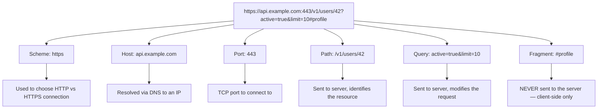

# URLs

## Why This Matters

Every single API call starts with a URL. It's the address you're sending a request to, and its structure encodes several distinct pieces of information — which protocol to use, which server to contact, which resource you want, and extra parameters shaping the request. Misunderstanding URL structure leads to real bugs: putting a value in the wrong part of the URL, forgetting to encode special characters, or exposing sensitive data (like tokens) in a query string that gets logged everywhere. Before you can design good REST endpoints ([Part 2](../02-rest-api-design/README.md)), you need to know precisely what each part of a URL is for.

## Core Concept

A **URL (Uniform Resource Locator)** is a structured string that identifies a resource and how to access it. It's a specific kind of **URI (Uniform Resource Identifier)** — URI is the general concept of "a string identifying a resource," and URL specifically means one that also tells you *how to locate/retrieve* it (a URN, by contrast, names something without saying where to find it; in practice, "URL" and "URI" are used almost interchangeably in day-to-day API work).

A full URL breaks into distinct components, each with a specific job:

```text
https://api.example.com:443/v1/users/42?active=true&limit=10#profile
└─┬──┘   └──────┬───────┘└┬┘└──────┬──────┘└────────┬────────┘└──┬──┘
 scheme       host       port     path          query string   fragment
```

## Mental Model

Think of a URL like a full postal address written in one line: the delivery method (scheme — "by courier" vs. "by regular mail"), the building (host), a specific suite number if the building has one (port), the exact office within the building (path), a set of special instructions attached to the delivery ("leave at front desk," "signature required" — query parameters), and a note for internal use once it arrives that the delivery service itself doesn't act on (fragment — meaningful only to whoever opens the envelope, not to the postal service getting it there).

## How It Works

Going through each component:

- **Scheme** (`https://`) — the protocol to use. For APIs, this is almost always `https` (or `http` in local development). It tells the client how to interpret and connect to everything that follows.
- **Host** (`api.example.com`) — the domain name (resolved via DNS, see [DNS](dns.md)) or IP address identifying which server to talk to.
- **Port** (`:443`) — which "door" on that server to knock on. HTTPS defaults to `443` and HTTP defaults to `80`, so these are almost always omitted in real-world URLs — you only see an explicit port for non-standard setups (e.g., `:8000` for a local dev server).
- **Path** (`/v1/users/42`) — identifies *which resource* on the server you want. In REST APIs (Part 2), this typically maps to a specific resource or collection — `/v1/users/42` means "user with ID 42."
- **Query string** (`?active=true&limit=10`) — optional key-value pairs, starting with `?` and separated by `&`, used for filtering, pagination, sorting, or other parameters that modify *how* the resource is fetched rather than *which* resource. Query parameters are always strings on the wire — a server must parse `"true"` and `"10"` into a boolean and integer itself.
- **Fragment** (`#profile`) — historically used by browsers to jump to a section of a page; it is **never sent to the server at all**. It's processed entirely client-side. This matters for API design: you cannot rely on fragment data server-side, ever.

**URL encoding (percent-encoding)** matters because URLs can only safely contain a limited set of characters. Anything outside that set — spaces, `&`, `?`, non-ASCII characters — must be percent-encoded (e.g., a space becomes `%20`, `&` inside a value becomes `%26`) so it isn't misinterpreted as part of the URL's structure. This is why a query parameter value containing `&` must be encoded — an unencoded `&` would be parsed as the start of the *next* parameter instead of part of the value.

## Architecture



## Request / Response Example

The path and query string are the parts that actually reach the server as part of the request line; scheme, host, and port are used to establish the connection, and the fragment never leaves the client at all:

**URL:** `https://api.example.com/v1/users/42?active=true&limit=10#profile`

**What's actually sent on the wire (path + query only):**

```http
GET /v1/users/42?active=true&limit=10 HTTP/1.1
Host: api.example.com
Accept: application/json
```

Note `Host` is sent as a header — separate from the request line — which is what allows a single server (or load balancer) to host multiple domains on the same IP address and port.

## Code Example

Python's `urllib.parse` module breaks a URL into exactly the components described above, and correctly handles percent-encoding:

```python
from urllib.parse import urlparse, parse_qs, urlencode, quote

url = "https://api.example.com:443/v1/users/42?active=true&limit=10#profile"

parsed = urlparse(url)
print(parsed.scheme)    # 'https'
print(parsed.hostname)  # 'api.example.com'
print(parsed.port)      # 443
print(parsed.path)      # '/v1/users/42'
print(parsed.query)     # 'active=true&limit=10'
print(parsed.fragment)  # 'profile'

# Query strings are always strings — parse_qs gives you a dict of lists,
# since a key can legally repeat (e.g. ?tag=a&tag=b).
print(parse_qs(parsed.query))  # {'active': ['true'], 'limit': ['10']}

# Building a query string safely: urlencode handles percent-encoding for you.
params = {"q": "cats & dogs", "limit": 10}
print(urlencode(params))  # 'q=cats+%26+dogs&limit=10'

# quote() encodes a single value/path segment for direct embedding in a URL.
print(quote("cats & dogs"))  # 'cats%20%26%20dogs'
```

Never build query strings with manual string concatenation (`f"?q={user_input}"`) — always use `urlencode` (or your HTTP client's built-in `params=` argument) so special characters are encoded correctly and your request can't be broken (or manipulated) by unexpected input.

## Production Considerations

- **Never put secrets in the URL.** Query strings and paths are commonly logged by web servers, proxies, browser history, and analytics tools — an API key or token in a URL can leak into logs you don't control. Use headers (`Authorization`) instead, covered in [Headers](headers.md).
- **URL length limits exist.** Most servers, browsers, and proxies impose a maximum URL length (commonly around 2000-8000 characters depending on the component). Large payloads belong in a request body, not stuffed into query parameters.
- **Path vs. query string is a design decision, not just a technical one.** Convention (formalized in Part 2) is: path identifies *which resource*, query string modifies *how* you retrieve it (filtering, sorting, pagination) — mixing these up leads to inconsistent, hard-to-use APIs.
- **Trailing slashes and case sensitivity can matter.** `/users/42` and `/users/42/` are technically different URLs, and some frameworks treat them differently by default (redirect, 404, or treat as identical) — pick a convention and be consistent.

## Common Mistakes

- **Manually concatenating strings to build URLs or query strings.** This is a common source of both bugs (unencoded special characters breaking the URL structure) and security issues (injection-style attacks) — always use a proper URL-building utility.
- **Assuming fragments are visible server-side.** Since the fragment is never sent in the HTTP request, any logic depending on it must live entirely in the client (this trips up developers coming from single-page-app routing conventions where the fragment is meaningful).
- **Putting sensitive data in query parameters.** Even over HTTPS (which encrypts the URL in transit), the full URL — including query string — often ends up in server access logs, browser history, and `Referer` headers of subsequent requests.

## Best Practices

- Use your HTTP client's built-in parameter handling (`httpx.get(url, params={...})`) instead of manually building query strings.
- Reserve the path for identifying resources and the query string for filtering/sorting/pagination — keep this distinction consistent across your API.
- Keep URLs short, predictable, and human-readable where possible; this is both a usability and a debuggability win (Part 2 covers naming conventions in depth).

## AI Engineering Perspective

LLM provider APIs use URLs the same way any REST API does — a base host (`api.anthropic.com`), a versioned path (`/v1/messages`), and occasionally query parameters for things like pagination when listing resources (e.g., files or batches). One AI-specific wrinkle: when building **RAG APIs** ([Part 16](../16-rag-apis/README.md)) that let users search or filter documents, it's tempting to stuff a long, free-text query directly into a URL's query string — but free-text search queries can be long and contain characters needing careful encoding, which is often a good signal that a request should be a `POST` with a JSON body instead of a `GET` with a query string (more on this trade-off in [HTTP Methods](http-methods.md)).

## Exercises

**Beginner**
1. Break down the URL `https://shop.example.com/products/88?currency=usd&ref=email#reviews` into its six components.
2. Explain why the fragment (`#reviews` above) never reaches the server.

**Intermediate**
3. Using `urllib.parse`, write a function that takes a base URL and a dict of query parameters and returns a correctly encoded full URL, handling a parameter value that contains an `&` character.

**Advanced**
4. A teammate proposes putting a user's session token as a query parameter (`?token=abc123`) instead of an `Authorization` header, arguing "it's over HTTPS so it's encrypted anyway." Explain concretely why this is still a bad idea, citing at least two specific leak vectors.

## Key Takeaways

- A URL has six meaningful parts: scheme, host, port, path, query string, and fragment — each with a distinct purpose.
- The fragment is never sent to the server; only scheme/host/port are used to connect, and path/query are what the server actually receives.
- Percent-encoding exists because URLs can only safely contain a restricted character set — always use a library to build URLs and query strings, never manual string concatenation.
- Secrets belong in headers or the request body, never in the URL, because URLs are pervasively logged across the request path.
