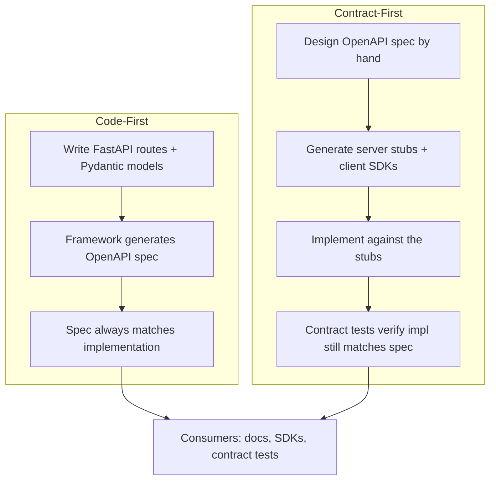

# API Contracts

## Why This Matters

An API is, fundamentally, a promise: "send me a request shaped like this, and I will respond with something shaped like that." A **contract** is that promise made explicit and machine-readable, instead of living only in your backend code (where clients can't see it) or in someone's memory (where it inevitably drifts). Without an explicit contract, every integration becomes a guessing game based on example responses, and every backend change risks silently breaking a client who happened to depend on undocumented behavior.

## Core Concept

An API contract is a formal, typically machine-readable description of an API's request and response shapes, status codes, headers, and constraints — most commonly expressed today as an **OpenAPI specification** (formerly Swagger), a YAML/JSON document describing every endpoint, its parameters, request/response schemas, and possible error responses.

There are two philosophies for producing this contract:

- **Code-first**: you write your API's implementation (e.g., FastAPI route handlers with Pydantic models), and the framework generates the OpenAPI spec automatically from your code.
- **Contract-first**: you write the OpenAPI spec by hand (or with a design tool) *before* writing any implementation code, then generate server stubs and/or client SDKs from that spec, and implement against it.

Both are legitimate; the right choice depends on team structure and how many independent consumers your API has.

## Mental Model

Think of an API contract like a blueprint for a building. Code-first is like building the house first and then having an architect draw up the blueprint based on what got built — fast to start, but if the builder made an inconsistent decision partway through (a doorway that doesn't line up with the hallway), the blueprint just faithfully documents the inconsistency rather than preventing it. Contract-first is like drawing the blueprint first, getting every stakeholder (electricians, plumbers, the client) to agree on it, and then building strictly to that plan — slower to start, but every trade can work in parallel against the same shared, agreed-upon plan without waiting for the house to physically exist.

## How It Works

**OpenAPI as the contract format**: an OpenAPI document describes, for every endpoint: the path and method, path/query parameters (with types and constraints), the request body schema, every possible response status code and its schema, and authentication requirements. This single document can drive interactive docs (Swagger UI, Redoc), generate client SDKs in multiple languages, generate server-side request validation, and power contract testing (see [Part 13 — API Testing](../13-api-testing/README.md)).

**Code-first in practice**: frameworks like FastAPI generate an OpenAPI spec automatically from your route decorators and Pydantic models — you get the contract "for free" as a byproduct of writing normal application code, and it's guaranteed to be in sync with the actual implementation because it's derived directly from it. The risk: without discipline, developers can make ad hoc changes to response shapes without stopping to think about whether the change is contract-breaking, because there's no separate "the contract says X" checkpoint forcing that conversation.

**Contract-first in practice**: teams write and review the OpenAPI spec as a design artifact, often before any backend code exists — this is valuable when a frontend team, a mobile team, and a partner integration team all need to start building against an API simultaneously, before the backend is finished. Tools generate typed client SDKs and server stub code from the spec, and CI can verify the actual implementation still matches the agreed contract (contract testing). The cost is process overhead: someone has to actually write and maintain the spec by hand, and it can drift from the implementation if discipline slips (mitigated by contract testing that fails CI when they diverge).

**Backward compatibility**: this is the practical heart of why contracts matter. A change is **backward compatible** (safe, no version bump needed — see [API Versioning](api-versioning.md)) if every existing client continues to work unmodified after the change. Adding a new optional field, adding a new endpoint, or adding a new enum value a client might not recognize yet (if clients are built to tolerate unknown values) are typically backward compatible. Removing a field, renaming a field, changing a field's type, making a previously-optional field required, or changing a status code's meaning are **breaking changes** — they require a new API version and a migration plan. The contract is what lets you *mechanically* check this: tools can diff two OpenAPI specs and flag exactly which changes are breaking, rather than relying on a human to notice.

## Architecture



## Request / Response Example

An OpenAPI fragment describing a single endpoint's contract — this is the machine-readable version of "here's what you can expect":

```yaml
/orders/{order_id}:
  get:
    summary: Get an order by ID
    parameters:
      - name: order_id
        in: path
        required: true
        schema:
          type: integer
    responses:
      '200':
        description: The order
        content:
          application/json:
            schema:
              type: object
              required: [id, status, total_cents]
              properties:
                id: { type: integer }
                status: { type: string, enum: [pending, shipped, cancelled] }
                total_cents: { type: integer }
      '404':
        description: Order not found
```

The corresponding real request/response the contract describes:

```http
GET /orders/482 HTTP/1.1
Host: api.example.com
Accept: application/json
```

```http
HTTP/1.1 200 OK
Content-Type: application/json

{ "id": 482, "status": "shipped", "total_cents": 4999 }
```

## Code Example

Code-first contract generation with FastAPI — the OpenAPI spec below is produced automatically from this code, with no separate spec file to maintain:

```python
from fastapi import FastAPI, HTTPException
from pydantic import BaseModel
from enum import Enum

app = FastAPI(title="Orders API", version="2.0.0")

class OrderStatus(str, Enum):
    pending = "pending"
    shipped = "shipped"
    cancelled = "cancelled"

class Order(BaseModel):
    # This model IS the contract for this endpoint's response shape.
    # Every field here becomes a required property in the generated
    # OpenAPI schema unless given a default value.
    id: int
    status: OrderStatus
    total_cents: int

@app.get("/orders/{order_id}", response_model=Order, responses={404: {"description": "Order not found"}})
def get_order(order_id: int) -> Order:
    if order_id != 482:
        raise HTTPException(status_code=404, detail="Order not found")
    return Order(id=order_id, status=OrderStatus.shipped, total_cents=4999)

# Visit /openapi.json to see the generated contract, or /docs for interactive docs.
```

Adding a new optional field (backward compatible, no version bump needed):

```python
class Order(BaseModel):
    id: int
    status: OrderStatus
    total_cents: int
    currency: str = "USD"  # new field with a default -- existing clients ignore it safely
```

## Production Considerations

- Run contract diffing in CI: compare the OpenAPI spec on a pull request against the spec on `main`, and fail the build if a breaking change is detected without an accompanying version bump (see [Part 13 — API Testing](../13-api-testing/README.md) for contract testing tooling).
- Keep example values in your OpenAPI spec realistic and current — stale examples in generated docs actively mislead integrators and generate support tickets.
- For public APIs with many independent third-party consumers, contract-first plus generated SDKs dramatically reduces integration bugs, because clients aren't hand-writing HTTP calls against loosely-documented behavior.
- Treat the contract, not the implementation, as the source of truth for what's "supported" — if your code happens to accept an undocumented field, that's an accident, not a feature, and shouldn't be relied upon by clients.

## Common Mistakes

- Treating any Pydantic/type change as automatically safe just because the code still runs — narrowing a field's type or removing a field is a breaking *contract* change even if your own tests still pass.
- Letting the OpenAPI spec silently drift from the real implementation in a contract-first team, because nobody wired up automated contract tests to catch divergence.
- Not documenting error response shapes at all, leaving clients to reverse-engineer what a `400` or `404` body looks like from trial and error.
- Assuming code-first automatically means "no discipline needed" — it still requires deliberate thought about backward compatibility every time a response model changes.

## Best Practices

- Adopt code-first for internal/small-team APIs where you control both client and server; adopt contract-first for public APIs or APIs with many independent client teams.
- Automate contract diffing in CI to catch breaking changes before merge, not after a client complains in production.
- Document every response status code your endpoint can return, including error shapes, not just the happy path.
- Use the contract to drive generated client SDKs wherever possible — hand-written HTTP client code is a recurring source of subtle integration bugs.

## AI Engineering Perspective

API contracts foreshadow one of the most important ideas in [Part 14 — AI API Engineering](../14-ai-api-engineering/README.md): **structured outputs**. When you ask an LLM to return JSON matching a specific schema (a "response schema" or a tool/function-calling parameter schema), you're doing exactly what an OpenAPI contract does for an HTTP API — defining, in a machine-readable way, exactly what shape of data you're going to get back, so downstream code doesn't have to defensively parse free-form text. The same backward-compatibility discipline applies too: if you add a new required field to a structured-output schema, every prompt and every piece of downstream code consuming that schema needs to be updated in lockstep — exactly like a breaking API contract change requires client updates. Treating your LLM's output schema with the same rigor you'd apply to a REST API contract (explicit types, required vs optional fields, versioned schema changes) is what separates a reliable AI feature from a brittle one.

## Exercises

**Beginner**: Given an OpenAPI fragment for a `/users/{id}` GET endpoint, identify which of the following changes would be backward compatible vs breaking: (a) adding an optional `bio` field, (b) renaming `email` to `email_address`, (c) adding a new possible value to a `status` enum.

**Intermediate**: Write a minimal OpenAPI YAML fragment (by hand, contract-first style) for a `POST /comments` endpoint, including request body schema, a 201 success response, and a 400 error response.

**Advanced**: Design a CI check that fails a pull request when it introduces a breaking OpenAPI contract change without a corresponding version bump. Describe what tool(s) you'd use and what "breaking" means precisely in your check's logic.

## Key Takeaways

- An API contract (typically an OpenAPI spec) makes your API's request/response shapes explicit and machine-readable instead of living only in code or memory.
- Code-first generates the contract from implementation (fast, always in sync); contract-first designs the contract first and implements against it (better for many independent consumers, more process overhead).
- Backward-compatible changes (additive, optional) don't need a new version; breaking changes (removed/renamed/retyped fields) do — see [API Versioning](api-versioning.md).
- Structured LLM outputs are a direct extension of this same idea — a schema is a contract with the model, not just with a client.

See also: [API Versioning](api-versioning.md), [Part 13 — API Testing](../13-api-testing/README.md), [Part 14 — AI API Engineering](../14-ai-api-engineering/README.md).
