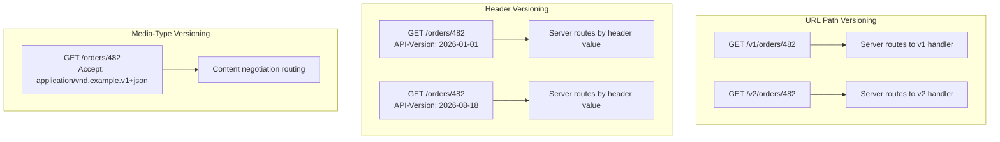

# API Versioning

## Why This Matters

Every API changes over time — fields get added, response shapes get restructured, business logic evolves. The problem is that once real clients depend on your API's current behavior, any change that breaks their assumptions breaks their production systems, often without warning. Versioning is how you evolve an API without silently breaking everyone who's already integrated with it — it's the mechanism that lets you say "here's the new way, but the old way still works until you're ready to migrate."

## Core Concept

API versioning means offering multiple, coexisting variants of your API's contract simultaneously, so that clients can migrate to a new version on their own schedule instead of being forced to upgrade the instant you ship a change. There are three common places to express a version:

1. **URL path versioning**: `/v1/orders`, `/v2/orders`.
2. **Header versioning**: a custom header like `API-Version: 2026-08-18` or `X-API-Version: 2`.
3. **Media-type (content negotiation) versioning**: `Accept: application/vnd.example.v2+json`.

All three achieve the same goal through different mechanisms, with different trade-offs in visibility, cacheability, and implementation complexity.

## Mental Model

Think of API versions like editions of a book. URL versioning is like putting the edition number right on the spine (`/v2/...`) — impossible to miss, easy to grab the right one off the shelf, but it means every reference to a specific page also has to specify which edition. Header versioning is like ordering "the current edition, but published no earlier than August 2026" — the request itself looks the same every time, and the *conversation* (the header) determines which edition you get. Media-type versioning is like asking specifically for "the hardcover, 2nd edition, illustrated" format — the version is baked into a description of exactly what you want back, alongside its file format.

## How It Works

**URL path versioning** is the most visible and most widely used in practice (Stripe used it for years, GitHub uses it, most public APIs use it). The version is the first segment after the domain: `https://api.example.com/v1/orders`. Its biggest advantage is discoverability — anyone reading a URL, a log line, or a curl command instantly knows which version they're looking at, and it works trivially with caching (different URLs are naturally different cache keys). Its downside: it technically means `/v1/orders/482` and `/v2/orders/482` are "different resources" from a pure REST/URL-identity standpoint, even though they represent the same underlying order — a philosophical wrinkle most teams accept without issue because the practical benefits outweigh it.

**Header versioning** keeps the URL stable (`/orders/482` regardless of version) and puts the version in a request header. This is philosophically cleaner (the resource's identity/URL never changes, only its representation) and avoids URL churn, but it's less discoverable — you can't tell which version a request used just by looking at the URL in a log line or browser bar, and it requires cache keys to account for the header (via `Vary`), which is easy to forget.

**Media-type versioning** (also called content negotiation versioning) folds the version into the `Accept` header's MIME type: `Accept: application/vnd.example.v2+json`. This is the "purest" REST approach — the client is literally asking for a specific representation format of the same resource — but it's the least common in practice because it's unfamiliar to most API consumers, harder to test with a browser or simple curl command, and adds complexity to routing logic for marginal benefit over header versioning.

**Choosing a strategy**: URL path versioning is the pragmatic default for most APIs — it's what developers expect, it's the easiest to document, test, and debug, and its "impurity" rarely matters in practice. Reserve header-based versioning for APIs where you specifically want version changes to be invisible to caching/routing infrastructure keyed on URL, or where you're versioning very frequently (e.g., date-based versions like Stripe's `2026-08-01` header) and don't want a proliferating list of `/v1`, `/v2`, `/v3`... path prefixes.

**Deprecation strategy**: whichever mechanism you choose, versioning is only half the story — you also need a plan for retiring old versions. This means: announcing deprecation with a concrete sunset date, returning a `Deprecation` and/or `Sunset` HTTP header (per the relevant IETF drafts) on responses from the deprecated version so automated tooling can detect it, monitoring actual traffic to the old version before removing it, and giving clients a real migration guide describing exactly what changed.

## Architecture



## Request / Response Example

URL path versioning — v1 and v2 coexist with different response shapes:

```http
GET /v1/orders/482 HTTP/1.1
Host: api.example.com
```

```http
HTTP/1.1 200 OK
Content-Type: application/json

{ "id": 482, "status": "shipped", "total": 49.99 }
```

```http
GET /v2/orders/482 HTTP/1.1
Host: api.example.com
```

```http
HTTP/1.1 200 OK
Content-Type: application/json

{ "id": 482, "status": "shipped", "total_cents": 4999, "currency": "USD" }
```

Note v2 fixed a real-world design mistake (float dollars → integer cents + explicit currency) without breaking v1 clients who still depend on the old shape.

A deprecated version signals it in headers:

```http
HTTP/1.1 200 OK
Content-Type: application/json
Deprecation: true
Sunset: Fri, 01 Jan 2027 00:00:00 GMT
Link: <https://docs.example.com/migrate-v1-to-v2>; rel="deprecation"

{ "id": 482, "status": "shipped", "total": 49.99 }
```

## Code Example

```python
from fastapi import FastAPI, APIRouter

app = FastAPI()

v1 = APIRouter(prefix="/v1")
v2 = APIRouter(prefix="/v2")

@v1.get("/orders/{order_id}")
def get_order_v1(order_id: int):
    # v1 kept for existing clients: float dollars, no explicit currency.
    return {"id": order_id, "status": "shipped", "total": 49.99}

@v2.get("/orders/{order_id}")
def get_order_v2(order_id: int, response=None):
    # v2 is the current, recommended shape.
    return {"id": order_id, "status": "shipped", "total_cents": 4999, "currency": "USD"}

# Mount both versions -- they coexist until v1 traffic drops to zero
# and its documented sunset date passes.
app.include_router(v1)
app.include_router(v2)


from fastapi import Response

@v1.get("/orders/{order_id}/deprecated-example")
def get_order_v1_with_deprecation_header(order_id: int, response: Response):
    # Signal deprecation via standard headers so automated client tooling
    # (and humans watching logs) can detect and react to it.
    response.headers["Deprecation"] = "true"
    response.headers["Sunset"] = "Fri, 01 Jan 2027 00:00:00 GMT"
    response.headers["Link"] = '<https://docs.example.com/migrate-v1-to-v2>; rel="deprecation"'
    return {"id": order_id, "status": "shipped", "total": 49.99}
```

## Production Considerations

- Version only when you're making a *breaking* change (removing/renaming a field, changing a type, changing status code semantics). Additive, backward-compatible changes (new optional field, new endpoint) don't require a new version — see [API Contracts](api-contracts.md) for what counts as breaking.
- Support a limited number of versions concurrently — every live version is ongoing maintenance and testing burden. Most mature APIs cap themselves at 2–3 supported versions and actively push clients toward the newest.
- Instrument version usage (log which version each request hits) so you have real data on whether it's safe to sunset an old version, rather than guessing.
- Communicate deprecation timelines well in advance and back them with headers (`Deprecation`, `Sunset`) so automated monitoring can catch it, not just a changelog entry nobody reads.

## Common Mistakes

- Treating every single change as version-worthy, leading to version sprawl (`v1` through `v11`) that's exhausting to maintain and confusing for clients to choose from.
- Silently changing behavior on an existing version instead of shipping a new one — this is the exact failure versioning exists to prevent, and it erodes trust in your API's stability guarantees.
- Removing an old version without any deprecation notice or sunset period, breaking clients with no warning.
- Forgetting `Vary: API-Version` (or the equivalent) when using header-based versioning behind a cache, causing the cache to serve the wrong version's response to a client requesting a different one.

## Best Practices

- Default to URL path versioning for public/external APIs — it's the most discoverable and the most widely understood convention.
- Reserve new major versions for genuinely breaking changes; ship additive changes without bumping the version.
- Always pair a deprecation announcement with a concrete sunset date and machine-readable `Deprecation`/`Sunset` headers.
- Provide a migration guide and, where feasible, a compatibility shim or clear field-mapping table between versions.

## AI Engineering Perspective

LLM provider APIs version aggressively and visibly, which makes this chapter's trade-offs concrete: model identifiers themselves act as a version (`claude-sonnet-4-5` vs an older snapshot), and providers frequently ship dated model versions (e.g., a `-20250514` suffix) precisely so that a production system pinned to a specific snapshot doesn't get surprised by silently updated model behavior — that's API versioning applied to the *model* as a resource, not just the HTTP contract. Separately, the HTTP API surface itself versions independently (e.g., a dated `API-Version` header some providers require), which is exactly the header-versioning pattern described above, chosen because these APIs iterate very frequently and don't want an ever-growing list of `/v1`, `/v2`, `/v3` path prefixes. When you build your own LLM gateway ([Part 15](../15-production-ai-systems/README.md)), expect to version both the model you route to and the gateway's own request/response contract independently.

## Exercises

**Beginner**: Explain the difference between URL path versioning and header versioning in your own words, including one concrete advantage of each.

**Intermediate**: You need to change an endpoint's response so that `price` (a float) becomes `price_cents` (an integer). Decide whether this requires a new API version, and if so, design the v1/v2 coexistence and write the deprecation headers for v1.

**Advanced**: Design a versioning and deprecation policy document for a public API: how many versions you'll support concurrently, how long a sunset period will be, what headers/announcements you'll use, and how you'll measure when it's safe to remove an old version.

## Key Takeaways

- Versioning lets you evolve an API's contract without breaking clients who haven't migrated yet — it's a promise-keeping mechanism, not a formality.
- URL path versioning is the most common and most discoverable strategy; header/media-type versioning trades discoverability for a cleaner resource-identity story.
- Only bump versions for breaking changes; additive changes should be backward compatible without a new version.
- Always pair deprecation with a concrete sunset date and machine-readable headers, not just a documentation note.

See also: [API Contracts](api-contracts.md), [Naming Conventions](naming-conventions.md), [Part 15 — Production AI Systems](../15-production-ai-systems/README.md).
