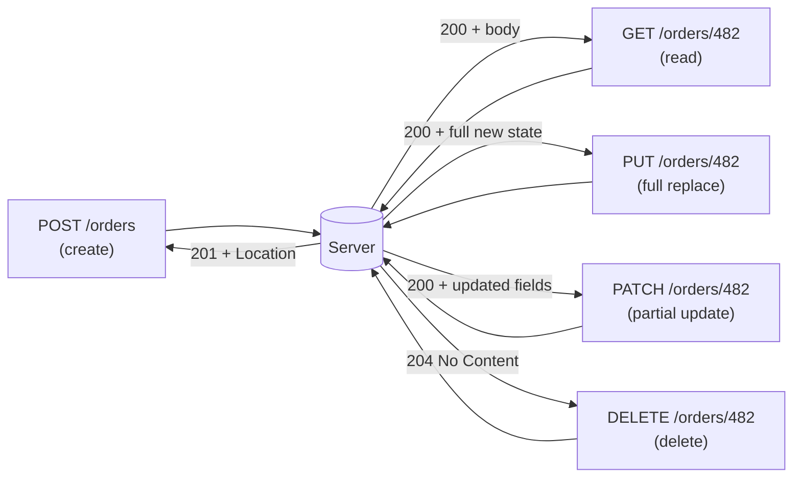

# CRUD Design

## Why This Matters

Create, Read, Update, Delete is the backbone of almost every API endpoint you will ever design. Mapping these four operations onto the right HTTP methods — and understanding the subtle but important difference between a full update and a partial update — is what makes an API predictable enough that developers can guess how it works before reading the docs. Get this mapping wrong and you force every integrator to read your source code instead of inferring behavior from HTTP semantics.

## Core Concept

CRUD maps onto HTTP methods as follows:

| Operation | HTTP Method | Target | Idempotent? |
|---|---|---|---|
| Create | `POST` | Collection (`/orders`) | No |
| Read | `GET` | Collection or item | Yes |
| Update (full) | `PUT` | Item (`/orders/482`) | Yes |
| Update (partial) | `PATCH` | Item (`/orders/482`) | Depends (see [Idempotency](idempotency.md)) |
| Delete | `DELETE` | Item (`/orders/482`) | Yes |

This table is the single most reused piece of knowledge in REST API design. Once it's internalized, most CRUD endpoint design becomes close to automatic.

## Mental Model

Think of CRUD operations the way you'd think about editing a document. `POST` is like typing a brand-new page and adding it to a binder — the binder decides the page number (ID), not you. `PUT` is like tearing out an existing page and replacing it entirely with a new one you wrote from scratch — anything not on your new page is gone. `PATCH` is like using correction fluid on just the one line you want to change, leaving everything else on the page untouched. `DELETE` removes the page. `GET` just reads it without touching anything.

## How It Works

**Create (`POST /orders`)**: the client sends a representation of the new resource (without an ID — the server assigns it) to the *collection* endpoint. The server creates it and responds `201 Created` with a `Location` header pointing at the new item's URL, plus the created representation (including its assigned ID) in the body.

**Read (`GET /orders` or `GET /orders/482`)**: no side effects, safe to cache, safe to retry infinitely. `GET` on a collection returns a list (usually paginated — see [Pagination](pagination.md)); `GET` on an item returns one resource or a `404` if it doesn't exist.

**Full update (`PUT /orders/482`)**: the client sends the *entire* resource representation. Semantically, `PUT` means "replace whatever is at this URL with exactly this." Any field the client omits from the request body is expected to be reset to its default/null — because the client is asserting "this is the complete new state," not "here's a partial change." This is why `PUT` is dangerous when clients forget to include a field: it can silently wipe data they didn't mean to touch.

**Partial update (`PATCH /orders/482`)**: the client sends only the fields that should change. Everything else on the server stays untouched. This is almost always what client applications actually want — a user changing their shipping address shouldn't have to resend their entire order payload. `PATCH` request bodies are commonly plain partial JSON objects (merge-patch style, per RFC 7396) or, for more complex partial-update semantics, a JSON Patch document (RFC 6902) describing a list of operations (`add`, `remove`, `replace`) — most APIs use the simpler merge-patch style unless they specifically need operation ordering or array-element-level patches.

**Delete (`DELETE /orders/482`)**: removes the resource. Typically responds `204 No Content` (successful, nothing to return) or `200 OK` with a confirmation body. Calling `DELETE` again on an already-deleted resource should return `404`, not error out — and this repeatability is exactly what makes `DELETE` idempotent (see [Idempotency](idempotency.md) for the precise definition).

## Architecture



## Request / Response Example

Full update with `PUT` — client must send the complete resource:

```http
PUT /orders/482 HTTP/1.1
Host: api.example.com
Content-Type: application/json

{
  "status": "shipped",
  "shipping_address": "12 Elm St",
  "total_cents": 4999
}
```

```http
HTTP/1.1 200 OK
Content-Type: application/json

{
  "id": 482,
  "status": "shipped",
  "shipping_address": "12 Elm St",
  "total_cents": 4999
}
```

Partial update with `PATCH` — only the changed field is sent, everything else is preserved:

```http
PATCH /orders/482 HTTP/1.1
Host: api.example.com
Content-Type: application/merge-patch+json

{
  "status": "cancelled"
}
```

```http
HTTP/1.1 200 OK
Content-Type: application/json

{
  "id": 482,
  "status": "cancelled",
  "shipping_address": "12 Elm St",
  "total_cents": 4999
}
```

## Code Example

```python
from fastapi import APIRouter, HTTPException
from pydantic import BaseModel
from typing import Optional

router = APIRouter(prefix="/orders")

class OrderFull(BaseModel):
    # PUT requires every field: this IS the complete new state.
    status: str
    shipping_address: str
    total_cents: int

class OrderPatch(BaseModel):
    # PATCH: every field optional. Unset fields are left untouched.
    status: Optional[str] = None
    shipping_address: Optional[str] = None
    total_cents: Optional[int] = None

ORDERS = {482: {"status": "pending", "shipping_address": "12 Elm St", "total_cents": 4999}}

@router.put("/{order_id}")
def replace_order(order_id: int, body: OrderFull):
    if order_id not in ORDERS:
        raise HTTPException(status_code=404, detail="Order not found")
    # Full replace: the new dict IS the entire resource state now.
    ORDERS[order_id] = body.model_dump()
    return {"id": order_id, **ORDERS[order_id]}

@router.patch("/{order_id}")
def update_order(order_id: int, body: OrderPatch):
    if order_id not in ORDERS:
        raise HTTPException(status_code=404, detail="Order not found")
    # Merge only the fields the client actually sent.
    updates = body.model_dump(exclude_unset=True)
    ORDERS[order_id].update(updates)
    return {"id": order_id, **ORDERS[order_id]}

@router.delete("/{order_id}", status_code=204)
def delete_order(order_id: int):
    if order_id not in ORDERS:
        raise HTTPException(status_code=404, detail="Order not found")
    del ORDERS[order_id]
    # 204 No Content: no body returned on success.
```

Note `exclude_unset=True` — this is the key detail that makes `PATCH` behave correctly in Pydantic: it distinguishes "the client didn't send this field" from "the client sent this field as `null`," which matters if `null` is itself a meaningful value you want to allow clients to set explicitly.

## Production Considerations

- Most real APIs implement `PATCH` far more than `PUT` in practice, because clients rarely have (or want to resend) the complete resource state. Some APIs skip `PUT` entirely and only offer `PATCH` for updates — that's a reasonable simplification as long as it's documented.
- `POST` for create is *not* idempotent by default — calling it twice creates two resources. If clients need safe retries on creation (e.g., a payment charge), you need an idempotency key mechanism (see [Idempotency](idempotency.md) and its implementation counterpart in [Part 6 — Production Reliability](../06-production-reliability/README.md)).
- Validate that `PUT` payloads are genuinely complete — a client omitting a required field should get a `400`/`422`, not have that field silently nulled out.
- Consider soft deletes (`status = "deleted"` instead of a row removal) for resources with audit or compliance requirements, while still exposing them through the same `DELETE` endpoint semantics externally.

## Common Mistakes

- Using `POST` for updates (`POST /orders/482/update`) instead of `PUT`/`PATCH` — this throws away the idempotency and semantic guarantees clients (and intermediaries like caches and retry logic) rely on.
- Implementing `PUT` as if it were `PATCH` — silently ignoring omitted fields instead of resetting them — which breaks the "replace" contract clients expect and creates confusing bugs when a client omits a field intentionally to clear it.
- Returning `200 OK` with no body inconsistently instead of `204 No Content` for deletes, or vice versa, without a documented convention.
- Not distinguishing "field omitted" from "field explicitly set to null" in `PATCH` handling, so clients can't clear a field.

## Best Practices

- Support `PATCH` for real-world partial updates; only add `PUT` if you have a genuine full-replace use case.
- Return the full updated resource representation in `PUT`/`PATCH` responses so clients don't need a follow-up `GET` to see the current state.
- Use `201 Created` + `Location` header for successful `POST`, and `204 No Content` for successful `DELETE` with no body.
- Document explicitly whether your `PATCH` uses merge-patch semantics (plain partial JSON) or JSON Patch (RFC 6902 operations) — don't make clients guess.

## AI Engineering Perspective

CRUD mapping applies directly to resources in AI systems: `POST /threads` creates a new conversation, `GET /threads/{id}/messages` reads its message history, `PATCH /threads/{id}` might rename a conversation or update its metadata (partial update — you're not resending the whole message history), and `DELETE /threads/{id}` removes it. Notably, messages *within* a thread are usually only ever created (`POST /threads/{id}/messages`) and read — most chat and agent APIs deliberately don't expose `PUT`/`PATCH`/`DELETE` on individual messages, because a conversation's history is treated as an append-only log for auditability and because "editing" a past message that already influenced a model's response is semantically murky. That's a deliberate CRUD *omission* worth noticing: not every resource needs all four operations.

## Exercises

**Beginner**: For a `/users/{id}` resource, write out example request bodies for a `PUT` (full replace) and a `PATCH` (partial update, just changing the email) and explain the difference in what happens to fields not included in each.

**Intermediate**: Design the CRUD endpoints for a `/playlists` resource that contains a `songs` list. Decide which operations should exist on `/playlists/{id}/songs` (e.g., is deleting a song a `DELETE` on a nested item, or a `PATCH` on the playlist's song list?) and justify your choice.

**Advanced**: Your team is debating whether to support `PUT` at all, given that 100% of current client code uses `PATCH`. Write a short design decision (with trade-offs) on whether to drop `PUT` from the API surface.

## Key Takeaways

- `POST` creates (not idempotent), `GET` reads (safe, idempotent), `PUT` fully replaces (idempotent), `PATCH` partially updates (semantics vary), `DELETE` removes (idempotent).
- `PUT` means "this is the complete new state" — omitted fields should be reset, not silently preserved.
- `PATCH` should only touch the fields explicitly included in the request body; distinguishing "omitted" from "set to null" matters.
- Not every resource needs all four CRUD operations — deliberately omitting one (like message edits in a chat API) is a valid design decision.

See also: [Resources and Endpoints](resources-and-endpoints.md), [Idempotency](idempotency.md), [Part 6 — Production Reliability](../06-production-reliability/README.md).
