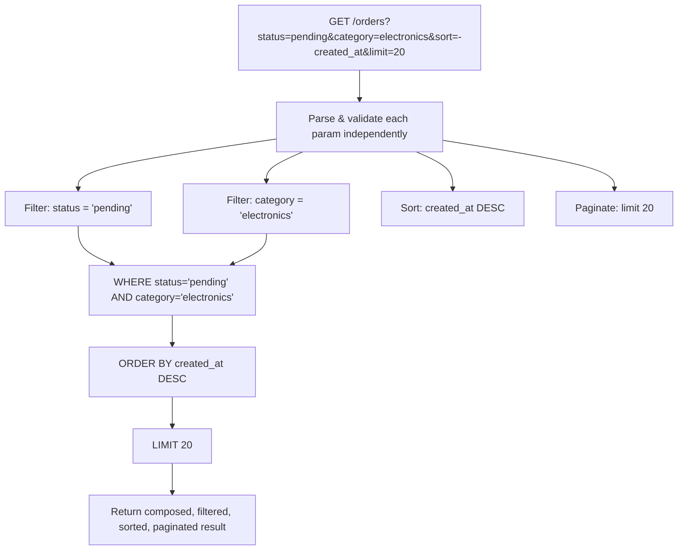

# Filtering and Sorting

## Why This Matters

Almost no client wants an entire collection every time — they want "orders that are still pending," "users signed up this month," "products under $20 sorted by rating." Filtering and sorting are what turn a collection endpoint from a dump of everything into a genuinely useful query interface. Designed well, they compose cleanly and stay predictable as your API grows; designed poorly, they become an unmaintainable pile of endpoint-specific special cases.

## Core Concept

**Filtering** narrows a collection to items matching some criteria, expressed via query parameters. **Sorting** controls the order in which the (possibly filtered) results are returned, also via a query parameter. Both operate on the collection endpoint (`GET /orders?status=pending&sort=-created_at`) and, critically, should be *composable* — a client should be able to combine multiple filters and a sort in one request without the API needing a special-cased endpoint for every combination.

## Mental Model

Think of filtering and sorting like a spreadsheet's AutoFilter and sort-by-column features. You can apply several column filters at once (status = "pending" AND category = "electronics") and then sort by a chosen column — the filters and the sort are independent, composable operations layered on top of the base data, not baked into separate spreadsheet views for every combination someone might want.

## How It Works

**Simple equality filters** are the easiest: `?status=pending` means "where status equals pending." For a field that can take one of several values, allow repeating or comma-separating: `?status=pending,shipped` means "where status is pending OR shipped."

**Range and comparison filters** need an operator convention since `field=value` alone only expresses equality. Two common approaches:
- Suffix-based: `?price_min=10&price_max=50` or `?created_after=2026-01-01&created_before=2026-02-01`.
- Operator-embedded: `?price[gte]=10&price[lte]=50` (bracket syntax) or `?filter=price>=10,price<=50` (custom query language).

Suffix-based filters (`_min`/`_max`, `_after`/`_before`) are easier to document, easier for clients to construct without a query-language parser, and are the dominant convention in production REST APIs. Reserve a full query-language syntax (like GraphQL-style filter objects) for APIs that genuinely need arbitrary boolean filter expressions — most CRUD-style REST APIs don't.

**Full-text/free-text search** uses a dedicated parameter, conventionally `q` (or `search`): `?q=blue+mug`. This is distinct from field-specific filters because it typically searches across multiple fields or uses a search index (see [Part 7 — Caching & Performance](../07-caching-performance/README.md) for search infrastructure) rather than an exact database column match.

**Sorting** uses a `sort` parameter with a documented convention for direction. The most common convention: a bare field name means ascending, a `-` prefix means descending: `?sort=-created_at`. Multi-field sort is expressed as a comma-separated list applied in order: `?sort=-priority,created_at` sorts by priority descending first, then by creation time ascending as a tie-breaker.

**Composability**: filters and sort should combine freely — `?status=pending&category=electronics&sort=-created_at&limit=20` should work exactly as you'd expect: filter by both conditions (AND), then sort, then paginate. This only works cleanly if your query-building code applies each parameter as an independent, composable clause (e.g., building up a SQL `WHERE` clause incrementally) rather than hardcoding specific filter combinations.

## Architecture



## Request / Response Example

```http
GET /orders?status=pending,shipped&created_after=2026-08-01&sort=-created_at&limit=2 HTTP/1.1
Host: api.example.com
Accept: application/json
```

```http
HTTP/1.1 200 OK
Content-Type: application/json

{
  "data": [
    { "id": 512, "status": "shipped", "created_at": "2026-08-17T09:00:00Z" },
    { "id": 509, "status": "pending", "created_at": "2026-08-16T14:30:00Z" }
  ],
  "meta": {
    "filters_applied": {
      "status": ["pending", "shipped"],
      "created_after": "2026-08-01"
    },
    "sort": "-created_at",
    "limit": 2
  }
}
```

An invalid sort field should be rejected explicitly, not silently ignored:

```http
GET /orders?sort=-bogus_field HTTP/1.1
```

```http
HTTP/1.1 400 Bad Request
Content-Type: application/json

{
  "error": "invalid_sort_field",
  "message": "'bogus_field' is not a sortable field. Allowed: id, created_at, total_cents, status"
}
```

## Code Example

```python
from fastapi import APIRouter, Query, HTTPException
from typing import Optional, List

router = APIRouter()

ALLOWED_SORT_FIELDS = {"id", "created_at", "total_cents", "status"}

def parse_sort(sort: str) -> List[tuple[str, str]]:
    """Turn '-created_at,total_cents' into [('created_at', 'DESC'), ('total_cents', 'ASC')]."""
    clauses = []
    for part in sort.split(","):
        part = part.strip()
        direction = "DESC" if part.startswith("-") else "ASC"
        field = part.lstrip("-")
        if field not in ALLOWED_SORT_FIELDS:
            # Reject unknown sort fields loudly rather than ignoring them --
            # a client silently getting unsorted results is a worse experience
            # than an explicit, actionable error.
            raise HTTPException(status_code=400, detail=f"'{field}' is not a sortable field")
        clauses.append((field, direction))
    return clauses

@router.get("/orders")
def list_orders(
    status: Optional[str] = Query(None, description="Comma-separated statuses"),
    created_after: Optional[str] = Query(None, description="ISO 8601 date"),
    sort: str = Query("-created_at"),
    limit: int = Query(20, ge=1, le=100),
):
    sort_clauses = parse_sort(sort)
    statuses = status.split(",") if status else None

    # Each filter is applied independently and composes with the others --
    # this is what lets clients freely combine filters without special-casing.
    where_clauses = []
    params = []
    if statuses:
        where_clauses.append(f"status IN ({','.join(['%s'] * len(statuses))})")
        params.extend(statuses)
    if created_after:
        where_clauses.append("created_at > %s")
        params.append(created_after)

    order_by = ", ".join(f"{field} {direction}" for field, direction in sort_clauses)
    where_sql = f"WHERE {' AND '.join(where_clauses)}" if where_clauses else ""

    query = f"SELECT * FROM orders {where_sql} ORDER BY {order_by} LIMIT %s"
    params.append(limit)

    rows = fake_db_execute(query, params)
    return {"data": rows, "meta": {"sort": sort, "limit": limit}}

def fake_db_execute(query, params):
    return [{"id": 512, "status": "shipped", "created_at": "2026-08-17T09:00:00Z"}]
```

## Production Considerations

- Index every field that's commonly filtered or sorted on — an unindexed `WHERE`/`ORDER BY` column turns a fast query into a full table scan as data grows (see [Part 4 — Databases & APIs](../04-databases-and-apis/README.md)).
- Maintain an explicit allow-list of filterable and sortable fields, and reject anything outside it with a `400`. Never pass a client-supplied field name directly into a raw SQL `ORDER BY` clause — that's a SQL injection vector (see [Part 10 — API Security](../10-api-security/README.md)).
- Document default sort order explicitly — an endpoint with no `sort` param specified should still behave predictably (usually most-recent-first) rather than returning database-arbitrary order.
- Combining full-text search (`q`) with structured filters and sort is powerful for users but often requires a dedicated search index (e.g., Elasticsearch, Postgres full-text search, or a vector index for semantic search) rather than plain SQL `LIKE` queries, which don't scale.

## Common Mistakes

- Silently ignoring unknown filter/sort field names instead of returning a `400` — clients then can't tell whether their filter did nothing because it matched zero rows or because it was never applied.
- Allowing arbitrary client-supplied strings directly into a raw `ORDER BY` or `WHERE` clause without an allow-list — a serious SQL injection risk.
- Inventing a different filter syntax for every endpoint (`price_min` here, `price[gte]` there) instead of one consistent convention across the API.
- Forgetting database indexes on frequently filtered/sorted columns, causing filtering to work correctly in a small dev dataset but become unusably slow in production.

## Best Practices

- Use consistent, suffix-based filter syntax (`_min`/`_max`, `_after`/`_before`) across the whole API rather than a bespoke query language, unless you have a genuine need for arbitrary boolean expressions.
- Maintain an explicit allow-list for both filterable and sortable fields; reject anything else with a clear `400` error.
- Support multi-field sort via comma-separated field lists with a `-` prefix for descending.
- Index every column that appears in a documented filter or sort option.

## AI Engineering Perspective

Filtering and sorting map directly onto retrieval-adjacent AI APIs: a RAG document API might support `GET /documents?status=indexed&source=upload&sort=-created_at` to let a client audit what's been ingested, or a vector search endpoint might combine structured metadata filters with semantic search: `POST /search {"query": "refund policy", "filters": {"doc_type": "policy", "updated_after": "2026-01-01"}}` — this hybrid of structured filtering plus semantic ranking is the standard pattern in production RAG systems (see [Part 16 — RAG APIs](../16-rag-apis/README.md)), where "sort" is effectively replaced or augmented by a relevance score from the retrieval model rather than a simple field comparison.

## Exercises

**Beginner**: Design filter query parameters for a `/movies` endpoint supporting genre, release year range, and minimum rating.

**Intermediate**: Implement multi-field sort parsing (`sort=-rating,title`) for the `/movies` endpoint, including validation against an allow-list of sortable fields.

**Advanced**: A client wants to filter orders by "any of these 5 statuses AND created in the last 30 days AND total over $100," then sort by total descending. Design the full query parameter contract, write the validation logic, and identify which database indexes this query pattern requires.

## Key Takeaways

- Filtering and sorting should compose freely — build them as independent, combinable query clauses, not endpoint-specific special cases.
- Use a consistent suffix-based filter convention across the whole API; reserve custom filter query languages for genuine advanced use cases.
- Always validate filter and sort field names against an explicit allow-list — this is both a UX and a SQL-injection-prevention necessity.
- Index whatever you let clients filter or sort by, or the feature will silently become a production performance problem.

See also: [Query Parameters](query-parameters.md), [Pagination](pagination.md), [Part 16 — RAG APIs](../16-rag-apis/README.md).
