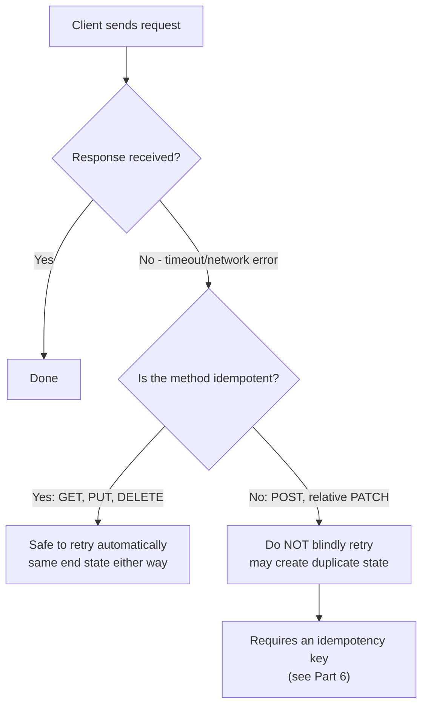

# Idempotency

## Why This Matters

Networks fail. A client sends a request, the server processes it successfully, but the response never makes it back — a timeout, a dropped connection, a proxy hiccup. From the client's perspective, this is indistinguishable from "the request never arrived at all." The client's only reasonable move is to retry. Whether that retry is *safe* — whether it's guaranteed not to cause a second, duplicate effect (charging a customer twice, creating two identical orders) — depends entirely on whether the operation is idempotent. Understanding idempotency at the HTTP-method level is the foundation for building retry-safe, reliable APIs.

## Core Concept

An operation is **idempotent** if performing it multiple times has the exact same effect on server state as performing it once. Critically, idempotency is about the *effect on server state*, not about whether the response is identical every time — calling `DELETE /orders/482` twice: the first call deletes the order and returns `204`; the second call finds nothing to delete and returns `404`. The responses differ, but the *server state* after either one or a hundred calls is identical: the order is gone. That's still idempotent.

HTTP defines idempotency per-method:

| Method | Idempotent? | Why |
|---|---|---|
| `GET` | Yes | Read-only, no state change at all. |
| `HEAD` | Yes | Same as `GET` but without a body — read-only. |
| `PUT` | Yes | Replaces a resource with the exact same complete representation every time — repeating it doesn't change the end state. |
| `DELETE` | Yes | The resource ends up deleted either way, whether called once or five times. |
| `OPTIONS` | Yes | Read-only, describes allowed operations. |
| `POST` | **No** | Conventionally creates a *new* resource on each call — calling it twice creates two resources. |
| `PATCH` | **Depends** | A `PATCH` that sets an absolute value (`{"status": "cancelled"}`) is idempotent — applying it repeatedly always ends in the same state. A `PATCH` that expresses a relative change (`{"increment_quantity_by": 1}`) is *not* idempotent — applying it twice doubles the effect. |

## Mental Model

Think of idempotency like a light switch versus a light *toggle*. Setting a light switch to "on" is idempotent — flip it to "on" once, or a hundred times, the light ends up on either way. But a "toggle the light" button is not idempotent — press it once, the light turns on; press it again (thinking your first press didn't register), and you've turned it back off, which is the opposite of what you wanted. `PUT` and absolute-value `PATCH` requests are light switches. `POST` and relative-value `PATCH` requests are toggles.

## How It Works

**Why `GET`/`HEAD`/`OPTIONS` are idempotent (and safe)**: these methods are also "safe" (an even stronger guarantee — they cause *no* state change at all, not even an idempotent one). A `GET` request should never have side effects; browsers, proxies, and crawlers all rely on this guarantee to freely retry, prefetch, and cache `GET` requests without asking permission.

**Why `PUT` is idempotent**: `PUT` semantically means "make the resource at this URL look exactly like this representation." If you send the same complete representation twice, the resource ends up in the same final state both times — the second `PUT` doesn't "add another copy," it just re-asserts the same state that's already there. This is exactly why `PUT` is the right choice for full-replace updates (see [CRUD Design](crud-design.md)): it's inherently retry-safe.

**Why `DELETE` is idempotent**: the *end state* (resource absent) is the same whether you call it once or many times, even though the second call returns a different status code (`404` instead of `204`) because there's nothing left to delete. Idempotency is defined over server state, not over the HTTP response.

**Why `POST` is not idempotent**: `POST /orders` conventionally means "create a new order resource." Each call, by definition, is meant to create something new — calling it twice is supposed to produce two things. This is precisely why `POST` retries are dangerous: if a client's `POST /charges` request to a payment API times out on the response but actually succeeded server-side, a naive retry creates a second charge. This is such a common, costly problem that HTTP-level idempotency isn't enough to solve it — you need a stronger mechanism (an idempotency key the client generates and sends, which the server uses to detect and safely no-op a retried `POST`). **That implementation-level mechanism is covered in [Part 6 — Production Reliability](../06-production-reliability/README.md)** — this chapter is specifically about the conceptual HTTP semantics: which methods are idempotent by definition and why, not how to bolt idempotency onto a naturally non-idempotent operation like `POST`.

**Why `PATCH` depends on the payload**: `PATCH` doesn't have a fixed idempotency guarantee at the HTTP-spec level the way `PUT` does — it depends entirely on what the partial update *expresses*. `{"status": "cancelled"}` is an absolute assignment: applying it once or a hundred times leaves `status` as `"cancelled"` either way — idempotent. `{"increment_quantity_by": 1}` is a relative/cumulative operation: applying it twice increments by 2, not 1 — not idempotent. As an API designer, prefer absolute-value `PATCH` semantics wherever possible specifically *because* it makes the operation safely retryable; reserve relative/incrementing operations for cases where that's genuinely the intended semantics (and consider whether such an operation should be its own explicit endpoint, e.g., `POST /orders/482/quantity-increments`, so its non-idempotent nature is obvious from the URL).

## Architecture



## Request / Response Example

Idempotent `PUT` — safe to retry after a timeout:

```http
PUT /orders/482 HTTP/1.1
Host: api.example.com
Content-Type: application/json

{ "status": "shipped", "total_cents": 4999 }
```

```http
HTTP/1.1 200 OK
Content-Type: application/json

{ "id": 482, "status": "shipped", "total_cents": 4999 }
```

Sending the exact same `PUT` request again (e.g., because the first response was lost to a timeout) produces an identical end state — no harm done.

Non-idempotent `POST` — retrying blindly is dangerous:

```http
POST /orders/482/payments HTTP/1.1
Host: api.example.com
Content-Type: application/json

{ "amount_cents": 4999 }
```

```http
HTTP/1.1 201 Created
Content-Type: application/json
Location: /payments/9911

{ "id": 9911, "order_id": 482, "amount_cents": 4999, "status": "succeeded" }
```

If this response is lost in transit and the client retries the exact same `POST`, a naive server creates a *second* `9912` payment — the customer is charged twice. This is precisely the problem idempotency keys (Part 6) solve.

## Code Example

```python
from fastapi import APIRouter, HTTPException
from pydantic import BaseModel

router = APIRouter(prefix="/orders")
ORDERS = {482: {"status": "pending", "total_cents": 4999}}

class OrderFull(BaseModel):
    status: str
    total_cents: int

@router.put("/{order_id}")
def replace_order(order_id: int, body: OrderFull):
    # Idempotent by design: calling this 1 time or 100 times with the
    # SAME body leaves ORDERS[order_id] in the exact same final state.
    if order_id not in ORDERS:
        raise HTTPException(status_code=404, detail="Order not found")
    ORDERS[order_id] = body.model_dump()
    return {"id": order_id, **ORDERS[order_id]}


class StatusPatch(BaseModel):
    status: str  # absolute value -- idempotent

@router.patch("/{order_id}/status")
def set_status(order_id: int, body: StatusPatch):
    # Idempotent: setting status to "cancelled" twice in a row has the
    # same effect as setting it once. Safe to retry on timeout.
    if order_id not in ORDERS:
        raise HTTPException(status_code=404, detail="Order not found")
    ORDERS[order_id]["status"] = body.status
    return {"id": order_id, **ORDERS[order_id]}


class QuantityIncrement(BaseModel):
    increment_by: int  # relative value -- NOT idempotent

@router.post("/{order_id}/quantity-increments")
def increment_quantity(order_id: int, body: QuantityIncrement):
    # Deliberately a POST, not a PATCH: this operation is NOT idempotent
    # (calling it twice adds the increment twice), so it's modeled as
    # creating a new "increment event" resource rather than disguised
    # as a safe-looking PATCH. A production version of this endpoint
    # would require an idempotency key (see Part 6) for safe retries.
    if order_id not in ORDERS:
        raise HTTPException(status_code=404, detail="Order not found")
    ORDERS[order_id].setdefault("quantity", 0)
    ORDERS[order_id]["quantity"] += body.increment_by
    return {"id": order_id, **ORDERS[order_id]}
```

## Production Considerations

- HTTP-level idempotency (the definitions in this chapter) tells you *whether a method is safe to retry as-is*. It does not, by itself, protect a naturally non-idempotent operation like `POST` — that requires an explicit idempotency-key mechanism at the application layer, covered in [Part 6 — Production Reliability](../06-production-reliability/README.md).
- Load balancers, HTTP clients, and proxies commonly auto-retry `GET`/`PUT`/`DELETE` requests on connection failures because their idempotency is a documented HTTP guarantee — but they will *not* auto-retry `POST` for exactly this reason. Don't fight this default; design your `POST` endpoints assuming clients (and infrastructure) will sometimes retry them regardless.
- When designing a `PATCH` endpoint, explicitly decide and document whether each field's update semantics are absolute (idempotent) or relative (not) — don't leave this ambiguous, since it directly determines whether clients can safely retry.
- Idempotency is also foundational to distributed systems patterns like at-least-once message delivery (see [Part 8 — Async Systems](../08-async-systems/README.md)) — a consumer that might process the same message twice needs the operation it performs to be idempotent, or it needs its own deduplication mechanism.

## Common Mistakes

- Assuming `PATCH` is always idempotent just because `PUT` is — it depends entirely on whether the update expresses an absolute or relative change.
- Building retry logic (in a client SDK or a resilience layer) that blindly retries `POST` requests the same way it retries `GET`, without any idempotency-key safeguard.
- Designing an endpoint that looks like a `PATCH` for a status field but secretly has cumulative side effects (e.g., `PATCH` that also sends a notification every time it's called, even when the status value didn't change) — this breaks the idempotency guarantee clients expect from `PATCH`-style absolute updates.
- Conflating "idempotent" with "returns the same response every time" — they're different properties; idempotency is about *server state*, not response content.

## Best Practices

- Design `PATCH` payloads to express absolute values wherever the semantics allow it, specifically to get idempotency for free.
- Model genuinely relative/cumulative operations as their own explicit endpoint (often `POST` to a sub-resource) so their non-idempotent nature is visible in the API's shape, not hidden inside a `PATCH`.
- Never build automatic retry logic for `POST` without an idempotency-key mechanism underneath it.
- Document each endpoint's idempotency guarantee explicitly in your API contract (see [API Contracts](api-contracts.md)) — don't leave clients to infer it.

## AI Engineering Perspective

Idempotency semantics matter directly for AI APIs that trigger real-world side effects. If an AI agent calls a tool that maps to `POST /orders/{id}/refunds` and the tool call's HTTP response times out, does the agent's retry logic issue a second refund? This is not a hypothetical — agent frameworks routinely retry failed tool calls automatically, and if the underlying API endpoint isn't idempotent (or doesn't support an idempotency key), an agent retry can cause a real duplicate financial transaction with no human in the loop to notice. This is one of the concrete reasons [Part 17 — AI Agents and MCP](../17-ai-agents-and-mcp/README.md) treats tool/action safety as a first-class concern: every tool an agent can call that has a side effect should be designed with the same idempotency discipline described in this chapter, and ideally exposed with explicit idempotency-key support, precisely because an autonomous retry loop is far less forgiving of duplicate side effects than a human clicking "submit" twice.

## Exercises

**Beginner**: For each of the following, state whether it's idempotent and why: `DELETE /users/9`, `POST /users`, `PUT /users/9`, `PATCH /users/9` with body `{"age": 30}`.

**Intermediate**: You're designing a `PATCH /carts/{id}` endpoint that both sets a `status` field and needs to support "add 1 to quantity of item X." Redesign this so the non-idempotent operation is clearly separated from the idempotent one.

**Advanced**: An AI agent framework auto-retries failed tool calls up to 3 times with exponential backoff. Identify which of your API's endpoints are safe for this retry policy as-is, which need idempotency keys before they can be safely exposed as agent tools, and write a short policy for how tool-call endpoints should be designed going forward.

## Key Takeaways

- Idempotency means repeating an operation produces the same server-state outcome as doing it once — it's about effect on state, not identical responses.
- `GET`, `HEAD`, `PUT`, `DELETE`, and `OPTIONS` are idempotent by HTTP definition; `POST` is not; `PATCH` depends on whether its payload expresses absolute or relative changes.
- Prefer absolute-value `PATCH` semantics to get idempotency "for free," and model genuinely relative operations as their own explicit endpoint.
- HTTP-level idempotency alone doesn't make `POST` safe to retry — that requires an application-level idempotency-key mechanism, covered in [Part 6 — Production Reliability](../06-production-reliability/README.md).

See also: [CRUD Design](crud-design.md), [Part 6 — Production Reliability](../06-production-reliability/README.md) (idempotency key implementation), [Part 17 — AI Agents and MCP](../17-ai-agents-and-mcp/README.md).
