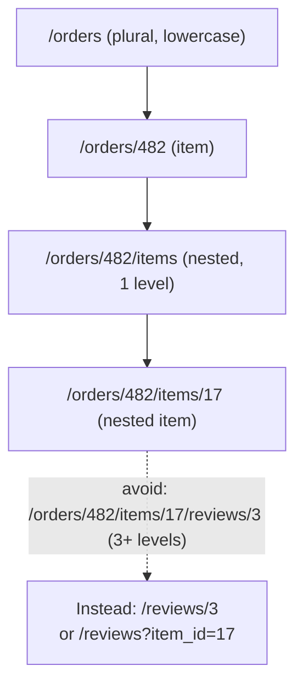

# API Naming Conventions

## Why This Matters

Naming is the part of API design with the least "correct" technical answer and the highest cost of inconsistency. A URL structure or field name, once shipped and consumed by clients, is expensive to change — every rename is a breaking change for someone. Establishing and enforcing naming conventions early, before your API surface grows, is one of the cheapest investments you can make in an API's long-term usability.

## Core Concept

API naming conventions cover four recurring decisions: pluralization, casing, nesting depth, and terminology consistency. None of these choices is objectively "correct" — REST doesn't mandate any of them — but each one needs to be made deliberately, once, and then applied everywhere without exception.

## Mental Model

Think of your API's naming conventions as a style guide, the same way a codebase has a linter config. No one seriously argues that 2-space indentation is "more correct" than 4-space — what matters is that the whole codebase uses one consistently, so nobody has to think about it or gets surprised. API naming is exactly the same: the specific choice matters far less than never deviating from it once made.

## How It Works

**Plural nouns for collections.** `/orders`, `/users`, `/products` — even for actions that conceptually operate on "one" resource type. `/orders/482` still lives under the plural collection `/orders`. Singular collection names (`/order`) are used by some APIs but plural is the dominant convention because it reads naturally for both the collection ("list of orders") and matches how you'd say it in English ("get the orders").

**Casing.** URL path segments are conventionally lowercase with hyphens for multi-word segments: `/order-items`, not `/orderItems` or `/order_items`. Hyphens are preferred over underscores in URLs because underscores can be visually hidden by text-decoration underlines in some renderers, and hyphens are the web's de facto standard (search engines, most public APIs). JSON field names inside request/response bodies typically follow `snake_case` (common in Python/Ruby-influenced APIs, e.g., Stripe) or `camelCase` (common in JavaScript-influenced APIs). Neither is universally "correct" — pick one, document it, and never mix them within the same API.

**Nesting depth.** Nest resources only as deep as necessary to express genuine parent-child ownership, and cap it in practice at 2–3 levels. `/orders/482/items/17` is reasonable. `/customers/91/orders/482/items/17/reviews/3` is not — it's fragile (any broken link in the chain breaks the whole URL), hard to construct client-side, and usually unnecessary since `items` and `reviews` can typically be addressed more directly (`/items/17`, or filtered via query parameters: `/reviews?item_id=17`). A good rule: once you're past two levels of nesting, ask whether the deeper resource should become a top-level, independently addressable resource instead (see [Resources and Endpoints](resources-and-endpoints.md)).

**Consistent terminology.** If a field is called `status` on `/orders`, don't call the equivalent concept `state` on `/shipments`. If IDs are `id` on every resource, don't suddenly call one `order_id` inside its own representation (it's redundant — you already know it's an order; use `id`, and use `order_id` only when *referencing* an order from another resource, like `{"order_id": 482}` inside a shipment). This sounds obvious in isolation but is one of the most common sources of drift as an API grows across multiple teams or over multiple years.

**Verbs stay out of URLs**, with one common, accepted exception: when an operation genuinely isn't a CRUD action on a resource's state, a verb-like sub-resource is acceptable — e.g., `POST /orders/482/cancellations` (creating a "cancellation" resource) or, more pragmatically, many production APIs simply accept `POST /orders/482/cancel` as a documented, deliberate exception to the noun rule for actions that don't map cleanly to `PATCH`ing a status field (side effects like refund processing, notification dispatch). This is a defensible pragmatic compromise, not a naming-convention failure — just don't let it become the default pattern for anything that *could* be a field update.

## Architecture



## Request / Response Example

Consistent naming across a full request/response cycle:

```http
POST /order-items HTTP/1.1
Host: api.example.com
Content-Type: application/json

{
  "order_id": 482,
  "sku": "MUG-BLUE-01",
  "quantity": 2,
  "unit_price_cents": 1299
}
```

```http
HTTP/1.1 201 Created
Content-Type: application/json
Location: /order-items/17

{
  "id": 17,
  "order_id": 482,
  "sku": "MUG-BLUE-01",
  "quantity": 2,
  "unit_price_cents": 1299,
  "created_at": "2026-08-18T10:15:00Z"
}
```

Notice: `order-items` (hyphenated URL), `order_id` (snake_case JSON field, used because it *references* another resource), `id` (not `order_item_id`, because this response IS the order-item — self-reference doesn't need the type prefix).

## Code Example

```python
from fastapi import APIRouter
from pydantic import BaseModel, ConfigDict
from datetime import datetime

router = APIRouter()

class OrderItemOut(BaseModel):
    # snake_case consistently, matching the rest of the API's JSON convention
    model_config = ConfigDict(populate_by_name=True)

    id: int
    order_id: int          # references a parent resource -> prefixed
    sku: str
    quantity: int
    unit_price_cents: int  # 'unit_price_cents' not 'unitPrice' or 'price' -- explicit unit + currency-safe integer
    created_at: datetime

# URL uses hyphenated, plural, lowercase path segment
@router.post("/order-items", response_model=OrderItemOut, status_code=201)
def create_order_item(sku: str, order_id: int, quantity: int, unit_price_cents: int):
    return OrderItemOut(
        id=17,
        order_id=order_id,
        sku=sku,
        quantity=quantity,
        unit_price_cents=unit_price_cents,
        created_at=datetime.utcnow(),
    )
```

## Production Considerations

- Write down your naming conventions in a one-page style guide before the API grows past a handful of endpoints — retrofitting consistency across dozens of existing endpoints is far more expensive than establishing it early.
- Money and quantities: always be explicit about units in field names (`unit_price_cents` not `price`) to prevent an entire category of "was this dollars or cents" bugs.
- Timestamps: use a consistent field name suffix (`_at` for instants: `created_at`, `updated_at`) and always ISO 8601 with a timezone (`2026-08-18T10:15:00Z`) — see [Part 1 — API Foundations](../01-api-foundations/README.md) for JSON serialization details.
- If you must break a naming convention for backward-compatibility reasons, document the exception explicitly rather than letting it look like the new standard.

## Common Mistakes

- Mixing plural and singular collection names across the API (`/orders` but `/product` for products).
- Mixing `camelCase` and `snake_case` for JSON fields within the same API, often because different teams or services built different endpoints independently.
- Redundant type prefixes on self-referencing IDs (`{"order_id": 482}` inside the `/orders/482` response itself, instead of just `{"id": 482}`).
- Deep nesting that mirrors your database's foreign key structure instead of what clients actually need to address directly.

## Best Practices

- Plural, lowercase, hyphenated path segments for URLs; one consistent casing style (snake_case or camelCase) for JSON field names — pick once, apply everywhere.
- Cap nesting at 2–3 levels; promote deeper resources to top-level, independently addressable endpoints with reference fields instead.
- Use `id` for a resource's own identifier in its own representation; use `<type>_id` only when referencing a different resource.
- Be explicit about units and formats in field names (`_cents`, `_at`, `_url`) to eliminate ambiguity without requiring a trip to the docs.

## AI Engineering Perspective

Naming conventions matter even more in AI APIs because field names often get parsed or reasoned about *by the model itself* — for example, when a JSON API response is fed back into an LLM's context, or when a tool/function-calling schema (see [Part 14 — AI API Engineering](../14-ai-api-engineering/README.md)) defines parameter names the model must produce accurately. A tool schema with inconsistent naming (`orderId` in one function, `order_id` in another) increases the odds the model hallucinates the wrong field name when generating a function call. The same "pick one convention and never deviate" discipline that helps human developers integrate faster also directly reduces LLM tool-calling error rates — it's not just a style preference, it measurably affects model reliability.

## Exercises

**Beginner**: Rewrite this inconsistent set of endpoints using consistent naming conventions: `/getUser/{id}`, `/product_list`, `/Orders/{orderId}/Item/{itemId}`.

**Intermediate**: Design field names for a `/subscriptions` resource including plan name, price, billing interval, and next billing date — being explicit about units and formats.

**Advanced**: Your API has grown organically across three teams and now has both `camelCase` and `snake_case` JSON fields depending on which team built the endpoint. Propose a migration strategy that fixes this without breaking every existing client at once (hint: connect this to [API Versioning](api-versioning.md)).

## Key Takeaways

- Naming conventions aren't about finding the "correct" style — they're about picking one and applying it with zero exceptions across the whole API.
- Plural, lowercase, hyphenated URLs and one consistent JSON casing convention are the two highest-leverage decisions to make early.
- Cap resource nesting at 2–3 levels; promote deeper resources to top-level endpoints instead.
- Be explicit about units and formats in field names — it prevents ambiguity bugs and helps both human developers and LLMs consuming your API via tool calls.

See also: [Resources and Endpoints](resources-and-endpoints.md), [CRUD Design](crud-design.md), [API Contracts](api-contracts.md).
