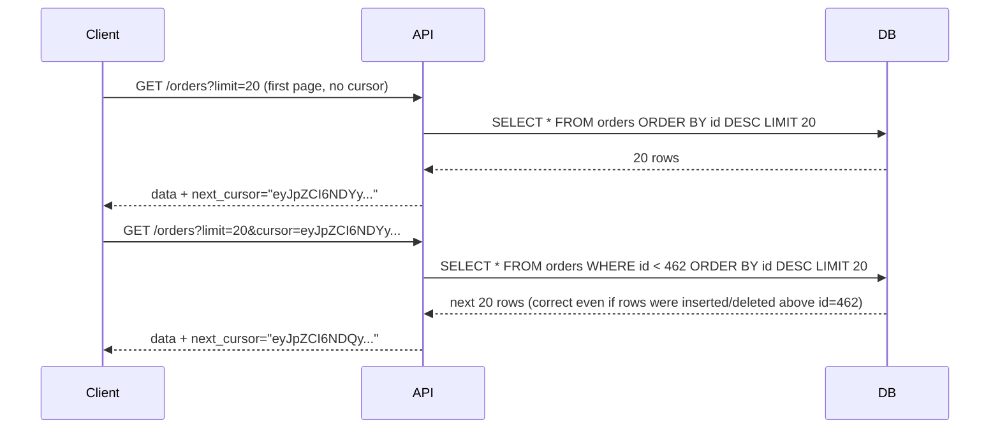

# Pagination

## Why This Matters

Any collection endpoint that can grow without bound — orders, users, log entries, chat messages — will eventually return too much data to send in a single response. Without pagination, a `GET /orders` on a table with ten million rows either times out, exhausts server memory, or sends a client an unusably huge payload. Pagination is the mechanism that makes collection endpoints scale from a demo with 10 rows to production with 10 million, and choosing the right pagination strategy (offset vs cursor) has real consequences for correctness and performance, not just convenience.

## Core Concept

Pagination splits a large collection into smaller, sequential chunks ("pages") that a client requests one at a time. There are two dominant strategies:

- **Offset-based pagination**: the client says "skip N items, give me the next M" (`?page=3&per_page=20` or `?offset=40&limit=20`). Simple to understand and implement, but has real correctness and performance problems at scale.
- **Cursor-based pagination**: the client says "give me the M items after this specific marker" (`?cursor=eyJpZCI6NDgyfQ&limit=20`), where the cursor encodes a position in a stable sort order (usually derived from the last item's ID or timestamp). More complex to implement, but correct and performant even as the underlying data changes.

## Mental Model

Offset pagination is like saying "give me rows 41 through 60 of this spreadsheet" — it works fine until someone inserts or deletes rows above row 41 while you're paging through, and now your "row 41" is a different row than it was a second ago. Cursor pagination is like saying "give me the 20 rows right after the one with this specific ID" — it doesn't matter how many rows got inserted or deleted elsewhere in the spreadsheet; your bookmark still points at a real, specific row, so the next page is always correct relative to where you left off.

## How It Works

**Offset pagination mechanics**: the server translates `page`/`per_page` (or `offset`/`limit`) directly into a SQL `LIMIT ... OFFSET ...` clause. `?page=3&per_page=20` becomes `LIMIT 20 OFFSET 40`. This is trivial to implement and lets clients jump to arbitrary pages ("go to page 50") — a feature cursor pagination can't offer.

Its two core weaknesses: **(1) Correctness under concurrent writes.** If a new row is inserted at the start of the result set between page 1 and page 2 requests, everything shifts by one position — the client can see a duplicate item (the one that got pushed from page 1's end into page 2's start... or the reverse: an item they should have seen gets skipped entirely). **(2) Performance at high offsets.** `OFFSET 100000` still requires the database to scan and discard 100,000 rows before returning the next page — this gets linearly slower as users page deeper into large datasets, even though the client only wants 20 rows.

**Cursor pagination mechanics**: the server returns an opaque cursor (usually a base64-encoded representation of the last item's sort key — e.g., `{"id": 482, "created_at": "2026-08-10T12:00:00Z"}`) alongside each page. The next request includes that cursor: `?cursor=eyJpZCI6NDgyfQ&limit=20`, and the server translates it into a `WHERE (created_at, id) < (?, ?) ORDER BY created_at DESC, id DESC LIMIT 20` query — using the cursor as a starting point rather than a row count to skip. This is why it stays fast regardless of how deep into the collection you page: the database uses an index to jump straight to the cursor position instead of scanning and discarding rows. It's also correct under concurrent writes: since the cursor is a specific data point, not a row count, insertions elsewhere in the set don't shift what "next" means.

The trade-off: cursors don't support jumping to an arbitrary page number, and pagination state can't easily be reconstructed from a bare integer a user might type into a URL bar — cursors are meant to be passed through unmodified from the previous response, not hand-constructed.

**Response envelope design**: regardless of strategy, a paginated response should include the page of data plus metadata that tells the client how to get more: a `next` cursor/link, whether more data exists, and (for offset pagination) optionally a total count. Fetching an exact `total_count` on every request against a huge table is itself expensive (it requires a full or near-full scan/index count) — many APIs make total count optional, approximate, or omit it entirely for very large collections.

## Architecture



## Request / Response Example

Offset-based:

```http
GET /orders?page=2&per_page=20 HTTP/1.1
Host: api.example.com
```

```http
HTTP/1.1 200 OK
Content-Type: application/json

{
  "data": [ { "id": 461, "status": "shipped" }, "... 19 more" ],
  "meta": {
    "page": 2,
    "per_page": 20,
    "total_count": 8342,
    "total_pages": 418
  }
}
```

Cursor-based:

```http
GET /orders?limit=20&cursor=eyJpZCI6NDgyfQ HTTP/1.1
Host: api.example.com
```

```http
HTTP/1.1 200 OK
Content-Type: application/json

{
  "data": [ { "id": 461, "status": "shipped" }, "... 19 more" ],
  "meta": {
    "limit": 20,
    "next_cursor": "eyJpZCI6NDQyfQ",
    "has_more": true
  }
}
```

## Code Example

```python
import base64
import json
from fastapi import APIRouter, Query
from typing import Optional

router = APIRouter()

def encode_cursor(last_id: int) -> str:
    return base64.urlsafe_b64encode(json.dumps({"id": last_id}).encode()).decode()

def decode_cursor(cursor: str) -> int:
    return json.loads(base64.urlsafe_b64decode(cursor.encode()))["id"]

@router.get("/orders")
def list_orders(
    limit: int = Query(20, ge=1, le=100),
    cursor: Optional[str] = Query(None, description="Opaque cursor from a previous response"),
):
    # Decode the cursor into a concrete "start after this id" position.
    # An index on (id) or (created_at, id) makes this query fast at any depth.
    after_id = decode_cursor(cursor) if cursor else None

    query = "SELECT * FROM orders"
    params = []
    if after_id is not None:
        query += " WHERE id < %s"
        params.append(after_id)
    query += " ORDER BY id DESC LIMIT %s"
    params.append(limit + 1)  # fetch one extra row to know if there's a next page

    rows = fake_db_execute(query, params)  # placeholder for real DB call

    has_more = len(rows) > limit
    page = rows[:limit]
    next_cursor = encode_cursor(page[-1]["id"]) if has_more else None

    return {
        "data": page,
        "meta": {"limit": limit, "next_cursor": next_cursor, "has_more": has_more},
    }

def fake_db_execute(query, params):
    return [{"id": i, "status": "shipped"} for i in range(480, 460, -1)]
```

## Production Considerations

- Default to cursor-based pagination for any collection that's large, high-write-volume, or exposed to the public — the correctness guarantee under concurrent writes matters more than most teams initially assume.
- Offset pagination remains fine for small, relatively static collections, or admin UIs where "jump to page 12" is a genuinely useful feature and the dataset is small enough that deep-offset performance never becomes a problem.
- Always cap `limit`/`per_page` server-side (e.g., max 100) regardless of strategy — never let a client request an unbounded page size.
- Cursors should be treated as opaque by clients — don't let them construct or guess a cursor value; if you ever need to change what a cursor encodes (e.g., add a tie-breaker field), an opaque encoding lets you do that without breaking clients that were just passing the string through unmodified.
- Index your sort/filter columns (whatever the cursor query filters and orders by) — cursor pagination's performance advantage disappears without a matching index.

## Common Mistakes

- Using offset pagination on a frequently-written-to table and being surprised when clients report duplicate or skipped items while paging.
- Not capping page size, letting a client request `per_page=100000` and hang the server or blow up response size.
- Computing an exact `total_count` on every paginated request against a huge table, adding significant latency for a number most clients don't actually need on every page.
- Letting clients construct their own cursor values instead of treating them as opaque tokens returned by the server.

## Best Practices

- Prefer cursor-based pagination for large or write-heavy collections; use offset pagination only for small, mostly-static ones.
- Always include a `has_more`/`next_cursor` (or equivalent) in the response so clients don't have to guess when they've reached the end.
- Cap page size server-side with a sane default and hard maximum.
- Make cursors opaque (base64-encode them) so you can evolve their internal structure without breaking clients.

## AI Engineering Perspective

Pagination shows up constantly in AI-facing APIs: paginating a conversation's message history (`GET /threads/{id}/messages?cursor=...`) for a chat UI that loads older messages on scroll, paginating uploaded documents in a RAG ingestion API (`GET /documents?cursor=...`), or paginating an agent's tool-call/run history for debugging (`GET /runs/{id}/steps?cursor=...`). Cursor pagination is especially natural here because conversation and run histories are append-only, high-write-volume, strictly ordered logs — exactly the shape cursor pagination is built for. Anthropic's and OpenAI's own APIs (e.g., listing files or fine-tuning jobs) use cursor-style pagination (`after`/`before` IDs) for this same reason.

## Exercises

**Beginner**: Explain, in your own words, why offset pagination can show a client a duplicate item when new rows are inserted at the top of a frequently-changing list.

**Intermediate**: Implement a cursor-based pagination endpoint for a `/comments` resource sorted by `created_at`, handling the tie-breaker case where two comments have the identical timestamp.

**Advanced**: Design a pagination strategy for a collection that needs both "jump to page N" (for an admin dashboard) and stable, correct paging under heavy concurrent writes (for the public API). Decide whether to support both strategies on the same endpoint or split them into separate endpoints, and justify your choice.

## Key Takeaways

- Offset pagination is simple and supports jumping to arbitrary pages, but is incorrect under concurrent writes and slow at high offsets.
- Cursor pagination stays fast and correct at any depth and under concurrent writes, at the cost of not supporting arbitrary page jumps.
- Always cap page size server-side and make cursors opaque tokens, never client-constructed values.
- Default to cursor-based pagination for large, write-heavy, or public-facing collections — which describes most real-world AI API resources like conversation and document histories.

See also: [Query Parameters](query-parameters.md), [Filtering and Sorting](filtering-and-sorting.md), [Part 4 — Databases & APIs](../04-databases-and-apis/README.md) for indexing considerations, and the [glossary](../../resources/glossary.md).
