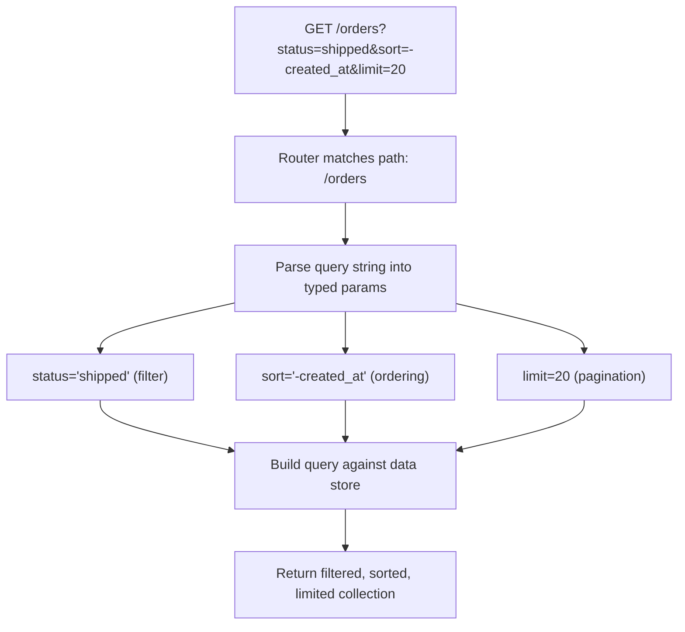

# Query Parameters

## Why This Matters

Almost no real endpoint returns "just the resource" — clients need to filter, sort, paginate, search, and select fields. Query parameters are the standard, cacheable, bookmarkable way to express all of that without inventing new endpoints for every combination of options. An API with a clean, predictable query parameter design feels effortless to integrate with; one without it forces clients to over-fetch, under-fetch, or build brittle client-side workarounds.

## Core Concept

A **query parameter** is a key-value pair appended to a URL after a `?`, used to modify *how* a request against a resource or collection behaves — without changing *which* resource is being addressed. In `/orders?status=shipped&limit=20`, the path (`/orders`) identifies the collection; the query string narrows and shapes what's returned from it.

Query parameters are inherently optional and order-independent: a well-designed endpoint should work with zero query parameters (sensible defaults) and behave predictably no matter what order the parameters appear in.

## Mental Model

If the path is "which aisle of the store," the query string is "what I'm asking the clerk for once I'm standing in that aisle": "the ones under $20," "sorted by rating," "only show me 10." The aisle doesn't change based on what you ask for — you're always in the same section of the store — but the specific stuff handed back to you does.

## How It Works

Query parameters generally fall into a few recurring categories, and it helps to design them by category rather than ad hoc:

- **Filtering** — narrow the collection: `?status=shipped`, `?category=electronics&min_price=10`. See [Filtering and Sorting](filtering-and-sorting.md) for full syntax design.
- **Sorting** — control result order: `?sort=-created_at`.
- **Pagination** — control which page/slice of results: `?page=2&per_page=20` or `?cursor=eyJpZCI6NDgyfQ`. See [Pagination](pagination.md).
- **Field selection** — reduce payload size: `?fields=id,name,status`.
- **Search** — free-text query: `?q=blue+mug`.
- **Expansion/embedding** — include related resources inline to avoid extra round trips: `?expand=customer`.

Query parameters are always strings on the wire; your framework is responsible for parsing them into the right types (`limit=20` becomes the integer `20`) and validating them (rejecting `limit=-5` or `limit=abc`). Because query parameters are optional, every one of them needs a sensible default, and your API needs to document what happens when a client omits, repeats (`?tag=a&tag=b`), or supplies an invalid value for each one.

**Repeated keys** are a genuine ambiguity in HTTP — there's no single standard for how `?tag=a&tag=b` should be interpreted. Some frameworks give you a list `["a", "b"]` automatically; others only keep the last value. Pick one convention (repeated keys = list) and document it, or use an explicit comma-separated form (`?tags=a,b`) to sidestep the ambiguity entirely — comma-separated is often easier for clients to reason about and log.

## Architecture



## Request / Response Example

```http
GET /orders?status=shipped&sort=-created_at&limit=2&fields=id,status,total_cents HTTP/1.1
Host: api.example.com
Accept: application/json
```

```http
HTTP/1.1 200 OK
Content-Type: application/json

{
  "data": [
    { "id": 482, "status": "shipped", "total_cents": 4999 },
    { "id": 479, "status": "shipped", "total_cents": 2100 }
  ],
  "meta": {
    "count": 2,
    "filters_applied": { "status": "shipped" },
    "sort": "-created_at"
  }
}
```

An invalid parameter value should return a `400`, not silently ignore the bad input:

```http
GET /orders?limit=abc HTTP/1.1
Host: api.example.com
```

```http
HTTP/1.1 400 Bad Request
Content-Type: application/json

{
  "error": "invalid_query_parameter",
  "message": "'limit' must be a positive integer, got 'abc'"
}
```

## Code Example

```python
from fastapi import APIRouter, Query
from typing import Optional

router = APIRouter()

@router.get("/orders")
def list_orders(
    status: Optional[str] = Query(
        None, description="Filter by order status", pattern="^(pending|shipped|cancelled)$"
    ),
    sort: str = Query("-created_at", description="Field to sort by, prefix '-' for descending"),
    limit: int = Query(20, ge=1, le=100, description="Max results per page"),
    fields: Optional[str] = Query(None, description="Comma-separated list of fields to return"),
):
    # FastAPI validates types/ranges/patterns before this code runs:
    # bad `status` values or non-integer `limit` are rejected with a 422
    # automatically, with no manual parsing needed here.
    requested_fields = fields.split(",") if fields else None

    orders = fetch_orders(status=status, sort=sort, limit=limit)  # your data layer

    if requested_fields:
        orders = [{k: o[k] for k in requested_fields if k in o} for o in orders]

    return {"data": orders, "meta": {"count": len(orders), "sort": sort}}


def fetch_orders(status, sort, limit):
    # Placeholder for real query logic (SQL, ORM, etc.)
    return [{"id": 482, "status": "shipped", "total_cents": 4999, "created_at": "2026-08-10"}]
```

## Production Considerations

- Validate and cap every numeric query parameter (`limit`, `page`) server-side — never trust a client-supplied `limit=1000000` to be reasonable; enforce a hard max and return the capped result (or a `400`) rather than trying to serve it.
- Query parameters affect cache keys: `/orders?status=shipped` and `/orders?status=pending` are different cache entries. Be deliberate about which parameter combinations you expect to be hit often enough to matter for caching (see [Part 7 — Caching & Performance](../07-caching-performance/README.md)).
- Document every query parameter's default value explicitly — "what happens if this is omitted" is one of the most common integration questions, and it belongs in your OpenAPI spec (see [API Contracts](api-contracts.md)), not just in a wiki page.
- Be consistent about naming style across the whole API (`created_at` vs `createdAt`) — see [Naming Conventions](naming-conventions.md).

## Common Mistakes

- Silently ignoring unknown or malformed query parameters instead of returning a `400` — this masks typos (`?statuss=shipped`) that silently return unfiltered results, which is a debugging nightmare for API consumers.
- Using query parameters to identify a specific resource instead of a path parameter (e.g., `/orders?id=482` instead of `/orders/482`) — this breaks caching semantics and resource addressability.
- Not capping `limit`/`per_page`, allowing a client to request an unbounded amount of data and overload the server or the response payload.
- Inconsistent filter operators across endpoints — e.g., `min_price` on one endpoint and `price_gte` on another for the same kind of comparison.

## Best Practices

- Use path parameters for "which resource," query parameters for "how to shape/filter the response" — never blur the two.
- Give every query parameter a documented default and validate it server-side with explicit bounds.
- Prefer comma-separated values over repeated keys for list-like parameters to avoid framework-dependent parsing ambiguity.
- Keep parameter naming and casing consistent across your entire API surface.

## AI Engineering Perspective

Query parameters are how AI APIs expose optional behavior without bloating the URL path. A RAG retrieval endpoint might accept `GET /search?q=refund+policy&top_k=5&min_score=0.7` — the query itself, the number of results, and a relevance threshold are all "how to shape the response," not "which resource." An LLM gateway's `GET /conversations?model=claude&since=2026-08-01` filters conversation history the same way an e-commerce API filters orders. The design discipline is identical: validate `top_k` has a sane max (you don't want a client requesting `top_k=100000` against your vector database), and document defaults clearly since AI API consumers are often tuning these values experimentally.

## Exercises

**Beginner**: Design query parameters for a `/products` endpoint supporting filtering by category and price range, and sorting by price or rating.

**Intermediate**: Write the FastAPI route for `/articles` supporting `q` (search), `tag` (repeatable filter), `sort`, and `limit`/`offset` pagination, with validation on each.

**Advanced**: A client reports that `/orders?limit=1000` returns only 100 results with no error. Diagnose whether this is a bug or intended behavior, and redesign the API contract (and response) to make the behavior unambiguous to callers.

## Key Takeaways

- Query parameters shape *how* a request against a resource behaves; they never identify *which* resource is being addressed — that's the path's job.
- Validate type, format, and bounds for every query parameter server-side, and reject invalid values with a `400` rather than silently ignoring them.
- Give every parameter a documented, sensible default so omitting it behaves predictably.
- Consistent naming and operator conventions across endpoints reduce integration friction dramatically.

See also: [Path Parameters](path-parameters.md), [Filtering and Sorting](filtering-and-sorting.md), [Pagination](pagination.md).
