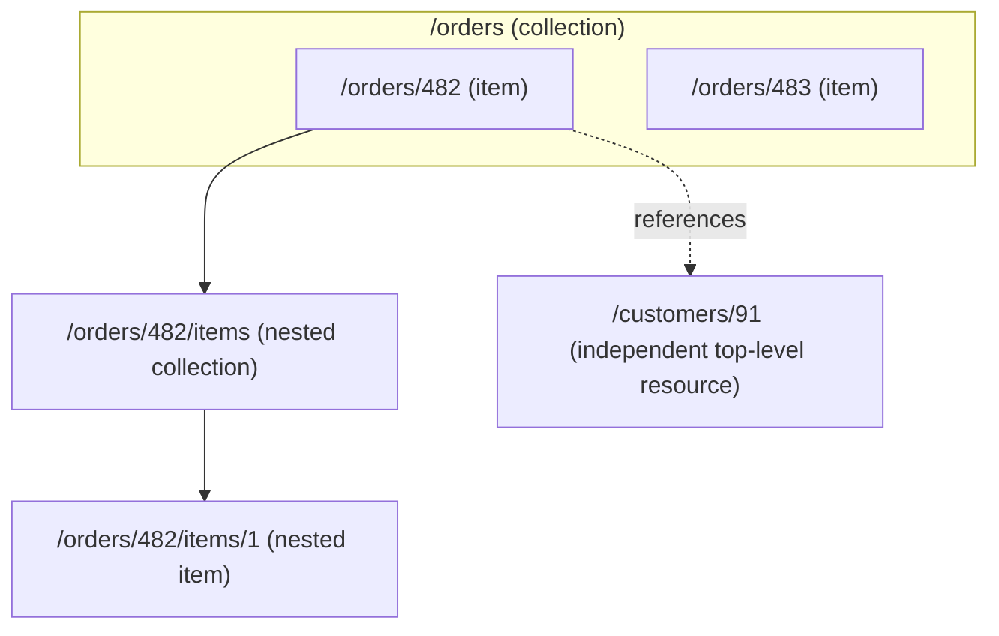

# Resources and Endpoints

## Why This Matters

Every design decision in a REST API flows from one question: "what is a resource here?" Get this right and your endpoints, HTTP methods, status codes, and even your database schema tend to fall into place naturally. Get it wrong — model your API around actions instead of things — and you end up with an RPC-in-disguise API that fights the HTTP toolchain (caching, method semantics, status codes) at every turn instead of using it.

## Core Concept

A **resource** is a noun: a thing your API exposes and lets clients create, read, update, or delete. Users, orders, invoices, messages, documents — these are resources. An **endpoint** is the URL path that identifies a resource or a collection of resources, combined with an HTTP method that says what to do with it.

The foundational REST design rule is: **URLs identify things, HTTP methods describe actions on those things.** `/orders/482` is a thing. `GET` on that URL reads it, `DELETE` removes it, `PATCH` updates it. You never need a URL like `/getOrder` or `/deleteOrder482` — the verb already lives in the HTTP method, so putting it in the URL too is redundant and, worse, invites inconsistency (`/getOrder` vs `/fetch-order` vs `/order/fetch`).

## Mental Model

Think of your API as a filesystem of nouns. `/orders` is a folder containing order resources. `/orders/482` is one specific file in that folder. `/orders/482/items` is a folder *inside* that file, containing the line items that belong to order 482. You navigate this tree with HTTP methods instead of `cd`, `cat`, `rm`, and `touch` — but the tree structure itself, and the discipline of naming every node after the *thing* it represents, is the same idea.

## How It Works

There are two endpoint shapes for every resource type: the **collection** and the **item**.

- **Collection endpoint**: `/orders` — represents the set of all orders (or a filtered/paginated subset). `GET /orders` lists them. `POST /orders` creates a new one.
- **Item endpoint**: `/orders/482` — represents one specific order. `GET /orders/482` reads it. `PUT`/`PATCH /orders/482` updates it. `DELETE /orders/482` removes it.

Resource modeling is the exercise of deciding what counts as a top-level resource, what counts as a nested sub-resource, and what's just a field on an existing resource rather than its own endpoint.

**Choosing what's a resource**: ask "does this thing have its own identity, lifecycle, and need to be fetched/referenced independently?" An order's `status` field is not its own resource — it's a property you update via `PATCH /orders/482`. An order's `items` might be its own resource if items can be added/removed/queried independently: `/orders/482/items`. A `customer` referenced by an order almost certainly is its own resource — `/customers/91` — because customers exist independently of any one order and are shared across many orders.

**Nesting**: a resource is nested under a parent when it can't exist without that parent (an order's `line-item` doesn't make sense outside the order it belongs to). A resource that *can* exist independently — like a customer — should generally be a top-level resource, even if orders reference it, to avoid deeply nested, hard-to-reuse URLs. (See [Naming Conventions](naming-conventions.md) for nesting-depth guidance.)

## Architecture



The order's line items are nested because they have no independent identity outside the order. The customer is referenced, not nested, because it exists on its own and is shared across many orders.

## Request / Response Example

```http
GET /orders/482 HTTP/1.1
Host: api.example.com
Accept: application/json
```

```http
HTTP/1.1 200 OK
Content-Type: application/json

{
  "id": 482,
  "status": "pending",
  "customer_id": 91,
  "items_url": "/orders/482/items",
  "total_cents": 15499
}
```

```http
POST /orders/482/items HTTP/1.1
Host: api.example.com
Content-Type: application/json

{
  "sku": "MUG-BLUE-01",
  "quantity": 2,
  "unit_price_cents": 1299
}
```

```http
HTTP/1.1 201 Created
Content-Type: application/json
Location: /orders/482/items/17

{
  "id": 17,
  "order_id": 482,
  "sku": "MUG-BLUE-01",
  "quantity": 2,
  "unit_price_cents": 1299
}
```

## Code Example

```python
from fastapi import APIRouter, HTTPException
from pydantic import BaseModel

router = APIRouter(prefix="/orders", tags=["orders"])

class Item(BaseModel):
    sku: str
    quantity: int
    unit_price_cents: int

# Collection endpoint: represents ALL orders
@router.get("/")
def list_orders():
    return {"data": [{"id": 482, "status": "pending"}]}

# Item endpoint: represents ONE order, identified by a path parameter
@router.get("/{order_id}")
def get_order(order_id: int):
    if order_id != 482:
        raise HTTPException(status_code=404, detail="Order not found")
    return {"id": order_id, "status": "pending", "customer_id": 91}

# Nested collection: items only make sense within an order
@router.post("/{order_id}/items", status_code=201)
def add_item(order_id: int, item: Item):
    # In practice: verify order_id exists, persist item, return with location.
    new_item = item.model_dump()
    new_item["id"] = 17
    new_item["order_id"] = order_id
    return new_item
```

## Production Considerations

- Keep resource shapes stable across an API — if `/orders/{id}` returns a `status` field, every order-related response that includes an order should use the same field name and value set. Inconsistency here is one of the top sources of integration bugs.
- Design resources around what clients need to do, not around your database tables. A resource can aggregate multiple tables (e.g., an `order` resource might join `orders`, `order_status_history`, and `shipping_info` tables) — the API shape and the storage shape are allowed to diverge.
- Avoid "God resources" that try to represent everything about an entity in one giant payload. Split large, independently-fetched sub-objects into their own endpoints (e.g., `/orders/482/invoice` instead of embedding a huge invoice PDF-metadata blob in every order response).

## Common Mistakes

- Action-based URLs: `/orders/482/cancelOrder` instead of updating a `status` field via `PATCH /orders/482` (or, when an action has real side effects and isn't a pure state update, a dedicated sub-resource like `POST /orders/482/cancellations`).
- Mixing singular and plural nouns for different resources, or inconsistent casing (`/Order/482` vs `/orders/482`).
- Modeling a field as an endpoint of its own without justification (e.g., `/orders/482/status` as a whole separate resource, when a `PATCH` to the order would be simpler for most cases).
- Deeply nesting resources that could stand alone, producing URLs like `/customers/91/orders/482/items/17/reviews/3` that are painful for clients to construct and cache.

## Best Practices

- Use plural nouns for collections consistently (`/orders`, not `/order`) — see [Naming Conventions](naming-conventions.md) for the full rationale.
- Prefer flat top-level resources for anything with independent identity (customers, products, users); nest only what genuinely can't exist without its parent.
- Keep collection and item endpoint response shapes consistent — an item in a list response and the same item fetched individually should have the same field names (the list version may simply omit some heavy fields).
- When in doubt, ask: "would a client ever want to fetch or reference this thing directly, outside its parent?" If yes, give it a top-level (or at least independently addressable) URL.

## AI Engineering Perspective

This same discipline applies directly to AI APIs. In a RAG system (see [Part 16](../16-rag-apis/README.md)), `documents`, `chunks`, and `embeddings` are natural resources: `/documents/{id}` for the source file, `/documents/{id}/chunks` for its derived chunks (nested, because chunks don't exist independently of a document), and potentially a top-level `/collections/{id}` resource representing a vector index that many documents belong to. In an agent API ([Part 17](../17-ai-agents-and-mcp/README.md)), a `conversation` is a top-level resource, and its `messages` are a nested collection — you rarely need to fetch a message without knowing which conversation it belongs to, which is exactly the signal that nesting is the right call.

## Exercises

**Beginner**: For a blogging API, decide which of these should be top-level resources vs nested: `posts`, `comments`, `authors`, `tags`. Write out the URL structure.

**Intermediate**: Take an API you've worked with that has action-style URLs (e.g., `/api/sendInvite`). Redesign it as resource-oriented URLs with appropriate HTTP methods.

**Advanced**: Design the resource model for a food-delivery API: `restaurants`, `menu items`, `orders`, `deliveries`, `drivers`. Decide nesting depth for each relationship and justify each choice using the "independent identity" test from this chapter.

## Key Takeaways

- URLs name things (nouns); HTTP methods describe actions on those things (verbs) — never duplicate the verb in the URL.
- Every resource type gets a collection endpoint (`/things`) and an item endpoint (`/things/{id}`).
- Nest a resource under a parent only when it has no independent identity outside that parent; otherwise keep it top-level.
- Consistent resource shapes across list and item responses reduce integration bugs and make your API predictable to learn.

See also: [REST Principles](rest-principles.md), [Path Parameters](path-parameters.md), [API Naming Conventions](naming-conventions.md).
