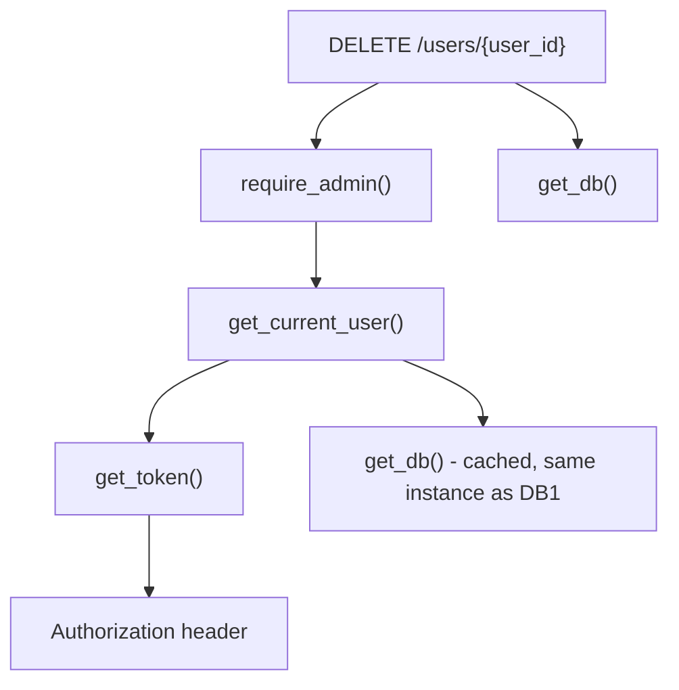

# Dependency Injection

## Why This Matters

Almost every route in a real API needs the same few things: a database session, the current authenticated user, some configuration values, maybe a rate limiter. Without a systematic way to provide these, you end up either duplicating setup code in every route or reaching for global variables — which makes testing painful (you can't easily swap a real database for a fake one) and creates hidden coupling between routes and infrastructure.

FastAPI's **dependency injection (DI)** system solves this cleanly: you declare what a route *needs*, and FastAPI provides it, resolving shared setup, teardown, and even sub-dependencies automatically.

## Core Concept

A **dependency** is just a callable (usually a function) that FastAPI calls on your behalf before running your route, and whose return value it hands to your route function as an argument. You declare a dependency with `Depends(...)`:

```python
from fastapi import Depends

def get_query_param(q: str | None = None) -> str | None:
    return q

@app.get("/search")
async def search(q: str | None = Depends(get_query_param)):
    return {"q": q}
```

That example is trivial on purpose — the real power shows up when dependencies do setup/teardown (DB sessions), enforce policy (auth), or chain into each other.

## Mental Model

Think of dependencies as a **tree that FastAPI resolves before your route runs**. Each node is a function; if a dependency itself declares its own `Depends(...)` parameters, FastAPI resolves those first, recursively, then calls your route with everything wired up. It's conceptually identical to constructor injection in other frameworks (Spring, Angular) — except in FastAPI, the "constructor" is your route function's parameter list.

Two extra properties matter:

- **Caching by default**: within a single request, if two different parts of the dependency tree depend on the *same* dependency, FastAPI calls it only once and reuses the result (unless you set `use_cache=False`).
- **`yield` dependencies** support setup/teardown, like a context manager — code before `yield` runs before your route, code after `yield` runs after the response is sent (even if your route raised an exception, for cleanup like closing a DB session).

## How It Works

### A DB session dependency (the canonical example)

```python
from sqlalchemy.orm import Session
from fastapi import Depends

def get_db():
    db = SessionLocal()  # SessionLocal is a sqlalchemy sessionmaker
    try:
        yield db          # <- everything before this line runs before the route
    finally:
        db.close()         # <- this always runs after, even on exceptions

@app.get("/orders/{order_id}")
async def get_order(order_id: int, db: Session = Depends(get_db)):
    return db.query(Order).filter(Order.id == order_id).first()
```

Every route that needs a DB session just declares `db: Session = Depends(get_db)` — no manual open/close code repeated anywhere, and no risk of leaking a connection because someone forgot to close it.

### Dependency chains (auth as a layered example)

```python
def get_token(authorization: str = Header(...)) -> str:
    if not authorization.startswith("Bearer "):
        raise HTTPException(401, "Missing bearer token")
    return authorization.removeprefix("Bearer ")

def get_current_user(token: str = Depends(get_token), db: Session = Depends(get_db)) -> User:
    user = decode_token_and_lookup_user(token, db)
    if user is None:
        raise HTTPException(401, "Invalid token")
    return user

def require_admin(user: User = Depends(get_current_user)) -> User:
    if not user.is_admin:
        raise HTTPException(403, "Admin privileges required")
    return user

@app.delete("/users/{user_id}")
async def delete_user(user_id: int, admin: User = Depends(require_admin), db: Session = Depends(get_db)):
    ...
```

Here `require_admin` depends on `get_current_user`, which depends on `get_token` and `get_db`. FastAPI resolves the whole chain automatically, and because `db` is requested independently in `delete_user` too, it's the *same* session instance (cached per-request), not a second connection.

### `Depends` at the router or app level

Dependencies don't have to be per-route. You can apply them to an entire `APIRouter` (e.g., "every route under `/admin` requires `require_admin`") or the whole app, avoiding repetition across dozens of routes. See `project-architecture.md` for how this fits into a router-based folder structure.

## Architecture



## Request / Response Example

```http
DELETE /users/91 HTTP/1.1
Host: api.example.com
Authorization: Bearer eyJhbGciOi...
```

If the token decodes to a non-admin user:

```http
HTTP/1.1 403 Forbidden
Content-Type: application/json

{"detail": "Admin privileges required"}
```

## Code Example

```python
# dependencies.py
from collections.abc import Generator
from fastapi import Depends, Header, HTTPException
from sqlalchemy.orm import Session
from database import SessionLocal
from models import User


def get_db() -> Generator[Session, None, None]:
    """Yield-style dependency: setup before yield, teardown after."""
    db = SessionLocal()
    try:
        yield db
    finally:
        db.close()


def get_token(authorization: str = Header(default="")) -> str:
    if not authorization.startswith("Bearer "):
        raise HTTPException(status_code=401, detail="Missing or malformed Authorization header")
    return authorization.removeprefix("Bearer ").strip()


def get_current_user(
    token: str = Depends(get_token),
    db: Session = Depends(get_db),
) -> User:
    user = db.query(User).filter(User.auth_token == token).first()
    if user is None:
        raise HTTPException(status_code=401, detail="Invalid or expired token")
    return user


def require_admin(current_user: User = Depends(get_current_user)) -> User:
    if not current_user.is_admin:
        raise HTTPException(status_code=403, detail="Admin privileges required")
    return current_user


# routers/users.py
from fastapi import APIRouter, Depends
from sqlalchemy.orm import Session
from dependencies import get_db, get_current_user, require_admin
from models import User

router = APIRouter(prefix="/users", tags=["users"])


@router.get("/me")
async def read_own_profile(current_user: User = Depends(get_current_user)):
    return {"id": current_user.id, "username": current_user.username}


@router.delete("/{user_id}", status_code=204, dependencies=[Depends(require_admin)])
async def delete_user(user_id: int, db: Session = Depends(get_db)):
    # `dependencies=[Depends(require_admin)]` runs the check without
    # injecting its return value as an argument — use this when you
    # only need the side effect (authorization), not the value.
    db.query(User).filter(User.id == user_id).delete()
    db.commit()
```

## Production Considerations

- **Connection pooling**: `get_db`-style dependencies should hand out sessions from a pool (see `../04-databases-and-apis/README.md`), not open a fresh raw connection per request — that would collapse under load.
- **`yield` dependency exceptions**: cleanup code after `yield` runs even when the route raises, but exceptions raised in the cleanup itself can mask the original error — keep teardown code simple and side-effect-only (closing, releasing).
- **Testing**: DI is what makes FastAPI apps easy to test — override any dependency with `app.dependency_overrides[get_db] = get_test_db` to inject a fake database or fake auth in tests, with zero changes to route code. See `../13-api-testing/README.md`.
- **Avoid overusing dependencies** for things that aren't shared or don't need request-scoped setup — a pure utility function doesn't need to go through DI.

## Common Mistakes

- Opening a DB connection with a plain function call instead of a `yield` dependency — leaks connections when exceptions occur mid-request.
- Forgetting that dependencies are cached *per request*, not globally — each request still gets fresh setup, which is correct but sometimes surprises people expecting a singleton.
- Overusing `dependencies=[Depends(...)]` (side-effect-only) when the route actually needs the returned value — leads to redundant re-fetching of the same data inside the route body.
- Putting business logic directly inside dependency functions — dependencies should provide *resources and checks*, not implement domain logic (keep that in the service layer).

## Best Practices

- Model auth, DB sessions, and cross-cutting policy checks (rate limits, feature flags) as dependencies — that's exactly what the system is for.
- Build dependency chains that mirror your authorization hierarchy (`get_current_user` → `require_admin` → `require_superadmin`) rather than duplicating checks.
- Use `app.dependency_overrides` in tests instead of monkeypatching internals.
- Keep dependency functions small, composable, and named after what they *provide* (`get_db`, `get_current_user`) or what they *enforce* (`require_admin`).

## AI Engineering Perspective

Dependency injection is exactly how you'll manage LLM and vector-database clients in Parts 14-17. Instead of instantiating an `OpenAI()` or `AnthropicClient()` inside every route (expensive, hard to test, hard to swap), you define `get_llm_client()` and `get_vector_db_client()` as dependencies, created once at startup (via `lifespan`, see `project-architecture.md`) and injected wherever needed. This is also how you'll implement **model routing** (Part 15) — a `get_llm_client(model_name: str)` dependency can return different provider clients based on request parameters, and how you'll mock LLM calls entirely in tests by overriding the dependency with a fake client that returns canned responses instead of making real, costly API calls.

## Exercises

**Beginner**
1. Write a `get_settings()` dependency that returns an app-config object, and inject it into two different routes.

**Intermediate**
2. Build a `get_current_user` dependency that reads an `X-API-Key` header, looks it up against a dict of valid keys, and raises `401` if missing/invalid. Use it in three routes.

**Advanced**
3. Build a three-level dependency chain: `get_db` → `get_current_user` (depends on `get_db`) → `require_role(role: str)` (a dependency *factory* that returns a dependency checking for a specific role). Wire `require_role("editor")` into one route and `require_role("admin")` into another.

## Key Takeaways

- `Depends(...)` lets routes declare what they need; FastAPI resolves the whole dependency tree, including sub-dependencies, automatically.
- `yield`-based dependencies provide clean setup/teardown — the standard pattern for DB sessions and other resources.
- Dependencies are cached per-request by default, avoiding redundant work when multiple parts of the tree need the same resource.
- `app.dependency_overrides` is the main lever for testing FastAPI apps in isolation.
- See the full working version in `../../examples/fastapi-crud/`.

Previous: `response-models.md` · Next: `middleware.md`.
