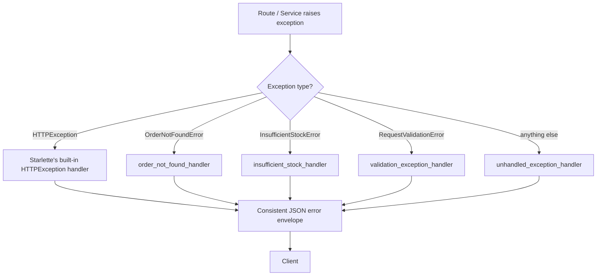

# Exception Handling

## Why This Matters

Things go wrong: a resource doesn't exist, a client sends invalid data, a downstream database times out, a third-party API (including LLM providers) returns an error. What separates a professional API from a hobby project is not whether errors happen — they always will — but whether every error produces a **consistent, predictable, well-shaped response** that clients can parse and handle programmatically, instead of a raw stack trace or an inconsistent one-off JSON shape per endpoint.

## Core Concept

FastAPI gives you two complementary tools:

1. **`HTTPException`** — raise this anywhere in your route or dependency code to immediately short-circuit with a specific status code and detail message.
2. **Custom exception handlers** (`@app.exception_handler(SomeExceptionType)`) — register a handler once for a given exception class, and FastAPI will route *any* uncaught exception of that type (or subclass), from anywhere in your app, through it — turning ad-hoc `try/except` blocks scattered across routes into one centralized place that decides how that error looks on the wire.

Together, these let you separate "what went wrong" (raised as a specific, meaningful exception close to where it happened) from "how it should look to the client" (decided once, centrally, consistently).

## Mental Model

Think of exception handling in FastAPI as a **routing table for errors**, symmetrical to your routing table for URLs. Just as `GET /orders/{id}` maps to a specific function, `OrderNotFoundError` maps to a specific handler function that builds the HTTP response. Your business logic should raise *meaningful, domain-specific* exceptions (`OrderNotFoundError`, `InsufficientStockError`) — not decide HTTP status codes deep in a service function. The exception handler layer is where domain errors get translated into HTTP.

## How It Works

### `HTTPException` — the direct, simple path

```python
from fastapi import HTTPException

@app.get("/orders/{order_id}")
async def get_order(order_id: int):
    order = find_order(order_id)
    if order is None:
        raise HTTPException(status_code=404, detail="Order not found")
    return order
```

Good for straightforward, route-local errors. Gets noisy if repeated everywhere and doesn't scale well to layered architectures (see `project-architecture.md`) where the *service* layer, not the route, usually detects the error.

### Custom domain exceptions + centralized handlers

```python
# exceptions.py
class OrderNotFoundError(Exception):
    def __init__(self, order_id: int):
        self.order_id = order_id


class InsufficientStockError(Exception):
    def __init__(self, product_id: int, requested: int, available: int):
        self.product_id = product_id
        self.requested = requested
        self.available = available
```

```python
# main.py
from fastapi import FastAPI, Request
from fastapi.responses import JSONResponse
from exceptions import OrderNotFoundError, InsufficientStockError

app = FastAPI()

@app.exception_handler(OrderNotFoundError)
async def order_not_found_handler(request: Request, exc: OrderNotFoundError):
    return JSONResponse(
        status_code=404,
        content={"error": {"code": "order_not_found", "message": f"Order {exc.order_id} not found"}},
    )

@app.exception_handler(InsufficientStockError)
async def insufficient_stock_handler(request: Request, exc: InsufficientStockError):
    return JSONResponse(
        status_code=409,
        content={
            "error": {
                "code": "insufficient_stock",
                "message": f"Requested {exc.requested} of product {exc.product_id}, only {exc.available} available",
            }
        },
    )
```

Now, a service function three layers deep can simply `raise OrderNotFoundError(order_id)`, and every route that calls it, anywhere in the app, gets the correct `404` with a consistent shape — with zero repeated `try/except` blocks.

### A consistent error envelope

Professional APIs use one JSON *shape* for all errors, regardless of cause:

```json
{"error": {"code": "insufficient_stock", "message": "...", "request_id": "..."}}
```

This lets client SDKs parse `error.code` programmatically (for retry logic, user-facing messages) instead of pattern-matching on free-text `detail` strings.

### Overriding the built-in validation error handler

FastAPI's default `422` shape (from Pydantic) is verbose and doesn't match a custom envelope. You can override it globally:

```python
from fastapi.exceptions import RequestValidationError

@app.exception_handler(RequestValidationError)
async def validation_exception_handler(request: Request, exc: RequestValidationError):
    return JSONResponse(
        status_code=422,
        content={"error": {"code": "validation_error", "message": "Invalid request", "details": exc.errors()}},
    )
```

### A catch-all safety net

```python
@app.exception_handler(Exception)
async def unhandled_exception_handler(request: Request, exc: Exception):
    # Log full traceback internally, but NEVER leak internals to the client.
    logger.exception("Unhandled exception", extra={"path": request.url.path})
    return JSONResponse(
        status_code=500,
        content={"error": {"code": "internal_error", "message": "An unexpected error occurred"}},
    )
```

## Architecture



## Request / Response Example

```http
POST /orders HTTP/1.1
Host: api.example.com
Content-Type: application/json

{"product_id": 12, "quantity": 500}
```

```http
HTTP/1.1 409 Conflict
Content-Type: application/json

{
  "error": {
    "code": "insufficient_stock",
    "message": "Requested 500 of product 12, only 30 available"
  }
}
```

## Code Example

```python
# exceptions.py
class AppError(Exception):
    """Base class for all domain exceptions in this app."""


class OrderNotFoundError(AppError):
    def __init__(self, order_id: int):
        self.order_id = order_id
        super().__init__(f"Order {order_id} not found")


class InsufficientStockError(AppError):
    def __init__(self, product_id: int, requested: int, available: int):
        self.product_id = product_id
        self.requested = requested
        self.available = available
        super().__init__("Insufficient stock")


# error_handlers.py
import logging
from fastapi import FastAPI, Request
from fastapi.exceptions import RequestValidationError
from fastapi.responses import JSONResponse
from exceptions import OrderNotFoundError, InsufficientStockError

logger = logging.getLogger("api.errors")


def register_exception_handlers(app: FastAPI) -> None:
    @app.exception_handler(OrderNotFoundError)
    async def order_not_found(request: Request, exc: OrderNotFoundError):
        return JSONResponse(
            status_code=404,
            content={"error": {"code": "order_not_found", "message": str(exc)}},
        )

    @app.exception_handler(InsufficientStockError)
    async def insufficient_stock(request: Request, exc: InsufficientStockError):
        return JSONResponse(
            status_code=409,
            content={
                "error": {
                    "code": "insufficient_stock",
                    "message": str(exc),
                    "available": exc.available,
                    "requested": exc.requested,
                }
            },
        )

    @app.exception_handler(RequestValidationError)
    async def validation_error(request: Request, exc: RequestValidationError):
        return JSONResponse(
            status_code=422,
            content={"error": {"code": "validation_error", "message": "Invalid request", "details": exc.errors()}},
        )

    @app.exception_handler(Exception)
    async def unhandled(request: Request, exc: Exception):
        request_id = getattr(request.state, "request_id", None)
        logger.exception("Unhandled exception", extra={"request_id": request_id})
        return JSONResponse(
            status_code=500,
            content={"error": {"code": "internal_error", "message": "An unexpected error occurred", "request_id": request_id}},
        )


# main.py
from fastapi import FastAPI
from error_handlers import register_exception_handlers
from exceptions import OrderNotFoundError, InsufficientStockError

app = FastAPI()
register_exception_handlers(app)


def get_order_or_raise(order_id: int):
    order = {}.get(order_id)  # placeholder lookup
    if order is None:
        raise OrderNotFoundError(order_id)
    return order


@app.get("/orders/{order_id}")
async def get_order(order_id: int):
    return get_order_or_raise(order_id)  # handler decides the HTTP shape, not this route
```

## Production Considerations

- **Never leak internals**: stack traces, SQL fragments, and file paths must never reach a client response — log them server-side (Part 12: Observability) and return a generic message plus a `request_id` the user can report.
- **Correlate errors with request IDs**: combine this with the middleware chapter (`middleware.md`) so every error response includes a `request_id` you can grep in logs.
- **Distinguish 4xx from 5xx rigorously**: 4xx means "the client did something the API doesn't accept" (retryable only after the client changes something); 5xx means "we failed" (often safe to retry as-is — see `../06-production-reliability/README.md` for retries and backoff).
- **Don't catch `Exception` inside routes** to "handle" errors locally — that's what the centralized handler is for; local `try/except` should only be used for genuinely local recoverable cases.

## Common Mistakes

- Returning different error JSON shapes from different routes — makes client-side error handling fragile and inconsistent.
- Using `HTTPException` for what is really a domain error caught deep in a service layer, forcing you to import FastAPI types into business logic that shouldn't know about HTTP at all.
- Forgetting to register a catch-all `Exception` handler — an unhandled error then falls through to FastAPI's default behavior, which in production (`debug=False`) returns a bare `{"detail": "Internal Server Error"}`, but in `debug=True` can leak a full traceback to clients.
- Swallowing exceptions silently in middleware or dependencies instead of letting them propagate to the handler chain.

## Best Practices

- Define a small hierarchy of domain exceptions (`AppError` base class, then specific subclasses) — keeps business logic decoupled from HTTP concerns.
- Centralize all exception-to-response mapping in one module (`error_handlers.py`), registered once at startup.
- Standardize on one error envelope shape (`{"error": {"code", "message", ...}}`) across the entire API — document it as part of your API contract (`../02-rest-api-design/README.md`).
- Always include a machine-readable `code` field, not just a human-readable `message` — clients build logic against codes, not prose.

## AI Engineering Perspective

This chapter's pattern maps almost directly onto AI API engineering. LLM provider SDKs raise their own exception hierarchies (rate limit errors, timeout errors, content-policy errors, context-length-exceeded errors). In Part 14 and Part 15, you'll register handlers for these exact exception types — e.g., a handler for `RateLimitError` that returns a consistent `429` with a `Retry-After` header, or a handler for a provider timeout that returns a `503` with a `code: "llm_provider_unavailable"` — so that no matter which provider is behind your `/chat` endpoint (OpenAI, Anthropic, a local model), your API's client-facing error shape stays identical. This is also foundational for building a **multi-provider LLM gateway** (Part 15): the gateway can catch a provider-specific error, translate it into your own domain exception (`LLMProviderError`), and fail over to a second provider — all invisible to the API's error-handling contract.

## Exercises

**Beginner**
1. Define a `ProductNotFoundError` exception and a matching `@app.exception_handler` that returns `404` with a `{"error": {"code": "product_not_found", ...}}` body.

**Intermediate**
2. Add a catch-all `Exception` handler that logs the traceback and returns a generic `500` response, and verify (by deliberately raising a `ZeroDivisionError` in a test route) that no traceback leaks to the client.

**Advanced**
3. Build an `AppError` base class with subclasses for at least three different domain errors, each mapping to a different HTTP status code, and a single generic handler registered on `AppError` (not each subclass individually) that inspects the exception type to pick the right status code and error code.

## Key Takeaways

- Raise specific domain exceptions close to where errors are detected; map them to HTTP responses centrally via `@app.exception_handler`.
- Standardize one JSON error envelope shape across your entire API.
- Always register a catch-all `Exception` handler to prevent leaking stack traces in production.
- Correlate error responses with request IDs from your middleware layer for debuggability.
- See the full working version in `../../examples/fastapi-crud/`.

Previous: `middleware.md` · Next: `project-architecture.md`.
