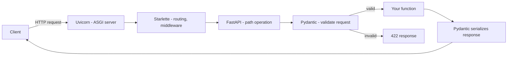

# FastAPI Fundamentals

## Why This Matters

Part 2 taught you how to *design* a REST API — resources, methods, status codes, contracts. Now you need to actually *build* one. You could use Flask, Django REST Framework, Express, or raw ASGI, but this handbook uses **FastAPI** because it solves the three biggest pain points of API development in one framework: validation, documentation, and performance — without forcing you to write boilerplate for any of them.

If you've ever shipped an API by hand-parsing JSON bodies, writing `if` statements to check required fields, and manually keeping a Postman collection in sync with your code, you already know the problem FastAPI solves. Every one of those manual steps is a place where bugs hide and documentation goes stale.

## Core Concept

FastAPI is a modern Python web framework for building APIs, built on top of two lower-level pieces:

- **Starlette** — handles the actual ASGI web layer: routing, requests, responses, middleware, WebSockets.
- **Pydantic** — handles data validation, parsing, and serialization using Python type hints.

FastAPI's core idea is: **your Python type hints are the source of truth**. You declare a function parameter as `age: int`, and FastAPI automatically validates incoming data, converts types, generates documentation, and gives you editor autocomplete — all from that one annotation.

## Mental Model

Think of a FastAPI **path operation** (a route handler) as a contract with three parts:

1. **Input contract** — the function's parameters (path params, query params, body models) describe exactly what a valid request looks like.
2. **Processing** — your function body, which can be sync or async.
3. **Output contract** — the return value (optionally shaped by a `response_model`) describes exactly what a valid response looks like.

FastAPI sits at the boundary and enforces both contracts automatically, rejecting anything that doesn't match with a structured `422 Unprocessable Entity` error — before your business logic ever runs.

## How It Works

### ASGI vs WSGI, briefly

Older Python web frameworks (Flask, Django's classic mode) are built on **WSGI** (Web Server Gateway Interface) — a synchronous, one-request-at-a-thread interface. WSGI has no native concept of `async`/`await`, WebSockets, or long-lived streaming connections.

**ASGI** (Asynchronous Server Gateway Interface) is WSGI's spiritual successor. It supports async request handling natively, so a single worker process can juggle thousands of in-flight requests that are waiting on I/O (database calls, HTTP calls to other services, LLM API calls) without blocking. FastAPI is built for ASGI and runs under an ASGI server like **Uvicorn** or **Hypercorn**.

This matters a lot in later parts: WebSockets (Part 9), streaming LLM responses (Part 14), and async job processing (Part 8) all depend on ASGI's ability to hold many concurrent connections cheaply.

### `async def` vs `def` routes

FastAPI lets you define a path operation either way, and it's a common source of confusion:

- `async def` — runs directly on the event loop. Use this when everything inside is `await`-able (async DB drivers, `httpx.AsyncClient`, async LLM SDKs). If you accidentally call blocking code (e.g., `time.sleep`, a sync `requests.get`) inside an `async def` route, you **block the entire event loop** — every other concurrent request stalls.
- `def` (sync) — FastAPI automatically runs it in a separate thread pool (via Starlette's `run_in_threadpool`), so blocking calls don't freeze the event loop. Simpler to reason about, but each request consumes a worker thread, which doesn't scale as far under high concurrency.

**Rule of thumb:** if your route only calls async-native libraries, use `async def`. If it calls a blocking/synchronous library you can't avoid (some ORMs, some SDKs), use plain `def` and let FastAPI's thread pool absorb it.

### Automatic docs

Because every route's inputs and outputs are typed, FastAPI can introspect your entire application and generate an **OpenAPI schema** (a JSON document describing every endpoint, parameter, and model) without you writing a line of documentation. From that schema it serves two interactive UIs for free: Swagger UI at `/docs` and ReDoc at `/redoc`. We go deep on this in `openapi-documentation.md`.

## Architecture



## Request / Response Example

```http
GET /items/42?include_reviews=true HTTP/1.1
Host: api.example.com
Accept: application/json
```

```http
HTTP/1.1 200 OK
Content-Type: application/json

{
  "id": 42,
  "name": "Wireless Mouse",
  "price": 24.99,
  "in_stock": true
}
```

If the path parameter isn't a valid integer:

```http
GET /items/not-a-number HTTP/1.1
Host: api.example.com
```

```http
HTTP/1.1 422 Unprocessable Entity
Content-Type: application/json

{
  "detail": [
    {
      "type": "int_parsing",
      "loc": ["path", "item_id"],
      "msg": "Input should be a valid integer, unable to parse string as an integer",
      "input": "not-a-number"
    }
  ]
}
```

## Code Example

```python
# main.py
from fastapi import FastAPI, Query
from pydantic import BaseModel

app = FastAPI(
    title="Inventory API",
    description="A minimal FastAPI app demonstrating fundamentals",
    version="1.0.0",
)


class Item(BaseModel):
    id: int
    name: str
    price: float
    in_stock: bool = True


# Pretend this is a database.
FAKE_DB: dict[int, Item] = {
    42: Item(id=42, name="Wireless Mouse", price=24.99),
}


@app.get("/items/{item_id}", response_model=Item)
async def get_item(item_id: int, include_reviews: bool = Query(default=False)):
    """
    Path param `item_id` is coerced to int automatically.
    Query param `include_reviews` defaults to False if absent.
    async def is fine here because there's no blocking I/O yet.
    """
    item = FAKE_DB.get(item_id)
    if item is None:
        # Raising HTTPException is covered in exception-handling.md
        from fastapi import HTTPException
        raise HTTPException(status_code=404, detail="Item not found")
    return item


@app.get("/items", response_model=list[Item])
def list_items():
    """
    Plain `def` route. FastAPI runs this in a worker thread pool.
    Fine for CPU-light, non-async-aware logic.
    """
    return list(FAKE_DB.values())


# Run with: uvicorn main:app --reload
```

## Production Considerations

- **Never run `uvicorn --reload` in production.** Use `uvicorn main:app --workers 4` behind a process manager (or Gunicorn with the `UvicornWorker` class), and put a reverse proxy (Nginx, or a cloud load balancer) in front for TLS termination and connection buffering.
- **Pick worker count deliberately.** For CPU-bound sync routes, more workers help. For I/O-bound async routes, a smaller number of workers with high concurrency per worker is usually more efficient — measure, don't guess.
- **Mixing sync and async carelessly is the #1 FastAPI performance bug.** A single blocking call inside an `async def` route can stall every concurrent request on that worker. Profile in staging under load before shipping.
- **Startup/shutdown events** (or the modern `lifespan` context manager) are where you should open database connection pools, HTTP clients, and LLM SDK clients once — not per-request.

## Common Mistakes

- Using `async def` and then calling a blocking library (e.g., a sync ORM query, `requests.get`) inside it — this silently degrades throughput under load rather than crashing, making it hard to spot in dev.
- Treating FastAPI's automatic validation as "the input is now safe for the database" — validation guarantees *shape*, not business-level safety (see `../10-api-security/README.md` for SQL injection, etc.).
- Forgetting that `def` routes run in a limited thread pool — enormous numbers of concurrent sync routes can exhaust it and cause timeouts.
- Not pinning FastAPI/Pydantic/Starlette versions — Pydantic v1 → v2 was a breaking change, and code examples online are often still v1-style.

## Best Practices

- Default to `async def` for new routes; only fall back to sync `def` when you have a genuinely blocking dependency you can't replace.
- Use type hints everywhere — they are not decoration, they are the mechanism that drives validation and docs.
- Keep path operation functions thin; push logic into service/repository layers (see `project-architecture.md`).
- Enable `/docs` in development and staging; consider disabling or protecting it in production for internal-only APIs.

## AI Engineering Perspective

Most LLM provider SDKs (OpenAI, Anthropic) ship both sync and async clients. When you build an AI-backed endpoint — say, one that calls an LLM and streams the response — you almost always want `async def` plus the SDK's async client, because a single LLM call can take seconds and you don't want that request to block others. Getting the async/sync distinction right in this chapter is exactly what makes Part 14 (AI API Engineering) and Part 15 (Production AI Systems) work — a chat-completion endpoint that accidentally uses a blocking LLM call inside `async def` will silently serialize every user's requests behind each other.

## Exercises

**Beginner**
1. Create a FastAPI app with a single `GET /health` route that returns `{"status": "ok"}`. Run it with Uvicorn and view the docs at `/docs`.
2. Add a `GET /greet/{name}` route that returns `{"message": f"Hello, {name}"}`, and observe how FastAPI validates the `name` path parameter.

**Intermediate**
3. Write two routes that do the same slow operation (`time.sleep(2)` vs `await asyncio.sleep(2)`) — one as `def`, one as `async def`. Fire five concurrent requests at each with a tool like `hey` or `ab` and compare total time.

**Advanced**
4. Deliberately call a blocking library (e.g. `time.sleep`) inside an `async def` route and load-test it against 50 concurrent requests. Observe the latency degradation, then fix it by moving the route to `def` or replacing the call with an async equivalent.

## Key Takeaways

- FastAPI derives validation, docs, and serialization from Python type hints — the types *are* the contract.
- It runs on ASGI (via Starlette), which is what enables async concurrency, WebSockets, and streaming.
- Choose `async def` for async-native I/O; choose `def` for unavoidable blocking calls, and let FastAPI's thread pool handle it.
- Automatic OpenAPI docs at `/docs` and `/redoc` come free from your type-annotated code.
- See the full working version in `../../examples/fastapi-crud/`.

Next: `request-validation-pydantic.md`.
