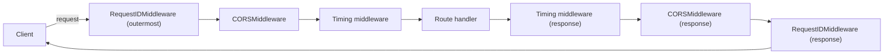

# Middleware

## Why This Matters

Some concerns don't belong to any single route — they apply to *every* request: logging, timing, CORS headers, request ID injection, compressing responses, catching unhandled exceptions before they leak stack traces. Repeating this logic in every route handler is both tedious and fragile (someone will forget). Middleware exists to wrap the entire request/response cycle in reusable, composable layers.

## Core Concept

**Middleware** in FastAPI (inherited from Starlette, which is ASGI-native) is a function or class that sits between the ASGI server and your route handlers. Every request passes *through* each registered middleware, in order, before reaching a route, and every response passes back *through* them in reverse order before reaching the client.

Conceptually, middleware wraps your entire application like layers of an onion:

```
request  → [Middleware A] → [Middleware B] → [Route] 
response ← [Middleware A] ← [Middleware B] ← [Route]
```

## Mental Model

Think of each middleware as a checkpoint on a highway on-ramp and off-ramp combined: traffic (a request) passes through the on-ramp side of every checkpoint in order on the way in, and through the off-ramp side of every checkpoint (in *reverse* order) on the way out. A middleware can inspect or modify the request before passing it on, and inspect or modify the response before passing it back — or short-circuit entirely (e.g., reject a request before it ever reaches your routes).

## How It Works

### Function-based middleware (the common case)

```python
import time
from fastapi import FastAPI, Request

app = FastAPI()

@app.middleware("http")
async def add_process_time_header(request: Request, call_next):
    start = time.perf_counter()
    response = await call_next(request)        # pass control down the chain
    duration_ms = (time.perf_counter() - start) * 1000
    response.headers["X-Process-Time-Ms"] = f"{duration_ms:.2f}"
    return response
```

`call_next(request)` is the pivot point: everything before it runs on the way *in*, everything after it runs on the way *out*. This pattern (a single async function taking `request` and `call_next`) is the simplest way to write middleware, but function-based middleware in FastAPI runs on top of Starlette's `BaseHTTPMiddleware`, which has known limitations around streaming responses — for anything performance-critical or that touches streaming (like Server-Sent Events in Part 9), prefer class-based ASGI middleware.

### Built-in middleware: CORS

Cross-Origin Resource Sharing is the most common middleware need for any API with a browser-based frontend on a different origin:

```python
from fastapi.middleware.cors import CORSMiddleware

app.add_middleware(
    CORSMiddleware,
    allow_origins=["https://app.example.com"],   # never "*" with credentials in production
    allow_credentials=True,
    allow_methods=["GET", "POST", "PUT", "PATCH", "DELETE"],
    allow_headers=["Authorization", "Content-Type"],
)
```

CORS is covered in depth (why it exists, preflight requests, the security model) in `../10-api-security/README.md` — this chapter focuses on *how* to wire it in as middleware.

### Custom class-based ASGI middleware

For middleware that needs to run reliably for *all* ASGI event types (including streaming), write a pure ASGI middleware class:

```python
class RequestIDMiddleware:
    def __init__(self, app):
        self.app = app

    async def __call__(self, scope, receive, send):
        if scope["type"] != "http":
            return await self.app(scope, receive, send)

        import uuid
        request_id = str(uuid.uuid4())

        async def send_with_header(message):
            if message["type"] == "http.response.start":
                headers = message.setdefault("headers", [])
                headers.append((b"x-request-id", request_id.encode()))
            await send(message)

        scope["state"] = {"request_id": request_id}
        await self.app(scope, receive, send_with_header)

app.add_middleware(RequestIDMiddleware)
```

### Ordering matters

Middleware registered with `add_middleware` wraps in **reverse registration order** — the *last* middleware added is the *outermost* layer (it sees the request first and the response last). This trips people up constantly. If you register `A` then `B`, the effective chain is:

```
request  → B → A → route
response ← B ← A ← route
```

So if you want request-ID generation to happen before CORS handling, register CORS first, then the request-ID middleware, so request-ID ends up outermost.

## Architecture



## Request / Response Example

```http
GET /orders HTTP/1.1
Host: api.example.com
Origin: https://app.example.com
```

```http
HTTP/1.1 200 OK
Content-Type: application/json
Access-Control-Allow-Origin: https://app.example.com
X-Request-ID: 6f2a1c9e-4b3a-4e1a-9c2d-1a2b3c4d5e6f
X-Process-Time-Ms: 4.32

[{"id": 1, "total": 39.98}]
```

## Code Example

```python
# main.py
import time
import uuid
import logging
from fastapi import FastAPI, Request
from fastapi.middleware.cors import CORSMiddleware

logger = logging.getLogger("api")
app = FastAPI()

# Registration order matters — see "How It Works" for the reverse-wrap rule.
# 1. CORS registered first -> becomes an inner layer.
app.add_middleware(
    CORSMiddleware,
    allow_origins=["https://app.example.com"],
    allow_credentials=True,
    allow_methods=["*"],
    allow_headers=["*"],
)


# 2. Function middleware registered after -> becomes an outer layer,
#    so it sees the raw request first and the final response last.
@app.middleware("http")
async def request_context(request: Request, call_next):
    request_id = str(uuid.uuid4())
    start = time.perf_counter()

    # Stash on request.state so routes/exception handlers can read it.
    request.state.request_id = request_id

    logger.info("request_started", extra={"request_id": request_id, "path": request.url.path})

    response = await call_next(request)

    duration_ms = (time.perf_counter() - start) * 1000
    response.headers["X-Request-ID"] = request_id
    response.headers["X-Process-Time-Ms"] = f"{duration_ms:.2f}"

    logger.info(
        "request_finished",
        extra={"request_id": request_id, "status_code": response.status_code, "duration_ms": duration_ms},
    )
    return response


@app.get("/orders")
async def list_orders(request: Request):
    # Access the request_id set by middleware, e.g. to include in a downstream call
    # to another service, or in a log line.
    return {"request_id": request.state.request_id, "orders": []}
```

## Production Considerations

- Every middleware adds latency to *every* request — keep middleware logic minimal and non-blocking; never do synchronous I/O inside `async def` middleware.
- `BaseHTTPMiddleware`-style (`@app.middleware("http")`) has documented issues with certain streaming response patterns; if you build streaming endpoints (SSE, chunked LLM responses in Part 14), test middleware interaction carefully or switch to pure ASGI middleware.
- Attach a **request ID** at the outermost middleware layer and propagate it through logs, downstream HTTP calls, and error responses — this is foundational for distributed tracing (Part 12).
- Never set `allow_origins=["*"]` together with `allow_credentials=True` — browsers reject it, and it's a security anti-pattern anyway.

## Common Mistakes

- Confusing registration order with execution order — remember it's reversed (last registered = outermost).
- Doing expensive work (DB queries, external API calls) inside middleware "just to log a bit more" — this runs on *every single request*, including ones that will get rejected by auth anyway.
- Catching exceptions inside custom middleware and swallowing them instead of re-raising — breaks the exception-handling pipeline described in `exception-handling.md`.
- Forgetting that CORS middleware only affects browser-originated cross-origin requests — it does nothing to protect server-to-server calls; that's a job for authentication.

## Best Practices

- Keep a small, well-understood stack: CORS, request ID/logging, and maybe compression is usually enough — resist middleware sprawl.
- Put security-relevant middleware (CORS, auth-adjacent checks) as close to the "front" (outer layer) as sensibly possible so bad requests are rejected early.
- Use `request.state` to pass data (like `request_id`) from middleware down to routes and exception handlers, rather than global variables.
- Document your middleware order explicitly in code comments — it's a common source of subtle bugs during refactors.

## AI Engineering Perspective

Middleware is where you'll implement **AI-specific cross-cutting concerns** in Part 15: a token-usage-logging middleware that records prompt/completion tokens for every AI route into your cost-tracking system, or a middleware that injects a `request_id` which you also pass along to the LLM provider as a trace/correlation ID for debugging a specific generation later. It's also a natural place to implement **AI-specific rate limiting** — since LLM calls are expensive, you often want a stricter, separate rate limit on `/ai/*` routes than on your regular CRUD routes, which you can enforce in a middleware that inspects `request.url.path`.

## Exercises

**Beginner**
1. Add a middleware that logs the HTTP method and path of every incoming request to the console.

**Intermediate**
2. Add CORS middleware allowing only `https://app.example.com`, then add a request-timing middleware, and verify (by reading response headers) which one wraps which, based on registration order.

**Advanced**
3. Write a pure ASGI class-based middleware that rejects any request whose body exceeds 1MB with a `413 Payload Too Large` response, without reading the whole body into memory first (check `content-length` header before passing control down the chain).

## Key Takeaways

- Middleware wraps the entire request/response cycle in composable layers, ideal for cross-cutting concerns like logging, timing, and CORS.
- Registration order is reversed at execution time — the last-registered middleware is the outermost layer.
- `call_next(request)` is the pivot: code before it runs on the way in, code after it runs on the way out.
- For streaming-heavy apps, prefer pure ASGI class-based middleware over `@app.middleware("http")`.
- See the full working version in `../../examples/fastapi-crud/`.

Previous: `dependency-injection.md` · Next: `exception-handling.md`.
