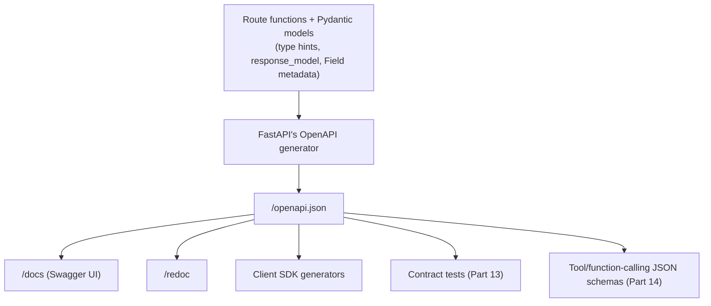

# API Documentation with OpenAPI

## Why This Matters

Undocumented APIs force consumers to read your source code or reverse-engineer behavior by trial and error — slow, error-prone, and a constant source of integration bugs. Manually maintained documentation (a wiki page, a Postman collection) drifts out of sync with the real code the moment someone adds a field and forgets to update the docs. FastAPI removes this trade-off entirely: because every route already declares its inputs and outputs as typed Pydantic models (Chapters 2 and 3 of this part), FastAPI can generate complete, accurate, always-up-to-date API documentation automatically, with zero extra effort.

## Core Concept

**OpenAPI** (formerly Swagger) is a language-agnostic specification for describing REST APIs as a single JSON/YAML document: every path, method, parameter, request body schema, response schema, and status code. FastAPI generates this document automatically from your code and type hints, exposes it at `/openapi.json`, and serves two interactive UIs on top of it for free:

- **Swagger UI** at `/docs` — interactive, lets you execute real requests against your API directly from the browser.
- **ReDoc** at `/redoc` — a clean, read-only reference view, often preferred for public-facing API documentation.

Because the schema is generated from the same code that actually runs, it is **structurally impossible** for the documentation to describe a field that doesn't exist or omit one that does — a guarantee hand-written docs can never make.

## Mental Model

Think of your FastAPI app as continuously "exporting a blueprint of itself." Every `response_model`, every Pydantic field, every path parameter type is a bolt in the machine; OpenAPI is the auto-generated blueprint listing every bolt, its size, and where it goes. You never draw the blueprint by hand — you build the machine correctly (with proper types and models) and the blueprint follows.

## How It Works

### What feeds the schema

Every piece of type information you've already written throughout this part directly shapes the generated docs:

| Your code | Appears in OpenAPI as |
|---|---|
| Path/query parameter type hints | Parameter type, required/optional |
| Pydantic request model | Request body schema |
| `response_model=` | Response schema per status code |
| `status_code=201` | Documented response status code |
| Docstring on the route function | Endpoint description in the UI |
| `Field(description=...)` | Per-field documentation |
| `tags=["orders"]` | Grouping in the Swagger UI sidebar |

### Enriching the docs

```python
from fastapi import APIRouter
from pydantic import BaseModel, Field

router = APIRouter(prefix="/orders", tags=["orders"])


class OrderOut(BaseModel):
    id: int = Field(description="Unique order identifier")
    total: float = Field(description="Order total in USD", examples=[39.98])
    status: str = Field(description="Current order status", examples=["confirmed"])


@router.get(
    "/{order_id}",
    response_model=OrderOut,
    summary="Get an order by ID",
    description="Fetches a single order. Returns 404 if the order does not exist.",
    responses={404: {"description": "Order not found"}},
)
async def get_order(order_id: int):
    """
    This docstring also appears in the Swagger UI as extended documentation
    if `description` above is not set.
    """
    ...
```

Every one of these — `summary`, `description`, `Field(description=...)`, `responses={...}` for documenting non-2xx outcomes — feeds directly into what a consumer sees at `/docs`, with no separate documentation system to maintain.

### Customizing the top-level schema

```python
from fastapi import FastAPI

app = FastAPI(
    title="Order API",
    description="Public API for managing orders and inventory.",
    version="2.1.0",
    contact={"name": "API Team", "email": "api@example.com"},
    license_info={"name": "MIT"},
    openapi_tags=[
        {"name": "orders", "description": "Create and manage customer orders"},
        {"name": "users", "description": "User account operations"},
    ],
)
```

### Fully custom OpenAPI schema (advanced)

For cases where you need to hand-adjust the generated schema (adding a global security scheme, custom `x-` extensions), override `app.openapi()`:

```python
from fastapi.openapi.utils import get_openapi

def custom_openapi():
    if app.openapi_schema:
        return app.openapi_schema  # cache it — generation has real cost

    schema = get_openapi(title=app.title, version=app.version, routes=app.routes)
    schema["components"]["securitySchemes"] = {
        "BearerAuth": {"type": "http", "scheme": "bearer", "bearerFormat": "JWT"}
    }
    schema["security"] = [{"BearerAuth": []}]
    app.openapi_schema = schema
    return app.openapi_schema

app.openapi = custom_openapi
```

### The schema as a contract, not just documentation

Because `/openapi.json` is a complete, machine-readable description of your API, it isn't just for humans reading `/docs`. It's routinely consumed by tooling:

- **Client SDK generators** (`openapi-generator`, `openapi-typescript`) turn it into typed client libraries automatically — no hand-written HTTP client code, and it can't drift from the real API.
- **Contract testing** (Part 13) can validate that your API's actual responses match the published schema, catching accidental breaking changes before release.
- **API gateways** (Part 11) can use it to configure routing and validation rules.

## Architecture



## Request / Response Example

```http
GET /openapi.json HTTP/1.1
Host: api.example.com
```

```http
HTTP/1.1 200 OK
Content-Type: application/json

{
  "openapi": "3.1.0",
  "info": {"title": "Order API", "version": "2.1.0"},
  "paths": {
    "/orders/{order_id}": {
      "get": {
        "summary": "Get an order by ID",
        "tags": ["orders"],
        "parameters": [
          {"name": "order_id", "in": "path", "required": true, "schema": {"type": "integer"}}
        ],
        "responses": {
          "200": {"description": "Successful Response", "content": {"application/json": {"schema": {"$ref": "#/components/schemas/OrderOut"}}}},
          "404": {"description": "Order not found"}
        }
      }
    }
  }
}
```

## Code Example

```python
# main.py
from contextlib import asynccontextmanager
from fastapi import FastAPI
from fastapi.openapi.utils import get_openapi
from routers import orders, users

app = FastAPI(
    title="Order API",
    description=(
        "Public REST API for managing orders, users, and inventory.\n\n"
        "All endpoints requiring authentication expect a `Bearer` token "
        "in the `Authorization` header."
    ),
    version="2.1.0",
    contact={"name": "API Platform Team", "email": "api-team@example.com"},
    openapi_tags=[
        {"name": "orders", "description": "Create and manage customer orders"},
        {"name": "users", "description": "User account operations"},
    ],
    docs_url="/docs",     # explicit, but these are also the defaults
    redoc_url="/redoc",
)

app.include_router(users.router)
app.include_router(orders.router)


def custom_openapi():
    """Add a global Bearer auth scheme to the generated schema, cached after first build."""
    if app.openapi_schema:
        return app.openapi_schema

    schema = get_openapi(
        title=app.title,
        version=app.version,
        description=app.description,
        routes=app.routes,
    )
    schema.setdefault("components", {}).setdefault("securitySchemes", {})["BearerAuth"] = {
        "type": "http",
        "scheme": "bearer",
        "bearerFormat": "JWT",
    }
    schema["security"] = [{"BearerAuth": []}]
    app.openapi_schema = schema
    return app.openapi_schema


app.openapi = custom_openapi
```

## Production Considerations

- **Decide who can see `/docs` in production.** Public APIs often keep them open deliberately as living documentation; internal-only APIs sometimes disable them (`docs_url=None, redoc_url=None`) or put them behind auth to avoid exposing internal endpoint structure.
- **Cache the generated schema** (`app.openapi_schema`) if you override `app.openapi()` — regenerating it from scratch on every `/openapi.json` request is wasted CPU, especially on large APIs.
- **Version your `info.version`** deliberately and bump it in sync with your actual API versioning strategy (`../02-rest-api-design/README.md`) — client SDK generators and contract tests both key off it.
- **Treat schema changes as API changes.** Removing a field from a `response_model`, or making an optional request field required, is a breaking change whether or not you remember to update a changelog — the OpenAPI diff between two versions is a good automated way to catch this.

## Common Mistakes

- Leaving routes and models undocumented (no `summary`, `description`, or `Field(description=...)`) and assuming the auto-generated docs are "good enough" — they're accurate but not necessarily *useful* without human-written context.
- Manually maintaining a separate Postman collection or wiki page alongside the auto-generated docs — they will drift; prefer generating Postman/Insomnia collections *from* `/openapi.json` instead.
- Regenerating a custom `app.openapi()` schema on every request without caching, adding needless latency to `/docs`.
- Exposing `/docs` publicly on an API that was never meant to be public, revealing internal-only endpoints and data shapes to anyone who requests `/openapi.json`.

## Best Practices

- Add `summary`, `description`, and `tags` to every route — the schema will always be *correct*, but only well-annotated code makes it *readable*.
- Use `Field(description=..., examples=[...])` on request/response model fields — examples in particular make Swagger UI dramatically easier to use for new integrators.
- Document non-2xx responses explicitly with `responses={404: {"description": "..."}}` — FastAPI can't infer these from your `HTTPException` calls automatically.
- Generate client SDKs and contract tests from `/openapi.json` rather than hand-writing HTTP client code against your API.

## AI Engineering Perspective

This chapter closes an important loop for Part 14 (AI API Engineering): the same Pydantic-driven JSON Schema generation that powers your OpenAPI docs is the mechanism LLM providers use for **function calling / tool calling**. A tool definition you hand to an LLM (`{"name": "get_order", "parameters": {...JSON Schema...}}`) is structurally the same artifact as an OpenAPI operation's request schema — both are just JSON Schema describing valid arguments. In practice, teams building AI agents often generate tool schemas directly from the same Pydantic models used for their FastAPI routes (`Model.model_json_schema()`), so a single well-typed model simultaneously validates HTTP requests *and* defines what a language model is allowed to call it with — one source of truth for both a human developer reading `/docs` and an LLM deciding how to call your API as a tool.

## Exercises

**Beginner**
1. Add `summary`, `description`, and `tags` to two existing routes, and confirm the improved output at `/docs`.

**Intermediate**
2. Add `Field(description=..., examples=[...])` to every field of a response model, and document a `404` response explicitly with `responses={404: {"description": "..."}}` on the route.

**Advanced**
3. Override `app.openapi()` to add a global `BearerAuth` security scheme to the generated schema (with caching), then fetch `/openapi.json` and confirm `components.securitySchemes` and `security` are present and correctly structured.

## Key Takeaways

- FastAPI generates a complete, always-accurate OpenAPI schema directly from your type hints and Pydantic models — no separate documentation to maintain.
- `/docs` (Swagger UI) and `/redoc` are free, interactive UIs built on top of that schema.
- The schema is more than documentation — it's a machine-readable contract consumable by SDK generators, contract tests, and gateways.
- `Field(description=...)`, `summary`, `tags`, and explicit `responses={...}` make auto-generated docs genuinely useful, not just technically correct.
- See the full working version in `../../examples/fastapi-crud/`.

Previous: `configuration-management.md` · Back to `README.md`.

This completes Part 3. Continue to `../04-databases-and-apis/README.md`.
