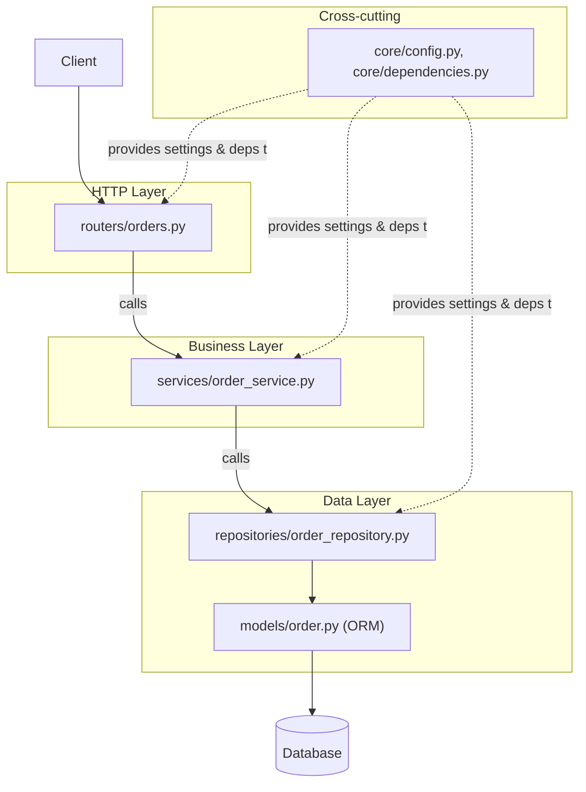

# Project Architecture

## Why This Matters

A single `main.py` with every route, model, and database call crammed into one file works fine for a weekend prototype. It stops working the moment a second person joins the project, or the third feature is added, or you need to write a test that doesn't spin up the entire app. Project architecture is about drawing boundaries — between HTTP concerns, business logic, and data access — so that each piece can be understood, tested, and changed independently.

## Core Concept

A well-architected FastAPI project separates code into layers with distinct responsibilities:

- **Routers** — define HTTP endpoints (paths, methods, request/response models). They translate HTTP into function calls and back. No business logic here.
- **Schemas** — Pydantic models for request/response validation (Part 3, Chapters 2-3).
- **Services** — business logic. Orchestrates repositories, enforces rules, raises domain exceptions. No HTTP or database-specific code here.
- **Repositories** — data access. Talks to the database (or an external API), returns plain Python/ORM objects. No business logic here.
- **Core** — cross-cutting infrastructure: configuration, security utilities, logging setup, dependency providers.

This is a variation of **layered architecture** (sometimes called "ports and adapters" or a simplified hexagonal architecture) applied specifically to FastAPI. The key discipline is the **dependency direction**: routers depend on services, services depend on repositories — never the reverse, and never skip a layer (a router should not call a repository directly).

## Mental Model

Think of it like a restaurant: the **router** is the waiter (takes the order, brings the food, never cooks). The **service** is the chef (decides how the dish is made, applies recipes/rules). The **repository** is the pantry/fridge (knows how to fetch and store raw ingredients, nothing more). If the waiter starts cooking, or the pantry starts deciding recipes, the whole kitchen becomes unpredictable. Keeping those roles separate is what keeps a growing codebase navigable.

## How It Works

### The folder tree

```
myapp/
├── main.py                      # creates the FastAPI() app, includes routers, lifespan
├── core/
│   ├── config.py                 # Settings (see configuration-management.md)
│   ├── security.py               # password hashing, JWT helpers
│   ├── logging.py                # logging setup
│   └── dependencies.py           # shared Depends() providers (get_db, get_current_user)
├── routers/
│   ├── users.py                  # APIRouter for /users
│   ├── orders.py                 # APIRouter for /orders
│   └── health.py                 # APIRouter for /health
├── schemas/
│   ├── user.py                   # UserCreate, UserOut, UserUpdate
│   └── order.py                  # OrderCreate, OrderOut
├── services/
│   ├── user_service.py           # business logic for users
│   └── order_service.py          # business logic for orders (e.g. stock checks)
├── repositories/
│   ├── user_repository.py        # DB access for users
│   └── order_repository.py       # DB access for orders
├── models/
│   ├── user.py                   # SQLAlchemy ORM model
│   └── order.py                  # SQLAlchemy ORM model
├── exceptions.py                 # domain exception classes
├── error_handlers.py             # @app.exception_handler registrations
└── tests/
    ├── test_users.py
    └── test_orders.py
```

### How a request flows through the layers

```python
# routers/orders.py
from fastapi import APIRouter, Depends
from schemas.order import OrderCreate, OrderOut
from services.order_service import OrderService
from core.dependencies import get_order_service

router = APIRouter(prefix="/orders", tags=["orders"])

@router.post("", response_model=OrderOut, status_code=201)
async def create_order(payload: OrderCreate, service: OrderService = Depends(get_order_service)):
    # Router: pure HTTP translation. No business logic.
    return await service.create_order(payload)
```

```python
# services/order_service.py
from schemas.order import OrderCreate
from repositories.order_repository import OrderRepository
from exceptions import InsufficientStockError

class OrderService:
    def __init__(self, repo: OrderRepository):
        self.repo = repo

    async def create_order(self, payload: OrderCreate):
        # Service: business rules live here.
        product = await self.repo.get_product(payload.product_id)
        if product.stock < payload.quantity:
            raise InsufficientStockError(product.id, payload.quantity, product.stock)
        return await self.repo.create_order(payload)
```

```python
# repositories/order_repository.py
from sqlalchemy.orm import Session

class OrderRepository:
    def __init__(self, db: Session):
        self.db = db

    async def get_product(self, product_id: int):
        # Repository: raw data access only. No business rules.
        return self.db.query(Product).filter(Product.id == product_id).first()

    async def create_order(self, payload):
        order = Order(**payload.model_dump())
        self.db.add(order)
        self.db.commit()
        self.db.refresh(order)
        return order
```

Notice: the router never imports `sqlalchemy`, and the repository never imports anything from `fastapi`. That's the layering discipline paying off — you could swap FastAPI for another framework, or Postgres for another database, touching only one layer.

## Architecture



## Request / Response Example

```http
POST /orders HTTP/1.1
Host: api.example.com
Content-Type: application/json

{"product_id": 5, "quantity": 2}
```

```http
HTTP/1.1 201 Created
Content-Type: application/json

{"id": 101, "product_id": 5, "quantity": 2, "status": "confirmed"}
```

The router, service, and repository each did exactly one part of producing this response, and each can be unit-tested in isolation.

## Code Example

```python
# core/dependencies.py
from fastapi import Depends
from sqlalchemy.orm import Session
from core.database import get_db
from repositories.order_repository import OrderRepository
from services.order_service import OrderService


def get_order_repository(db: Session = Depends(get_db)) -> OrderRepository:
    return OrderRepository(db)


def get_order_service(repo: OrderRepository = Depends(get_order_repository)) -> OrderService:
    # This is DI (dependency-injection.md) used to wire layers together,
    # not just to provide raw resources like DB sessions.
    return OrderService(repo)


# main.py
from contextlib import asynccontextmanager
from fastapi import FastAPI
from routers import users, orders, health
from error_handlers import register_exception_handlers
from core.logging import configure_logging


@asynccontextmanager
async def lifespan(app: FastAPI):
    # Startup: runs once before the app accepts traffic.
    configure_logging()
    yield
    # Shutdown: runs once as the app stops (close pools, flush logs, etc).


app = FastAPI(title="Order API", version="1.0.0", lifespan=lifespan)
register_exception_handlers(app)

app.include_router(health.router)
app.include_router(users.router)
app.include_router(orders.router)
```

## Production Considerations

- Use `lifespan` (not the deprecated `@app.on_event("startup")`) to initialize shared resources once: DB connection pools, HTTP clients, LLM SDK clients — never per-request.
- Keep routers thin enough that they're almost boring to read — if you find yourself writing an `if` statement with business meaning inside a router, it belongs in the service layer.
- Repositories should be swappable in tests — inject a fake/in-memory repository via `app.dependency_overrides` to unit-test services without a real database.
- As the app grows, split routers/services/repositories further by *domain* (e.g., `routers/orders/`, `routers/payments/`) rather than letting single files balloon.

## Common Mistakes

- Calling the database directly from a router "just this once" — it always becomes a pattern, and now business logic is scattered across two layers.
- Putting Pydantic schemas and SQLAlchemy models in the same file/class — they serve different purposes (API contract vs storage) and conflating them makes both harder to evolve independently.
- Skipping the service layer for "simple" CRUD and later needing to retrofit business rules (audit logging, notifications) across many routers instead of one service.
- Circular imports between layers — usually a sign the dependency direction (router → service → repository) has been violated somewhere.

## Best Practices

- Enforce the dependency direction with code review discipline (or lint rules) — routers import services, services import repositories, never the reverse.
- Name files and folders after domain concepts (`orders`, `users`, `payments`), not technical layers alone — `routers/orders.py`, `services/order_service.py` should be easy to find together.
- Write one `tests/` module per domain, testing services against fake repositories and routers against a real `TestClient` with dependency overrides.
- Keep `core/` deliberately small — configuration, security primitives, shared dependency providers, logging. If it starts accumulating business logic, that logic belongs in a service.

## AI Engineering Perspective

This layering pays off enormously once you add AI features. An `LLMService` (business layer) can orchestrate a `VectorRepository` (retrieval, Part 16) and an `LLMProviderClient` (Part 15) the exact same way `OrderService` orchestrates `OrderRepository` — meaning a RAG pipeline or an agent's tool execution loop is architecturally just another service, not a special case bolted onto routers. This is also what makes multi-provider fallback (Part 15) and swapping vector databases (Part 16) low-risk changes: they're contained to one repository-like layer, invisible to routers and largely invisible to services that depend on an abstract interface rather than a specific provider's SDK.

## Exercises

**Beginner**
1. Take a single-file FastAPI app with two routes doing direct dict lookups, and split it into `routers/`, `services/`, and `repositories/` (using an in-memory dict as the "database" inside the repository).

**Intermediate**
2. Add a `core/dependencies.py` that wires a repository into a service into a router via `Depends`, and write one test that overrides the repository with a fake one to test the service in isolation.

**Advanced**
3. Design a folder structure for an app with three domains (users, orders, payments) where each domain has its own router, service, and repository, sharing a common `core/` — and a single `main.py` that stays under 30 lines.

## Key Takeaways

- Layered architecture (routers → services → repositories) keeps HTTP, business logic, and data access independently testable and changeable.
- Dependencies should only ever point "inward" — routers depend on services, services on repositories, never the reverse.
- `core/` holds cross-cutting infrastructure: config, security, shared dependency providers.
- This structure scales cleanly into AI features — LLM and vector-DB clients just become another repository-like dependency.
- See the full working version in `../../examples/fastapi-crud/`.

Previous: `exception-handling.md` · Next: `environment-variables.md`.
