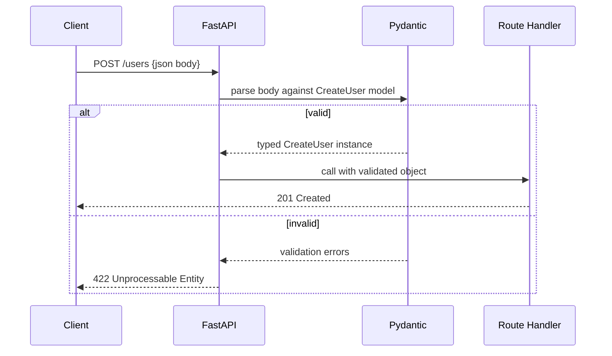

# Request Validation with Pydantic

## Why This Matters

Every API endpoint is a boundary between the chaotic outside world and your trusted internal code. Clients send malformed JSON, missing fields, wrong types, out-of-range numbers, and outright malicious payloads. If you validate this by hand — a wall of `if "email" not in data: raise ...` — you'll miss edge cases, and every new field means more manual checks that drift out of sync with reality.

Pydantic flips this around: you describe what valid data *looks like* once, as a model, and get parsing, coercion, and rejection of everything else for free. This is the single biggest reason FastAPI feels different from older frameworks.

## Core Concept

A **Pydantic model** is a Python class (subclassing `BaseModel`) whose attributes are type-annotated. When FastAPI sees a path operation parameter typed as a Pydantic model, it:

1. Reads the raw request body as JSON.
2. Passes it to the model for **parsing and validation**.
3. If valid, gives you a fully-typed Python object with autocomplete.
4. If invalid, short-circuits with a `422` response describing exactly what's wrong — your function never runs.

This is **Pydantic v2**, which is meaningfully faster and has a different validator API than v1. This handbook uses v2 syntax throughout.

## Mental Model

Think of a Pydantic model as a **schema + parser + guard** combined:

- **Schema**: what fields exist, their types, defaults, constraints.
- **Parser**: converts raw JSON (strings, numbers, nested objects) into real Python types (`datetime`, `Decimal`, `EmailStr`, nested models).
- **Guard**: rejects anything that doesn't fit, with a precise error trail (`loc`) pointing at exactly which field failed and why.

## How It Works

### Basic fields and `Field`

`Field()` lets you attach constraints and metadata beyond the bare type:

```python
from pydantic import BaseModel, Field

class CreateUser(BaseModel):
    username: str = Field(min_length=3, max_length=30)
    age: int = Field(ge=0, le=130)
    bio: str | None = Field(default=None, max_length=500)
```

### Custom validators

For logic that a type + `Field` constraint can't express, use `@field_validator` (v2 API):

```python
from pydantic import BaseModel, field_validator

class CreateUser(BaseModel):
    username: str
    password: str

    @field_validator("username")
    @classmethod
    def username_no_spaces(cls, value: str) -> str:
        if " " in value:
            raise ValueError("username must not contain spaces")
        return value.lower()  # you can also transform the value
```

For validation that spans *multiple* fields (e.g., "password confirmation must match password"), use `@model_validator(mode="after")`.

### Nested models

Real payloads are rarely flat. Pydantic models nest naturally:

```python
class Address(BaseModel):
    street: str
    city: str
    postal_code: str

class CreateUser(BaseModel):
    username: str
    address: Address           # nested model — validated recursively
    tags: list[str] = []       # list of primitives
    addresses: list[Address] = []  # list of nested models
```

Nested validation errors carry a full `loc` path like `["body", "address", "postal_code"]`, so clients know precisely where the problem is — even three levels deep.

### `model_config`

`model_config` (a class attribute, replacing v1's inner `class Config`) controls model-wide behavior:

```python
from pydantic import BaseModel, ConfigDict

class CreateUser(BaseModel):
    model_config = ConfigDict(str_strip_whitespace=True, extra="forbid")

    username: str
    email: str
```

`extra="forbid"` rejects any field the client sends that isn't declared in the model — useful for catching typos and preventing clients from silently sending fields you'll never read.

## Architecture



## Request / Response Example

```http
POST /users HTTP/1.1
Host: api.example.com
Content-Type: application/json

{
  "username": "hi malo",
  "age": 250,
  "address": {"street": "1 Main St", "city": "Springfield", "postal_code": "1234"}
}
```

```http
HTTP/1.1 422 Unprocessable Entity
Content-Type: application/json

{
  "detail": [
    {"type": "value_error", "loc": ["body", "username"], "msg": "Value error, username must not contain spaces"},
    {"type": "less_than_equal", "loc": ["body", "age"], "msg": "Input should be less than or equal to 130"}
  ]
}
```

## Code Example

```python
# schemas.py
from datetime import datetime
from pydantic import BaseModel, Field, EmailStr, field_validator, model_validator, ConfigDict


class Address(BaseModel):
    street: str
    city: str
    postal_code: str = Field(pattern=r"^\d{5}$")  # exactly 5 digits


class CreateUser(BaseModel):
    model_config = ConfigDict(extra="forbid", str_strip_whitespace=True)

    username: str = Field(min_length=3, max_length=30)
    email: EmailStr  # built-in email format validation
    age: int = Field(ge=13, le=130)
    password: str = Field(min_length=8)
    password_confirm: str
    address: Address
    signup_source: str | None = None

    @field_validator("username")
    @classmethod
    def no_spaces(cls, v: str) -> str:
        if " " in v:
            raise ValueError("username must not contain spaces")
        return v.lower()

    @model_validator(mode="after")
    def passwords_match(self) -> "CreateUser":
        # Cross-field validation runs after individual fields are validated.
        if self.password != self.password_confirm:
            raise ValueError("password and password_confirm must match")
        return self


# main.py
from fastapi import FastAPI

app = FastAPI()


@app.post("/users", status_code=201)
async def create_user(payload: CreateUser):
    # By the time we're here, payload is guaranteed to match the schema.
    # No manual "if not data.get(...)" checks needed.
    return {
        "username": payload.username,
        "email": payload.email,
        "created_at": datetime.utcnow().isoformat(),
    }
```

## Production Considerations

- Validation is not a security boundary by itself — it guarantees *shape and type*, not business rules (e.g., "email not already registered" still needs a database check). See `../10-api-security/README.md`.
- Deeply nested, expensive validators (e.g., ones that call an external service) can slow down every request — keep `field_validator`s pure and fast; do I/O-bound checks in the route/service layer instead.
- Use `extra="forbid"` on request models for APIs with strict contracts (internal services, versioned public APIs) to catch client drift early; use `extra="ignore"` (the v2 default) for more tolerant public APIs.
- Large request bodies still need a size limit at the ASGI server or reverse proxy level — Pydantic validates what arrives, but doesn't protect you from a client sending a 2GB body.

## Common Mistakes

- Writing manual `if` validation *in addition to* Pydantic models — redundant and inconsistent; let Pydantic own it.
- Confusing v1 syntax (`@validator`, `class Config`) with v2 syntax (`@field_validator`, `model_config = ConfigDict(...)`) — they are not interchangeable, and mixing them causes runtime errors.
- Returning raw Pydantic validation errors to end users without considering whether the message leaks internal details (rare, but check for models exposing internal field names).
- Forgetting that `EmailStr` requires the optional `email-validator` package to be installed.

## Best Practices

- One model per *use case*, not one shared model for create/update/response. A `CreateUser` model rarely equals an `UpdateUser` model (partial fields) or a `UserResponse` model (no password field). See `response-models.md` for the response side of this.
- Keep validators small and single-purpose; prefer `Field` constraints (`ge`, `le`, `pattern`, `min_length`) over custom code whenever possible — they're faster and self-documenting in the OpenAPI schema.
- Use `Annotated[...]` (Pydantic v2's preferred style) for reusable field constraints across models when your codebase grows.

## AI Engineering Perspective

When you build endpoints that accept structured input for an LLM pipeline — e.g., a `POST /agents/run` endpoint accepting a `task description`, `tool_choice`, and `max_steps` — Pydantic models are exactly what you'll reuse in Part 14 and Part 17 to validate **structured outputs** and **function-calling arguments**. The same `field_validator` pattern you use here to reject a malformed `postal_code` is the pattern you'll use to reject a malformed tool-call argument before executing it against a real system. Pydantic's JSON Schema export (`Model.model_json_schema()`) is also literally the format many LLM providers expect for function/tool schemas — the skill you're building here transfers directly.

## Exercises

**Beginner**
1. Define a `CreateProduct` model with `name: str`, `price: float` (must be `> 0`), and `in_stock: bool = True`. Wire it into a `POST /products` route.

**Intermediate**
2. Add a nested `Dimensions` model (`length`, `width`, `height`, all positive floats) to `CreateProduct`, and a `field_validator` that rejects products where `price` has more than 2 decimal places.

**Advanced**
3. Build a `CreateOrder` model with a `model_validator(mode="after")` that ensures `discount_amount` never exceeds `subtotal`, and a `field_validator` on a `promo_code` field that only allows uppercase alphanumeric codes 4-12 characters long.

## Key Takeaways

- Pydantic models are schema, parser, and guard in one — declare once, get validation everywhere.
- `field_validator` handles single-field logic; `model_validator(mode="after")` handles cross-field logic.
- Nested models validate recursively and produce precise `loc` paths in errors.
- `model_config = ConfigDict(...)` (v2) replaces v1's `class Config`.
- See the full working version in `../../examples/fastapi-crud/`.

Previous: `fastapi-fundamentals.md` · Next: `response-models.md`.
