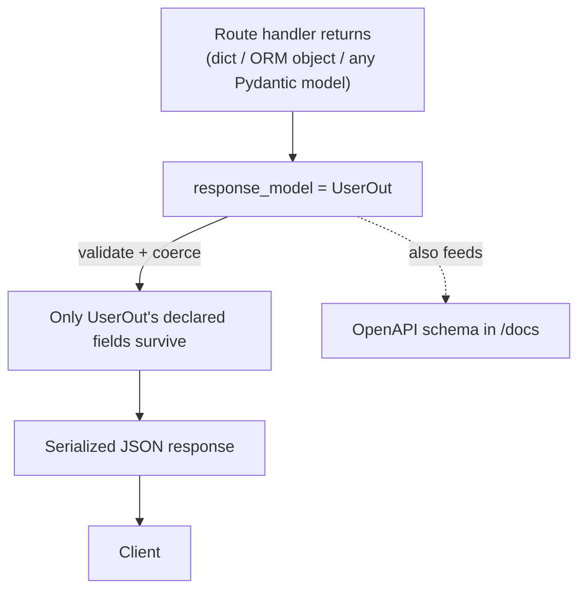

# Response Models

## Why This Matters

Validating input is only half the contract. What your API sends *back* matters just as much — and it's easy to get wrong by accident. A classic and dangerous bug: you fetch a `User` object from the database (which includes `password_hash`) and return it directly from a route. Without a response model, FastAPI will happily serialize every attribute on that object straight into the JSON response, including the hash. Response models are how you draw a hard line between your internal data shape and your public API shape.

## Core Concept

`response_model` is a parameter on the path operation decorator that tells FastAPI: "no matter what my function returns, serialize it through *this* Pydantic model before sending it to the client." FastAPI will:

1. Take whatever your function returns (a dict, an ORM object, a different Pydantic model).
2. Validate and coerce it against `response_model`.
3. Drop any fields not declared on `response_model` (unless you configure otherwise).
4. Use `response_model` to generate the OpenAPI schema clients see in `/docs`.

This means the response model acts as an **allowlist**, not a blocklist — you declare what's visible, not what's hidden.

## Mental Model

Picture two separate doors on your route: an **input door** (the request model, validated in `request-validation-pydantic.md`) and an **output door** (the response model). They are almost always *different shapes of the same concept* — a `CreateUser` (with password) goes in; a `UserOut` (no password) comes out. Never assume symmetry between request and response schemas; design them independently.

## How It Works

### Basic usage

```python
from fastapi import FastAPI
from pydantic import BaseModel

app = FastAPI()

class UserOut(BaseModel):
    id: int
    username: str
    email: str
    # notice: no password_hash field here at all

@app.get("/users/{user_id}", response_model=UserOut)
async def get_user(user_id: int):
    # Suppose this returns a dict or ORM object with MORE fields than UserOut declares,
    # including password_hash. FastAPI strips anything not in UserOut automatically.
    return db_fetch_user(user_id)
```

### Controlling serialization further

- `response_model_exclude_none=True` — drop fields whose value is `None` from the JSON output (useful for sparse/partial resources).
- `response_model_exclude={"internal_notes"}` — exclude specific fields per-route without a whole new model.
- `response_model_include={"id", "username"}` — the inverse: only include specific fields.
- Per-field, `Field(exclude=True)` permanently excludes a field from *any* serialization of that model, everywhere it's used.

```python
from pydantic import BaseModel, Field

class UserOut(BaseModel):
    id: int
    username: str
    internal_risk_score: float = Field(exclude=True)  # never serialized, ever
```

### Reading ORM / non-dict objects

If your route returns a SQLAlchemy model instance (not a dict), Pydantic needs permission to read attributes off arbitrary objects instead of just dict keys:

```python
from pydantic import BaseModel, ConfigDict

class UserOut(BaseModel):
    model_config = ConfigDict(from_attributes=True)  # v2 name for v1's orm_mode
    id: int
    username: str
```

### `response_model` vs return type hint

FastAPI can also infer the response schema purely from the function's `-> ReturnType` annotation. Using explicit `response_model=` is preferred when you want the *declared* schema to differ from what your function's type-checker sees returned (e.g., you return an ORM object typed as `User` but want it serialized as `UserOut`) — `response_model` always wins for serialization purposes.

## Architecture



## Request / Response Example

```http
GET /users/7 HTTP/1.1
Host: api.example.com
```

Internally, `db_fetch_user(7)` might return an object with `password_hash`, `internal_risk_score`, and `last_login_ip`. None of that reaches the wire:

```http
HTTP/1.1 200 OK
Content-Type: application/json

{
  "id": 7,
  "username": "amelia",
  "email": "amelia@example.com"
}
```

## Code Example

```python
# schemas.py
from pydantic import BaseModel, ConfigDict, Field, EmailStr


class UserCreate(BaseModel):
    """Input shape — what a client sends to create a user."""
    username: str
    email: EmailStr
    password: str = Field(min_length=8)


class UserOut(BaseModel):
    """Output shape — what a client is allowed to see."""
    model_config = ConfigDict(from_attributes=True)

    id: int
    username: str
    email: EmailStr


class UserInternal(BaseModel):
    """Full internal shape — never returned directly from an API route."""
    id: int
    username: str
    email: EmailStr
    password_hash: str
    internal_risk_score: float


# main.py
from fastapi import FastAPI
from schemas import UserCreate, UserOut, UserInternal

app = FastAPI()

_FAKE_DB: dict[int, UserInternal] = {}
_next_id = 1


def hash_password(password: str) -> str:
    # placeholder — real code uses bcrypt/argon2, see Part 5
    return f"hashed::{password}"


@app.post("/users", response_model=UserOut, status_code=201)
async def create_user(payload: UserCreate):
    global _next_id
    internal = UserInternal(
        id=_next_id,
        username=payload.username,
        email=payload.email,
        password_hash=hash_password(payload.password),
        internal_risk_score=0.0,
    )
    _FAKE_DB[_next_id] = internal
    _next_id += 1

    # We return the FULL internal object, but response_model=UserOut
    # guarantees password_hash and internal_risk_score never leave the server.
    return internal


@app.get("/users/{user_id}", response_model=UserOut)
async def get_user(user_id: int):
    from fastapi import HTTPException
    user = _FAKE_DB.get(user_id)
    if user is None:
        raise HTTPException(status_code=404, detail="User not found")
    return user
```

## Production Considerations

- Treat `response_model` as a security control, not just a convenience — audit every route that returns database objects directly to confirm sensitive fields are excluded.
- Response model validation has a real CPU cost at high throughput; for extremely hot paths, benchmark whether `response_model_exclude_unset` or hand-built serialization is worth the added complexity.
- Keep response models stable across minor versions — clients depend on the shape; adding optional fields is safe, removing or renaming fields is a breaking change (see API versioning in `../02-rest-api-design/README.md`).
- For paginated list endpoints, wrap items in an envelope model (`{"items": [...], "total": N, "next_cursor": ...}`) rather than returning a bare list — it's much easier to extend later.

## Common Mistakes

- Returning ORM objects with `response_model` omitted, "because it works in dev" — it works because nothing sensitive was in the test data yet.
- Forgetting `model_config = ConfigDict(from_attributes=True)` when serializing non-dict objects — causes confusing validation errors.
- Sharing one model between request and response ("it's the same fields, mostly") — until the day it silently exposes a field that shouldn't be public.
- Using `response_model_exclude` as your *only* protection for secrets instead of never putting secrets in the same model in the first place — defense in depth is cheap here.

## Best Practices

- Always define separate `*Create`, `*Update`, and `*Out` schemas per resource, even when they overlap heavily at first — they diverge over time, and it's cheap to start clean.
- Name response models consistently (`UserOut`, `OrderOut`, ...) so it's instantly clear which models are output-only.
- Use envelope/wrapper models for collections so you can add pagination metadata without a breaking change.
- Keep `response_model` explicit on every route — don't rely solely on return-type inference for public-facing APIs.

## AI Engineering Perspective

Response models become critical when building AI endpoints that call external LLM providers: a raw provider response often contains fields you don't want to leak (internal model routing metadata, raw token usage details you bill for differently, provider-specific error internals). Wrapping every AI endpoint's output in your *own* `ChatCompletionOut` response model — rather than passing the provider's raw JSON straight through — is what lets you swap providers later (Part 15: multi-provider architecture) without breaking every client integrated against your API. It's the same allowlist principle applied one layer up the stack.

## Exercises

**Beginner**
1. Create a `ProductOut` response model with `id`, `name`, `price` and wire it to a route that internally works with a dict containing an extra `cost_basis` field. Confirm `cost_basis` never appears in the response.

**Intermediate**
2. Build a paginated `GET /products` route returning an envelope `{"items": [ProductOut], "total": int}` instead of a bare list.

**Advanced**
3. Create a route that returns a SQLAlchemy-style object (a plain class with attributes, not a dict) and use `from_attributes=True` to serialize it through a response model, excluding two internal-only fields.

## Key Takeaways

- `response_model` is an allowlist that filters and validates whatever your function returns before it hits the wire.
- Request and response schemas should almost always be different models, even for the "same" resource.
- `from_attributes=True` (v2) lets Pydantic read non-dict objects like ORM instances.
- Treat response shaping as a security boundary, not just a formatting nicety.
- See the full working version in `../../examples/fastapi-crud/`.

Previous: `request-validation-pydantic.md` · Next: `dependency-injection.md`.
