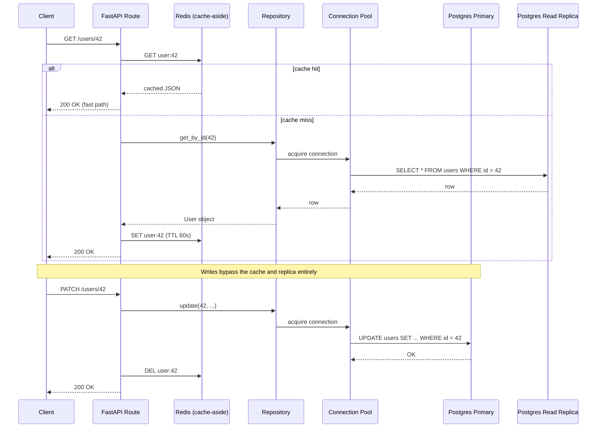

# API + Database Architecture

## Why This Matters

Every chapter in this part covers one piece — SQL, the ORM, transactions, pooling, migrations, the repository pattern, pagination, performance. This chapter puts the pieces together: how should the API layer and the database layer be organized *as a system*, at the scale of an entire service or a fleet of services? Getting this wrong shows up as coupling that makes independent deployment impossible, or as a database that becomes a shared bottleneck no team can safely touch.

## Core Concept

Three architectural decisions dominate how an API's data layer scales: **who owns the database** (one database per service vs. a shared database across services), **how you scale reads** (read replicas), and **where caching sits** (between the API and the database, absorbing read traffic before it reaches Postgres at all). These decisions interact — a shared database undermines a microservices architecture's independence; read replicas only help if your API can tolerate slightly stale reads; caching only helps for read-heavy, cacheable data.

**One database per service vs. shared database.** In a microservices architecture (see [Part 11 — Microservices & Distributed Systems](../11-microservices-distributed-systems/README.md)), the strong default is one database per service, accessed only through that service's API — never directly by another service. This preserves independent deployability: a schema change in the orders service can't silently break the inventory service, because the inventory service was never allowed to query the orders database directly. The cost is that cross-service queries ("show me a user with their orders and their support tickets") now require calling multiple services and joining in application code, or accepting eventual consistency via events (see [Part 8 — Async Systems](../08-async-systems/README.md)) instead of a single SQL join. A shared database is simpler to query across, but couples every service's schema to every other service's assumptions — a change one team makes can break a team they don't even know depends on that table.

**Read replicas.** A read replica is a continuously-updated copy of your primary database that serves read-only queries, offloading read traffic from the primary so it can focus on writes. Application code routes `SELECT`s to a replica and all writes (`INSERT`/`UPDATE`/`DELETE`) to the primary. The trade-off is replication lag: replicas apply changes asynchronously, so a read immediately after a write might not see that write yet. This is fine for a public content feed; it's a real correctness risk for "read your own write" flows (e.g., a user submits a form and is redirected to a page that reads from a lagging replica and shows stale data) — those specific reads should go to the primary, not the replica.

**Where caching fits.** As covered in [Part 7 — Caching & Performance](../07-caching-performance/README.md), a cache (typically Redis) sits between the API and the database, intercepting reads for hot, expensive, or frequently-requested data so they never reach Postgres at all. The [cache-aside pattern](../07-caching-performance/cache-aside.md) is the most common integration point: the API checks the cache first, falls back to the database on a miss, and populates the cache with the result. This is a separate scaling lever from read replicas — replicas scale raw read *capacity*, caching reduces the *number of reads that need any database at all*.

## Mental Model

Think of the full stack as concentric rings around your data: the application layer decides *what* to ask for, the cache is a fast-access shelf holding recently-requested answers, the connection pool is the front door managing how many conversations with the database can happen at once, and the database (primary + replicas) is where the ground truth actually lives. A request tries the innermost, fastest ring first (cache) and only goes deeper (pool → primary or replica) when it has to.

## How It Works

A request for "get user profile" in a well-architected system flows through several layers, each with a job:

1. FastAPI route handler receives the HTTP request.
2. It checks Redis for a cached response (cache-aside).
3. On a cache miss, it asks the repository (see [Repository Pattern](repository-pattern.md)) for the data.
4. The repository, using a pooled connection (see [Connection Pooling](connection-pooling.md)), issues a `SELECT` — routed to a read replica if this data can tolerate replication lag, or to the primary if it must be fresh.
5. The result is written back to Redis with a TTL, then returned to the client.

Writes skip the cache-read step entirely, go straight to the primary inside a transaction (see [Database Transactions](database-transactions.md)), and typically invalidate the relevant cache key so the next read isn't stale.

## Architecture



## Request / Response Example

```
GET /users/42 HTTP/1.1
```

First request (cache miss): Redis `GET user:42` → nil; repository issues `SELECT * FROM users WHERE id = 42` against a read replica; response cached in Redis with `SET user:42 <json> EX 60`.

```
HTTP/1.1 200 OK
X-Cache: MISS

{"id": 42, "email": "jane@example.com", "full_name": "Jane Doe"}
```

Second request within 60 seconds (cache hit): served entirely from Redis, no database round trip at all.

```
HTTP/1.1 200 OK
X-Cache: HIT

{"id": 42, "email": "jane@example.com", "full_name": "Jane Doe"}
```

## Code Example

```python
import os
from sqlalchemy.ext.asyncio import create_async_engine, async_sessionmaker

# Two engines: one for writes (primary), one for reads that can tolerate
# a little staleness (replica). Both configured via environment variables,
# never hardcoded (see Part 3: environment-variables.md).
PRIMARY_URL = os.environ["DATABASE_URL_PRIMARY"]
REPLICA_URL = os.environ["DATABASE_URL_REPLICA"]

primary_engine = create_async_engine(PRIMARY_URL, pool_size=10, max_overflow=5)
replica_engine = create_async_engine(REPLICA_URL, pool_size=10, max_overflow=5)

PrimarySession = async_sessionmaker(primary_engine, expire_on_commit=False)
ReplicaSession = async_sessionmaker(replica_engine, expire_on_commit=False)
```

```python
# routes.py — cache-aside in front of a read-replica-backed repository
import json
from fastapi import APIRouter, Depends
from redis.asyncio import Redis
from repositories import UserRepository

router = APIRouter()

async def get_redis() -> Redis:
    return Redis.from_url(os.environ["REDIS_URL"])

@router.get("/users/{user_id}")
async def get_user(
    user_id: int,
    repo: UserRepository = Depends(get_read_replica_repository),
    redis: Redis = Depends(get_redis),
):
    cache_key = f"user:{user_id}"
    cached = await redis.get(cache_key)
    if cached:
        return json.loads(cached)  # cache hit — no database round trip at all

    user = await repo.get_by_id(user_id)  # reads from replica
    if user is None:
        raise HTTPException(404, "User not found")

    payload = {"id": user.id, "email": user.email, "full_name": user.full_name}
    await redis.set(cache_key, json.dumps(payload), ex=60)  # 60s TTL
    return payload


@router.patch("/users/{user_id}")
async def update_user(
    user_id: int,
    full_name: str,
    repo: UserRepository = Depends(get_primary_repository),  # writes go to primary
    redis: Redis = Depends(get_redis),
):
    user = await repo.update(user_id, full_name=full_name)
    await redis.delete(f"user:{user_id}")  # invalidate so the next read is fresh
    return {"id": user.id, "full_name": user.full_name}
```

## Production Considerations

- Replication lag is real and measurable — monitor it (`pg_stat_replication` lag) and route any "read your own write" endpoint to the primary explicitly, not to a replica.
- Cache invalidation on write is the part most likely to be forgotten — an `UPDATE` that doesn't invalidate the corresponding cache key leaves stale data visible for the full TTL.
- Cross-service joins in a one-database-per-service architecture require either API composition (call multiple services, join in memory) or event-driven data replication (see [Part 8 — Async Systems](../08-async-systems/README.md)) — plan for this before splitting services, not after.
- Connection pool budgets (see [Connection Pooling](connection-pooling.md)) now need to account for both primary and replica connections per process.

## Common Mistakes

- Routing a "read your own write" request to a replica and showing the user stale data immediately after they submit a change.
- Sharing one database directly across multiple "independent" microservices, silently recreating a monolith's coupling without any of a monolith's simplicity.
- Forgetting cache invalidation on writes, leaving the cache authoritative over the database from the user's perspective for the TTL window.
- Scaling reads with a replica while the actual bottleneck was an unindexed query — replicas don't fix bad queries, they just run the same slow query on more hardware.

## Best Practices

- Default to one database per service in a microservices architecture; treat a shared database as a deliberate, documented exception, not a default.
- Route writes and read-your-own-write queries to the primary; route tolerant, high-volume reads to replicas.
- Pair caching with replicas, not as a substitute for them — caching reduces database load for hot keys, replicas add raw read capacity for everything else.
- Always fix the underlying query (indexes, N+1, see [Database Performance](database-performance.md)) before reaching for a read replica as a scaling fix.
- The [`examples/fastapi-crud/`](../../examples/fastapi-crud/) example currently runs on SQLite for simplicity — swapping in the PostgreSQL connection pattern from [PostgreSQL Integration](postgresql-integration.md), plus a repository layer and cache-aside reads, is the natural next step toward this chapter's architecture.

## AI Engineering Perspective

An LLM gateway or RAG API (see [Part 15 — Production AI Systems](../15-production-ai-systems/README.md) and [Part 16 — RAG APIs](../16-rag-apis/README.md)) typically layers the same architecture with an AI-specific addition: a semantic cache in front of the LLM call itself (caching by meaning, not just exact key match), a vector database or `pgvector`-backed Postgres for retrieval, and the same primary/replica/cache-aside pattern for any relational metadata (user permissions, usage quotas, conversation history) sitting alongside the AI-specific data path. The database architecture principles in this chapter don't change for AI workloads — they simply sit next to a second, parallel data path for embeddings and model calls.

## Exercises

**Beginner**: Draw (in words or a diagram) the request path for `GET /products/7` through cache, replica, and primary in a system using cache-aside and read replicas.

**Intermediate**: Design the API boundary between an "orders" service and an "inventory" service that each own their own database, including how the orders service finds out about stock changes without querying inventory's database directly.

**Advanced**: A user updates their profile and is immediately redirected to their profile page, which shows stale data. Diagnose the likely cause (cache invalidation vs. replication lag vs. both) and propose a fix for each possible cause.

## Key Takeaways

- One database per service preserves independent deployability in a microservices architecture; a shared database recreates monolithic coupling.
- Read replicas scale read capacity but introduce replication lag — route read-your-own-write queries to the primary.
- Caching (cache-aside, see [Part 7](../07-caching-performance/cache-aside.md)) reduces the number of reads that reach the database at all, and is a separate lever from replica capacity.
- Cache invalidation on write is the most commonly forgotten step in this architecture — missing it silently serves stale data.
- Fix slow queries (indexes, N+1) before scaling with replicas — replicas amplify capacity, they don't fix inefficient queries.

---
Previous: [Database Performance](database-performance.md) · Back to [Part 4 README](README.md) · Next: [Part 5 — Authentication & Authorization](../05-authentication-authorization/README.md)
