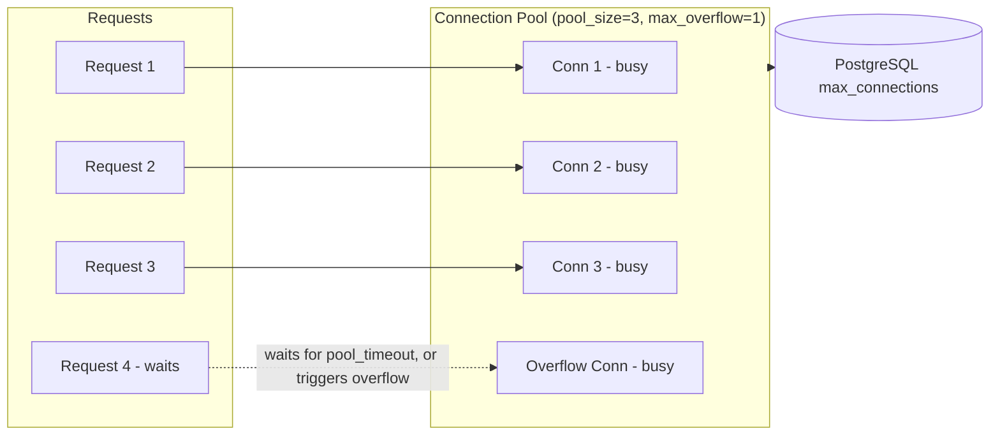

# Connection Pooling

## Why This Matters

An API that works fine in local testing can fall over in production the moment real concurrent traffic hits it — not because the code is wrong, but because it opens a new database connection for every single request. Establishing a TCP connection, doing TLS negotiation, and completing Postgres's authentication handshake takes real time (milliseconds, sometimes tens of milliseconds) — repeated on every request, this becomes your API's dominant latency cost and, worse, a way to exhaust the database itself. Connection pooling is the fix, and understanding how it works is essential to configuring it correctly instead of guessing.

## Core Concept

A connection pool is a set of already-open, ready-to-use database connections that your application reuses across requests instead of opening and closing a connection each time. When a request needs the database, it borrows a connection from the pool; when it's done, it returns the connection to the pool instead of closing it — the connection stays open, ready for the next request.

This matters because opening a Postgres connection is expensive relative to running a typical query: the TCP handshake, TLS negotiation (if enabled), and Postgres's own authentication and session setup can easily cost more time than the actual `SELECT` you wanted to run. Pooling amortizes that cost across many requests.

## Mental Model

Think of a connection pool like a car rental counter with a fixed number of cars. Instead of building a new car every time a customer needs one (and destroying it after), the counter keeps a fleet of cars ready. Customers check one out, drive it, return it — the same cars get reused all day. If every car is checked out and another customer arrives, they either wait for one to be returned or, if the counter allows a bit of overflow, a limited number of extra cars are brought in temporarily.

## How It Works

SQLAlchemy's async engine (see [PostgreSQL Integration](postgresql-integration.md)) manages a pool internally with a few key parameters:

- **`pool_size`**: the number of connections kept open at steady state.
- **`max_overflow`**: additional connections allowed temporarily beyond `pool_size` during traffic bursts, closed again once load drops.
- **`pool_timeout`**: how long a request waits for a connection to free up before raising an error.
- **`pool_recycle`**: max connection age before it's proactively closed and replaced (avoids issues with connections the database or a load balancer silently kills after some idle time).
- **`pool_pre_ping`**: validates a connection is still alive with a lightweight check before handing it to your code, avoiding "connection reset" errors on stale connections.

The critical constraint: Postgres itself has a hard `max_connections` limit (often 100 by default on managed instances), and **every process** in your system that connects to the database shares that limit — your API's pool, plus any background workers, plus any admin tools connected at the same time. If you run 10 API server processes each with `pool_size=20`, that's 200 connections at steady state before overflow — easily exceeding a 100-connection limit and causing new connections (and thus requests) to fail outright.

## Architecture



## Request / Response Example

Under load, a request that can't get a connection within `pool_timeout` fails at the application layer before even reaching the database:

```
GET /orders HTTP/1.1
```

```
HTTP/1.1 503 Service Unavailable
Content-Type: application/json

{"detail": "Database connection pool exhausted, please retry"}
```

This is a distinct, application-level failure mode — different from a slow query or a database outage — and it should be logged and alerted on separately, because it usually means either the pool is undersized or a query is holding connections too long.

## Code Example

```python
import os
from sqlalchemy.ext.asyncio import create_async_engine

DATABASE_URL = os.environ["DATABASE_URL"]

engine = create_async_engine(
    DATABASE_URL,
    pool_size=10,        # steady-state connections per app process
    max_overflow=5,      # burst capacity: up to 15 connections total under load
    pool_timeout=10,     # seconds to wait for a free connection before erroring
    pool_recycle=1800,   # recycle connections older than 30 minutes
    pool_pre_ping=True,  # cheap liveness check before reuse
)
```

```python
# Sizing math you should actually do, not guess:
# max_connections on the DB (check with `SHOW max_connections;`) = 100
# Reserve headroom for admin/migrations/other services, say 20
# Usable budget = 80
# If you run N app server processes, each process's pool_size + max_overflow
# must satisfy: N * (pool_size + max_overflow) <= 80
#
# 4 app processes -> pool_size=15, max_overflow=5 => 4 * 20 = 80 (at the edge,
# consider a shared external pooler like PgBouncer instead, see below)
```

For a fleet of app processes larger than a handful, an external pooler like **PgBouncer** sits between your app and Postgres, multiplexing many app-side connections onto a smaller number of real Postgres connections — this is the standard production pattern once a single SQLAlchemy pool per process no longer scales cleanly across many processes.

## Production Considerations

- Connection pool exhaustion is a real, common production failure mode — it shows up as a spike in request timeouts or 503s that's disconnected from any single slow query, and it's often triggered by a deploy that scaled up app instances without re-checking the total pool budget against `max_connections`.
- `pool_pre_ping` costs a small round trip per checkout but prevents intermittent failures from connections closed by the database side (common on managed Postgres with idle connection timeouts).
- Background workers and cron jobs need their own, separately-sized pools — don't let them share the API's pool budget unaccounted for.
- Consider PgBouncer (or your cloud provider's built-in pooler) once you're running more than a handful of app processes, since per-process pools multiply the connection count linearly with your fleet size.

## Common Mistakes

- No `max_overflow`/`pool_size` limits at all, letting the pool grow unbounded and exhausting `max_connections` under a traffic spike.
- Opening a new engine (and thus a new pool) per request instead of once at startup — this defeats pooling entirely and is functionally identical to no pooling.
- Sizing the pool without accounting for the number of running app processes/replicas, then being surprised when scaling out causes connection errors.
- Not setting `pool_recycle`, leading to mysterious connection failures after the database or a network load balancer silently drops long-idle connections.

## Best Practices

- Compute your pool budget against the database's actual `max_connections`, accounting for every process type that connects (API, workers, migrations, admin tools).
- Start conservative (`pool_size=5–10` per process) and tune upward based on observed wait times, not intuition.
- Use `pool_pre_ping=True` and a sensible `pool_recycle` in any cloud-managed database setup.
- Monitor pool utilization (checked-out vs available connections) as a first-class metric, not an afterthought — see [Part 12 — Observability](../12-observability/README.md).

## AI Engineering Perspective

AI agent workloads that fan out many concurrent tool calls (e.g., an agent processing a batch of documents, each triggering a database write) can spike connection demand far faster than typical human-driven API traffic, because agent loops can issue many requests in tight succession without the natural pacing of human users. Size pools and rate limits for AI-driven workloads with this bursty pattern in mind, and consider [rate limiting](../06-production-reliability/README.md) tool-call-triggered database writes independently from normal API traffic.

## Exercises

**Beginner**: Explain why opening a new database connection per request is slower than reusing a pooled connection.

**Intermediate**: Given a Postgres instance with `max_connections=100`, and a fleet of 5 API processes plus 2 background worker processes, propose a `pool_size`/`max_overflow` budget for each process type that stays safely under the limit.

**Advanced**: Design a load test that deliberately exhausts your connection pool, and describe what metrics and error responses you'd expect to see, and how you'd distinguish "pool exhausted" from "database is actually down."

## Key Takeaways

- Connection pooling reuses already-open connections instead of paying the TCP/TLS/auth handshake cost on every request.
- `pool_size` + `max_overflow`, multiplied across every app process, must stay under the database's `max_connections`.
- Connection pool exhaustion is a distinct, common production failure mode that needs its own monitoring and alerting.
- `pool_pre_ping` and `pool_recycle` prevent stale-connection errors caused by the database or network silently dropping idle connections.
- At fleet scale, an external pooler like PgBouncer replaces per-process pools as the right architecture.

---
Previous: [Database Transactions](database-transactions.md) · Next: [Migrations](migrations.md) · Back to [Part 4 README](README.md)
