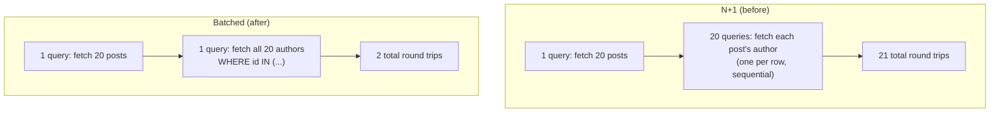

# Database Performance

## Why This Matters

Most production API slowness traces back to the database, and most of that traces back to a small handful of recurring, well-understood causes: too many queries per request, missing indexes, and schema designs that force expensive joins on hot paths. Understanding these deeply — not just knowing the buzzwords — is what lets you diagnose a slow endpoint in minutes instead of guessing your way through it.

## Core Concept

Database performance work is fundamentally about reducing two things: the **number** of round trips to the database per request, and the **amount of work** the database does per query. The N+1 problem attacks the first; indexing attacks the second. `EXPLAIN ANALYZE` is the tool that tells you, concretely, where the database is spending its time on a given query — without it, performance tuning is guesswork.

## Mental Model

Think of each database round trip as a phone call: even a one-second question costs you the overhead of dialing, waiting for pickup, and hanging up. Twenty short phone calls (N+1 queries) cost far more than one longer call that asks everything at once (a single batched query) — the network round-trip overhead dominates, not the actual work.

For indexes: think of a database table without an index as a phone book sorted by nothing — finding "Smith" means reading every entry. An index is the phone book sorted alphabetically — finding "Smith" means jumping straight to the S section.

## How It Works

**The N+1 query problem, in depth.** Say you fetch 20 blog posts, then for each post access `post.author.name`:

```python
posts = (await session.execute(select(Post).limit(20))).scalars().all()
for post in posts:
    print(post.author.name)  # triggers a lazy load — one query PER post
```

This issues 1 query to fetch the posts, then 20 more queries (one per post) to lazily fetch each author — 21 total queries for data that could have been fetched in 2. At 20 posts this is merely wasteful; at 200 posts per page, or nested one level deeper (posts → comments → comment authors), it becomes a real latency and database load problem, and it scales linearly with the number of rows, which is exactly the kind of bug that's invisible in development (small dataset, fast local DB) and severe in production (real dataset, network latency to the DB).

The fix is to tell the ORM to fetch related data eagerly, in a small, fixed number of additional queries regardless of how many posts there are:

```python
from sqlalchemy.orm import selectinload

stmt = select(Post).limit(20).options(selectinload(Post.author))
posts = (await session.execute(stmt)).scalars().all()
for post in posts:
    print(post.author.name)  # no additional query — already loaded
```

`selectinload` issues exactly 2 queries total: one for the posts, one `SELECT * FROM authors WHERE id IN (...)` batching all 20 author IDs at once — constant query count regardless of row count.

**EXPLAIN ANALYZE**, conceptually, runs your query for real and reports both the planner's cost estimate and the actual measured execution: how many rows were scanned, whether an index was used, and where time was actually spent.

```sql
EXPLAIN ANALYZE
SELECT * FROM orders WHERE user_id = 42;
```

```
Seq Scan on orders  (cost=0.00..18334.00 rows=12 width=48) (actual time=45.211..112.887 rows=12 loops=1)
  Filter: (user_id = 42)
  Rows Removed by Filter: 499988
Planning Time: 0.112 ms
Execution Time: 113.021 ms
```

`Seq Scan` with `Rows Removed by Filter: 499988` is the tell: Postgres read half a million rows to find 12 matches — no index exists on `user_id`. After adding `CREATE INDEX ix_orders_user_id ON orders (user_id);`:

```
Index Scan using ix_orders_user_id on orders  (cost=0.29..8.45 rows=12 width=48) (actual time=0.031..0.048 rows=12 loops=1)
  Index Cond: (user_id = 42)
Execution Time: 0.061 ms
```

Same query, 113ms → 0.06ms — nearly a 2000x improvement, from one index.

**Index design basics**: index columns you filter on (`WHERE`), join on (`JOIN ... ON`), and sort on (`ORDER BY`) frequently and at scale. Every foreign key column should almost always be indexed — Postgres does *not* automatically index foreign key columns (only the primary key side is indexed automatically), and an unindexed foreign key means every join or filter on that relationship is a sequential scan. Indexes aren't free, though: each one adds write overhead (every `INSERT`/`UPDATE` must also update the index) and disk space, so index what you actually query, not every column defensively.

**When to denormalize**: normalization (splitting data into separate tables to avoid duplication) is the right default, but a computed or duplicated value can be worth the redundancy when a query that recomputes it is too expensive to run on every read — e.g., storing `order_count` directly on a `users` row instead of running `COUNT(*)` over orders on every profile page view. The trade-off is real: denormalized data can drift out of sync unless you're disciplined about updating it (often via a transaction, trigger, or async job), so treat it as a deliberate, documented performance decision, not a default.

## Architecture



## Request / Response Example

```
GET /posts?limit=20
```

Before the fix, this endpoint's server-side log shows 21 SQL statements executed and a p95 latency of ~450ms. After adding `selectinload`, the same endpoint shows 2 SQL statements and a p95 latency of ~40ms — the response body (JSON list of 20 posts with author names) is identical; only the database work behind it changed.

## Code Example

```python
# Before: N+1 trap hiding in what looks like innocuous code
@router.get("/posts")
async def list_posts(session: AsyncSession = Depends(get_session)):
    result = await session.execute(select(Post).limit(20))
    posts = result.scalars().all()
    return [
        {"id": p.id, "title": p.title, "author": p.author.name}  # lazy load per post
        for p in posts
    ]

# After: batched eager load, constant query count
from sqlalchemy.orm import selectinload

@router.get("/posts")
async def list_posts(session: AsyncSession = Depends(get_session)):
    stmt = select(Post).limit(20).options(selectinload(Post.author))
    result = await session.execute(stmt)
    posts = result.scalars().all()
    return [{"id": p.id, "title": p.title, "author": p.author.name} for p in posts]
```

```sql
-- Diagnosing: always start with EXPLAIN ANALYZE on the slow query, not guesses
EXPLAIN ANALYZE SELECT * FROM orders WHERE user_id = 42;

-- Then add the missing index
CREATE INDEX CONCURRENTLY ix_orders_user_id ON orders (user_id);
```

## Production Considerations

- Enable slow query logging (`log_min_duration_statement` in Postgres) in production so N+1 patterns and missing indexes surface from real traffic, not just from code review.
- Every foreign key column used in a `JOIN` or `WHERE` should be indexed — check this explicitly during schema review, since Postgres won't do it for you.
- `EXPLAIN ANALYZE` actually executes the query — be careful running it directly against production for writes or expensive queries; use a read replica or staging copy with representative data volume.
- Denormalized fields need an explicit, tested update path (transaction, trigger, or background job) or they will silently drift from the source of truth.

## Common Mistakes

- Accessing a lazily-loaded ORM relationship inside a loop, causing an N+1 query pattern invisible in small dev datasets.
- Assuming an index exists on a foreign key column because "that's how relational databases work" — it isn't automatic in Postgres.
- Adding indexes defensively on every column "just in case," bloating write latency and storage without measurable read benefit.
- Denormalizing data without a plan to keep it in sync, leading to subtly incorrect counts/totals shown to users.
- Never running `EXPLAIN ANALYZE` on a slow query and instead guessing at the fix.

## Best Practices

- Treat query count per request as a first-class metric — log or assert on it in tests for hot endpoints.
- Use `selectinload`/`joinedload` deliberately for every relationship you know you'll access, rather than relying on default lazy loading.
- Run `EXPLAIN ANALYZE` on any query serving a high-traffic endpoint before shipping it, not after a production slowdown.
- Index foreign keys and frequently filtered/sorted columns; avoid indexing everything defensively.

## AI Engineering Perspective

RAG retrieval pipelines commonly combine a vector similarity search with relational metadata filtering (e.g., "find similar documents, but only ones this user can access") — and it's easy to introduce an N+1 pattern here too, fetching each candidate document's metadata one at a time after the vector search returns IDs. The same fix applies: batch the metadata fetch with a single `WHERE id IN (...)` query, or use `selectinload`-equivalent eager loading, rather than looping over results and issuing one query per candidate (see [Part 16 — RAG APIs](../16-rag-apis/README.md)).

## Exercises

**Beginner**: Given a `comments` table with an unindexed `post_id` foreign key, write the `EXPLAIN ANALYZE` output you'd expect before and after adding an index, in your own words.

**Intermediate**: Rewrite an endpoint that lists 50 orders and accesses `order.customer.name` for each into a version using `selectinload`, and state the resulting query count.

**Advanced**: Design a denormalization strategy for showing "total likes" on a post without running `COUNT(*)` on every page view, including how the count stays correct when likes are added/removed concurrently.

## Key Takeaways

- The N+1 query problem — one query becoming N+1 due to lazy-loaded relationships accessed in a loop — is the most common ORM-related performance bug in production.
- `EXPLAIN ANALYZE` shows real, measured execution behavior, not just estimates — it's the starting point for any performance investigation, not a guess.
- Foreign key columns are not automatically indexed in Postgres; index them explicitly if you filter or join on them.
- Denormalization trades write complexity and consistency risk for read performance — use it deliberately, not as a first resort.
- Reducing round trips (batching) and reducing per-query work (indexing) are the two levers that matter most for database performance.

---
Previous: [Pagination at Scale](pagination-at-scale.md) · Next: [API + Database Architecture](api-database-architecture.md) · Back to [Part 4 README](README.md)
