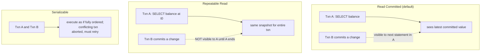

# Database Transactions

## Why This Matters

The moment your API does more than one write in a request — debit one account and credit another, create an order and decrement inventory — you need transactions, or you will eventually leave your database in a state that's internally inconsistent. A transaction is the guarantee that a group of operations either all happen or none happen. Without understanding this precisely, "it worked in testing" turns into "half the write happened during a production outage" and that's how you get orders with no matching inventory decrement.

## Core Concept

A transaction is a sequence of one or more database operations treated as a single, indivisible unit. Postgres (and any real relational database) guarantees four properties for transactions, known as **ACID**:

- **Atomicity**: all operations in the transaction succeed, or none do. If a transfer debits account A and the process crashes before crediting account B, atomicity guarantees the debit is rolled back too — you never end up with money missing.
- **Consistency**: a transaction moves the database from one valid state to another, respecting all constraints (foreign keys, unique constraints, check constraints). If a transaction would violate a `NOT NULL` or `FOREIGN KEY` constraint, it's rejected entirely, not partially applied.
- **Isolation**: concurrent transactions don't see each other's uncommitted changes. If two API requests both update the same row's counter at the same time, isolation rules determine whether they see each other's in-flight changes or not (this is where isolation levels come in, below).
- **Durability**: once a transaction commits, it survives a crash — Postgres writes to a write-ahead log (WAL) on disk before acknowledging the commit, so even a server crash immediately after commit doesn't lose the data.

## Mental Model

Think of a transaction as a draft document with "track changes" turned on, visible only to you until you hit "publish" (`COMMIT`). Other readers see the last published version until you publish; if you decide to discard your draft (`ROLLBACK`), it's as if you never touched the document.

## How It Works

```sql
BEGIN;

UPDATE accounts SET balance_cents = balance_cents - 5000 WHERE id = 1;
UPDATE accounts SET balance_cents = balance_cents + 5000 WHERE id = 2;

COMMIT;  -- both updates become visible atomically, or...
-- ROLLBACK;  -- ...neither does, if something went wrong
```

If the connection drops or an exception is raised between the two `UPDATE`s, Postgres automatically rolls back everything since `BEGIN` — the first update never becomes visible to anyone else.

**Isolation levels** control how much concurrent transactions can see of each other's in-progress work, trading correctness guarantees against concurrency/performance:

- **Read Committed** (Postgres's default): a transaction only ever sees data that was committed before each individual statement started. Two `SELECT`s in the same transaction can see different data if another transaction committed in between — this is fine for most API request handling.
- **Repeatable Read**: the entire transaction sees a consistent snapshot taken at its start — no matter how many statements you run, they all see the same snapshot. Prevents "non-repeatable reads" (re-querying the same row and getting a different answer mid-transaction), at the cost of more retry-on-conflict scenarios under concurrent writes.
- **Serializable**: the strictest level — transactions behave as if executed one at a time in some serial order, even though they actually run concurrently. Prevents subtle anomalies (like two transactions each reading "5 seats left" and both booking, overselling to 6) but requires your application to retry transactions that Postgres aborts due to serialization conflicts.

## Architecture



## Request / Response Example

An API request `POST /transfers` that moves money between two accounts must be wrapped in one transaction:

```
POST /transfers HTTP/1.1
Content-Type: application/json

{"from_account": 1, "to_account": 2, "amount_cents": 5000}
```

Underlying SQL, executed as a single transaction:

```sql
BEGIN;
SELECT balance_cents FROM accounts WHERE id = 1 FOR UPDATE; -- lock the row
UPDATE accounts SET balance_cents = balance_cents - 5000 WHERE id = 1;
UPDATE accounts SET balance_cents = balance_cents + 5000 WHERE id = 2;
COMMIT;
```

`FOR UPDATE` explicitly locks the source row so a concurrent transfer from the same account can't read a stale balance before this one commits.

## Code Example

```python
from sqlalchemy import select
from sqlalchemy.ext.asyncio import AsyncSession

async def transfer_funds(session: AsyncSession, from_id: int, to_id: int, amount_cents: int):
    # SQLAlchemy's AsyncSession opens an implicit transaction on first use;
    # everything below either all commits or all rolls back together.
    async with session.begin():  # explicit transaction boundary
        from_account = (
            await session.execute(
                select(Account).where(Account.id == from_id).with_for_update()
            )
        ).scalar_one()

        if from_account.balance_cents < amount_cents:
            raise ValueError("Insufficient funds")

        to_account = (
            await session.execute(select(Account).where(Account.id == to_id))
        ).scalar_one()

        from_account.balance_cents -= amount_cents
        to_account.balance_cents += amount_cents
        # session.begin() context manager commits on clean exit,
        # rolls back automatically if any exception is raised above.
```

You need an *explicit* transaction boundary (`session.begin()`) whenever a request performs more than one write that must succeed or fail together. A single `INSERT` doesn't need this — SQLAlchemy already wraps it in an implicit transaction that commits when you call `session.commit()`.

## Production Considerations

- Keep transactions short — a long-running transaction holds locks and prevents `VACUUM` from cleaning up old row versions, degrading performance for everyone.
- Never do slow, non-database work (calling an external API, sleeping) inside an open transaction — it holds locks the whole time.
- Serializable isolation requires your application code to catch serialization failures and retry — plan for this if you use it.
- Row-level locks (`FOR UPDATE`) prevent race conditions but can cause deadlocks if two transactions lock the same rows in different orders — always lock rows in a consistent order across your codebase.

## Common Mistakes

- Doing a "read balance, check in application code, then write" without a transaction and row lock — two concurrent requests can both read the same starting balance and cause a lost update.
- Wrapping an entire request handler in one giant transaction including HTTP calls to third parties, holding database locks for the duration of a slow network call.
- Assuming Read Committed prevents all race conditions — it doesn't; it only guarantees each statement sees committed data, not that the whole transaction is race-free.
- Not handling serialization failures under Serializable isolation, causing user-facing errors instead of a transparent retry.

## Best Practices

- Default to Read Committed (Postgres's default) unless you have a specific, well-understood reason to raise the isolation level.
- Use explicit row locks (`FOR UPDATE`) for read-modify-write patterns like balance transfers or inventory decrements.
- Keep the transaction boundary as tight as possible — only the database operations that must be atomic, nothing else.
- Test concurrent-write scenarios explicitly (two simultaneous transfers from the same account) rather than assuming correctness from sequential testing.

## AI Engineering Perspective

Multi-step AI agent workflows that touch a database (e.g., "check inventory, reserve it, then charge the customer") face the exact same atomicity problem as any multi-write API request — an agent that reserves inventory via one tool call and then fails to charge the customer in a later, separate tool call has no transactional guarantee tying those steps together. Where possible, collapse such sequences into a single backend endpoint that owns the full transaction, rather than letting an agent orchestrate multiple independent, non-atomic tool calls against the same data.

## Exercises

**Beginner**: Explain, in your own words, what would go wrong if the funds-transfer example above ran without `BEGIN`/`COMMIT` as separate statements.

**Intermediate**: Write the SQL for a "reserve inventory" operation that must check stock and decrement it atomically, using `FOR UPDATE`.

**Advanced**: Design a booking system for a limited number of seats using Serializable isolation, and describe how your API should handle a serialization failure returned by Postgres.

## Key Takeaways

- ACID means atomicity, consistency, isolation, durability — each solves a specific real failure mode.
- Read Committed (default) is fine for most single-statement operations; use explicit transactions for multi-write operations that must succeed or fail together.
- Isolation levels trade correctness guarantees against concurrency and the need for retry logic.
- Keep transactions short and free of slow external calls to avoid holding locks too long.
- Row-level locking (`FOR UPDATE`) is how you prevent lost updates in read-modify-write flows.

---
Previous: [ORM Concepts](orm-concepts.md) · Next: [Connection Pooling](connection-pooling.md) · Back to [Part 4 README](README.md)
