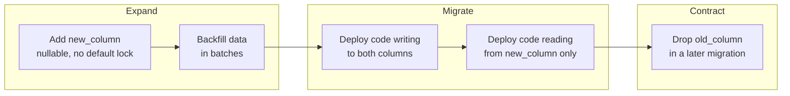

# Migrations

## Why This Matters

Your database schema changes over time — new columns, new tables, renamed fields, new indexes — at the same rate your API evolves. If those changes live only as manual `ALTER TABLE` commands someone ran once against production, you have no record of what changed, no way to reproduce the schema on a new environment, and no way to safely roll back. Migrations turn schema changes into version-controlled, repeatable code, the same discipline you already apply to application code.

## Core Concept

A migration is a small, ordered script that transforms the database schema from one known state to the next — and, ideally, back again. Each migration has an "up" operation (apply the change) and a "down" operation (reverse it). A migration tool tracks which migrations have already been applied to a given database (usually in a table like `alembic_version`), so running migrations is idempotent: it only applies what hasn't been applied yet, in the correct order.

This matters for three reasons: **reproducibility** (any environment — local, staging, production — can be brought to the exact same schema by replaying the same migration history), **collaboration** (two engineers changing the schema in parallel get a clear, mergeable history instead of silently conflicting manual changes), and **safety** (a bad migration can be rolled back with a corresponding "down" script instead of requiring manual forensic repair).

## Mental Model

Think of migrations as `git commit`s for your database schema. Each migration is a diff from one schema state to the next; the migration history is the schema's commit log; and just like `git log`, you can always ask "what does the schema currently look like, and how did it get there?"

## How It Works

**Alembic** is the standard migration tool for SQLAlchemy. It generates migration scripts (either by hand or auto-generated by diffing your ORM models against the current database schema), each stamped with a revision ID and a reference to the previous revision, forming a linked list of changes.

```
alembic revision --autogenerate -m "add orders table"
```

generates a file like:

```python
"""add orders table

Revision ID: a1b2c3d4e5f6
Revises: 9f8e7d6c5b4a
"""
from alembic import op
import sqlalchemy as sa

revision = "a1b2c3d4e5f6"
down_revision = "9f8e7d6c5b4a"

def upgrade():
    op.create_table(
        "orders",
        sa.Column("id", sa.Integer, primary_key=True),
        sa.Column("user_id", sa.Integer, sa.ForeignKey("users.id"), nullable=False),
        sa.Column("total_cents", sa.Integer, nullable=False),
        sa.Column("status", sa.String(20), nullable=False, server_default="pending"),
    )
    op.create_index("ix_orders_user_id", "orders", ["user_id"])

def downgrade():
    op.drop_index("ix_orders_user_id", table_name="orders")
    op.drop_table("orders")
```

Running `alembic upgrade head` applies every migration between the database's current recorded revision and the latest one, in order.

**Zero-downtime, backward-compatible migrations**: the trickiest part isn't writing the SQL, it's sequencing changes so that old application code (still running during a rolling deploy) and new application code both work against the schema at every point in the deploy. A naive "rename column" migration breaks old code the instant it runs, because old code still queries the old column name. The safe pattern is expand-contract:

1. **Expand**: add the new column, keep the old one, backfill data, deploy code that writes to both.
2. **Migrate**: deploy code that reads from the new column only.
3. **Contract**: once all instances are on the new code, drop the old column in a later migration.

## Architecture



## Request / Response Example

Before a migration adds an index, this query does a sequential scan:

```sql
EXPLAIN SELECT * FROM orders WHERE user_id = 42;
-- Seq Scan on orders  (cost=0.00..1834.00 rows=12 width=48)
```

After `CREATE INDEX CONCURRENTLY ix_orders_user_id ON orders (user_id);` runs (as a migration):

```sql
EXPLAIN SELECT * FROM orders WHERE user_id = 42;
-- Index Scan using ix_orders_user_id on orders  (cost=0.29..8.31 rows=12 width=48)
```

The `CONCURRENTLY` keyword is what makes this migration safe on a large, live table — see below.

## Code Example

```python
"""add is_verified column to users, safely (expand phase)

Revision ID: b2c3d4e5f6a7
Revises: a1b2c3d4e5f6
"""
from alembic import op
import sqlalchemy as sa

def upgrade():
    # nullable=True with no server_default avoids a full-table rewrite/lock
    # on large tables — a NOT NULL column with a default historically forced
    # Postgres to rewrite every row (fixed in PG 11+, but nullable-first is
    # still the safest, most portable pattern across versions).
    op.add_column("users", sa.Column("is_verified", sa.Boolean(), nullable=True))

def downgrade():
    op.drop_column("users", "is_verified")
```

```python
"""add index concurrently to avoid locking the orders table

Revision ID: c3d4e5f6a7b8
Revises: b2c3d4e5f6a7
"""
from alembic import op

def upgrade():
    # CONCURRENTLY builds the index without holding a write lock on the
    # table — critical for large, live production tables. It cannot run
    # inside a transaction block, so Alembic must be told to skip its
    # normal transactional wrapper for this migration.
    op.execute("COMMIT")  # end the implicit transaction Alembic opened
    op.execute("CREATE INDEX CONCURRENTLY ix_orders_user_id ON orders (user_id)")

def downgrade():
    op.execute("DROP INDEX CONCURRENTLY IF EXISTS ix_orders_user_id")
```

## Production Considerations

- `ALTER TABLE ... ADD COLUMN ... NOT NULL DEFAULT ...` on older Postgres versions rewrites every row and locks the table for the duration — on a large table in production, this can cause an outage. Add nullable, backfill in batches, then add the `NOT NULL` constraint separately once backfilled.
- `CREATE INDEX` without `CONCURRENTLY` takes a lock that blocks writes to the table for as long as the index build takes — always use `CONCURRENTLY` for indexes on tables that receive live traffic.
- Migrations should be reviewed like code — a migration that looks correct in a small dev database can lock a 50-million-row production table for minutes.
- Always run migrations as a separate deploy step, before the new application code goes live, and design them to be backward-compatible with the *previous* version of the code during a rolling deploy.

## Common Mistakes

- Renaming a column in one migration, which instantly breaks any old application instance still running the previous code during a rolling deploy.
- Adding a `NOT NULL` column with a default directly, locking a large table.
- Building an index without `CONCURRENTLY`, blocking writes for the build's duration.
- Editing an already-applied migration file instead of writing a new one — this desyncs environments that already ran the old version.
- Forgetting a `downgrade()` implementation, making rollback impossible when a migration turns out to be wrong.

## Best Practices

- Follow expand-contract for any breaking schema change; never combine "add" and "remove" of related columns in the same deploy.
- Use `CREATE INDEX CONCURRENTLY` for indexes on any table with live production traffic.
- Keep each migration small and focused — one logical change per migration, easy to review and reason about.
- Test migrations against a copy of production-scale data before running them for real, not just an empty dev database.

## AI Engineering Perspective

Schema changes for AI-adjacent tables (e.g., adding a `pgvector` column for embeddings, or changing embedding dimensionality when switching models) carry the same production risks as any migration, amplified by size — embedding columns are often large, and backfilling millions of rows with newly computed embeddings is a slow, resource-intensive batch job that should be designed with the same expand-contract discipline: add the new embedding column, backfill asynchronously, cut over reads, then drop the old column.

## Exercises

**Beginner**: Write an Alembic migration that adds a `phone_number` nullable column to a `users` table, with both `upgrade()` and `downgrade()`.

**Intermediate**: Write the three migrations (expand, migrate, contract) needed to safely rename a column `full_name` to `display_name` without breaking a running application during a rolling deploy.

**Advanced**: Given a `orders` table with 80 million rows, design a migration plan to add a `NOT NULL` `region` column with a backfill, without locking the table for more than a few seconds at any point.

## Key Takeaways

- Migrations are version-controlled, repeatable schema changes, tracked like a commit history via a tool like Alembic.
- Backward-compatible (expand-contract) migrations are required for zero-downtime deploys with rolling application updates.
- `NOT NULL` columns with defaults and non-concurrent index builds are the two most common ways a migration accidentally locks a production table.
- Always write both `upgrade()` and `downgrade()` so a bad migration can be reversed.
- Test migrations against production-scale data, not just an empty database.

---
Previous: [Connection Pooling](connection-pooling.md) · Next: [Repository Pattern](repository-pattern.md) · Back to [Part 4 README](README.md)
