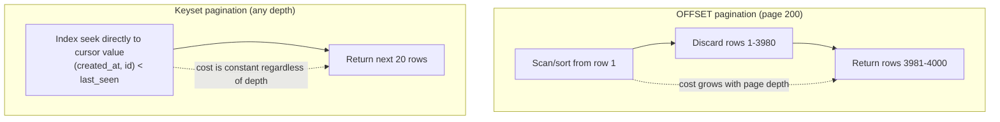

# Pagination at Scale

## Why This Matters

[Part 2's pagination chapter](../02-rest-api-design/pagination.md) introduced the API contract for pagination — `page`/`limit` or `cursor` parameters in a request, `next`/`previous` links in a response. This chapter goes one level deeper: what actually happens inside the database when you implement that contract, why the naive approach (`OFFSET`) quietly degrades as your table grows, and how to build pagination that stays fast at millions of rows.

## Core Concept

The naive way to paginate is `LIMIT 20 OFFSET 4000` — "skip the first 4000 rows, give me the next 20." This reads intuitively but hides a real cost: Postgres has to actually scan and discard all 4000 skipped rows before it can return your 20. `OFFSET` doesn't teleport to row 4000 — it counts through every row before it, every single time you request that page. As your table grows and users page deeper, each page gets progressively slower, in the worst case scanning the entire table for the last page.

**Keyset pagination** (also called cursor pagination) fixes this by replacing "skip N rows" with "give me rows after this specific value," using an indexed column as the bookmark. Instead of counting, the database does an indexed lookup directly to the right starting point — the cost of fetching page 4000 is the same as fetching page 1.

## Mental Model

`OFFSET` pagination is like finding page 400 of a book by starting at page 1 and flipping through every page until you count to 400. Keyset pagination is like using the book's index to jump straight to page 400 — you need something to look up (a sorted marker), but once you have it, the jump is instant regardless of how deep into the book you go.

## How It Works

OFFSET pagination:

```sql
SELECT id, title, created_at FROM articles
ORDER BY created_at DESC
LIMIT 20 OFFSET 4000;
```

Postgres must sort (or use an index to walk in order) through 4020 rows and discard the first 4000 before returning 20 — that discard work happens on every request for a deep page, even though the client only sees 20 rows.

Keyset pagination replaces `OFFSET` with a `WHERE` condition on the last row's sort column from the previous page:

```sql
-- Page 1
SELECT id, title, created_at FROM articles
ORDER BY created_at DESC, id DESC
LIMIT 20;

-- Next page: client sends back the last row's (created_at, id) as a cursor
SELECT id, title, created_at FROM articles
WHERE (created_at, id) < ('2026-08-15T09:00:00Z', 1042)
ORDER BY created_at DESC, id DESC
LIMIT 20;
```

The `(created_at, id)` tuple comparison is a **composite cursor**: `created_at` alone isn't guaranteed unique (two articles can share a timestamp), so `id` breaks ties and guarantees a stable, total ordering — without it, rows with identical timestamps could be skipped or duplicated across pages.

This requires a composite index matching the sort/filter columns:

```sql
CREATE INDEX ix_articles_created_at_id ON articles (created_at DESC, id DESC);
```

With this index, the `WHERE (created_at, id) < (...)` lookup is a direct index seek to the right starting point — no counting, no discarding, and the cost stays flat whether it's page 2 or page 20,000.

## Architecture



## Request / Response Example

```
GET /articles?limit=20&cursor=eyJjcmVhdGVkX2F0IjoiMjAyNi0wOC0xNVQwOTowMDowMFoiLCJpZCI6MTA0Mn0
```

(The cursor is a base64-encoded JSON blob of `{"created_at": "2026-08-15T09:00:00Z", "id": 1042}`, opaque to the client, exactly matching the pattern from [Part 2 — Pagination](../02-rest-api-design/pagination.md).)

Response:

```json
{
  "data": [
    {"id": 1041, "title": "...", "created_at": "2026-08-15T08:58:12Z"},
    {"id": 1040, "title": "...", "created_at": "2026-08-15T08:55:47Z"}
  ],
  "next_cursor": "eyJjcmVhdGVkX2F0IjoiMjAyNi0wOC0xNVQwODo1NTo0N1oiLCJpZCI6MTA0MH0"
}
```

## Code Example

```python
import base64
import json
from sqlalchemy import select, tuple_
from sqlalchemy.ext.asyncio import AsyncSession
from models import Article

def encode_cursor(created_at, id_: int) -> str:
    payload = json.dumps({"created_at": created_at.isoformat(), "id": id_})
    return base64.urlsafe_b64encode(payload.encode()).decode()

def decode_cursor(cursor: str) -> tuple[str, int]:
    payload = json.loads(base64.urlsafe_b64decode(cursor.encode()))
    return payload["created_at"], payload["id"]

async def list_articles_keyset(
    session: AsyncSession, limit: int = 20, cursor: str | None = None
):
    stmt = select(Article).order_by(Article.created_at.desc(), Article.id.desc()).limit(limit)

    if cursor:
        created_at, last_id = decode_cursor(cursor)
        # tuple_() performs the composite (created_at, id) comparison in one
        # go, matching the (created_at DESC, id DESC) index exactly.
        stmt = stmt.where(tuple_(Article.created_at, Article.id) < (created_at, last_id))

    result = await session.execute(stmt)
    articles = result.scalars().all()

    next_cursor = None
    if len(articles) == limit:
        last = articles[-1]
        next_cursor = encode_cursor(last.created_at, last.id)

    return articles, next_cursor
```

```sql
-- The supporting index — must match the ORDER BY / WHERE columns exactly,
-- including sort direction, to be used efficiently.
CREATE INDEX ix_articles_created_at_id ON articles (created_at DESC, id DESC);
```

## Production Considerations

- Keyset pagination doesn't support "jump to page 47" the way `OFFSET` does — it only supports "next" and "previous" relative to a cursor. If your product genuinely needs arbitrary page-number jumping (rare, and usually a UX smell for large datasets), `OFFSET` with a page-count cap is a reasonable compromise.
- `OFFSET` is fine for small tables or shallow pagination (first few pages of a table with thousands of rows) — the cost only becomes a real production problem at depth and scale. Don't over-engineer a low-traffic admin table with keyset pagination it doesn't need.
- Always index the exact columns used in your `ORDER BY`/cursor `WHERE` clause, with matching sort direction — a mismatched or missing index silently falls back to a full sort/scan, erasing the benefit.

## Common Mistakes

- Using `OFFSET` for a public, deep-paginated feed (e.g., search results, activity logs) that grows to millions of rows, causing the API to time out on later pages.
- Using a single, non-unique column (like `created_at` alone) as a cursor, causing rows with duplicate timestamps to be skipped or duplicated across pages.
- Building the composite index in the wrong column order or direction relative to the query, so Postgres can't use it efficiently.
- Exposing raw, guessable cursor values instead of opaque encoded tokens, letting clients construct arbitrary (and potentially expensive or incorrect) queries.

## Best Practices

- Default to keyset pagination for any endpoint whose underlying table can grow large or whose users page deep (feeds, logs, search results).
- Always pick a cursor column combination that's unique and matches an index exactly, typically `(sort_column, id)`.
- Encode cursors opaquely (base64 JSON, or better, signed) so clients can't tamper with or reverse-engineer them.
- Reserve `OFFSET` for small, shallow, or admin-only pagination where simplicity outweighs the performance cost.

## AI Engineering Perspective

RAG ingestion pipelines that page through large source tables or document stores to process records in batches (see [Part 16 — RAG APIs](../16-rag-apis/README.md)) hit the exact same `OFFSET` degradation at much larger scale than typical user-facing pagination — a batch job re-scanning millions of already-processed rows to reach the next unprocessed batch is a common, avoidable source of ingestion slowdown. Keyset pagination on an indexed `id` or `updated_at` column is the standard fix for these background processing loops, not just for HTTP APIs.

## Exercises

**Beginner**: Explain in your own words why `OFFSET 100000` is slower than `OFFSET 10` on the same table.

**Intermediate**: Implement keyset pagination for a `comments` table ordered by `(created_at DESC, id DESC)`, including the composite index definition.

**Advanced**: Design a pagination strategy for an endpoint that must support both "jump to an arbitrary page" (rare, used by an internal admin tool) and "efficient infinite scroll" (common, used by the public feed) against the same underlying table.

## Key Takeaways

- `OFFSET` pagination cost grows with page depth because the database must scan and discard every skipped row.
- Keyset (cursor) pagination replaces counting with an indexed lookup, keeping cost constant regardless of depth.
- Cursors need a unique, indexed composite key (typically `sort_column, id`) to guarantee stable ordering without skips or duplicates.
- `OFFSET` remains fine for small or shallow pagination — apply keyset pagination where it's actually needed.
- This chapter builds on the API-contract-level pagination design in [Part 2 — Pagination](../02-rest-api-design/pagination.md); read that first if you haven't.

---
Previous: [Repository Pattern](repository-pattern.md) · Next: [Database Performance](database-performance.md) · Back to [Part 4 README](README.md)
