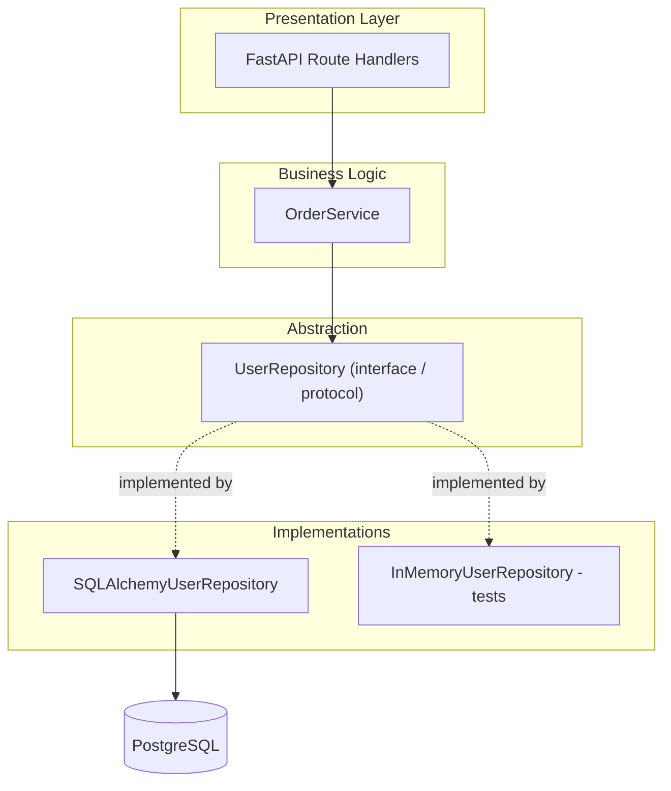

# Repository Pattern

## Why This Matters

When your route handlers directly call `session.execute(select(User)...)` scattered across dozens of files, two problems compound over time: your business logic and your persistence details tangle together, and testing anything requires a real database. The repository pattern draws a clean line between "what data operations does my application need" and "how exactly are those operations implemented against Postgres" — a boundary that pays off as the codebase grows, and costs real complexity when it doesn't.

## Core Concept

A repository is a class that abstracts persistence behind an interface expressed in your application's own vocabulary — `get_by_email`, `create_order`, `list_pending_orders` — rather than in SQL or ORM vocabulary. The rest of your application (route handlers, business logic services) depends only on this interface, never directly on SQLAlchemy sessions or raw SQL. The concrete implementation underneath can be swapped — a different database, an in-memory fake for tests, a caching layer — without touching any code that calls the repository.

This is a direct application of the **dependency inversion principle**: high-level business logic shouldn't depend on low-level persistence details; both should depend on an abstraction.

## Mental Model

Think of a repository as a librarian. You don't go pull books off shelves yourself (write SQL inline in your business logic) — you ask the librarian "find me books by this author" (call `repository.get_by_author(...)`), and the librarian knows exactly which shelf, which system, which card catalog to use. If the library changes its shelving system entirely, you don't notice — you're still just asking the librarian.

## How It Works

A repository typically exposes methods named after domain operations, not database operations:

```python
class UserRepository:
    async def get_by_id(self, user_id: int) -> User | None: ...
    async def get_by_email(self, email: str) -> User | None: ...
    async def create(self, email: str, full_name: str) -> User: ...
    async def list_active(self, limit: int, offset: int) -> list[User]: ...
```

Route handlers and service-layer business logic call these methods and never see a `select()` statement or a raw SQL string. This has two concrete payoffs: unit tests for business logic can inject a fake, in-memory repository instead of hitting a real database (fast, deterministic tests), and if you later need to change how users are stored — add caching in front of Postgres, migrate to a different table structure — you change one file, not every route handler that touches users.

## Architecture



## Request / Response Example

```
POST /users HTTP/1.1
Content-Type: application/json

{"email": "jane@example.com", "full_name": "Jane Doe"}
```

Internally, the route handler calls `await user_repository.create(email=..., full_name=...)`, which — inside the SQLAlchemy implementation — issues:

```sql
INSERT INTO users (email, full_name) VALUES ($1, $2)
RETURNING id, created_at;
```

The route handler never sees this SQL; it just receives back a `User` object.

```
HTTP/1.1 201 Created
Content-Type: application/json

{"id": 101, "email": "jane@example.com", "full_name": "Jane Doe"}
```

## Code Example

```python
# repositories.py
from typing import Protocol
from sqlalchemy import select
from sqlalchemy.ext.asyncio import AsyncSession
from models import User

class UserRepository(Protocol):
    """The interface the rest of the app depends on."""
    async def get_by_id(self, user_id: int) -> User | None: ...
    async def get_by_email(self, email: str) -> User | None: ...
    async def create(self, email: str, full_name: str) -> User: ...


class SQLAlchemyUserRepository:
    """Real implementation backed by Postgres via SQLAlchemy."""

    def __init__(self, session: AsyncSession):
        self.session = session

    async def get_by_id(self, user_id: int) -> User | None:
        result = await self.session.execute(select(User).where(User.id == user_id))
        return result.scalar_one_or_none()

    async def get_by_email(self, email: str) -> User | None:
        result = await self.session.execute(select(User).where(User.email == email))
        return result.scalar_one_or_none()

    async def create(self, email: str, full_name: str) -> User:
        user = User(email=email, full_name=full_name)
        self.session.add(user)
        await self.session.commit()
        await self.session.refresh(user)
        return user
```

```python
# In-memory fake used only in tests — no database required.
class InMemoryUserRepository:
    def __init__(self):
        self._users: dict[int, User] = {}
        self._next_id = 1

    async def get_by_id(self, user_id: int) -> User | None:
        return self._users.get(user_id)

    async def get_by_email(self, email: str) -> User | None:
        return next((u for u in self._users.values() if u.email == email), None)

    async def create(self, email: str, full_name: str) -> User:
        user = User(id=self._next_id, email=email, full_name=full_name)
        self._users[self._next_id] = user
        self._next_id += 1
        return user
```

```python
# routes.py — depends only on the abstraction, wired via FastAPI's DI
# (see Part 3: dependency-injection.md)
from fastapi import APIRouter, Depends, HTTPException
from sqlalchemy.ext.asyncio import AsyncSession
from db import get_session
from repositories import SQLAlchemyUserRepository, UserRepository

router = APIRouter()

def get_user_repository(session: AsyncSession = Depends(get_session)) -> UserRepository:
    return SQLAlchemyUserRepository(session)

@router.post("/users", status_code=201)
async def create_user(email: str, full_name: str, repo: UserRepository = Depends(get_user_repository)):
    existing = await repo.get_by_email(email)
    if existing:
        raise HTTPException(409, "Email already registered")
    user = await repo.create(email=email, full_name=full_name)
    return {"id": user.id, "email": user.email, "full_name": user.full_name}
```

## Production Considerations

- Repositories work best when your persistence model genuinely might change, or when your business logic has real branching complexity worth unit-testing in isolation from the database.
- Keep repository methods domain-focused, not a thin 1:1 wrapper around every possible SQL query — a repository with a method per ad-hoc query defeats the purpose.
- Transactions that span multiple repositories (e.g., debit one account's repository, credit another's) need a shared session/unit-of-work passed in, not each repository managing its own transaction independently (see [Database Transactions](database-transactions.md)).

## Common Mistakes

- Introducing a repository layer for a small CRUD API where the ORM session already provides enough abstraction — pure overhead with no payoff.
- Leaking SQLAlchemy-specific types (`Query`, `Select`) through the repository interface, which defeats the abstraction's purpose.
- Writing a repository method per exact query variant used anywhere in the app, producing a bloated interface that's no easier to test than raw session calls.
- Forgetting that multiple repository calls within one request may need to share a single transaction/session — instantiating a new session per repository call breaks atomicity.

## Best Practices

- Reach for the repository pattern when you have real business logic to unit-test independently of the database, or a genuine chance of swapping persistence implementations.
- For small CRUD-heavy APIs, calling the SQLAlchemy session directly from route handlers (as shown in [PostgreSQL Integration](postgresql-integration.md)) is often simpler and perfectly fine — don't add a layer you don't need.
- Keep repository interfaces narrow and domain-shaped, not a mirror of every SQL query in the app.
- Pass a shared session into repositories that need to participate in the same transaction, following the project architecture conventions in [Part 3 — Project Architecture](../03-building-apis/project-architecture.md).

## AI Engineering Perspective

The repository pattern is a natural fit for exposing safe, bounded database access to an AI agent's tool calls: instead of giving an agent a raw "execute SQL" tool (a serious security and correctness risk, see [Part 17 — AI Agents & MCP](../17-ai-agents-and-mcp/README.md)), you expose a small number of well-tested repository methods as tools — `get_order_status`, `list_recent_orders` — each with fixed, validated inputs and no ability to run arbitrary queries.

## Exercises

**Beginner**: Write a `ProductRepository` interface with `get_by_id` and `list_all` methods, plus a SQLAlchemy-backed implementation.

**Intermediate**: Write an `InMemoryProductRepository` fake and a unit test for a business-logic function (`apply_discount`) that depends on the repository interface, without touching a real database.

**Advanced**: Design a repository interface for the funds-transfer scenario from [Database Transactions](database-transactions.md), where the transfer must be atomic across two repository calls sharing one session — sketch the method signatures and how the shared transaction is passed in.

## Key Takeaways

- The repository pattern abstracts persistence behind a domain-shaped interface, decoupling business logic from database details.
- Its main payoffs are testability (fake repositories in unit tests) and the ability to change persistence implementation without touching callers.
- It's overkill for small CRUD APIs where calling the ORM session directly is simpler and equally maintainable — apply it deliberately, not by default.
- Multi-repository operations that must be atomic need a shared session/transaction, not independently managed ones.

---
Previous: [Migrations](migrations.md) · Next: [Pagination at Scale](pagination-at-scale.md) · Back to [Part 4 README](README.md)
