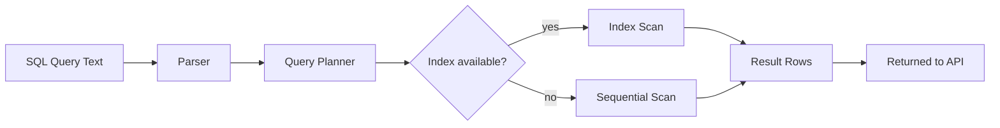

# SQL Fundamentals for APIs

## Why This Matters

Every API that isn't a toy eventually talks to a database, and almost every production database still speaks SQL. You can hide behind an ORM for a while, but the moment a query is slow, returns the wrong rows, or needs a join across three tables, you need to read and write SQL directly. This chapter gives you the working SQL vocabulary a backend engineer needs to be dangerous — not a full database course, just the 20% that shows up in 80% of API code.

## Core Concept

SQL (Structured Query Language) is a declarative language: you describe *what* data you want, not *how* to fetch it. The database's query planner decides the "how" — which indexes to use, which join algorithm to run, in what order to filter rows. This separation is powerful: you write `SELECT * FROM orders WHERE status = 'pending'` and the database figures out the fastest path to that result, using statistics it keeps about your data.

The core statements you need are the CRUD verbs — `SELECT`, `INSERT`, `UPDATE`, `DELETE` — plus the clauses that shape a `SELECT`: `WHERE`, `JOIN`, `GROUP BY`, `ORDER BY`, `LIMIT`.

## Mental Model

Think of a table as a spreadsheet: rows are records, columns are fields, and every row typically has a unique `id`. A `JOIN` is what happens when the data you need is spread across two spreadsheets and you want to combine them side by side based on a matching column — like using VLOOKUP, but for entire result sets instead of one cell at a time.

## How It Works

**SELECT** retrieves rows:

```sql
SELECT id, email, created_at
FROM users
WHERE is_active = true
ORDER BY created_at DESC
LIMIT 20;
```

Execution conceptually happens in this order (not the order you type it): `FROM` → `WHERE` → `GROUP BY` → `HAVING` → `SELECT` → `ORDER BY` → `LIMIT`. The database decides which rows qualify (`WHERE`) before it decides what to show you (`SELECT` columns) or how to sort it (`ORDER BY`). Understanding this order explains why you can't reference a `SELECT` alias in a `WHERE` clause — the `WHERE` runs before the alias exists.

**INSERT** adds rows:

```sql
INSERT INTO orders (user_id, total_cents, status)
VALUES (42, 1999, 'pending')
RETURNING id, created_at;
```

`RETURNING` (PostgreSQL-specific) hands back the generated `id` and any default values in one round trip — critical for APIs that need to return the created resource's ID to the client.

**UPDATE** and **DELETE** modify or remove rows, and both are dangerous without a `WHERE` clause — `UPDATE orders SET status = 'cancelled'` with no `WHERE` cancels every order in the table.

```sql
UPDATE orders SET status = 'shipped' WHERE id = 42;
DELETE FROM orders WHERE id = 42 AND status = 'cancelled';
```

**JOINs** combine rows from multiple tables on a matching column. An `INNER JOIN` only returns rows that match in both tables; a `LEFT JOIN` returns every row from the left table even if there's no match on the right (filling missing columns with `NULL`). This distinction matters constantly in APIs: "get every user, and their most recent order if they have one" is a `LEFT JOIN`, because users without orders should still appear.

```sql
SELECT u.id, u.email, o.id AS order_id, o.total_cents
FROM users u
LEFT JOIN orders o ON o.user_id = u.id AND o.status = 'pending';
```

**GROUP BY** collapses rows into groups and pairs with aggregate functions (`COUNT`, `SUM`, `AVG`, `MAX`):

```sql
SELECT user_id, COUNT(*) AS order_count, SUM(total_cents) AS lifetime_value
FROM orders
GROUP BY user_id
HAVING COUNT(*) > 5;
```

`HAVING` filters groups after aggregation, the same way `WHERE` filters rows before aggregation.

**Indexes**, conceptually, are a sorted lookup structure the database maintains alongside a table so it doesn't have to scan every row to find matches. A `WHERE user_id = 42` on an indexed `user_id` column is a lookup in a sorted structure (fast); on an unindexed column it's a full table scan (slow, and gets slower as the table grows). We go deeper on index design in [Database Performance](database-performance.md).

## Architecture



## Request / Response Example

An API endpoint `GET /orders?status=pending&user_id=42` typically compiles to:

```sql
SELECT id, user_id, total_cents, status, created_at
FROM orders
WHERE status = 'pending' AND user_id = 42
ORDER BY created_at DESC
LIMIT 20 OFFSET 0;
```

Result set:

```
 id | user_id | total_cents | status  |         created_at
----+---------+-------------+---------+----------------------------
 88 |      42 |        1999 | pending | 2026-08-19 14:02:11.123+00
 71 |      42 |        4500 | pending | 2026-08-15 09:30:02.884+00
```

The API then serializes each row into a JSON object for the HTTP response body.

## Code Example

```python
# Raw SQL executed through SQLAlchemy's async engine (no ORM layer yet —
# see orm-concepts.md for when to prefer the ORM instead).
import os
from sqlalchemy import text
from sqlalchemy.ext.asyncio import create_async_engine

DATABASE_URL = os.environ["DATABASE_URL"]  # never hardcode credentials
engine = create_async_engine(DATABASE_URL)

async def get_pending_orders(user_id: int) -> list[dict]:
    query = text("""
        SELECT id, user_id, total_cents, status, created_at
        FROM orders
        WHERE status = :status AND user_id = :user_id
        ORDER BY created_at DESC
        LIMIT 20
    """)
    async with engine.connect() as conn:
        # Bound parameters (:status, :user_id) prevent SQL injection —
        # never use an f-string to build a query with user input.
        result = await conn.execute(query, {"status": "pending", "user_id": user_id})
        return [dict(row._mapping) for row in result]
```

## Production Considerations

- Always use parameterized queries (`:param` placeholders), never string interpolation, to avoid SQL injection (see [SQL Injection](../10-api-security/sql-injection.md) if it exists in Part 10).
- `SELECT *` is convenient in exploration but wastes bandwidth and breaks when columns change — name columns explicitly in production code.
- Every `WHERE`, `JOIN ON`, and `ORDER BY` column that filters or sorts large tables is a candidate for an index — check with `EXPLAIN ANALYZE` (covered in [Database Performance](database-performance.md)).
- `LEFT JOIN` vs `INNER JOIN` is a business-logic decision, not a style choice — get it wrong and you silently drop or duplicate rows in an API response.

## Common Mistakes

- Forgetting `WHERE` on `UPDATE`/`DELETE` and modifying the entire table.
- Using `INNER JOIN` when a `LEFT JOIN` was needed, silently excluding valid rows (e.g., users with zero orders disappearing from a report).
- Filtering an aggregate with `WHERE` instead of `HAVING` (a `WHERE COUNT(*) > 5` is a syntax error — aggregates aren't available yet at that stage of execution).
- Building queries via string concatenation with request input — the #1 SQL injection vector.
- Assuming `ORDER BY` order is guaranteed without an explicit clause — unindexed, unordered queries can return rows in any order across calls.

## Best Practices

- Write the query in a SQL client first, verify the result set, then wire it into code.
- Name columns explicitly in `SELECT`.
- Use `RETURNING` on `INSERT`/`UPDATE` in PostgreSQL to avoid a second round trip.
- Keep `WHERE` clauses on indexed columns for anything that runs on every request.
- Learn to read `EXPLAIN` output early — it will save you from performance surprises in production.

## AI Engineering Perspective

RAG pipelines and AI agents that query relational data (e.g., a "text-to-SQL" tool call) generate SQL dynamically from natural language. The same injection and correctness risks apply, amplified: an LLM-generated query might use `DELETE` when the user asked to "clean up test orders," or omit a `WHERE` clause it hallucinated as unnecessary. Production AI-database integrations should run LLM-generated SQL through a read-only role, a query validator, and a `LIMIT` cap before execution — never against a role with write access.

## Exercises

**Beginner**: Write a `SELECT` that returns the 10 most recently created users, only the `id`, `email`, and `created_at` columns.

**Intermediate**: Write a query that returns each user's total number of orders and total spend, including users with zero orders (hint: `LEFT JOIN` + `COUNT`).

**Advanced**: Given an `orders` table with millions of rows, write a query for "orders placed in the last 7 days with status = 'pending'" and explain which column(s) you'd index to make it fast.

## Key Takeaways

- SQL is declarative — you describe the result, the query planner decides execution.
- `WHERE` runs before `SELECT`; `HAVING` runs after `GROUP BY` — this order explains many "why doesn't this work" surprises.
- `LEFT JOIN` vs `INNER JOIN` changes which rows appear in your API response — choose deliberately.
- Always parameterize queries; never interpolate user input into SQL text.
- Indexes turn `WHERE`/`JOIN`/`ORDER BY` from table scans into fast lookups — introduced conceptually here, detailed in [Database Performance](database-performance.md).

---
Next: [PostgreSQL Integration](postgresql-integration.md) · Back to [Part 4 README](README.md) · [Glossary](../../resources/glossary.md)
