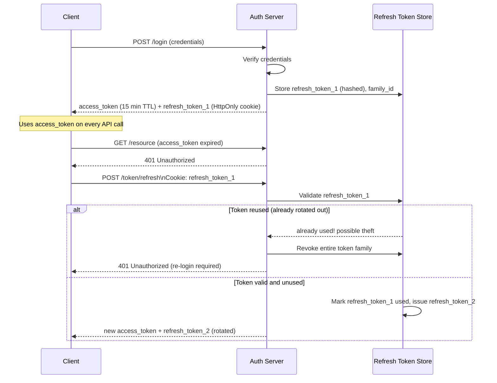

# Access vs Refresh Tokens

## Why This Matters

Two competing needs collide in almost every token-based auth system: users hate re-authenticating constantly, but short-lived credentials are far safer than long-lived ones (as established in [JWT Deeply Explained](jwt-deeply-explained.md), a leaked token is dangerous for exactly as long as it remains valid). The **access token / refresh token** pattern resolves this tension without asking the user to type a password every 15 minutes, and it's the pattern behind virtually every "stay logged in" experience in modern apps, including the [OAuth 2.0](oauth2.md) flows covered in the next chapter.

## Core Concept

- **Access token**: short-lived (typically minutes), sent on every API request to prove the caller's identity and permissions. Usually a stateless [JWT](jwt-deeply-explained.md) so it can be verified without a database round-trip.
- **Refresh token**: long-lived (hours to weeks), used *only* to obtain a new access token when the current one expires. It is never sent to ordinary resource endpoints — only to a dedicated token-refresh endpoint.

The split lets you get the security benefit of short-lived credentials (small exposure window if leaked) without the usability cost of frequent full logins (the refresh token silently gets the user a new access token in the background).

## Mental Model

Think of an **access token like a day pass at a conference, and a refresh token like your paid conference registration**. The day pass gets you through every door for one day — lose it, and whoever finds it can walk around as you for the rest of that day, but no longer. Your registration record (refresh token) isn't shown at every door; you present it once each morning at the registration desk to get a fresh day pass. Because the registration desk is a single, controlled checkpoint, it's much easier to revoke your registration entirely (block you from ever getting a new day pass) than it would be to hunt down and cancel a day pass you already dropped somewhere in the building.

## How It Works

1. **Login**: user authenticates with credentials. Server issues both an access token (short TTL, e.g. 15 minutes) and a refresh token (long TTL, e.g. 30 days), typically returning the access token in the response body and the refresh token in an `HttpOnly` cookie (or, for native apps, in secure device storage).
2. **Normal API calls**: client sends the access token as a bearer token on every request. No refresh token is involved.
3. **Access token expires**: the client's next API call gets a `401`. Instead of forcing a full login, the client silently calls a `/token/refresh` endpoint, presenting the refresh token.
4. **Server validates the refresh token**: unlike an access token, a refresh token is normally checked against server-side state (a database or cache), because refresh tokens *must* be revocable — this is the primary lever you have for "log this user out everywhere" or "kill this stolen session."
5. **Refresh token rotation**: on each successful refresh, the server issues a **new** refresh token and invalidates the old one, rather than reusing the same refresh token indefinitely. This means a refresh token is effectively single-use, which gives you a powerful detection signal: **if an already-used (rotated-out) refresh token is ever presented again, that's strong evidence of token theft** — a legitimate client would never present a token it already exchanged, so the server can respond by revoking the entire token family (every token descended from that login) as a precaution.
6. **Logout**: the server explicitly revokes the refresh token server-side. The already-issued access token remains valid until its own short expiry — which is exactly why keeping that expiry short matters.

## Architecture



## Request / Response Example

Login response:

```http
POST /login HTTP/1.1
Content-Type: application/json

{"email": "user@example.com", "password": "correct horse battery staple"}
```

```http
HTTP/1.1 200 OK
Set-Cookie: refresh_token=rt_8e2a...; HttpOnly; Secure; SameSite=Strict; Path=/token/refresh; Max-Age=2592000
Content-Type: application/json

{"access_token": "eyJhbGciOiJIUzI1NiIsInR5cCI6IkpXVCJ9...", "token_type": "bearer", "expires_in": 900}
```

Refresh request, once the access token has expired:

```http
POST /token/refresh HTTP/1.1
Cookie: refresh_token=rt_8e2a...
```

```http
HTTP/1.1 200 OK
Set-Cookie: refresh_token=rt_9f31...; HttpOnly; Secure; SameSite=Strict; Path=/token/refresh; Max-Age=2592000
Content-Type: application/json

{"access_token": "eyJhbGciOiJIUzI1NiIsInR5cCI6IkpXVCJ9...", "token_type": "bearer", "expires_in": 900}
```

Reuse of an already-rotated refresh token (theft signal):

```http
HTTP/1.1 401 Unauthorized
Content-Type: application/json

{"error": "refresh_token_reused", "message": "Session revoked. Please log in again."}
```

## Code Example

```python
import os
import time
import secrets
import hashlib
from fastapi import FastAPI, HTTPException, Response, Request
from jose import jwt

app = FastAPI()

JWT_SECRET = os.environ["JWT_SECRET"]
ALGORITHM = "HS256"
ACCESS_TOKEN_TTL = 900        # 15 minutes
REFRESH_TOKEN_TTL = 2592000   # 30 days

# In production: a database table keyed by hashed refresh token, storing
# {family_id, user_id, used: bool, expires_at}. Rotation and theft-detection
# both depend on this being real, queryable server-side state.
REFRESH_STORE: dict[str, dict] = {}


def hash_token(token: str) -> str:
    return hashlib.sha256(token.encode()).hexdigest()


def issue_access_token(user_id: str) -> str:
    now = int(time.time())
    payload = {"sub": user_id, "iat": now, "exp": now + ACCESS_TOKEN_TTL}
    return jwt.encode(payload, JWT_SECRET, algorithm=ALGORITHM)


def issue_refresh_token(user_id: str, family_id: str) -> str:
    raw = secrets.token_urlsafe(32)
    REFRESH_STORE[hash_token(raw)] = {
        "user_id": user_id,
        "family_id": family_id,
        "used": False,
        "expires_at": time.time() + REFRESH_TOKEN_TTL,
    }
    return raw


@app.post("/login")
async def login(response: Response, email: str, password: str):
    user = authenticate(email, password)
    if not user:
        raise HTTPException(status_code=401, detail="Invalid credentials")

    family_id = secrets.token_hex(8)  # groups all tokens descended from this login
    access_token = issue_access_token(user["id"])
    refresh_token = issue_refresh_token(user["id"], family_id)

    response.set_cookie(
        "refresh_token", refresh_token,
        httponly=True, secure=True, samesite="strict",
        path="/token/refresh", max_age=REFRESH_TOKEN_TTL,
    )
    return {"access_token": access_token, "token_type": "bearer", "expires_in": ACCESS_TOKEN_TTL}


@app.post("/token/refresh")
async def refresh(request: Request, response: Response):
    raw_token = request.cookies.get("refresh_token")
    if not raw_token:
        raise HTTPException(status_code=401, detail="Missing refresh token")

    record = REFRESH_STORE.get(hash_token(raw_token))
    if record is None or record["expires_at"] < time.time():
        raise HTTPException(status_code=401, detail="Refresh token invalid or expired")

    if record["used"]:
        # This exact refresh token was already exchanged once before.
        # A legitimate client never presents a used token - this is the
        # signature of token theft (attacker replaying a stolen token,
        # or the legitimate client and attacker racing each other).
        revoke_token_family(record["family_id"])
        raise HTTPException(status_code=401, detail="Refresh token reuse detected - session revoked")

    # Rotate: retire this token, issue a new one in the same family.
    record["used"] = True
    new_refresh_token = issue_refresh_token(record["user_id"], record["family_id"])
    new_access_token = issue_access_token(record["user_id"])

    response.set_cookie(
        "refresh_token", new_refresh_token,
        httponly=True, secure=True, samesite="strict",
        path="/token/refresh", max_age=REFRESH_TOKEN_TTL,
    )
    return {"access_token": new_access_token, "token_type": "bearer", "expires_in": ACCESS_TOKEN_TTL}


def revoke_token_family(family_id: str) -> None:
    for record in REFRESH_STORE.values():
        if record["family_id"] == family_id:
            record["used"] = True  # effectively dead; also could hard-delete


def authenticate(email: str, password: str) -> dict | None:
    return {"id": "user_123"} if email and password else None
```

## Production Considerations

- **Store refresh tokens hashed**, exactly like [API keys](api-keys.md) — a database breach shouldn't hand out usable refresh tokens.
- **Bind refresh tokens to a delivery mechanism that limits exposure** — an `HttpOnly`, `Secure`, `SameSite=Strict` cookie scoped to the refresh path only (not sent on every request) for web clients; secure device keychain storage for native/mobile apps.
- **Always rotate refresh tokens on use**, and implement reuse detection — this is the single highest-leverage security control in this pattern, because it turns "a refresh token leaked" from a silent, ongoing compromise into a detectable, one-time event.
- **Cap absolute session lifetime**, not just refresh-token TTL, so an actively-refreshed session doesn't extend forever — e.g., even with continuous refreshing, force full re-login after 90 days.
- **Keep access token TTL short enough that revoking the refresh token has a bounded, acceptable delay** before the access token itself expires — 5–15 minutes is a common range.

## Common Mistakes

- **Never rotating refresh tokens** — reusing the same refresh token for its entire lifetime means a single leak grants an attacker access for the full TTL (potentially weeks), with no way to detect the compromise from usage patterns.
- **Sending the refresh token on every API request** instead of only to the refresh endpoint — this needlessly multiplies its exposure surface (every log, every proxy, every request now carries your longest-lived credential).
- **Storing the refresh token in `localStorage`** in a browser app, exposing your longest-lived credential directly to XSS — this is worse than doing the same with an access token, precisely because of the much longer validity window.
- **Making access token TTL too long** "to reduce refresh calls" — this defeats the entire purpose of the pattern, since the access token itself becomes the long-lived risk.
- **Not implementing reuse detection**, missing the single best signal you have for catching token theft in real time.

## Best Practices

- Short access token TTL (minutes) + long-lived, rotated refresh token = the standard, well-tested pattern.
- Always rotate refresh tokens on every use and detect/react to reuse of an already-rotated token.
- Scope the refresh token's cookie path/storage narrowly so it's only ever sent to the refresh endpoint.
- Set an absolute maximum session lifetime independent of continuous refreshing.
- Provide an explicit, server-enforced logout that revokes the refresh token, not just a client-side token deletion.

## AI Engineering Perspective

The access/refresh pattern is directly relevant to long-running AI agent sessions and streaming interactions: an agent conversation or a background job orchestrating multiple [tool calls](../17-ai-agents-and-mcp/README.md) can easily outlive a short access token's TTL, so agent frameworks need the same silent-refresh capability a web app needs — refreshing the access token mid-session without interrupting an in-flight multi-step agent task or a long-lived streaming connection. It's also a useful model for **AI-specific credential scoping**: some production LLM gateways issue their own short-lived, scoped access tokens to internal services (rather than passing the upstream provider's raw API key everywhere), refreshed from a more tightly held, revocable long-lived credential — directly mirroring this pattern and reducing how widely the "real" provider secret needs to be distributed. See [Part 15 — Production AI Systems](../15-production-ai-systems/README.md) for more on this kind of internal credential architecture.

## Exercises

**Beginner**
1. Explain, in one or two sentences, why a stolen access token is less dangerous than a stolen refresh token, all else being equal.
2. Why does a full logout need to revoke the refresh token server-side rather than just deleting it client-side?

**Intermediate**
3. Extend the `/token/refresh` handler above so that revoking a token family also immediately invalidates any already-issued access tokens for that user (hint: this requires moving away from purely stateless access-token verification for that check — describe how, without necessarily implementing it).

**Advanced**
4. Design the data model and logic for "log out of all other devices except this one" using the refresh token family concept introduced in this chapter.

A full, runnable implementation of this exact pattern — JWT access tokens paired with rotated refresh tokens in FastAPI — is available in [`examples/authentication/`](../../examples/authentication/), and forms the backbone of [Project 2 — Authentication Service](../../projects/02-authentication-service/).

## Key Takeaways

- Short-lived access tokens minimize exposure; long-lived, server-tracked refresh tokens minimize how often users must fully re-authenticate.
- Refresh tokens should be rotated on every use — reuse of an already-rotated token is a strong, actionable signal of theft.
- Refresh tokens carry more risk than access tokens due to their longer lifetime, so they deserve tighter storage and transport scoping (narrow cookie path, `HttpOnly`, `Secure`, `SameSite=Strict`).
- This pattern is what OAuth 2.0's access/refresh tokens (next chapter) are built on, and it generalizes well to long-running AI agent sessions.
