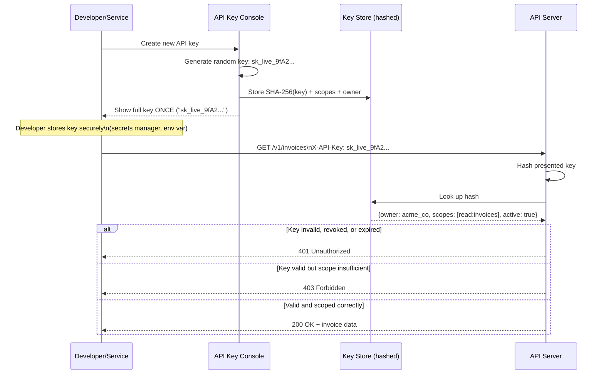

# API Keys

## Why This Matters

Not every caller of your API is a human sitting behind a browser with cookies. Backend services, CI pipelines, third-party integrations, and command-line tools all need a way to authenticate that doesn't involve a login form, a session, or a redirect flow. **API keys** are the simplest possible answer: a long, static secret string that identifies (and often authenticates) the caller. They're everywhere — every cloud provider, payment processor, and LLM provider issues them — but their simplicity is also their biggest risk: a leaked API key is often full account access, forever, until someone notices and rotates it.

## Core Concept

An **API key** is a unique, typically high-entropy string issued to a client (a developer, a service, an application) that identifies who is calling and is used to authenticate requests — most commonly sent as a header like `X-API-Key: <key>` or as part of an `Authorization` header.

It's important to be precise about what an API key *is not*: unlike a [bearer token](bearer-tokens.md) issued by an OAuth flow, an API key is usually long-lived, manually generated, and doesn't inherently carry structured claims (expiry, scopes, subject) unless the system issuing it builds that structure in. An API key is, at its core, closer to a password than to a JWT — the security model relies entirely on the string staying secret.

## Mental Model

Think of an API key like a physical key to a building, cut once and handed to a specific contractor. It doesn't say "I am contractor Jane Doe" — the building's front desk maintains a separate ledger mapping "key #4471 was cut for Jane's Cleaning Co." The key itself, if lost, works for whoever picks it up; there's no photo ID check. That's exactly the property that makes API keys good for *automated, low-friction service authentication* and risky for *anything requiring strong identity assurance* — if it leaks, whoever has it is fully trusted until someone revokes it.

## How It Works

1. **Generation**: the server generates a cryptographically random key, typically with a recognizable prefix (`sk_live_...`, `pk_test_...`) that helps identify the key's type/environment at a glance (this is how tools like GitHub's secret scanning can detect leaked keys in public repos).
2. **Issuance**: the *full* key is shown to the developer exactly once, at creation time. The server never displays it again.
3. **Storage at rest**: the server stores only a **hash** of the key (e.g., SHA-256), never the plaintext — the same principle as password storage. On each request, the server hashes the presented key and compares it to the stored hash.
4. **Verification**: on each request, the server looks up the key (by hash, or by a fast-lookup prefix plus hash comparison), checks it's active and not expired/revoked, and resolves it to the owning account/service plus its permitted scopes.
5. **Scoping**: well-designed API key systems attach explicit **scopes** (`read:orders`, `write:invoices`) and constraints (rate limits, IP allowlists, expiry) to each key, so a leaked key doesn't equal full account compromise.
6. **Rotation/revocation**: keys should be revocable individually and support planned rotation (issue a new key, run both in parallel briefly, retire the old one) without downtime.

## Architecture



## Request / Response Example

```http
GET /v1/invoices?status=paid HTTP/1.1
Host: api.example.com
X-API-Key: sk_live_9fA2c7Dq1mZpN0xR3vLk8s
Accept: application/json
```

```http
HTTP/1.1 200 OK
Content-Type: application/json

{"invoices": [{"id": "inv_101", "amount": 4200, "status": "paid"}]}
```

Response when the key is valid but lacks the required scope:

```http
HTTP/1.1 403 Forbidden
Content-Type: application/json

{"error": "insufficient_scope", "required_scope": "write:invoices"}
```

Response when the key has been revoked:

```http
HTTP/1.1 401 Unauthorized
Content-Type: application/json

{"error": "invalid_api_key"}
```

## Code Example

```python
import hashlib
import hmac
import os
import secrets
from datetime import datetime, timezone

from fastapi import FastAPI, Header, HTTPException, Depends

app = FastAPI()

KEY_PREFIX = "sk_live_"

# In production: a database table, indexed on key_hash, not an in-memory dict.
# Row shape: {key_hash, owner_id, scopes, created_at, expires_at, revoked_at}
API_KEY_STORE: dict[str, dict] = {}


def generate_api_key() -> tuple[str, str]:
    """Returns (plaintext_key_shown_once, hash_stored_in_db)."""
    raw = secrets.token_urlsafe(32)
    full_key = f"{KEY_PREFIX}{raw}"
    key_hash = hash_key(full_key)
    return full_key, key_hash


def hash_key(key: str) -> str:
    # SHA-256 is sufficient here (unlike password hashing) because API keys
    # are already high-entropy random strings, not low-entropy human-chosen
    # secrets - there's no offline brute-force risk the way there is with
    # passwords, so we don't need bcrypt/argon2's deliberate slowness.
    return hashlib.sha256(key.encode()).hexdigest()


def create_key_for_owner(owner_id: str, scopes: list[str]) -> str:
    plaintext, key_hash = generate_api_key()
    API_KEY_STORE[key_hash] = {
        "owner_id": owner_id,
        "scopes": scopes,
        "created_at": datetime.now(timezone.utc),
        "revoked": False,
    }
    return plaintext  # caller must show/store this now - it can't be retrieved again


def verify_api_key(x_api_key: str = Header(..., alias="X-API-Key")) -> dict:
    if not x_api_key.startswith(KEY_PREFIX):
        raise HTTPException(status_code=401, detail="Invalid API key format")

    key_hash = hash_key(x_api_key)
    record = API_KEY_STORE.get(key_hash)

    # Use a constant-time-safe lookup pattern; dict lookup by hash is fine here
    # because we're comparing hashes, not doing a raw string compare of secrets.
    if record is None or record["revoked"]:
        raise HTTPException(status_code=401, detail="Invalid or revoked API key")

    return record


def require_scope(scope: str):
    def dependency(key_record: dict = Depends(verify_api_key)) -> dict:
        if scope not in key_record["scopes"]:
            raise HTTPException(status_code=403, detail=f"Missing required scope: {scope}")
        return key_record
    return dependency


@app.get("/v1/invoices")
async def list_invoices(key_record: dict = Depends(require_scope("read:invoices"))):
    return {"invoices": [], "owner": key_record["owner_id"]}


@app.post("/v1/invoices")
async def create_invoice(key_record: dict = Depends(require_scope("write:invoices"))):
    return {"status": "created", "owner": key_record["owner_id"]}
```

## Production Considerations

- **Never log full API keys.** Log only a prefix (e.g., first 8 characters) for debugging/support purposes — enough to identify "which key" without exposing the secret.
- **Support multiple active keys per owner** so rotation doesn't require downtime: issue key B, update the client to use it, verify traffic has shifted, then revoke key A.
- **Rate-limit and scope every key.** A single API key with unlimited, unscoped access is a single point of catastrophic failure if it leaks.
- **Detect leaked keys proactively.** Services like GitHub secret scanning look for recognizable key prefixes in public commits — using a distinctive prefix on your own keys makes this kind of detection (yours or a third party's) possible.
- **Set expiry where feasible.** Keys that never expire accumulate risk over the life of a product; even a generous 1-year expiry with an easy renewal flow reduces the blast radius of a long-forgotten leaked key.
- **Prefer per-environment keys** (`sk_test_...` vs `sk_live_...`) so a test key leaking doesn't expose production data.

## Common Mistakes

- **Storing API keys in plaintext** in the database — if the database is breached, every key is instantly usable by the attacker, exactly like storing plaintext passwords.
- **Issuing one god-mode key per account** instead of scoped keys — a key meant only for reading analytics shouldn't also be able to delete resources.
- **Committing API keys to source control.** This is one of the most common real-world leak vectors; always load keys from environment variables or a secrets manager, never hardcode them.
- **Treating an API key as proof of user identity** rather than proof of *client/application* identity — API keys authenticate "which integration is calling," not "which human is behind it." Don't use a shared API key as a substitute for per-user authentication when you actually need to know which user performed an action.
- **No revocation path.** If there's no way to invalidate a specific key without regenerating all of them, a single leak forces a painful, disruptive full rotation.

## Best Practices

- Store only a hash of the key; show the plaintext exactly once, at creation.
- Scope every key to the minimum permissions it needs (principle of least privilege).
- Build revocation and rotation into the system from day one, not as an afterthought.
- Use a recognizable, distinctive key prefix per key type/environment to aid detection and debugging.
- Rate-limit per key, not just globally, so one compromised or misbehaving key can't exhaust capacity for everyone.

## AI Engineering Perspective

API keys are the dominant authentication mechanism for LLM provider APIs — OpenAI, Anthropic, and most inference platforms authenticate requests with a static API key sent as a bearer credential. This has direct engineering consequences covered in [Part 14 — AI API Engineering](../14-ai-api-engineering/README.md) and [Part 15 — Production AI Systems](../15-production-ai-systems/README.md): teams building on top of these APIs need to treat the provider key with the same rigor described here — never ship it to a client-side app or mobile bundle (it will be extracted from the binary), route all model calls through your own backend or an [LLM gateway](../15-production-ai-systems/README.md) that holds the real provider key server-side, and issue your *own*, scoped, revocable keys to your own users/services rather than passing the upstream provider key through. Cost-tracking and per-key rate limits (Part 15) also depend on this same scoping discipline — you can't attribute LLM spend to a customer if everyone shares one upstream key.

## Exercises

**Beginner**
1. Why is it safe to hash API keys with plain SHA-256, while password hashing requires a slow algorithm like bcrypt or argon2?
2. What's the difference between an API key expiring and an API key being revoked?

**Intermediate**
3. Extend the `verify_api_key` dependency above to also check an `expires_at` field on the key record and reject expired keys with a distinct error message from revoked keys.

**Advanced**
4. Design a key-rotation workflow for a customer with automated systems calling your API 24/7, such that rotating their key causes zero downtime. What does your API need to support to make this possible?

## Key Takeaways

- An API key is a static, high-entropy secret that identifies a calling client/service, not a structured, self-describing token like a JWT.
- Store only a hash of the key server-side; the plaintext is shown once and never retrievable again.
- Scope every key to least privilege and support easy rotation and revocation — an unscoped, unrevocable key is a major liability if leaked.
- API keys authenticate an application/service, not a human user — don't conflate the two.
- LLM provider APIs rely heavily on API keys, making key hygiene (never client-side, always server-proxied) especially important in AI system architecture.
