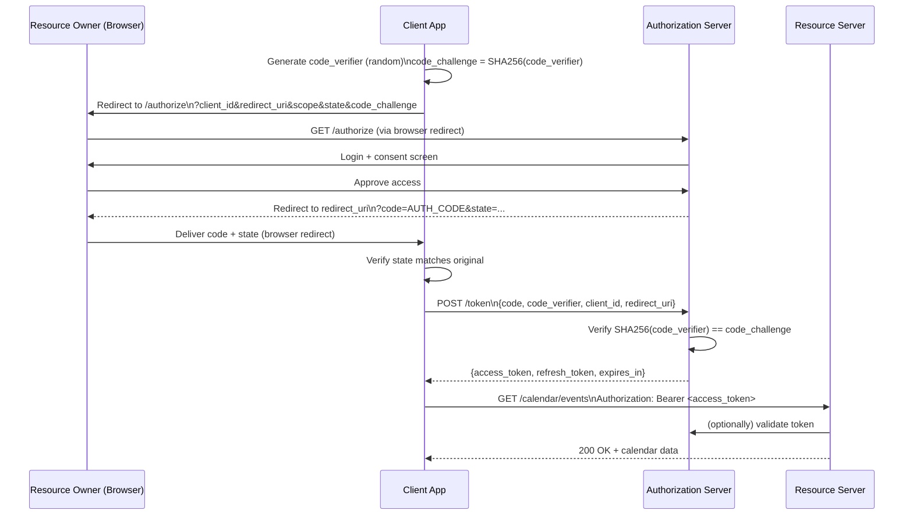

# OAuth 2.0

## Why This Matters

Every time you click "Sign in with Google" or grant a third-party app access to your calendar without ever typing your Google password into that app, you're using OAuth 2.0. It solves a problem that predates it caused real damage: before OAuth, the only way to let a third-party app act on your behalf was to **hand it your actual password**, giving it unlimited, unscoped, indefinite access — exactly what you'd never want to give a random calendar-sync tool. OAuth 2.0 is the industry-standard protocol for **delegated authorization**: letting a user grant a third-party application limited, revocable access to their resources on another service, without ever sharing credentials with that third party.

## Core Concept

OAuth 2.0 defines four roles:

- **Resource Owner**: the user who owns the data (e.g., you, owning your Google Calendar).
- **Client**: the third-party application requesting access (e.g., a scheduling app that wants to read your calendar).
- **Authorization Server**: the service that authenticates the resource owner and issues tokens (e.g., Google's OAuth server).
- **Resource Server**: the API that actually holds the protected data and accepts the resulting access token (e.g., the Google Calendar API — sometimes the same physical server as the authorization server, sometimes not).

Crucially, OAuth 2.0 is an **authorization** protocol, not an authentication protocol — it answers "what can this client do on the user's behalf?" not "who is this user?" (That identity layer is what [OpenID Connect](README.md) adds on top of OAuth 2.0, covered as a planned chapter in this Part.) A recurring, real-world mistake is using a bare OAuth access token as if it proves user identity to the client application — it doesn't, by itself.

## Mental Model

Think of OAuth like a **hotel key card system**. You (the resource owner) don't hand the valet your house keys (your password) to get your car. Instead, the front desk (authorization server) issues the valet a key card (access token) that opens only the parking garage, for one day, and can be deactivated at the front desk at any time — without changing the locks on your actual house. The valet never learns your house key, the access is scoped (garage only, not your room), time-limited, and revocable independently of your real credentials.

## How It Works

OAuth 2.0 defines several "grant types" (flows) for different client situations. The one that matters most today is the **Authorization Code flow with PKCE (Proof Key for Code Exchange)** — the current best-practice flow for essentially all client types, including single-page apps and mobile apps, and it has effectively replaced the older Implicit flow.

### Why the Implicit flow is deprecated

The Implicit flow returned the access token directly in the browser's URL fragment after redirect, with no server-side exchange step. This meant the token could leak via browser history, referrer headers, or JavaScript running on the page, and there was no way to verify the token was requested by the same client that initiated the flow. The OAuth working group now recommends against it entirely in favor of Authorization Code + PKCE, even for public clients (SPAs, mobile apps) that can't hold a secret.

### Authorization Code + PKCE, step by step

1. **Client generates a PKCE pair**: a random `code_verifier` (a high-entropy secret string kept only in the client), and a `code_challenge` derived from it (`code_challenge = BASE64URL(SHA256(code_verifier))`).
2. **Client redirects the user's browser** to the authorization server's `/authorize` endpoint, including `client_id`, `redirect_uri`, requested `scope`, a random `state` value (CSRF protection for the redirect), and the `code_challenge`.
3. **User authenticates** at the authorization server (this is where they log in, if not already) and is shown a consent screen describing exactly what the client is requesting access to.
4. **User approves.** The authorization server redirects back to the client's `redirect_uri` with a short-lived, single-use **authorization code** and the original `state` value.
5. **Client verifies `state`** matches what it sent (protects against CSRF on the redirect).
6. **Client exchanges the code for tokens** via a direct, server-to-server (or app-to-server) POST to the `/token` endpoint, including the authorization code **and the original `code_verifier`** (not the challenge — the verifier).
7. **Authorization server verifies** that `SHA256(code_verifier) == code_challenge` from step 2. This is the core PKCE guarantee: even if the authorization code is intercepted in transit (step 4's redirect is more exposed than step 6's direct POST), an attacker who doesn't have the original `code_verifier` cannot redeem it for tokens.
8. **Authorization server issues an access token** (and typically a refresh token) to the client.
9. **Client uses the access token** as a bearer token against the resource server, exactly as described in [Bearer Tokens](bearer-tokens.md).

This is a textbook application of [access vs refresh tokens](access-vs-refresh-tokens.md): the access token from step 8/9 is short-lived, and the refresh token lets the client get new access tokens without repeating the full user-facing redirect flow.

## Architecture



## Request / Response Example

Step 2 — authorization request (a browser redirect, not a fetch/XHR call):

```http
GET /authorize?response_type=code
  &client_id=scheduler-app-123
  &redirect_uri=https%3A%2F%2Fscheduler.example.com%2Fcallback
  &scope=calendar.read
  &state=xk3F9d2Lp
  &code_challenge=E9Melhoa2OwvFrEMTJguCHaoeK1t8URWbuGJSstw-cM
  &code_challenge_method=S256 HTTP/1.1
Host: auth.google-like-provider.com
```

Step 4 — redirect back to the client after user approval:

```http
HTTP/1.1 302 Found
Location: https://scheduler.example.com/callback?code=SplxlOBeZQQYbYS6WxSbIA&state=xk3F9d2Lp
```

Step 6 — token exchange (server-to-server, not visible to the browser URL):

```http
POST /token HTTP/1.1
Host: auth.google-like-provider.com
Content-Type: application/x-www-form-urlencoded

grant_type=authorization_code
&code=SplxlOBeZQQYbYS6WxSbIA
&redirect_uri=https%3A%2F%2Fscheduler.example.com%2Fcallback
&client_id=scheduler-app-123
&code_verifier=dBjftJeZ4CVP-mB92K27uhbUJU1p1r_wW1gFWFOEjXk
```

Step 8 — token response:

```http
HTTP/1.1 200 OK
Content-Type: application/json

{
  "access_token": "ya29.a0AfH6...",
  "token_type": "Bearer",
  "expires_in": 3600,
  "refresh_token": "1//0gLp...",
  "scope": "calendar.read"
}
```

## Code Example

```python
import base64
import hashlib
import os
import secrets
import httpx
from fastapi import FastAPI, HTTPException, Request
from starlette.responses import RedirectResponse

app = FastAPI()

CLIENT_ID = os.environ["OAUTH_CLIENT_ID"]
CLIENT_SECRET = os.environ.get("OAUTH_CLIENT_SECRET")  # empty for public clients using PKCE alone
REDIRECT_URI = "https://scheduler.example.com/callback"
AUTH_SERVER = "https://auth.example-provider.com"

# In production: store keyed by session, not a process-global dict.
PENDING_FLOWS: dict[str, dict] = {}


def generate_pkce_pair() -> tuple[str, str]:
    verifier = secrets.token_urlsafe(64)
    digest = hashlib.sha256(verifier.encode("ascii")).digest()
    challenge = base64.urlsafe_b64encode(digest).rstrip(b"=").decode("ascii")
    return verifier, challenge


@app.get("/login")
async def login():
    state = secrets.token_urlsafe(16)
    code_verifier, code_challenge = generate_pkce_pair()

    # Persist verifier + state server-side (or in an encrypted, HttpOnly
    # cookie) - we need the verifier again at the /callback step, and state
    # to detect CSRF on the redirect.
    PENDING_FLOWS[state] = {"code_verifier": code_verifier}

    params = {
        "response_type": "code",
        "client_id": CLIENT_ID,
        "redirect_uri": REDIRECT_URI,
        "scope": "calendar.read",
        "state": state,
        "code_challenge": code_challenge,
        "code_challenge_method": "S256",
    }
    query = "&".join(f"{k}={v}" for k, v in params.items())
    return RedirectResponse(f"{AUTH_SERVER}/authorize?{query}")


@app.get("/callback")
async def callback(code: str, state: str):
    flow = PENDING_FLOWS.pop(state, None)
    if flow is None:
        # Unknown or reused state -> possible CSRF attempt on the redirect
        raise HTTPException(status_code=400, detail="Invalid or expired state")

    async with httpx.AsyncClient() as http_client:
        response = await http_client.post(
            f"{AUTH_SERVER}/token",
            data={
                "grant_type": "authorization_code",
                "code": code,
                "redirect_uri": REDIRECT_URI,
                "client_id": CLIENT_ID,
                "code_verifier": flow["code_verifier"],  # proves we started this flow
            },
        )
    if response.status_code != 200:
        raise HTTPException(status_code=502, detail="Token exchange failed")

    tokens = response.json()
    # Store tokens.access_token / tokens.refresh_token associated with this
    # user's session - never return the raw tokens directly to a browser
    # response body in a way JavaScript can read, if avoidable.
    return {"status": "connected", "scope": tokens.get("scope")}
```

## Production Considerations

- **PKCE is not just for public clients anymore.** Even confidential clients (with a client secret) should use PKCE — it protects against authorization code interception regardless of client type, and current OAuth security guidance recommends it universally.
- **Always validate `state`** to prevent CSRF on the authorization redirect — an attacker who can trick a victim into completing *their own* OAuth flow (with the attacker's authorization code) without state validation can bind the victim's session to the attacker's account.
- **Request the minimum scope necessary.** Don't request `calendar.full_access` when `calendar.read` suffices — narrower scopes limit damage if a token leaks and reduce what users must trust you with on the consent screen.
- **Validate `redirect_uri` strictly** on the authorization server side (exact match, not just prefix) — a loosely validated redirect URI is a common vector for leaking authorization codes to attacker-controlled endpoints.
- **Treat the refresh token from an OAuth flow with the same care as described in [Access vs Refresh Tokens](access-vs-refresh-tokens.md)** — store it encrypted/hashed, scope its use narrowly, and support revocation.

## Common Mistakes

- **Using the Implicit flow for new integrations.** It's deprecated for good reason — always use Authorization Code + PKCE.
- **Skipping `state` validation**, opening the door to login/session CSRF.
- **Treating an OAuth access token as proof of user identity in the client app.** OAuth alone tells you "this token can access these scopes," not "this is user X" — that identity assertion is what [OpenID Connect](README.md) layers on top via the ID token.
- **Requesting overly broad scopes** "just in case," which both increases risk on leak and looks alarming on the consent screen, hurting user trust and conversion.
- **Hardcoding or committing the client secret** for confidential clients — load it from environment variables/secrets managers, same discipline as any other credential in this Part.

## Best Practices

- Use Authorization Code + PKCE for every client type — public and confidential alike.
- Always generate and validate `state` on every authorization request/response pair.
- Validate `redirect_uri` with an exact allowlist match on the authorization server.
- Request the narrowest scopes that satisfy the integration's actual needs.
- Treat resulting access/refresh tokens with the same storage and rotation discipline covered in [Access vs Refresh Tokens](access-vs-refresh-tokens.md).

## AI Engineering Perspective

OAuth 2.0 is increasingly central to AI agent architectures: when an [AI agent](../17-ai-agents-and-mcp/README.md) needs to act on a user's behalf against a third-party service — reading their email, managing their calendar, posting to their Slack — the correct pattern is the same delegated-authorization flow described here, not asking the user to hand the agent their raw password or a broad, unscoped API key. The [MCP (Model Context Protocol)](../17-ai-agents-and-mcp/README.md) ecosystem in particular is converging on OAuth 2.0 as the standard way for MCP clients to obtain scoped, revocable access to MCP servers acting on a user's behalf, precisely because agents automate actions at a speed and volume where an overly broad, unrevocable credential is far riskier than it would be in a human-paced workflow. Scoping matters even more for agents: a user granting an autonomous agent `calendar.read` should have real confidence the agent architecturally cannot also write or delete events, not just a promise that "the agent won't do that."

## Exercises

**Beginner**
1. In your own words, explain what problem PKCE solves and why it matters even for a confidential client with a client secret.
2. Why is OAuth 2.0 described as an authorization protocol rather than an authentication protocol?

**Intermediate**
3. Trace through what would go wrong (concretely) if the `/callback` handler above did not check that the incoming `state` exists in `PENDING_FLOWS` before proceeding.

**Advanced**
4. Design the scope model for an AI agent that needs to read a user's calendar and draft (but never send) emails on their behalf. What OAuth scopes would you request, and how would you structure token storage so a compromised agent process can't escalate beyond those scopes?

## Key Takeaways

- OAuth 2.0 lets a user grant a client limited, scoped, revocable access to their resources on another service, without sharing credentials with that client.
- Authorization Code + PKCE is the current best-practice flow for all client types; the Implicit flow is deprecated due to token-exposure risk.
- PKCE prevents a stolen authorization code from being redeemed by anyone other than the client that originated the flow, by requiring the original `code_verifier` at token exchange.
- `state` validation prevents CSRF on the authorization redirect; strict `redirect_uri` validation prevents code leakage to attacker endpoints.
- OAuth alone establishes authorization, not identity — identity requires OpenID Connect layered on top.
