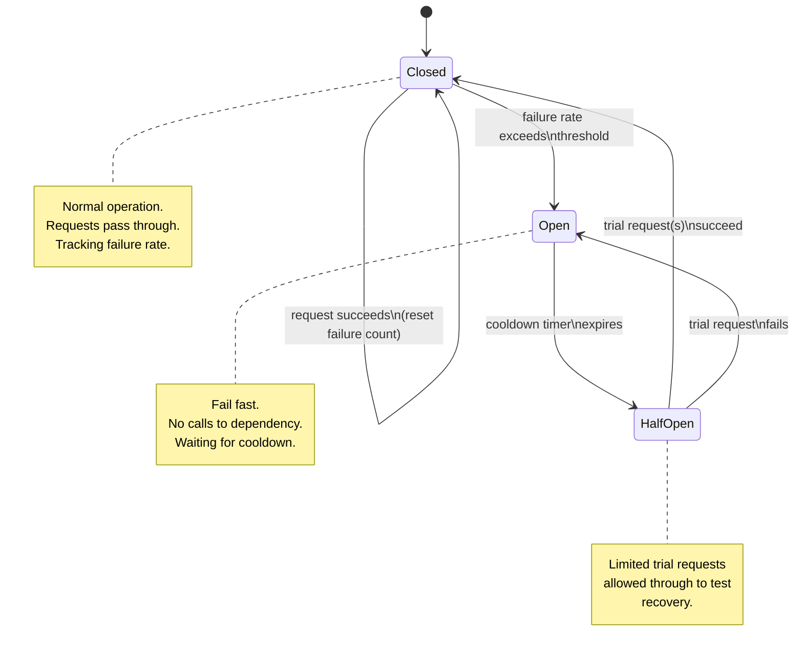

# Circuit Breakers

## Why This Matters

Timeouts and retries (see [Timeouts](timeouts.md) and [Retries](retries.md)) handle the case where a single call to a downstream dependency fails. But they have a blind spot: if the dependency is *consistently* failing — down, overloaded, mid-outage — every single caller will independently wait out its timeout, retry, wait again, and eventually fail, over and over, for as long as the outage lasts. Multiply this by every request your service handles, and you get two compounding problems: your own service wastes enormous capacity (threads, connections, latency budget) waiting on calls that are extremely unlikely to succeed, and you keep sending load at a dependency that is actively trying to recover — which can actually *prevent* it from recovering. This is how a single unhealthy dependency causes a **cascading failure** that takes down services that depend on it, and then services that depend on those. A circuit breaker exists specifically to stop this cascade.

## Core Concept

A **circuit breaker** wraps calls to a dependency and tracks their success/failure rate. When failures cross a threshold, it "trips" — stops attempting the call entirely for a period of time, failing fast instead, rather than letting every caller independently discover the same failure the slow way (via timeout). It only cautiously starts sending traffic again once it has reason to believe the dependency might have recovered. The name comes directly from electrical circuit breakers: a device that "trips" open to stop current flow when it detects a dangerous condition (like a short circuit), protecting the rest of the circuit from damage, rather than letting the fault keep drawing current indefinitely.

The critical insight is that a circuit breaker protects **two** things at once:

- **The caller**, by failing fast (microseconds) instead of waiting out a full timeout (seconds) on every single request during an outage — freeing up threads, connections, and latency budget for other work.
- **The failing dependency**, by reducing the load it receives while unhealthy, giving it room to actually recover instead of being continuously hit with new requests the moment it comes back up.

## Mental Model

Think of a circuit breaker like a restaurant host who's watching how a specific waiter is doing. If that waiter starts dropping every order they carry, the host stops sending new tables to that waiter (**open** — fail fast, don't even try) rather than continuing to seat people who will just get bad service. After some time, the host cautiously sends one small, low-stakes table to that waiter to see if they've recovered (**half-open** — a limited trial). If that test table goes well, the host resumes sending tables normally (**closed** — back to business as usual). If it goes badly again, the host stops sending tables again and waits longer before the next trial.

## How It Works

A circuit breaker is a state machine with three states:

- **Closed** — the normal state. Requests flow through to the dependency as usual. The breaker tracks recent failures (e.g., a rolling count or percentage over the last N requests or T seconds). If the failure rate crosses a configured threshold, the breaker **trips** and transitions to **open**.
- **Open** — the breaker rejects requests immediately, without attempting to call the dependency at all, typically raising an error the caller can handle (fall back to cached data, return a degraded response, or propagate the failure) far faster than a timeout would. After a configured **cooldown / reset timeout**, the breaker transitions to **half-open**.
- **Half-open** — the breaker allows a small number of trial requests through to the real dependency. If those trial requests succeed (above some threshold), the breaker assumes the dependency has recovered and transitions back to **closed**, resuming normal traffic. If they fail, the breaker assumes the dependency is still unhealthy and transitions back to **open**, restarting the cooldown timer — critically, *without* flooding the dependency with full traffic to find that out.

This three-state design is what distinguishes a circuit breaker from a simple "if N failures, stop for T seconds, then resume at full traffic" rule: the half-open state's *limited* trial is what prevents the recovery check itself from becoming another overload event.

## Architecture



## Request / Response Example

While the breaker is **open**, the caller never even attempts the network call — it fails immediately with a synthetic, fast error:

```http
GET /v1/recommendations?user_id=8821 HTTP/1.1
Host: your-api.example.com
```

```http
HTTP/1.1 503 Service Unavailable
Retry-After: 15
Content-Type: application/json

{
  "error": "circuit_open",
  "message": "Recommendation service is currently unavailable (circuit breaker open). Falling back to default recommendations.",
  "fallback_applied": true
}
```

Note the response returned in ~1ms, not after a multi-second timeout — and the body signals a graceful degradation (a default/cached recommendation set) rather than a bare failure, which is often the point of tripping a breaker: fail fast enough that you have time left in your own request budget to serve a reasonable fallback instead of nothing at all.

## Code Example

```python
import os
import time
import threading
from enum import Enum
from collections.abc import Callable
from typing import TypeVar

T = TypeVar("T")


class CircuitState(Enum):
    CLOSED = "closed"
    OPEN = "open"
    HALF_OPEN = "half_open"


class CircuitOpenError(Exception):
    """Raised immediately when the breaker is open -- no call was attempted."""


class CircuitBreaker:
    def __init__(
        self,
        failure_threshold: int = int(os.getenv("CB_FAILURE_THRESHOLD", "5")),
        reset_timeout_seconds: float = float(os.getenv("CB_RESET_TIMEOUT_SECONDS", "30")),
        half_open_max_trials: int = int(os.getenv("CB_HALF_OPEN_TRIALS", "1")),
    ):
        self.failure_threshold = failure_threshold
        self.reset_timeout_seconds = reset_timeout_seconds
        self.half_open_max_trials = half_open_max_trials

        self._state = CircuitState.CLOSED
        self._failure_count = 0
        self._opened_at: float | None = None
        self._half_open_trials_used = 0
        self._lock = threading.Lock()

    def _transition_to(self, new_state: CircuitState) -> None:
        self._state = new_state
        if new_state == CircuitState.OPEN:
            self._opened_at = time.monotonic()
        if new_state == CircuitState.CLOSED:
            self._failure_count = 0
        if new_state == CircuitState.HALF_OPEN:
            self._half_open_trials_used = 0

    def _should_attempt_reset(self) -> bool:
        assert self._opened_at is not None
        return (time.monotonic() - self._opened_at) >= self.reset_timeout_seconds

    def call(self, operation: Callable[[], T]) -> T:
        with self._lock:
            if self._state == CircuitState.OPEN:
                if self._should_attempt_reset():
                    self._transition_to(CircuitState.HALF_OPEN)
                else:
                    # Fail fast -- do NOT attempt the network call at all.
                    raise CircuitOpenError("Circuit is open; failing fast.")

            if self._state == CircuitState.HALF_OPEN:
                if self._half_open_trials_used >= self.half_open_max_trials:
                    # A trial is already in flight / used up; reject further
                    # concurrent attempts rather than flooding the dependency
                    # during its recovery test.
                    raise CircuitOpenError("Circuit is half-open; trial in progress.")
                self._half_open_trials_used += 1

        # The actual call happens OUTSIDE the lock so a slow dependency
        # doesn't block every other thread's breaker check.
        try:
            result = operation()
        except Exception:
            self._on_failure()
            raise
        else:
            self._on_success()
            return result

    def _on_success(self) -> None:
        with self._lock:
            if self._state in (CircuitState.HALF_OPEN, CircuitState.CLOSED):
                # A successful trial (or normal call) -- fully close the circuit.
                self._transition_to(CircuitState.CLOSED)

    def _on_failure(self) -> None:
        with self._lock:
            if self._state == CircuitState.HALF_OPEN:
                # The recovery trial failed -- the dependency is still unhealthy.
                # Go straight back to open, restarting the cooldown.
                self._transition_to(CircuitState.OPEN)
                return

            self._failure_count += 1
            if self._failure_count >= self.failure_threshold:
                self._transition_to(CircuitState.OPEN)


# --- Usage ---
recommendations_breaker = CircuitBreaker()


def get_recommendations(user_id: str) -> list[dict]:
    try:
        return recommendations_breaker.call(lambda: _fetch_recommendations(user_id))
    except CircuitOpenError:
        return _default_recommendations()  # graceful degradation, not a hard failure
    except Exception:
        return _default_recommendations()


def _fetch_recommendations(user_id: str) -> list[dict]:
    ...  # real HTTP call to the recommendation service, with its own timeout


def _default_recommendations() -> list[dict]:
    return [{"id": "popular-item-1"}, {"id": "popular-item-2"}]
```

## Production Considerations

- **Threshold tuning is a real trade-off.** A low failure threshold trips fast but risks false positives from a brief, unrelated blip; a high threshold tolerates transient noise but takes longer to protect the system once a real outage starts. Base it on observed failure-rate variance during normal operation, not a guess.
- **A breaker with no half-open test never recovers automatically.** A simplistic "open for exactly T seconds then just resume full traffic" design reintroduces the exact overload problem the breaker was meant to prevent, the moment the timer expires — the half-open state's limited trial is not an optional detail.
- **Circuit breakers should be scoped per dependency, not global.** A single breaker wrapping "all outbound calls" means one unhealthy dependency trips the breaker for calls to entirely unrelated, healthy dependencies — always instantiate one breaker per downstream service (and often per-endpoint for services with very different reliability characteristics).
- **Pair the breaker with a real fallback**, not just a faster error. The value of failing fast is largely wasted if the caller has nothing better to do with the freed-up time — serve cached data, a default value, or a degraded response where possible (see the upcoming `graceful-degradation.md` chapter).
- **Expose breaker state as a metric.** "Circuit X has been open for 4 minutes" is one of the highest-signal alerts you can have — it tells you precisely which dependency is unhealthy and for how long, often before broader error-rate dashboards make it obvious.

## Common Mistakes

- **No half-open recovery test** — either resuming full traffic abruptly after a fixed timer, or never automatically closing the circuit at all, requiring manual intervention.
- **One shared breaker across multiple unrelated dependencies**, so an outage in one unrelated service unnecessarily blocks calls to healthy ones.
- **Setting the failure threshold too low**, causing the breaker to trip on ordinary, expected transient noise and degrading availability during otherwise-healthy operation.
- **Tripping the breaker but having no fallback behavior**, so failing fast just produces a faster error instead of a better outcome for the end user.
- **Confusing circuit breakers with retries** — they solve different problems and are complementary, not interchangeable: retries handle a single transient failure, a breaker handles sustained, ongoing unhealthiness across many calls. Retrying *inside* an open circuit breaker defeats its entire purpose.

## Best Practices

- Instantiate one circuit breaker per downstream dependency (and per-endpoint where reliability characteristics differ significantly).
- Always implement the half-open state with a small, bounded number of trial requests — never resume at full traffic immediately after the cooldown.
- Tune `failure_threshold` and `reset_timeout` from observed baseline behavior of the dependency, and make both configurable without a redeploy.
- Combine circuit breakers with a real fallback strategy — cached data, a default response, or a clearly degraded feature — not just a faster failure.
- Emit metrics/logs on every state transition (closed→open, open→half-open, half-open→closed/open) — these are some of the most actionable signals available during an incident.

## AI Engineering Perspective

Circuit breakers are especially valuable in front of LLM provider calls, because an unhealthy or degraded LLM API tends to fail slowly rather than cleanly — elevated latency, partial timeouts, and intermittent errors, rather than a clean "service down" signal your infrastructure can detect immediately. A circuit breaker per-provider lets a multi-provider LLM gateway (see [Part 15 — Production AI Systems](../15-production-ai-systems/README.md)) detect "provider A's success rate has dropped below threshold" and stop routing traffic to it, falling back to provider B, without every single in-flight request individually discovering the degradation via a slow timeout. This is the mechanical foundation of a **fallback system** for LLM gateways: the circuit breaker's open state is precisely the signal that triggers routing to an alternate model or provider, and the half-open state is what allows traffic to safely and gradually shift back to the primary provider once it recovers, rather than an abrupt all-at-once cutover that could overload a provider that's still only partially healthy.

## Exercises

**Beginner**
1. Draw the three circuit breaker states and label the two transitions that require a failed trial vs. a successful trial. In your own words, explain why "open" alone (with no half-open state) is an incomplete design.

**Intermediate**
2. Using the `CircuitBreaker` class above, write a short simulation that calls an operation which fails the first 6 times and succeeds afterward, with `failure_threshold=5` and `reset_timeout_seconds=2`. Trace through and print the state transitions you'd expect.

**Advanced**
3. Design a circuit breaker policy for an LLM gateway that fronts three providers (A, B, C) with different baseline latencies and error rates. Decide whether you'd use one breaker per provider or something more granular (e.g., per provider *and* per model), and explain how a tripped breaker for provider A should affect routing decisions for new requests.

## Key Takeaways

- A circuit breaker stops sending requests to a dependency that's failing at a high rate, protecting both the caller (fail fast instead of timing out repeatedly) and the dependency (reduced load while it's unhealthy).
- The three states — closed, open, half-open — are all necessary; half-open's limited recovery trial is what allows safe, automatic recovery without re-overloading the dependency.
- Circuit breakers should be scoped per dependency (and often per endpoint), never shared globally across unrelated calls.
- Pair a tripped breaker with a real fallback (cache, default value, degraded response) to make failing fast actually useful.
- Circuit breakers and retries solve different problems and compose together — retries handle single transient failures; breakers handle sustained unhealthiness across many calls.

See also: [Timeouts](timeouts.md), [Retries](retries.md), [Exponential Backoff](exponential-backoff.md), and the [glossary](../../resources/glossary.md).

[← Back to Part 6 — Production Reliability](README.md)
