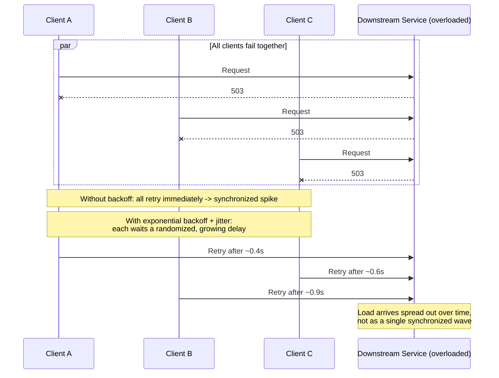

# Exponential Backoff

## Why This Matters

Retrying a failed request is a good instinct — but *how* you space out those retries determines whether your retry logic helps a struggling service recover or actively makes things worse. If every client that just failed a request immediately retries with no delay, and the failure was caused by the downstream service being overloaded, you've just added another wave of load at the exact moment the service is least able to handle it. Worse, if many clients failed at roughly the same moment (which is common — a deploy, a brief network blip, a GC pause), they all retry in near-perfect synchrony, creating a sharp, repeating spike of traffic. This pattern is called a **retry storm**, and it's one of the more common ways a brief, minor hiccup turns into an extended outage. Exponential backoff is the standard fix: space retries out with a rapidly growing delay, so retry traffic thins out over time instead of piling up.

## Core Concept

**Exponential backoff** means each successive retry waits **longer than the previous one**, with the delay growing exponentially (as a power of some base, typically 2) rather than linearly or staying constant. The canonical formula is:

```
delay(attempt) = min(base_delay * (multiplier ^ (attempt - 1)), max_delay)
```

Where:
- `base_delay` is the delay before the first retry (e.g., 0.5 seconds)
- `multiplier` is the growth factor, almost always `2` ("exponential" = doubling)
- `attempt` is the retry attempt number, starting at 1
- `max_delay` is a hard cap on the delay, preventing it from growing unboundedly

With a `base_delay` of 0.5s and multiplier of 2:

| Attempt | Raw delay | Capped at max_delay = 10s |
|---|---|---|
| 1 | 0.5s | 0.5s |
| 2 | 1.0s | 1.0s |
| 3 | 2.0s | 2.0s |
| 4 | 4.0s | 4.0s |
| 5 | 8.0s | 8.0s |
| 6 | 16.0s | **10.0s (capped)** |
| 7 | 32.0s | **10.0s (capped)** |

The **cap on max backoff** matters just as much as the exponential growth itself: without it, a client that's been failing for a while could end up waiting minutes between retries, which might exceed your overall timeout budget or simply make the client feel unresponsive far longer than acceptable, even after the downstream service has recovered.

Exponential backoff on its own reduces the *rate* at which a group of synchronized clients hammers a struggling service, but it does not fully solve synchronization — if every client failed at the same instant and all use the identical deterministic formula above, they all retry at the same delays, just spaced further apart each round instead of every round. Adding randomness to the delay — **jitter** — is what actually desynchronizes clients from each other. Jitter has its own dedicated upcoming chapter (`jitter.md`) in this part; the short version is: instead of sleeping for exactly `delay(attempt)`, sleep for a randomized value derived from it (e.g., a random value between 0 and `delay(attempt)`), so that clients which failed simultaneously don't all wake up and retry simultaneously.

## Mental Model

Think of a crowded restaurant that just had a fire alarm go off and everyone rushed outside. If everyone tries to walk back in the instant the alarm stops, you get a crush at the door — that's an immediate, un-backed-off retry storm. If instead the host says "wait a bit longer each time you try, and if it's still crowded, wait even longer" — that's exponential backoff: it thins out the crowd trying to re-enter over successive waves. But if the host tells everyone to wait *exactly* 30 seconds, then exactly 60 seconds, then exactly 120 seconds, everyone is still moving in lockstep, just less often — you'd still get a crush every wave, just a smaller number of times. Telling each person "wait somewhere between 20 and 40 seconds" (jitter) is what actually spreads people out across time instead of into synchronized waves.

## How It Works

1. A request fails with a retryable error (see [Retries](retries.md)).
2. The client computes a delay for this attempt number using the exponential formula, capped at `max_delay`.
3. The client sleeps for that delay (optionally randomized via jitter — see `jitter.md`, planned).
4. The client retries the request.
5. If it fails again, the attempt counter increments, and the delay for the *next* retry is recomputed — larger than the last, up to the cap.
6. This continues until either the request succeeds or the maximum retry count from [Retries](retries.md) is reached, at which point the client gives up and propagates a final failure.

The exponential growth is what gives the *downstream service* a real chance to recover: instead of a constant drumbeat of retry pressure, the pressure decreases sharply the longer the outage persists, precisely because clients back off more the more times they've already failed.

## Architecture



## Request / Response Example

The downstream service is overloaded and signals it with a `503`; note it does not itself specify an exact retry delay here, leaving the client's backoff policy to govern the wait (contrast with the `Retry-After`-driven example in [Retries](retries.md), which should still take priority when present):

```http
POST /v1/search HTTP/1.1
Host: search-service.internal
Content-Type: application/json

{ "query": "reliability patterns" }
```

```http
HTTP/1.1 503 Service Unavailable
Content-Type: application/json

{
  "error": "overloaded",
  "message": "Search service is at capacity. Please retry with backoff."
}
```

A client implementing exponential backoff would wait roughly 0.5s, then 1s, then 2s (plus jitter) between successive attempts at this endpoint, rather than hammering it every few milliseconds.

## Code Example

```python
import os
import random
import time
from collections.abc import Callable
from typing import TypeVar

T = TypeVar("T")

BASE_DELAY_SECONDS = float(os.getenv("BACKOFF_BASE_DELAY_SECONDS", "0.5"))
MULTIPLIER = float(os.getenv("BACKOFF_MULTIPLIER", "2.0"))
MAX_DELAY_SECONDS = float(os.getenv("BACKOFF_MAX_DELAY_SECONDS", "10.0"))
MAX_ATTEMPTS = int(os.getenv("BACKOFF_MAX_ATTEMPTS", "5"))


def compute_backoff_delay(attempt: int) -> float:
    """
    attempt is 1-indexed: attempt=1 is the delay before the FIRST retry
    (i.e., after the initial request already failed once).
    """
    raw_delay = BASE_DELAY_SECONDS * (MULTIPLIER ** (attempt - 1))
    capped_delay = min(raw_delay, MAX_DELAY_SECONDS)

    # Full jitter: pick a random value between 0 and the capped delay,
    # rather than sleeping the exact deterministic value. This is what
    # actually desynchronizes clients that failed at the same moment --
    # see jitter.md (planned) for a deeper treatment of jitter strategies
    # (full jitter, equal jitter, decorrelated jitter).
    return random.uniform(0, capped_delay)


def retry_with_backoff(
    operation: Callable[[], T],
    is_retryable: Callable[[Exception], bool],
) -> T:
    last_exception: Exception | None = None

    for attempt in range(1, MAX_ATTEMPTS + 1):
        try:
            return operation()
        except Exception as exc:  # noqa: BLE001 -- intentionally broad; filtered below
            last_exception = exc
            if not is_retryable(exc) or attempt == MAX_ATTEMPTS:
                raise
            delay = compute_backoff_delay(attempt)
            time.sleep(delay)

    # Unreachable in practice (loop always returns or raises), but keeps
    # type checkers happy and documents the invariant explicitly.
    raise last_exception  # type: ignore[misc]
```

## Production Considerations

- **The max delay cap must fit inside your overall timeout budget.** If a caller has a 5-second SLA but your `max_delay` is 10 seconds, you'll blow the SLA on the very first capped retry — tune `max_delay` against the budget discussed in [Timeouts](timeouts.md).
- **A multiplier of 2 is a strong, well-tested default**, but it's not universal — systems with very cheap, fast-recovering dependencies sometimes use a smaller multiplier (e.g., 1.5) to retry a bit more aggressively; systems calling notoriously overload-prone dependencies sometimes use a larger one.
- **Backoff without jitter still helps, but it's an incomplete fix** for the synchronized-clients problem. If your client population is large and traffic is bursty (e.g., a mobile app after a network partition heals and thousands of devices reconnect at once), jitter is not optional — plan to layer it in per the upcoming `jitter.md` chapter.
- **Log the delay actually used on each retry**, not just that a retry happened — this makes it possible to diagnose, after the fact, whether backoff behaved as configured during an incident.

## Common Mistakes

- **Immediate retries with no delay at all** — the most severe version of this mistake, guaranteeing a retry storm under any synchronized failure.
- **Fixed-delay retries** (e.g., always wait exactly 1 second) — better than nothing, but doesn't reduce pressure on a downstream service that's been down for a while, and doesn't desynchronize clients any better than a single wave.
- **No maximum delay cap**, letting the exponential growth produce absurdly long waits after several failures (2^10 attempts is over 17 minutes at a 1-second base) that likely exceed any reasonable user-facing budget.
- **Deterministic backoff with no jitter across a large client population**, leaving synchronized retry waves intact just spaced further apart — see the mental model above.
- **Applying backoff delay but ignoring a server-supplied `Retry-After` header** when one is present — the server's explicit guidance should generally take priority over your own computed value.

## Best Practices

- Use `min(base * multiplier^(attempt-1), max_delay)` as your formula, with a multiplier of 2 as a sensible default.
- Always set a `max_delay` cap that fits inside your overall timeout/SLA budget.
- Add jitter on top of the computed delay for any system with more than a handful of concurrent clients (see `jitter.md`, planned, for jitter strategy options).
- Make `base_delay`, `multiplier`, `max_delay`, and `max_attempts` configurable via environment variables so they can be tuned per-environment without a code deploy.
- Log both the attempt number and the actual delay used, so backoff behavior is visible during incident review.

## AI Engineering Perspective

LLM providers are a textbook case for exponential backoff, because their `429` rate-limit responses are frequently caused by aggregate load across *many* tenants sharing the same underlying compute — a naive fleet of clients all retrying immediately after a rate-limit error compounds exactly the problem that caused the `429` in the first place. Most official LLM provider SDKs ship exponential backoff with jitter built in for this reason, and it's worth understanding what your SDK is doing by default rather than assuming "the library handles it" without knowing the base delay, multiplier, and cap it uses. In an LLM gateway that fans requests out across many application instances (see [Part 15 — Production AI Systems](../15-production-ai-systems/README.md)), backoff parameters are often tuned *per provider*, since different providers publish different rate-limit recovery characteristics — a one-size-fits-all backoff policy across multiple providers under-utilizes some and still overloads others.

## Exercises

**Beginner**
1. By hand, compute the backoff delay (before jitter) for attempts 1 through 6 using `base_delay=1.0`, `multiplier=2`, `max_delay=20`. At which attempt does the cap first kick in?

**Intermediate**
2. Modify the `compute_backoff_delay` function above to support a `multiplier` of your choosing passed as a parameter, and explain, with a short table like the one in this chapter, how a multiplier of 1.5 changes the growth curve compared to 2.0.

**Advanced**
3. Design a backoff policy for a fleet of 10,000 IoT devices that all lose connectivity simultaneously during a regional network outage and will all attempt to reconnect once connectivity returns. Explain what specifically would go wrong with plain exponential backoff (no jitter) at this scale, and what change would fix it.

## Key Takeaways

- Exponential backoff spaces out retries with a growing delay (`base * multiplier^attempt`, capped at `max_delay`), reducing pressure on a recovering downstream service over successive rounds of retries.
- Always cap the maximum delay, and make sure that cap fits inside your overall timeout/SLA budget.
- Backoff alone does not fully solve synchronized retries from many clients that failed at once — that requires jitter, covered in its own upcoming chapter.
- A multiplier of 2 is a solid, widely-used default, but should be tuned to the failure characteristics of the specific dependency.
- Most production HTTP/LLM SDKs implement backoff internally — know your defaults rather than assuming they're appropriate for your SLA.

See also: [Retries](retries.md), [Timeouts](timeouts.md), [Rate Limiting](rate-limiting.md), and the [glossary](../../resources/glossary.md). The jitter chapter (`jitter.md`, planned) builds directly on the formula introduced here.

[← Back to Part 6 — Production Reliability](README.md)
