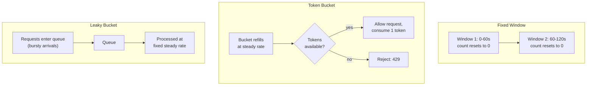

# Rate Limiting

## Why This Matters

An API with no limit on how fast a single caller can send requests is an API that any one misbehaving client — a buggy retry loop, a scraping script, a compromised account, or just a single customer's traffic spike — can use to degrade service for everyone else. Rate limiting is the mechanism that protects your API's capacity from being monopolized by any one caller, keeps costs predictable when downstream calls (especially LLM APIs) are billed per request or per token, and gives you a controlled way to say "not right now" instead of falling over. It's also one of the few reliability patterns that sits on both sides of a call: you rate-limit callers of *your* API, and you have to gracefully handle being rate-limited by APIs *you* call — see [Retries](retries.md) and [Exponential Backoff](exponential-backoff.md) for the caller-side response.

## Core Concept

**Rate limiting** enforces a maximum number of requests (or units of work, like tokens) a given caller may perform within a time window, rejecting or delaying requests that exceed it. There are four widely used algorithms, and they trade off accuracy, burst tolerance, and implementation cost differently:

- **Fixed window** — count requests in discrete, non-overlapping windows (e.g., "100 requests per minute," where the minute resets at :00 seconds). Simple to implement (a counter plus a TTL), but has a boundary problem: a client can send 100 requests at 0:59 and another 100 at 1:00, achieving 200 requests in a 2-second span while technically staying within the stated limit each window.
- **Sliding window** — instead of resetting sharply at window boundaries, weight the count using a rolling window that blends the current and previous fixed windows (or tracks individual request timestamps). This smooths out the boundary-burst problem of fixed windows at the cost of slightly more computation/storage.
- **Token bucket** — a bucket holds up to `capacity` tokens, refilling at a steady `rate` (tokens/second). Each request consumes one token; if the bucket is empty, the request is rejected or delayed. This naturally allows short bursts (up to the bucket's full capacity) while still enforcing a long-run average rate — a good match for "usually low traffic, occasionally bursty" client behavior.
- **Leaky bucket** — conceptually the inverse: requests enter a queue (the "bucket") and are processed ("leak out") at a constant rate, regardless of how bursty the arrivals were. This produces a perfectly smoothed *outgoing* rate, at the cost of added latency for requests that arrive during a burst (they wait in the queue rather than being processed immediately or rejected).

| Algorithm | Burst handling | Precision | Storage cost | Typical use |
|---|---|---|---|---|
| Fixed window | Allows boundary bursts (2x in worst case) | Low | Very low (one counter) | Simple, coarse-grained limits |
| Sliding window | Smooths boundary bursts | Medium–High | Low–Medium | General-purpose API limits |
| Token bucket | Allows controlled bursts up to capacity | High | Low | Client-facing limits tolerating burstiness |
| Leaky bucket | Fully smooths bursts (adds queueing delay) | High | Medium (needs a queue) | Protecting a fixed-throughput downstream resource |

## Mental Model

Fixed window is like a nightclub that resets its headcount to zero at the top of every hour — if it's nearly closing time for the hour, a rush of people can get in right before the reset, and another rush right after, giving you two rushes back-to-back even though the "per hour" cap was technically respected both times. Token bucket is like a punch card that refills one punch every few seconds up to a maximum of, say, ten punches saved up — you can spend all ten punches in a burst if you've been away and it refilled, but once they're spent you're limited to the refill rate. Leaky bucket is like a funnel: however unevenly you pour liquid in at the top, it drips out the bottom at a fixed rate — smooth on the way out, but anything poured in faster than the drip rate just waits in the funnel.

## How It Works

**Token bucket (the most common choice for API rate limiting) works like this:**

1. Each client (identified by API key, user ID, or IP) has a bucket with a maximum `capacity` and a `refill_rate` (tokens per second).
2. On each request, the bucket is first refilled based on elapsed time since the last check: `tokens = min(capacity, tokens + elapsed_seconds * refill_rate)`.
3. If `tokens >= 1`, the request is allowed and one token is deducted.
4. If `tokens < 1`, the request is rejected (typically with `429 Too Many Requests`) or queued, depending on the policy.
5. State (`tokens`, `last_refill_timestamp`) is stored per client — in memory for a single-instance limiter, or in a shared store like Redis for a limiter that must work correctly across multiple API instances.

## Architecture



**Where to enforce it: gateway vs. application.** Rate limiting can live at the API Gateway/edge (before a request ever reaches your application code — cheapest to reject at, protects everything behind it, but usually only has access to coarse identifiers like IP or API key) or in the application layer (has access to rich context like authenticated user, plan tier, or the specific resource being hit, but the request has already consumed some of your application's resources by the time it's rejected). Production systems commonly do both: a coarse, cheap gateway-level limit as a first line of defense against abuse, and a more precise, business-aware application-level limit for per-user/per-plan quotas.

## Request / Response Example

```http
POST /v1/search HTTP/1.1
Host: api.example.com
Authorization: Bearer sk-live-...
```

```http
HTTP/1.1 429 Too Many Requests
Retry-After: 30
X-RateLimit-Limit: 100
X-RateLimit-Remaining: 0
X-RateLimit-Reset: 1755500430
Content-Type: application/json

{
  "error": "rate_limited",
  "message": "You have exceeded 100 requests per minute. Retry after 30 seconds."
}
```

The `X-RateLimit-*` headers (a de facto standard, though not formally part of the HTTP spec) let well-behaved clients self-throttle *before* hitting the limit, by checking `X-RateLimit-Remaining` on successful responses too — not just reacting after being rejected.

## Code Example

```python
import os
import time
import threading

# Configurable via environment so limits can differ per deployment tier
# without a code change.
BUCKET_CAPACITY = int(os.getenv("RATE_LIMIT_BUCKET_CAPACITY", "20"))
REFILL_RATE_PER_SECOND = float(os.getenv("RATE_LIMIT_REFILL_PER_SECOND", "5"))


class TokenBucket:
    """
    A single client's token bucket. In production, per-client state like this
    is usually stored in Redis (via a Lua script for atomicity) rather than
    in local memory, so the limit is enforced consistently across every
    instance of a horizontally scaled API -- a purely in-memory bucket per
    instance would let a client get N times the intended limit by spreading
    requests across N instances.
    """

    def __init__(self, capacity: int = BUCKET_CAPACITY, refill_rate: float = REFILL_RATE_PER_SECOND):
        self.capacity = capacity
        self.refill_rate = refill_rate
        self.tokens = float(capacity)  # start full -- allow an initial burst
        self.last_refill = time.monotonic()
        self._lock = threading.Lock()

    def _refill(self) -> None:
        now = time.monotonic()
        elapsed = now - self.last_refill
        self.tokens = min(self.capacity, self.tokens + elapsed * self.refill_rate)
        self.last_refill = now

    def allow_request(self) -> tuple[bool, float]:
        """Returns (allowed, seconds_until_next_token_if_denied)."""
        with self._lock:
            self._refill()
            if self.tokens >= 1:
                self.tokens -= 1
                return True, 0.0
            # Not enough tokens -- compute how long until one becomes available.
            deficit = 1 - self.tokens
            wait_seconds = deficit / self.refill_rate
            return False, wait_seconds


# One bucket per client, keyed by API key / user ID.
_buckets: dict[str, TokenBucket] = {}
_buckets_lock = threading.Lock()


def get_bucket_for_client(client_id: str) -> TokenBucket:
    with _buckets_lock:
        if client_id not in _buckets:
            _buckets[client_id] = TokenBucket()
        return _buckets[client_id]


def rate_limit_middleware(client_id: str) -> tuple[int, dict]:
    """Returns (status_code, extra_headers) for a hypothetical request handler."""
    bucket = get_bucket_for_client(client_id)
    allowed, retry_after = bucket.allow_request()

    if not allowed:
        return 429, {"Retry-After": str(round(retry_after, 2))}
    return 200, {}
```

## Production Considerations

- **A single global limit causes noisy-neighbor problems.** If every client shares one bucket, one heavy customer can starve everyone else's quota. Rate limits should be scoped per client/API key/tenant at minimum, and often per-endpoint too, since a cheap `GET /health` and an expensive `POST /reports/generate` have very different acceptable rates.
- **Distributed rate limiting requires shared state.** If your API runs on multiple instances behind a load balancer, per-instance in-memory buckets don't enforce a global limit correctly — a client hitting N instances effectively gets N times the intended limit. Use a shared, fast store (commonly Redis, often via `INCR`+`EXPIRE` for fixed window, or a Lua script for atomic token bucket updates) so all instances see consistent state.
- **Always return `Retry-After` on a `429`** so well-behaved clients know exactly how long to wait, rather than guessing with their own backoff policy.
- **Tier limits by plan/customer**, not just by raw request count — a paid tier legitimately needs a higher ceiling than a free tier, and this is usually implemented as a different `capacity`/`refill_rate` pair per plan rather than a separate code path.

## Common Mistakes

- **One global rate limit bucket shared across all clients**, letting a single high-volume caller degrade service for every other caller (the classic noisy-neighbor problem).
- **Rate limiting only at the gateway with no application-layer awareness**, missing the ability to apply different limits per authenticated user, plan tier, or expensive endpoint.
- **Fixed window limits with no smoothing**, allowing a 2x burst right at window boundaries that a naive "requests per minute" dashboard won't reveal.
- **Not returning `Retry-After`**, forcing clients to guess a retry delay instead of being told exactly how long to wait.
- **Rate limiting only inbound requests and forgetting your own outbound calls to third-party APIs** need the same discipline — you can be rate-limited by *your* dependencies just as your callers can be rate-limited by you.

## Best Practices

- Default to token bucket for client-facing API limits — it tolerates reasonable burstiness while enforcing a long-run average rate, matching how real client traffic behaves.
- Scope limits per client identity (API key or authenticated user) and, where relevant, per endpoint — never a single shared global bucket.
- Enforce a coarse limit at the gateway/edge as a first line of defense, and a precise, plan-aware limit in the application layer.
- Always communicate limit state via response headers (`X-RateLimit-Limit`, `X-RateLimit-Remaining`, `X-RateLimit-Reset`) and `Retry-After` on rejection.
- Use a shared store (e.g., Redis) for rate limit state in any horizontally scaled deployment.

## AI Engineering Perspective

LLM APIs typically enforce *two* independent rate limits simultaneously — requests-per-minute (RPM) and tokens-per-minute (TPM) — and TPM is usually the one that bites first for any non-trivial workload, since a handful of long-context requests can exhaust a token budget while barely denting a request-count budget. When you build an LLM gateway that fronts multiple downstream providers (see [Part 15 — Production AI Systems](../15-production-ai-systems/README.md)), rate limiting becomes bidirectional in a way that's easy to underestimate: you need to rate-limit your own callers (to protect your service and control cost) *and* respect each provider's RPM/TPM limits on the way out (to avoid cascading `429`s that then have to be retried per [Retries](retries.md) and [Exponential Backoff](exponential-backoff.md)). A token bucket sized in *tokens*, not requests, is a natural fit here — you can decrement the bucket by the actual token count of each completion once it's known, giving you a rate limiter whose unit of accounting matches the unit your provider actually bills and limits on.

## Exercises

**Beginner**
1. Explain, in your own words, why a fixed-window limiter of "100 requests per minute" can technically allow 200 requests within a 2-second span. Draw the two windows involved.

**Intermediate**
2. Extend the `TokenBucket` code above so that `allow_request` can consume more than 1 token per call (e.g., to charge different costs for a cheap `GET` vs. an expensive `POST /reports`), and explain what change to the API this requires.

**Advanced**
3. Design a rate-limiting scheme for a multi-tenant SaaS API where each tenant has a different plan tier (Free / Pro / Enterprise) and requests must be rate-limited both per-tenant and per-endpoint (some endpoints are far more expensive than others). Decide where each layer of limiting should live (gateway vs. application) and what algorithm you'd use at each layer, and justify your choice.

## Key Takeaways

- Rate limiting protects API capacity from any single caller monopolizing it, and gives you a controlled way to reject excess load instead of degrading for everyone.
- Fixed window is simple but allows boundary bursts; sliding window smooths that out; token bucket allows controlled bursts against a long-run rate; leaky bucket fully smooths outgoing rate at the cost of queueing delay.
- Token bucket is the most common choice for client-facing API limits because it matches realistic bursty client behavior while still enforcing an average rate.
- Scope limits per client and per endpoint — a single global bucket causes noisy-neighbor problems.
- In distributed deployments, rate limit state must live in a shared store (e.g., Redis), not per-instance memory, or the effective limit multiplies with instance count.

See also: [Retries](retries.md), [Exponential Backoff](exponential-backoff.md), [Circuit Breakers](circuit-breakers.md), and the [glossary](../../resources/glossary.md).

[← Back to Part 6 — Production Reliability](README.md)
