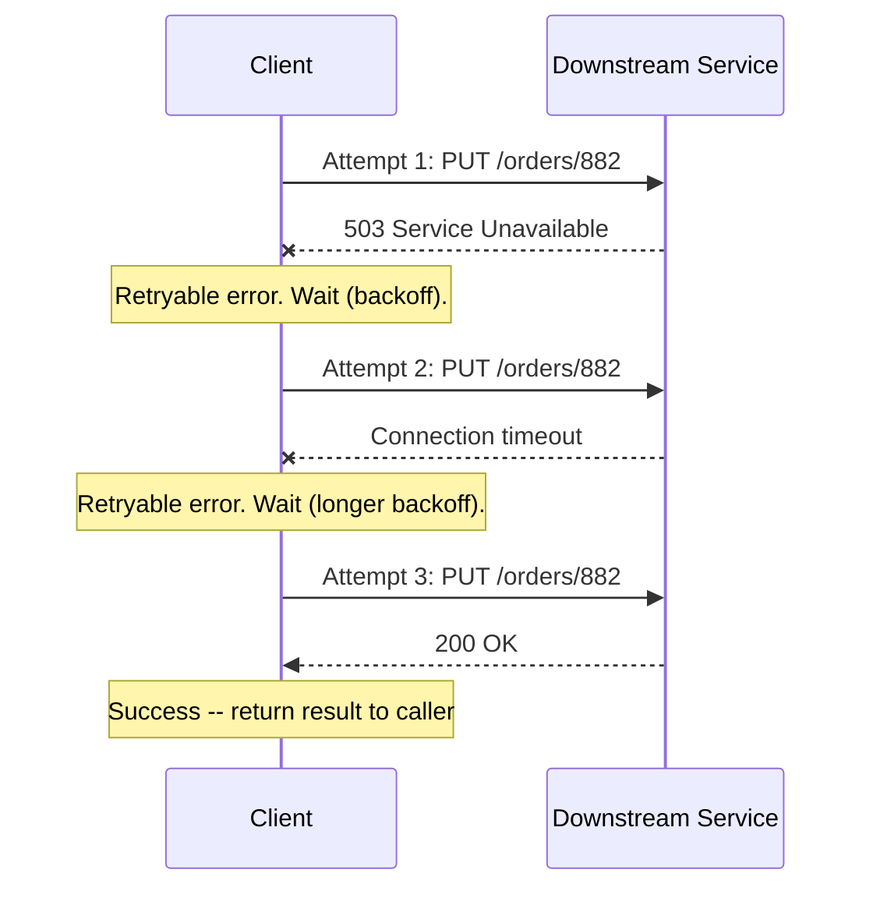

# Retries

## Why This Matters

Networks drop packets, servers restart mid-deploy, load balancers occasionally route a request to an instance that's already shutting down. Most of these failures are transient — the exact same request, sent a moment later, would succeed. A system with no retry logic treats every transient blip as a permanent user-facing failure, which is both a worse experience and a waste of a perfectly recoverable situation. But retries are not free or automatically safe: retrying the wrong kind of operation can duplicate a payment, double-send an email, or create two identical database rows. Knowing *when* to retry, matters at least as much as knowing *how*.

## Core Concept

A **retry** is re-sending a failed request, on the assumption that the failure was transient rather than a fundamental problem with the request itself. The critical question that must be answered before writing any retry logic is: **is this operation idempotent?** An idempotent operation produces the same end state no matter how many times it's applied — `PUT /users/42 {"name": "Alice"}` sent three times leaves the user in exactly the same state as sending it once. A non-idempotent operation, like `POST /payments {"amount": 50}` without any deduplication mechanism, could charge the customer three times if retried three times after a response was lost (not the request — just the *response* acknowledging it, a subtle but crucial distinction, since the original charge may have already succeeded on the server).

This is why retries and idempotency are inseparable topics: see [Part 2's idempotency chapter](../02-rest-api-design/idempotency.md) for the HTTP-level semantics (idempotent methods, idempotency keys), and the upcoming `idempotency-in-practice.md` chapter in this part for implementing idempotency keys as a first-class reliability mechanism. If you cannot guarantee idempotency — either because the HTTP method is inherently safe to repeat (`GET`, `PUT`, `DELETE`) or because you've added an idempotency key — you should not blindly retry a request that might have already taken effect.

**Retryable vs. non-retryable errors** is the second core distinction:

| Category | Examples | Retry? |
|---|---|---|
| Network-level failures | Connection refused, DNS failure, timeout | Usually yes |
| 5xx server errors | 500, 502, 503, 504 | Usually yes (server-side issue, likely transient) |
| 429 Too Many Requests | Rate limited | Yes, but respect `Retry-After` |
| 408 Request Timeout | Server gave up waiting on you | Usually yes |
| 4xx client errors (other) | 400, 401, 403, 404, 422 | No — the request itself is wrong; retrying identically will fail identically |
| Business logic failures | "Insufficient funds," validation errors | No — not a transport-layer problem |

Retrying a `400 Bad Request` or `404 Not Found` is a classic mistake: the request is malformed or the resource genuinely doesn't exist, and no amount of retrying changes that. You'll just burn time and resources reproducing the same failure.

## Mental Model

Think of a retry like re-knocking on a door after no one answers. It's reasonable to knock again — maybe they didn't hear you the first time. But it's not reasonable to keep pushing money through the mail slot every time you knock, hoping this time someone's home to receive it: if the first envelope actually made it through, you've now paid twice. The "money through the mail slot" action is the non-idempotent operation; "knocking" is safe to repeat because knocking itself has no side effect. Every retry decision comes down to: is the action I'm about to repeat like knocking, or like pushing money through a slot?

## How It Works

1. A request is sent and a failure is observed — either an exception (connection error, timeout) or an HTTP response with a retryable status code.
2. The client checks: is this error class retryable? (See table above.) If not, fail immediately and surface the error.
3. If retryable, the client checks: have we exceeded the **maximum retry count**? Retrying forever is itself a failure mode — it can turn a brief downstream blip into a client that hammers an already-struggling service indefinitely. A typical max is 3–5 attempts for user-facing calls, tuned to fit the overall timeout budget from [Timeouts](timeouts.md).
4. If under the limit, the client waits before retrying — ideally with a growing delay rather than an immediate re-attempt (see [Exponential Backoff](exponential-backoff.md); naive immediate retries are a major cause of retry storms).
5. The request is re-sent. If it succeeds, return the result. If it fails again, go back to step 2.
6. If the retry budget is exhausted, the client gives up and returns a final failure to its own caller — ideally distinguishing "downstream is down, retries exhausted" from a first-attempt failure, since that distinction matters for alerting and for callers further up the chain.

## Architecture



If attempt 3 had also failed and the max retry count were 3, the client would stop and propagate a final error rather than retrying a fourth time.

## Request / Response Example

A downstream service signals a transient, retryable condition explicitly:

```http
PUT /v1/orders/882/status HTTP/1.1
Host: fulfillment-service.internal
Content-Type: application/json

{ "status": "shipped" }
```

```http
HTTP/1.1 503 Service Unavailable
Retry-After: 2
Content-Type: application/json

{
  "error": "temporarily_unavailable",
  "message": "Fulfillment service is restarting. Retry shortly."
}
```

`PUT` is idempotent by HTTP semantics — sending "set status to shipped" twice leaves the same end state as sending it once — so this is a safe request to retry. Compare that to a non-idempotent `POST` without protection:

```http
POST /v1/orders HTTP/1.1
Content-Type: application/json

{ "sku": "widget-9", "quantity": 2 }
```

If the response to this is lost due to a timeout, blindly retrying could create a second, duplicate order — unless the request carries an idempotency key the server can use to detect and collapse the duplicate (see [Part 2's idempotency chapter](../02-rest-api-design/idempotency.md)).

## Code Example

```python
import os
import time
import httpx

MAX_RETRIES = int(os.getenv("HTTP_MAX_RETRIES", "3"))
BASE_DELAY_SECONDS = float(os.getenv("HTTP_RETRY_BASE_DELAY", "0.5"))

# Status codes considered safe to retry -- transient/server-side conditions only.
RETRYABLE_STATUS_CODES = {408, 429, 500, 502, 503, 504}

# HTTP methods considered safe to retry blindly, per HTTP idempotency semantics.
IDEMPOTENT_METHODS = {"GET", "PUT", "DELETE", "HEAD", "OPTIONS"}


def request_with_retries(
    client: httpx.Client,
    method: str,
    url: str,
    *,
    idempotency_key: str | None = None,
    **kwargs,
) -> httpx.Response:
    """
    Retries only when it is safe to do so:
      - the HTTP method is inherently idempotent, OR
      - the caller supplied an idempotency_key (server-side deduplication),
    AND the failure observed is a retryable, transient-looking failure.
    """
    is_safe_to_retry = method.upper() in IDEMPOTENT_METHODS or idempotency_key is not None

    headers = kwargs.pop("headers", {})
    if idempotency_key:
        headers["Idempotency-Key"] = idempotency_key

    last_exception: Exception | None = None

    for attempt in range(1, MAX_RETRIES + 1):
        try:
            response = client.request(method, url, headers=headers, **kwargs)
        except (httpx.ConnectTimeout, httpx.ReadTimeout, httpx.ConnectError) as exc:
            # Network-level failure -- always potentially transient.
            last_exception = exc
            if not is_safe_to_retry or attempt == MAX_RETRIES:
                raise
            _sleep_before_retry(attempt)
            continue

        if response.status_code not in RETRYABLE_STATUS_CODES:
            # Either success, or a permanent client error (4xx) that a
            # retry cannot fix -- return/raise immediately, don't waste attempts.
            return response

        if not is_safe_to_retry or attempt == MAX_RETRIES:
            return response  # exhausted retries or unsafe to retry; let caller handle it

        # Respect the server's explicit guidance if it gave one.
        retry_after = response.headers.get("Retry-After")
        delay = float(retry_after) if retry_after else _backoff_delay(attempt)
        time.sleep(delay)

    if last_exception:
        raise last_exception
    return response


def _backoff_delay(attempt: int) -> float:
    # See exponential-backoff.md for the full derivation of this formula.
    return BASE_DELAY_SECONDS * (2 ** (attempt - 1))


def _sleep_before_retry(attempt: int) -> None:
    time.sleep(_backoff_delay(attempt))
```

Note the two gates that must *both* pass before a retry happens: the error must be a transient/retryable class, **and** the operation must be safe to repeat. Either one failing means "fail now," not "retry."

## Production Considerations

- **A maximum retry count is not optional.** Without one, a client can retry indefinitely against a downstream service that's down for an extended maintenance window, adding load to a system that is actively trying to recover — this is one of the mechanisms behind retry storms (see [Exponential Backoff](exponential-backoff.md)).
- **Retries consume your timeout budget.** Three retries at a 2-second timeout each is up to 6 seconds of waiting before final failure — factor this into the total budget discussed in [Timeouts](timeouts.md), not just the per-attempt timeout.
- **Retries should be observable.** Log/metric each retry attempt distinctly from a first attempt, so you can see "this endpoint required 3 retries on 40% of calls last hour" as a leading indicator of a degrading dependency, well before it becomes a full outage.
- **Idempotency keys turn non-idempotent operations into safely-retryable ones.** A `POST /payments` call with a client-generated `Idempotency-Key` header lets the server recognize "I've already processed this exact key" and return the original result instead of creating a duplicate — this is the mechanism, and `idempotency-in-practice.md` (planned) covers implementing it server-side.

## Common Mistakes

- **Retrying non-idempotent operations with no deduplication mechanism** — duplicate charges, duplicate orders, duplicate emails are the direct, recurring consequence of this mistake.
- **Retrying 4xx client errors** — a `422 Unprocessable Entity` will fail identically on every retry because the request itself is invalid; retrying just delays surfacing the real problem.
- **No maximum retry count**, leading to unbounded retry loops that can outlast the actual outage and contribute to it.
- **Retrying immediately with no delay**, which under any concurrent load becomes a retry storm — many clients hammering a struggling service at the exact moment it's least able to handle a spike (see [Exponential Backoff](exponential-backoff.md)).
- **Ignoring a `Retry-After` header** the server explicitly provided, and using a fixed/computed delay instead — the server usually has better information than you do about when it will recover.

## Best Practices

- Retry only network-level failures, `429`, `408`, and `5xx` responses — never blindly retry other `4xx` responses.
- Only retry non-idempotent operations (`POST`, `PATCH` without idempotency guarantees) if you've attached an idempotency key the server honors.
- Always cap the maximum number of attempts, and make it configurable per call site — a background job can tolerate more retries than a user-facing request under an SLA.
- Combine retries with exponential backoff (and jitter, covered in the upcoming `jitter.md` chapter) rather than fixed or zero delay between attempts.
- Respect a server-provided `Retry-After` header over your own computed backoff delay when one is present.
- Log distinct metrics for "succeeded on first attempt" vs. "succeeded after N retries" vs. "exhausted retries" — these tell very different stories about system health.

## AI Engineering Perspective

LLM API calls fail for reasons that map cleanly onto this chapter's categories, but with LLM-specific nuance: a `429` from a model provider usually means you've hit a requests-per-minute or tokens-per-minute limit, and blindly retrying at full speed just deepens the problem — this is exactly the scenario `Retry-After` (or provider-specific rate-limit headers) exists to solve. More subtly, a **streaming** completion that fails partway through is not simply "retryable" in the naive sense: if you've already streamed 200 tokens to a user and the connection drops on token 201, retrying the whole request from scratch duplicates cost and latency for content the user already has. Production LLM gateways (see [Part 15 — Production AI Systems](../15-production-ai-systems/README.md)) generally treat retries around model calls as a *routing* decision as much as a retry decision — a failed call to one provider may be retried against a different provider or model entirely (a fallback), rather than retried against the same provider that just failed, since a struggling provider rarely recovers within your retry window.

## Exercises

**Beginner**
1. List three HTTP status codes that are safe to retry and three that are not, and explain the difference in one sentence each.

**Intermediate**
2. Take the `request_with_retries` function above and add a metric/log line that distinguishes "succeeded on attempt N" from "exhausted all retries," and explain what each would tell an on-call engineer.

**Advanced**
3. Design a retry policy for a `POST /orders` endpoint that has no built-in idempotency key support today. Propose the minimal change needed to make retries safe for this endpoint, and describe what happens on the server side when a duplicate request with the same idempotency key arrives.

## Key Takeaways

- Only retry when you know the operation is idempotent (by HTTP semantics or an idempotency key) — retrying a non-idempotent write without one risks duplication.
- Retry transient failures (network errors, `429`, `408`, `5xx`); never blindly retry other `4xx` errors — the request itself is wrong and retrying won't fix it.
- Always enforce a maximum retry count, and factor retries into your overall timeout budget.
- Prefer a server-provided `Retry-After` over your own computed delay when present.
- Pair retries with exponential backoff, not immediate re-attempts, to avoid contributing to retry storms.

See also: [Timeouts](timeouts.md), [Exponential Backoff](exponential-backoff.md), [Part 2's idempotency chapter](../02-rest-api-design/idempotency.md), and the [glossary](../../resources/glossary.md).

[← Back to Part 6 — Production Reliability](README.md)
